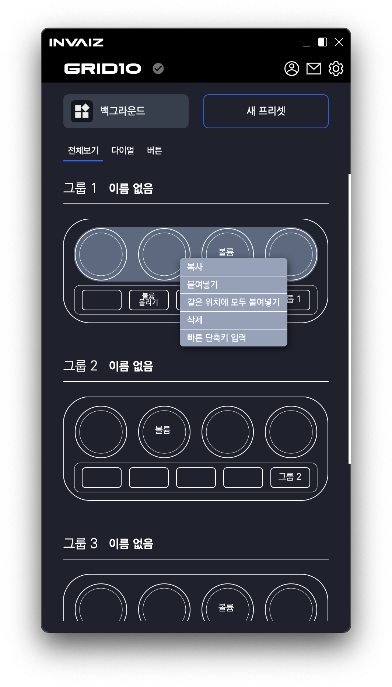

# 2021/11 3주차 주간 리포트

## 주간 작업 목록

- 매크로 입력 기능 구현 ✅
- 우클릭 `Context Menu` 생성 ✅
- 시작 프로그램 켜기 / 끄기 기능 구현 ✅
- ESC 안정화 기능 추가 ✅
- 목록 휴지통 기능 ❌

---

---

### 매크로 입력 기능 구현 ✅

#### 작업 상세 설명

- 기본 상태

  

- 우측 추가 리스트를 클릭하여 조합 리스트에 추가한 상태

  

  추가했을 때, 필수 데이터가 필요한 기능의 경우 노란 경고 아이콘 표시

- 단축키를 수정하기 위해 클릭한 상태

  

  기능 이름은 필수로 입력하지 않아도 되는 식별을 위한 데이터.  
  클릭 시 해당 데이터의 수정 상태가 됨.  
  수정 상태가 되면, 아래 쪽에 매크로 입력 창이 좌측에서 날아오며 `opacity` 값이 올라가는 `Animation`과 함께 보여짐.  
  수정 상태 취소 시 반대의 `Animation`과 함께 사라짐.(`Animation` 동작 시 수정 영역의 높이가 가변하는 버그?)

  - 단축키: 단일 커스텀 키 입력 `input`
  - 텍스트: 입력할 텍스트 입력 `input`
  - 지연: 시간 입력 `input`
  - 열기: 파일 경로를 선택할 수 있는 `dialog` 여는 버튼

> 현재 단축키(단일 커스텀 키) 입력의 경우 일반 키와 특수 키 단일 입력이 정상적으로 되지 않는 버그 존재.

- 파일 경로를 수정하기 위해 `dialog` 열기 버튼을 클릭한 상태 :: `Mac OS`

  

  여러 파일 선택 불가능 하며, 선택 시 버튼 영역에 선택한 `File/Folder`의 경로가 입력됨.  
  `dialog` 창을 띄우고 선택하지 않고 닫거나 취소할 경우 이전에 입력했던 경로 값이 초기화 됨.(노란 경고 아이콘 표시)

- 조합 리스트에서 `Drag & Drop`으로 순서를 변경

  

  `Drag & Drop`을 통해 매크로 커스텀의 순서를 변경할 수 있음.  
  현재 순서 변경 시 수정 창을 제거(선택 상태를 초기화)함.

- 타이틀, 매크로 커스텀 조합 리스트의 기능에 있는 노란 경고 아이콘을 모두 처리하면 추가 가능 상태

  

  이렇게 모든 필요 데이터의 입력이 다 되었을 때만 추가 버튼이 활성화 되며, 추가가 가능함.  
  추가 시에 우측 하단의 체크박스를 통해 추가 후 창을 닫거나/닫지 않는 옵션을 선택할 수 있음.  
  "매크로 구조 히스토리를 남겨둡니다." 선택 시 모든 데이터가 남음.(최상단의 타이틀만 사라짐.)  
  선택하지 않으면 모든 데이터 삭제.

- 매크로 커스텀 조합창 우측의 리셋 버튼은 클릭 시 추가되어 있는 조합 리스트 전부 삭제.
- 기능 수정 영역의 리셋 버튼은 클릭 시 해당 기능의 데이터 초기화.
- 기능 수정 영역의 삭제 버튼은 조합 리스트에서 해당 기능 제거.

#### 고려사항

1. 현재 추가 시 창을 닫거나 닫지 않은 옵션은 다이얼 / 버튼 / 매크로 / 텍스트 모두 다르게 적용되는데, 이를 모든 리스트에 통일을 해야 하는가.  
   또한 상태를 유지해야하는가.(이는 당연한거 요소?)

   Ex) 다이얼에서 체크박스 선택 => 매크로로 이동(매크로에는 체크박스가 미선택 상태) => 다시 다이얼로 이동(다이얼에는 체크박스가 미선택 상태)

---

### 우클릭 `Context Menu` 생성 ✅

#### 작업 상세 설명

- 매크로 커스텀 조합 리스트의 배경에서

  

  붙여넣기만 `Context Menu`에 포함.  
  복사된 데이터가 없을 경우 클릭하더라도 실행되지 않음.

- 매크로 커스텀 조합 아이템에서

  

  - 수정: 아래 쪽에 매크로 수정 창 열림.
  - 삭제: 리스트에서 해당 매크로 기능 제거.
  - 복사: 해당 매크로 기능 복사 후 데이터 저장(임시 `Clipboard`).
  - 붙여넣기: 임시 `Clipboard`에 있는 데이터 가장 아래에 추가.

  > 동시 선택 기능 미구현 상태. 추후 추가할 예정(당장은 힘들 것으로 판단.)

- 프리셋 미리보기 단일 기능에서

  

  > 이미지에 혼란이 있을 수 있음.

  - 복사: 해당 단일 기능 복사 후 데이터 저장(임시 `Clipboard`). - 미구현
  - 붙여넣기: 임시 `Clipboard`에 있는 데이터 가장 아래에 추가. - 미구현
  - 같은 위치에 모두 붙여넣기: 다른 그룹의 해당 기능 위치에 동일한 기능 붙여넣기(복사 안 해도 됨) - 미구현
  - 삭제: 해당 기능 제거(빈 값으로 초기화).
  - 빠른 단축키 입력: 커스텀 단축키 목록에 저장하지 않고 바로 기능 추가 - 미구현

- 프리셋 미리보기 세트에서

  

  - 복사: 해당 다이얼/버튼 세트 복사 후 데이터 저장(임시 `Clipboard`). - 미구현
  - 붙여넣기: 임시 `Clipboard`에 있는 데이터 가장 아래에 추가. - 미구현
  - 같은 위치에 모두 붙여넣기: 다른 그룹의 해당 다이얼/버튼 세트 위치에 동일한 기능 붙여넣기(복사 안 해도 됨) - 미구현
  - 삭제: 해당 다이얼/버튼 세트 제거(빈 값으로 초기화).

- 프리셋 미리보기 그룹에서

  

  - 복사: 해당 그룹 복사 후 데이터 저장(임시 `Clipboard`). - 미구현
  - 붙여넣기: 임시 `Clipboard`에 있는 데이터 가장 아래에 추가. - 미구현
  - 같은 위치에 모두 붙여넣기: 다른 그룹에 동일한 기능 붙여넣기(복사 안 해도 됨) - 미구현
  - 삭제: 해당 그룹 제거(빈 값으로 초기화).

- 프리셋 설정 아이템에서

  

  - 삭제: 해당 프리셋 제거.
  - 복제하기: 해당 프리셋과 똑같은 프리셋 복사하여 추가.
    > 복제 시 데이터까지 복사되지 않는 버그 fix 중.
  - 이름 변경: 해당 프리셋의 이름 변경하는 `input` 나타냄. - 미구현
  - 잠금 ON/OFF: 해당 프리셋의 기능 및 조작을 제한하는 잠금 상태 ON/OFF, 잠금 시 선택 불가 및 아이콘 변경.
  - 내보내기: 해당 프리셋 내보내는 `dialog` 열기.

#### 고려사항

1. 프리셋 미리보기에서 빠른 단축키 추가의 경우 커스텀 단축키 목록에 저장해야 하는가.
2. 프리셋 미리보기에서 단일 / 세트 / 그룹의 복사를 하나의 `Clipboard`로 사용해야 하는가.  
   각기 다른(하나가 아닌) `Clipboard`라면 단일 복사 후 세트 복사해도 단일의 기능이 사라지지 않음.
3. 프리셋 설정 아이템에서 잠금했을 때 제한을 어디까지 걸어야 하는가.

---

### 시작 프로그램 켜기 / 끄기 기능 구현 ✅

김사나이가 요청한 아이디어를 카이균이 디자인하여 추가된 기능.

#### 작업 상세 설명

- 시작 프로그램 설정을 껐을 경우.

  

  로그인 항목(로그인 시 자동 실행 프로그램 리스트)에서 제거됨.

- 시작 프로그램 설정을 켰을 경우.

  

  로그인 항목(로그인 시 자동 실행 프로그램 리스트)에 추가됨.

#### 고려사항

1. 현재 기능 변경 시 시간이 좀 걸리는데 Loading 처리 Design을 어떻게 할지.
2. 추가 설명 및 토글 클릭 시 따로 알림 창이 떠야하는가.
3. 현재 디자인 그대로 유지하는가.
4. 창 관리라는 이름 외에 적절한 명칭이 있는가.

---

### ESC 안정화 기능 추가 ✅

#### 작업 상세 설명


위처럼 프리셋 이름 변경 시에 `ESC` 혹은 `Enter`를 누르면 입력 창만 사라져야 하는데,
입력 창과 함께 프리셋 설정 모달(위에서 내려오는 창)이 함께 꺼지는 버그가 간혹 발생.

이 버그를 Fix 함.

#### 고려사항

1. 간혹 발생하는 버그이기 때문에 `ESC`, `Enter` 키의 연속 입력과 같은 경우에도 재발 가능성 有.

---

### 목록 휴지통 기능 ❌

#### 작업 상세 설명

- `Type.d.ts`

```ts
declare interface RecyclePresetFile {}

declare type RecyclePresetFiles = RecyclePresetFile[];

declare interface RecycleShortcut {}
declare type RecycleShortcuts = RecycleShortcut[];

declare interface RecycleShortcutFile {}
declare type RecycleShortcutFiles = RecycleShortcutFile[];
```

- `RecycleBin Class`

```ts
class RecycleBinManager {
  private static instance: RecycleBinManager | null;
  presetFileBin: RecyclePresetFiles;
  shortcutBin: RecycleShortcuts;
  shortcutFileBin: RecycleShortcutFiles;

  /**
   * '`RecycleBin Manager` 생성자'
   *
   * @param __dirrecyclebin `Recycle Bin` folder 경로
   */
  private constructor(private __dirrecyclebin: string) {
    this.presetFileBin = [];
    this.shortcutBin = [];
    this.shortcutFileBin = [];
    this.loadRecycleBin();
    this.registCommunication();
  }

  private loadRecycleBin(): void {}

  private saveRecycleBin(): void {}

  addPresetFiles(deleteSettings: TempPresets): void {}

  addShortcut(deleteShortcut: Func): void {}

  addShortcutFiles(): void {}

  /**
   * 'ipc 통신 모듈 등록하는 Method'
   */
  private registCommunication(): void {}

  public static getInstance(): RecycleBinManager {
    if (RecycleBinManager.instance === null) {
      RecycleBinManager.instance = new RecycleBinManager("");
    }
    return RecycleBinManager.instance;
  }
  public static createInstance(__dirrecyclebin: string): void {
    RecycleBinManager.instance = new RecycleBinManager(__dirrecyclebin);
  }
}
```

다음과 같이 목록 휴지통을 관리하는 클래스 `Singleton Pattern`으로 설계 및 생성.  
해당 클래스의 기능을 구현하여 `Renderer-process`와 통신하면 목록 휴지통의 프로토타입 기능 개발 완료.

#### 고려사항

일반 파일을 삭제 시 목록 휴지통으로 이동할 때, 기존의 파일은 `workset` 폴더 내에 있는데, 이를 목록 휴지통 폴더에 실제로 이동 후 저장해야 하는지 고민.

---

---

## 전달사항

### 현재 구현이 필요한 기능 리스트(미구현 리스트)

- 자동 업데이트 환경 구성
- 프로그램 포커싱
  - 객체 Design 고민 진행 중.
- 목록 휴지통 기능 구현
  - Design 설계 중.
- `Context Menu` 기능 배치 디테일
- 프리셋 복제 시 데이터까지 복제
  - FE 코드에서 `undefined`를 넘겨주는 버그 확인.
- 오버레이 상단에 프로그램/프리셋 정보
- 서브 오버레이?
- 커스텀 목록 데이터 형식 변경
- `Func` 형식에 `id` 추가
- `Func` 형식에서 `sendCepScript`의 경우 `fcode`에 `id` 값 매핑 후 실행
- 카테고리 형식 => 커스텀 기능 파일 형식으로 구조 변경
- 매크로 매핑 시 커스텀 목록 리스트 가져오기
- 매크로 여러 개 클릭하여 한 번에 복사 / 붙여넣기
- 매크로에서 단축키 입력 시 정상적으로 되지 않는 버그 픽스
- 기능 수정하기 만들기
- 기능 추가 시 `snackbar` 띄우기

> 이외에 더 필요한 기능 있으면 추가 요청.
