# 2021/11 4주차 주간 리포트

## 주간 작업 목록

- [`Workset`과 `Setting` 파일 통합 ✅](#workset과-setting-파일-통합)
- [커스텀 목록 데이터 형식 변경 ✅](#커스텀-목록-데이터-형식-변경)
- [커스텀 목록 데이터 추가/제거/내보내기 등 기능 구현 ✅](#커스텀-목록-데이터-추가제거내보내기-등-기능-구현)
- [기능 입력 시 해당 프로그램에 포커싱 ✅](#기능-입력-시-해당-프로그램에-포커싱)
- [목록 휴지통 기능 구현 ❌](#목록-휴지통-기능-구현)

---

---

### `Workset`과 `Setting` 파일 통합 ✅

#### 작업 상세 설명

- `Workset`과 `Setting` 상태

  - 기존 `Workset`과 `Setting` 구조

    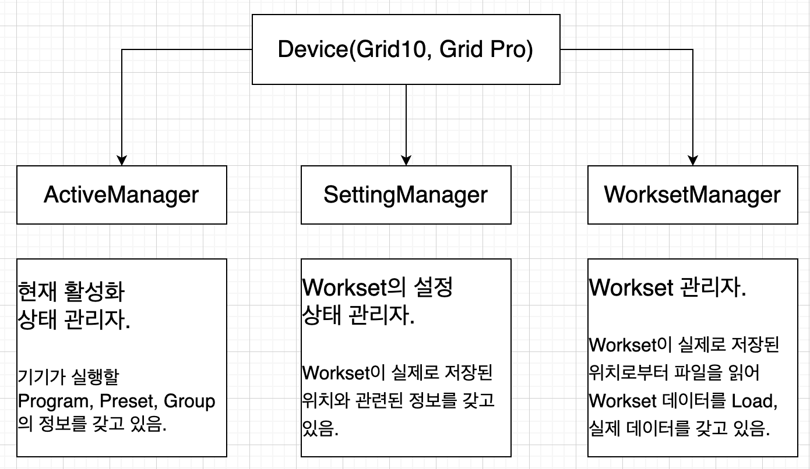

  - 기존 `Workset`과 `Setting` 폴더

    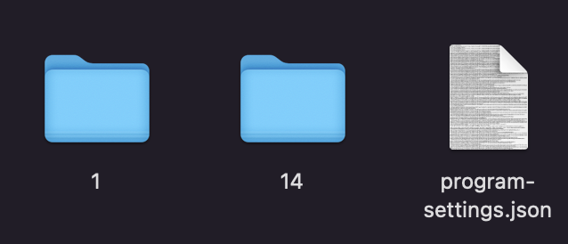

    기존에는 `Workset Manager`와 `Setting Manager`를 구분하여 `Setting`이 모두 `load`된 이후에 `Workset Manager`로 `Setting` 값을 넘겨 `Workset` 폴더에 접근, 실제 `Workset`파일을 `load`하는 비효율적인 형태로 구성.

    이는 파일 읽기 뿐만 아니라 수정, 삭제 시에도 `Workset` 데이터가 변경되면 `Setting`에도 이를 알려야 했기 때문에 두 코드의 의존성을 불러일으킬 뿐만 아니라, 코드의 난독화까지 발생시킴.

    > 때문에 목록 휴지통을 개발하기에 앞서 이를 재구성, 리팩터링할 필요가 있다고 판단.

  - 리팩터링 `Workset` 구조

    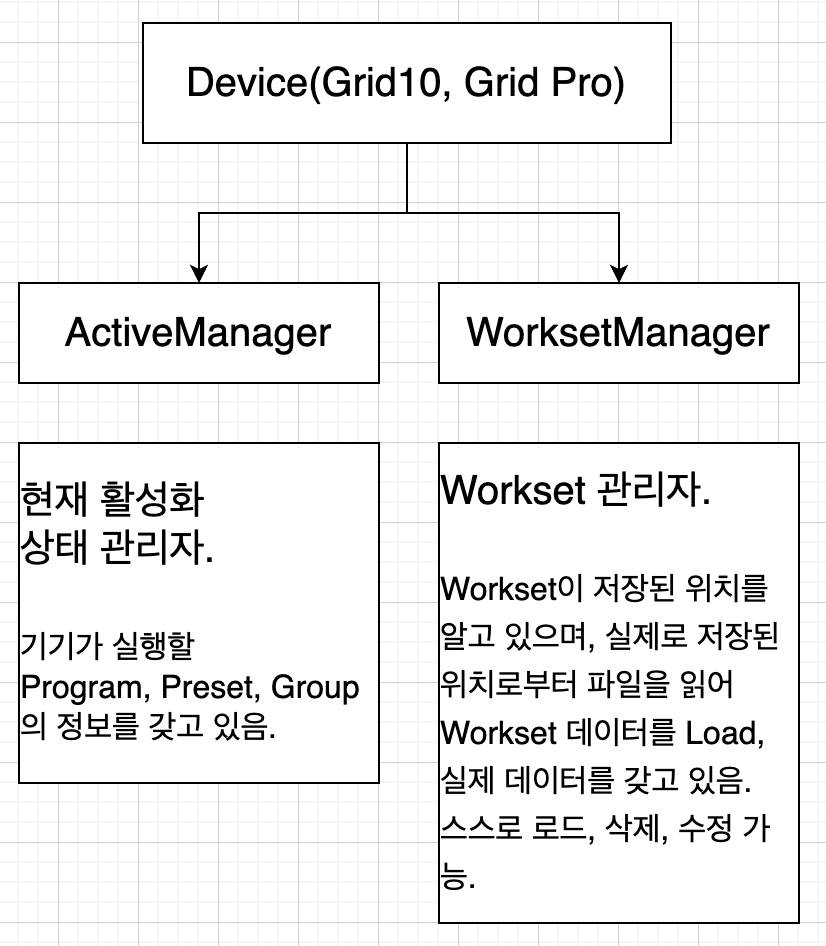

    불필요한 `Setting Manager`의 기능을 `Workset Manager` 내부로 모두 이동시켜 독립적으로 `Workset`을 `load`, `save`, `update` 할 수 있게 함.  
    이 구성을 통해 코드의 난독성을 줄이고, 파일 저장 / 삭제 / 수정을 수월하게 할 수 있게 되어 후에 목록 휴지통 개발에 차질이 없을 것으로 예상.

    이를 통해 이전의 프리셋 복제 시 데이터까지 복제 되는 버그 또한 해결.

#### 고려 사항

추후 `Workset Manager`의 내부 슬롯. 즉, `Workset`, `Program`, `Preset` 또한 독립적인 클래스로 구성할 계획.

---

### 커스텀 목록 데이터 형식 변경 ✅

#### 작업 상세 설명

- 대표님의 의견으로 커스텀 목록 파일을 추가해야하는 작업.

- 기존의 커스텀 목록 구조

  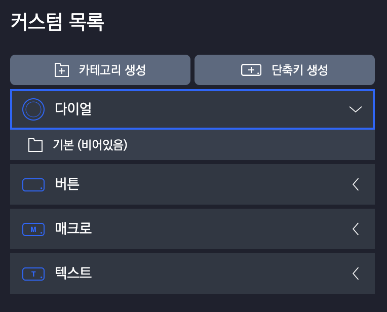

  ```ts
  /** `Device` 키의 타입 */
  declare type DeviceKeyType = "dial" | "button";

  /** 기능을 보유한 타입 */
  declare type FunctionType = DeviceKeyType | "macro" | "text";

  /** 기능을 분류하는 있는 카테고리 */
  declare interface FunctionCategory<T extends Func> {
    /** 카테고리의 id */
    id: number;
    /** 카테고리의 이름(언어 팩) */
    name: LanguagePack;
    /** 카테고리가 갖고 있는 `Func` */
    functions: T[];
    /** 기본 카테고리 여부 */
    default?: boolean;
  }

  /** 기능 분류 카테고리의 배열 */
  declare type FunctionCategories<T extends Func> = FunctionCategory<T>[];

  /** 타입에 따른 기능들의 리스트 */
  declare interface FunctionList
    extends Record<FunctionType, FunctionCategory> {
    /** 다이얼 타입의 기능 카테고리 리스트 */
    dial: FunctionCategories<DialFunc>;
    /** 버튼 타입의 기능 카테고리 리스트 */
    button: FunctionCategories<ButtonFunc>;
    /** 매크로 타입의 기능 카테고리 리스트 */
    macro: FunctionCategories<MacroFunc<ButtonFunc>>;
    /** 텍스트 타이핑 타입의 기능 카테고리 리스트 */
    text: FunctionCategories<TypingFunc>;
  }

  interface FunctionState {
    /** 지원 프로그램 기본 제공 `Function List` */
    support: BuiltInFunctionPrograms;
    /** `INVAIZ Studio` 자체 기본 제공 `Function List` */
    invaiz: FunctionList;
    /** `Custom Function List` */
    custom: FunctionList;
  }
  ```

  기능 타입 내에 기능 카테고리가 있고, 그 아래에 기능이 저장되는 방식.

- 변경된 커스텀 목록 구조

  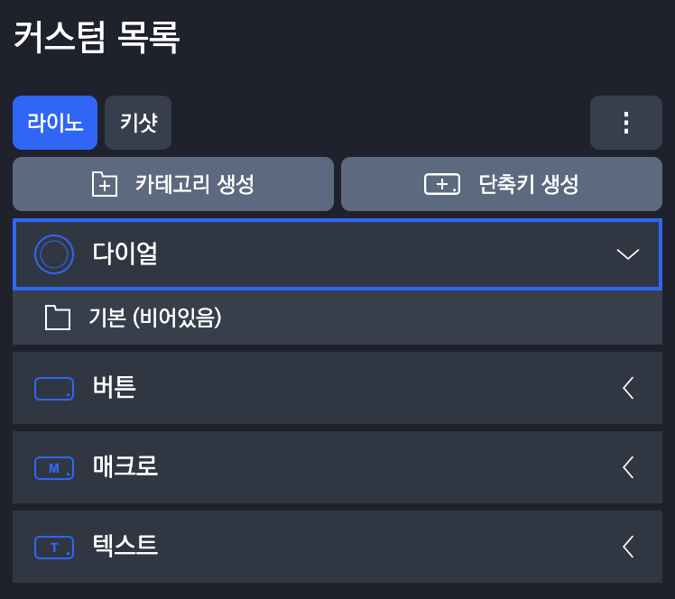

  ```ts
  declare interface CustomFileContent {
    name: LanguagePack;
    functionList: FunctionList;
  }
  declare type CustomFileContents = CustomFileContent[];

  declare type CustomFileSettingId = `cf-${string}`;
  declare interface CustomFileSetting {
    id: CustomFileSettingId;
    saved_file_name: string;
    locked: boolean;
  }
  declare type CustomFileSettings = CustomFileSetting[];

  declare interface CustomFile extends CustomFileContent, CustomFileSetting {}
  declare type CustomFiles = CustomFile[];

  interface FunctionState {
    /** 지원 프로그램 기본 제공 `Function List` */
    support: BuiltInFunctionPrograms;
    /** `INVAIZ Studio` 자체 기본 제공 `Function List` */
    invaiz: FunctionList;
    /** `Custom Function List` */
    custom: CustomFiles;
  }
  ```

  `CustomFiles`라는 타입을 추가하여 커스텀 파일을 매핑하고,
  커스텀 목록에는 `FunctionList`가 아닌 `CustomFiles` 타입을 사용하여 구현.

#### 고려 사항

- 기본 카테고리는 필수적으로 존재해야하는가?
- 내부에 카테고리를 그대로 둬야하는지 제거해야하는지 고민.

---

### 커스텀 목록 데이터 추가/제거/내보내기 등 기능 구현 ✅

#### 작업 상세 설명

- 커스텀 목록의 구조가 변경됨에 따라 해당 구조를 조작할 UI 구현.

- 커스텀 파일 설정 창

  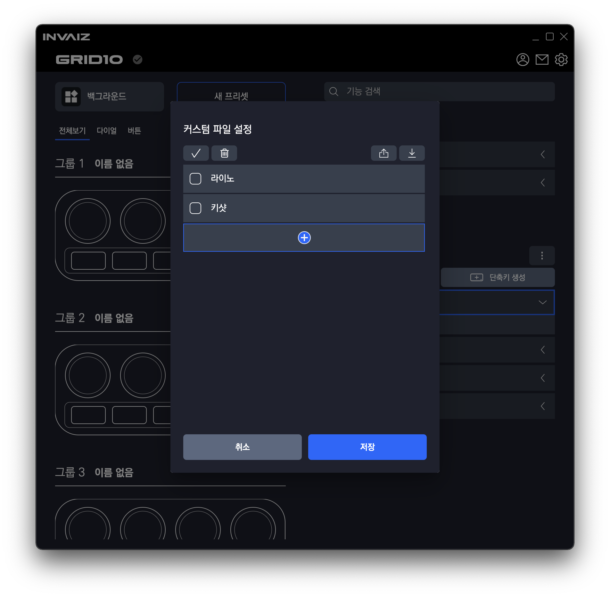

  프리셋 설정 모달과 유사하게 생긴 창.  
  유사한 만큼 거의 비슷한 기능이 구현되며, 차이점은 활성화 상태를 설정하는 토글이 없음.  
  내부에서 변경된 사항은 저장을 눌렀을 때 반영됨.

- 커스텀 파일 생성 유도

  

  초기 실행 시나 삭제 등의 이유로 커스텀 파일이 없을 경우, 생성을 유도하기 위한 버튼  
  클릭 시 커스텀 파일 설정 창 띄움.

- 커스텀 파일 생성 후 기능 설정

  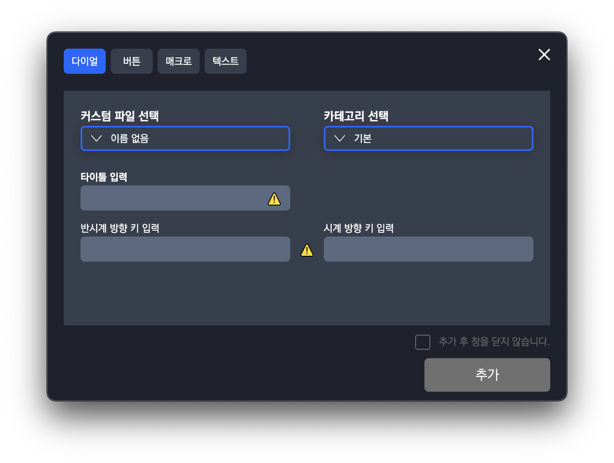

  기존의 카테고리 선택 `Selector`를 옆으로 이동시키고, 커스텀 파일 선택란 추가.

- 커스텀 파일 불러오기

  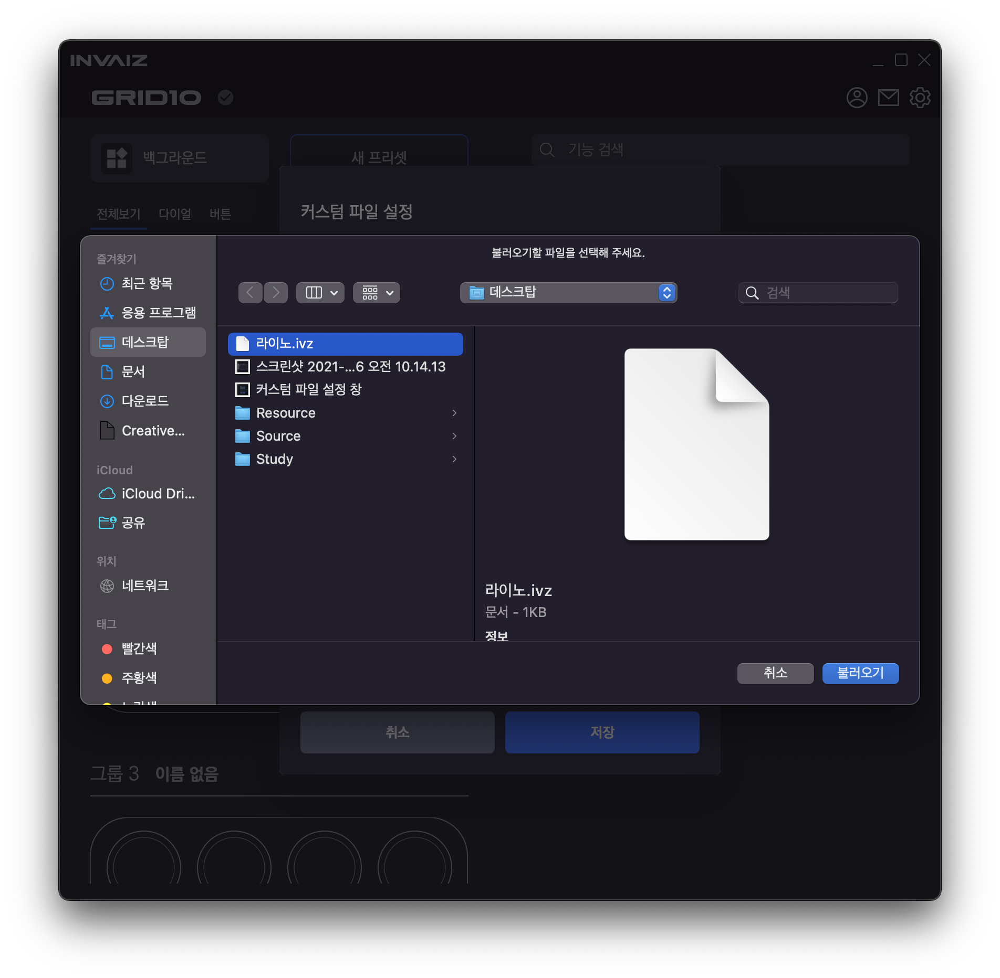

  내보내기 했던 커스텀 파일(`.ivz`)을 불러올 수 있음.  
  여러 파일 선택하여 불러오기 가능.

- 커스텀 파일 내보내기

  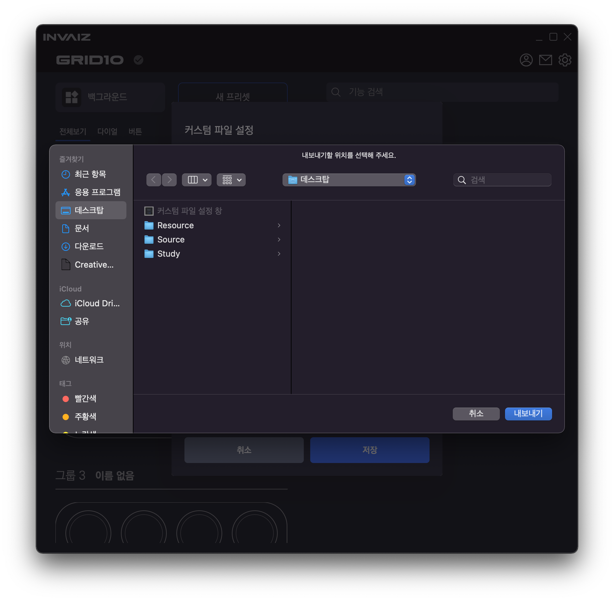

  설정한 커스텀 파일을 `.ivz` 확장자로 내보낼 수 있음.
  경로를 선택하면 해당 폴더에 파일 내보내기.
  내보내기 한 파일은 암호화하여 저장되므로 외부의 변화로부터 안전함.(하나라도 변환되면 안됨.)

- 암호화 상태

  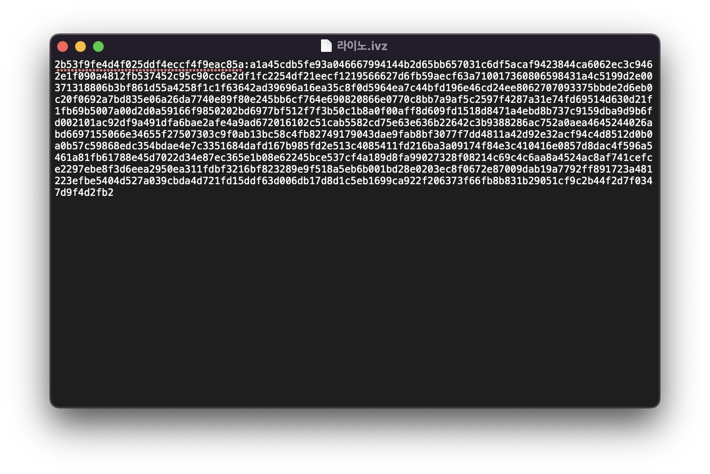

#### 고려 사항

- 프로그램, 프리셋 설정과 같이 활성화를 만들어야 하는가.

---

### 기능 입력 시 해당 프로그램에 포커싱 ✅

#### 작업 상세 설명

- 현재 `INVAIZ Studio`는 다음과 같은 두 경우에 프로그램 포커스를 조작함.

1. `Grid10` 기기 입력(기능 실행) 시 프로그램 포커싱 알고리즘

   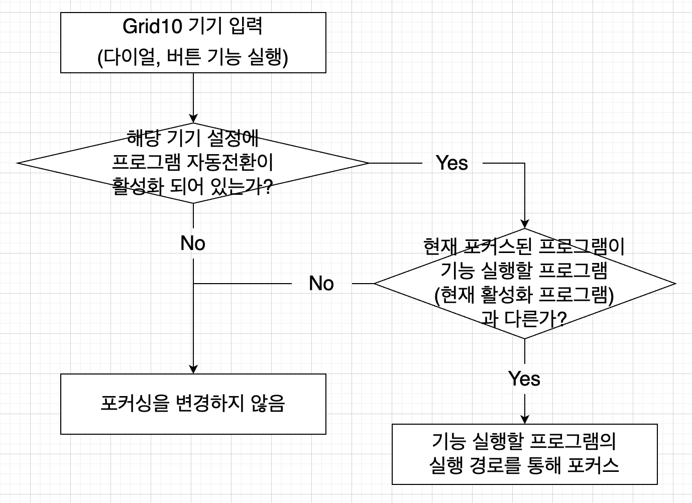

2. 마우스 포커스에 따른 현재 프로그램 변경 알고리즘

   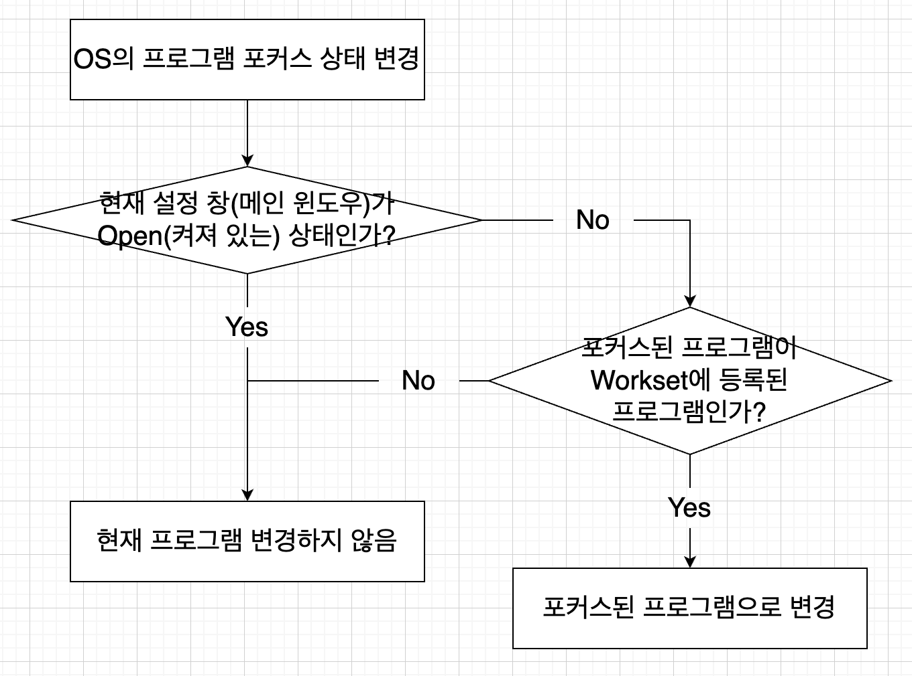

#### 고려 사항

현재는 `Grid10`의 설정과 `Grid Pro`의 설정이 공유되는데, 이를 분할해야할지 고민.

프로그램 이름이 미리 입력되어있지 않거나, 정상적인 프로그램 이름(formal한 name)을 알지 못하면 버그 발생 위험.

실행하는 `OS` 및 각 프로그램 버전에 따라 프로그램 이름이 다를 수 있으므로, `Windows OS`와 `Mac OS`의 프로그램 모든 버전에서 테스트 해봐야할 필요가 있음.

---

### 목록 휴지통 기능 구현 ❌

#### 작업 상세 설명

원래 이 기능을 구현하려 했으나, 해당 기능을 상기 기술한 요소들을 작업하지 않고 했을 경우 구현 시간이 더 오래 걸릴 것으로 예상되어 앞선 요소 먼저 진행.

현재 디자인 작업 중임.

#### 고려 사항

여전히 지워진 파일을 목록 휴지통에서 따로 보관할지 남겨둘지 고민해봐야 함.  
이 문제만 해결하면 빠른 구현 가능할 듯.

---

---

## 전달사항

### 현재 구현이 필요한 기능 리스트(미구현 리스트)

- 자동 업데이트 환경 구성
- 목록 휴지통 기능 구현
- `Context Menu` 기능 배치 디테일
- 오버레이 상단에 프로그램/프리셋 정보
- 서브 오버레이?
- `Func` 형식에 `id` 추가
- `Func` 형식에서 `sendCepScript`의 경우 `fcode`에 `id` 값 매핑 후 실행
- 매크로 매핑 시 커스텀 목록 리스트 가져오기
- 매크로 여러 개 클릭하여 한 번에 복사 / 붙여넣기
- 매크로에서 단축키 입력 시 정상적으로 되지 않는 버그 픽스
- 기능 수정하기 만들기
- 기능 추가 시 `snackbar` 띄우기
- 모든 데이터 구조 ID 형식 변경: `number` -> `string`
- 새로운 아이콘 적용

> 이외에 더 필요한 기능 있으면 추가 요청.

### 테스트 배포 시기 결정.

> 2021.12.03 ~ 2021.12.08 내에 `Windows`, `Mac` 동시 진행.  
> 현재 `CEP` 코드가 독립되지 않아 `Mac`에서의 자동 업데이트는 불가한 상태로 배포되어야할 듯 함.
