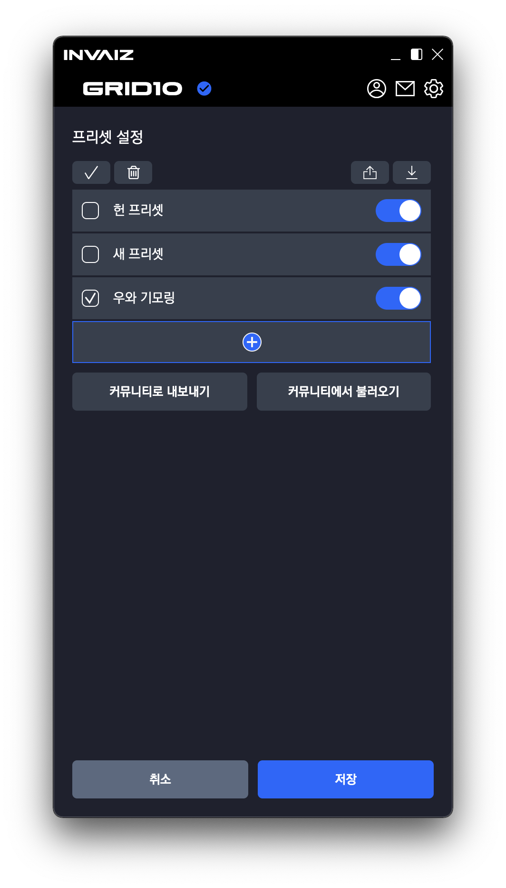

# 2021/12 1주차 주간 리포트

## 주간 작업 목록

- [`INVAIZ Studio` 개발 진행 화면 캡처 ✅](#invaiz-studio-개발-진행-화면-캡처)
- [마우스 클릭 기능 ✅](#마우스-클릭-기능)
- [버그 수정 ✅](#버그-수정)
- [목록 휴지통 기능 구현(보류) ❌](<#목록-휴지통-기능-구현(보류)>)

---

---

### `INVAIZ Studio` 개발 진행 화면 캡처 ✅

#### 작업 상세 설명

디자이너의 요청으로 베타 테스터 모집 공고 글 작성 및 진행 상황 보고를 위해 현재까지의 개발 진행 상황 일부를 캡처하여 `INVAIZ Studio 자료`에 업로드 하였음.

- [리뉴얼 캡처 자료](https://flow.team/l/KLIA)

  

- [리뉴얼 Drag & Drop 영상 녹화 자료](https://flow.team/l/KwwH)

  

---

### 마우스 클릭 기능 ✅

#### 작업 상세 설명

- 마우스 입력을 기본 제공 기능에 추가하고, 실행할 수 있게 함.
  

  좌, 우 클릭/더블클릭 가능하며, 버튼에만 매핑하여 실행할 수 있음.  
   입력할 클릭 버튼의 위치(왼쪽, 오른쪽)과 더블 클릭 여부를 툴팁에서 보여줌.

  ```ts
  /** 강제 마우스 버튼 + 키보드 입력 데이터(`Button`) */
  declare interface ForceMouseButton {
    /** 사용할 key의 배열 */
    keys: string[];
    /** 사용할 modifier의 배열 */
    modifiers: string[];
    /** 마우스 클릭 위치 */
    click: "left" | "right";
    /** 더블 클릭 여부 */
    double?: boolean;
  }

  /** Button => Mouse 제어 사용 기능 */
  declare interface ButtonMouseFunc extends NoneFunc {
    etype: "sendButtonMouse";
    fcode: ForceMouseButton;
  }
  ```

#### 고려 사항

⚠️ 현재 키보드 + 마우스 클릭(Ex. Ctrl + 우클릭)은 매핑이 제공되지 않고, 추후 키보드 모드 개발 후 매핑 가능.

---

### 버그 수정 ✅

#### 작업 상세 설명

`Workset/Setting Manager` 통합 후에, 해당 통합과 관련된 설정이 있는 기능 `Program Setting`, `Preset Setting`, `Custom Setting`에서 공통된 버그들이 발견되었고, 그 기능들을 모두 수정함.

1. ##### 프리셋/커스텀 목록 변경 시 적용 안되는 버그

   

   위와 같은 리스트 목록에서, 순서 변경과 활성화 상태 변경. 이름 변경 등의 기능이 정상적으로 동작하지 않는 버그 발생.

   `Workset Manager`와 `Setting Manager`를 통합 도중 내부 필요없는 구조를 함께 가져오면서 발생하는 버그로 확인.

   > 새로운 구조를 생성하여 해결.

2. ##### 프리셋/커스텀 목록 연속 추가 시 추가된 프리셋/커스텀 목록의 내용 수정 시 한 번에 복사되어 적용되는 버그

   

   위와 같이 설정 창을 한 번 켰을 때, 동시에 여러 번을 파일을 생성한 직후 한 파일의 내용을 바로 수정하면,

   

   수정하지 않은 나머지 파일들의 내용도 동시에 수정되는 버그 발생.

   `1번` 버그를 해결하면서 만든 구조에서, 새로 파일을 생성할 때 초기 데이터를 복사하지 않고 동시에 참조하면서 발생하는 버그로 확인.

   > 동시에 참조하지 않도록 복사하는 구조를 생성하여 해결.

3. ##### 프리셋/커스텀 목록 삭제/추가/삭제 연속해서 할 경우, 이 전의 더미 데이터 남아있는 버그

   설정 창에서 기존에 있던 파일을 삭제하고, 새로 추가한 후 다시 삭제하면
   제일 처음 삭제 됐어야하는 내부 파일이 삭제되지 않고 데이터만 남아 `INVAIZ Studio`에서 관리할 수 없는 파일로 남는 버그 발생.

   > `1번` 문제와 같은 원인으로 확인하여 동시에 해결.

4. ##### 프리셋, 커스텀 목록, `Context Menu`의 아이템이 언어 설정 후에 실시간 변경이 안 되는 버그

   

   해당 요소들은 `useState`로 관리되는 데이터로, `Redux` 상태 값인 `Language`가 변경된다고 동시에 변경되지 않음.

   > 언어 설정이 변경되면 하위의 요소들에 `useEffect`를 적용하여 직접 변경시켜 줌으로 해결.

#### 고려 사항

잡아내지 못한 버그가 있을 수도 있음.(가능성은 낮음.)

---

### 목록 휴지통 기능 구현(보류) ❌

#### 작업 상세 설명


현재 프리셋/커스텀 파일을 삭제할 경우 목록 휴지통으로 데이터를 옮기는 작업까지는 완료함.

목록 휴지통으로 총 4개의 데이터를 관리할 예정.

1. 프리셋 파일
2. 커스텀 목록 파일
3. 기능 카테고리
4. 단일 기능

> 지금 당장은 보류하기로 결정.

#### 고려 사항

데이터를 복원시킬 때 어떻게 시킬지 결정해야함.

1. 이전에 있던 곳으로 복원시킨다. => 이전에 있던 곳이 사라지면 어떻게 할 것인가.
2. 복원시킬 위치를 선택한다. => 번거롭지는 않은지, + 디자인 필요
   등등

---

---

## 전달 사항

### 현재 구현이 필요한 기능 리스트(미구현 리스트)

- 자동 업데이트 환경 구성
- 프로그램 포커싱 - 객체 Design 고민.
- 목록 휴지통 기능 구현 - Design 설계 중.
- `Context menu` 기능 배치 디테일
- 오버레이 및 미리보기 글씨 알고리즘 수정
- 서브 오버레이?
- `Func` 형식에 `id` 추가
- `Func` 형식에서 `sendCepScript`의 경우 `fcode`에 `id` 값 매핑 후 실행
- 매크로 매핑 시 커스텀 목록 리스트 가져오기
- 매크로 여러 개 클릭하여 한 번에 복사 / 붙여넣기
- 매크로에서 단축키 입력 시 정상적으로 되지 않는 버그 픽스
- 기능, 카테고리 수정/삭제 만들기
- 기능 추가 시 `snackbar` 띄우기
- 모든 데이터 구조 ID 형식 변경 `number` -> `string`
- 오버레이 상단에 프로그램/프리셋 정보
- 새로운 아이콘 적용
- 키보드 모드

### 2021.12.08(수) 베타 테스트 배포.
