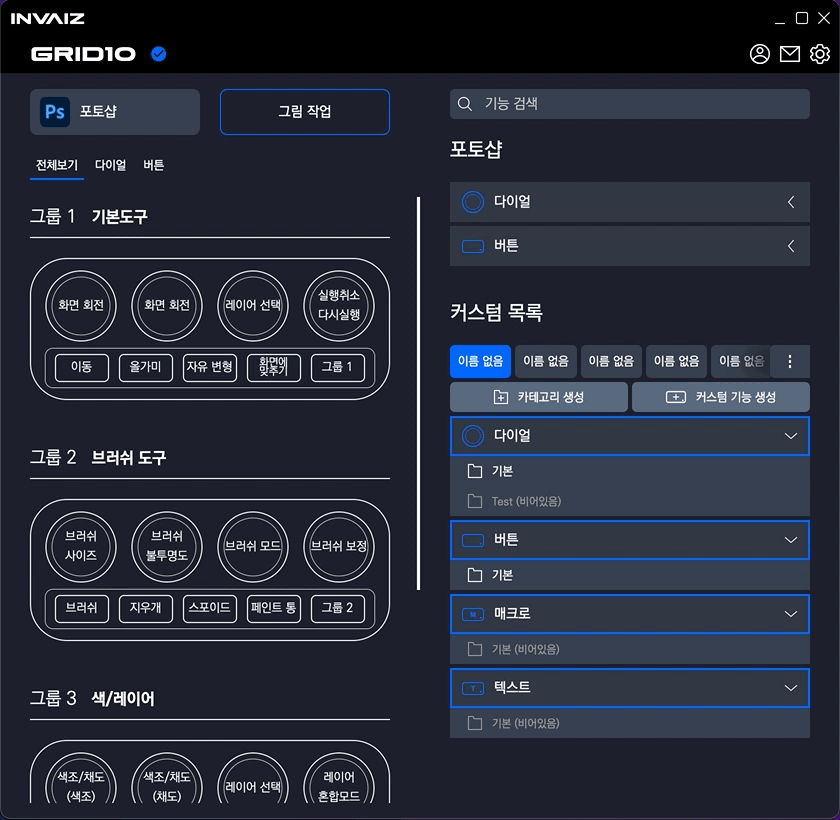
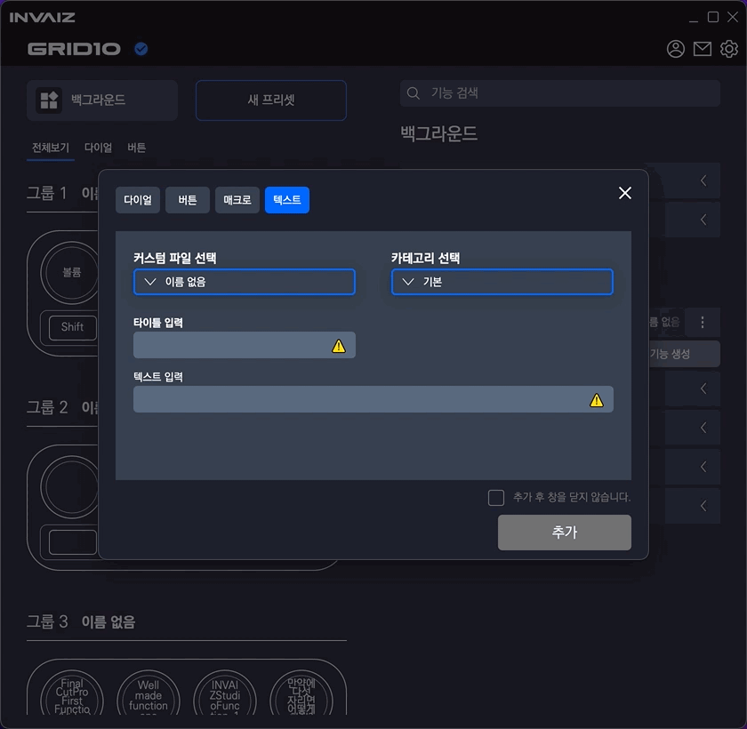

# 2021/12 3주차 주간 리포트

## 주간 작업 목록

- [숫자 키패드 입력 기능 추가 ✅](#숫자-키패드-입력-기능-추가)
- [검색 시 폴더 열기 ✅](#검색-시-폴더-열가)
- [빠른 단축키 추가 기능 구현 ✅](#빠른-단축키-추가-기능-구현)
- [오버레이 및 미리보기 글씨 알고리즘 수정 ✅](#오버레이-및-미리보기-글씨-알고리즘-수정)
- [프로그램 자동 전환 오류 수정 후 추가 ✅](#프로그램-자동-전환-오류-수정-후-추가)
- [디테일 수정 ✅](#디테일-수정)
- [펑션베이 팔로업 ✅](#펑션베이-팔로업)

---

---

## 숫자 키패드 입력 기능 추가 ✅

#### 작업 상세 설명

- 다음과 같이 숫자 키패드의 값을 입력하면 `0`, `1`, `2`가 아닌, 0️⃣, 1️⃣, 2️⃣의 형태로 다른 디자인 출력.
- 실제 입력 값 또한 숫자 키패드로 입력 됨.
- 이 외에 `Windows`에서 `Command` 키를 `Window` 키로, `Mac`에서 `Option`키를 `Alt` 키로 함.
- 또한, 볼륨, 밝기 등등 소소한 요소를 아이콘으로 대체.

#### 고려 사항

- 다른 디자인 및 아이콘을 써야할지에 대한 고민

---

---

## 검색 시 폴더 열기 ✅

#### 작업 상세 설명

- 검색 전에는 비어있음이 표시가 됨.
- 검색 후에는 비어있는 폴더는 보이지 않고, 검색된 아이템이 있는 카테고리는 열림.
- 카테고리 이름이 일치하여 검색된 경우, 해당 카테고리 폴더는 열리지 않음.

#### 고려 사항

- 검색 자체가 한글 조합 상태`[Ex) 브러쉬 => 블, 브럿 등]`에서 검색이 제대로 안됨.
- 검색엔진 같은 경우 이런 조합 상태를 다 추적을 하는데... 당장은 힘들 듯.

---

---

## 빠른 단축키 추가 기능 구현 ✅

#### 작업 상세 설명

- 다이얼 추가

  

  - 커스텀 기능 생성과 마찬가지로 타이틀과 반시계/시계 둘 중 한 기능만 입력하면 추가 가능.
  - 반시계/시계 스위칭 또한 구현.

- 버튼 추가

  

  - 커스텀 기능 생성과 마찬가지로 타이틀과 기능을 입력해야 추가 가능.

- 수정

  

  - 기존의 입력 값을 수정할 수 있음.

    - 이를 응용하면 입력할 수 없는 값`[Ex) 볼륨, 밝기 등]`을 커스텀 할 수 있음.
    - `Ex) 반시계 = 볼륨 내리기, 시계 = 밝기 올리기`

  - CEP나 Text, Macro의 경우 빠른 수정을 할 수 없으므로 모두 단축키 입력으로 수정됨.

#### 고려 사항

- 빠른 단축키 입력 창을 여는 클릭의 느낌이 별로 안좋음.
- 클릭한 후 드래그를 1px도 하지 않아야 실행이 됨.
- 또한 미니 모드에서 클릭되면 화면이 열리면서 창이 켜지는데, 화면을 여는 interaction을 따로 만드는게 좋은 듯?

---

---

## 오버레이 및 미리보기 글씨 알고리즘 수정 ✅

#### 작업 상세 설명

- 글씨 알고리즘 변경 전

  

  

  - 이처럼 오버레이에서 타이틀에 공백(space)이 없는 기능의 경우 한 줄로 출력하여 칸을 초과하고, 여러 줄로 출력하는 경우 글씨가 지나치게 줄어드는 버그가 있었음.

- 글씨 알고리즘 변경 후

  

  - 변경 후 글씨가 적당 선에서 줄어들고, 공백이 없는 경우 문자를 중간부터 잘라냄.

  

  

  - 위와 같이 설정 창에서도 오류 없이 잘 보이도록 수정함.

#### 고려 사항

- 완벽하게 실제 문자가 렌더링 되는`[Ex) 한글, 브라우저 등]` 프로그램보단 부족하지만 계속 개선해나갈 예정.

---

---

## 프로그램 자동 전환 오류 수정 후 추가 ✅

#### 작업 상세 설명

- 프로그램 설정 최상단에 설정 여부가 추가되었으며, 기본 값은 `off`.
- 동작 상황

  - `INVAIZ Studio`에서 `Background`를 활성화한 후 기능 실행 => 변함 없음.
  - `INVAIZ Studio`에서 켜져있는 프로그램을 활성화한 후 기능 실행 => 켜져있는 프로그램 포커싱.
  - `INVAIZ Studio`에서 꺼져있는 프로그램을 활성화한 후 기능 실행 => 포커싱 하지 않고 실행.
  - 다른 프로그램이 활성화되어 있을 때 프로그램 리스트에 추가된 프로그램을 포커싱한 후 기능 실행 => 포커싱 된 프로그램으로 상태 변경.
  - 다른 프로그램이 활성화되어 있을 때 프로그램 리스트에 추가되지 않은 프로그램을 포커싱한 후 기능 실행 => `Background`가 추가되어 있으면 `Background`로 변경. 추가되어 있지 않으면 활성화된 프로그램 포커싱.

- 위 동작 상황에 어긋나는 행동이 있으면 버그일 가능성 높음.

#### 고려 사항

- `Mac`에서는 최대한 테스트하여 `Adobe` 제품은 정상 동작(버전에 따라 다를 수 있음)을 확인.
- `Windows`에서는 테스트 부족으로 아직 불완전한 기능. 계속 개선 예정.
- 이름을 프로그램 포커싱이 아닌 프로그램 자동 전환(`Program Auto Switching`)이라고 부르는게 맞을 듯.

---

---

## 디테일 수정 ✅

#### 작업 상세 설명

#### 전체적인 디테일과 소소한 버그를 픽스함.

- 매크로에서 단축키 입력 시 정상적으로 입력 되지 않는 버그 픽스

  - 매크로에서 단일 키 입력이 똑바로 되지 않는 버그가 존재했으나 픽스.
  - 정상적으로 입력 가능.

- 키매핑 입력 오류 제거

  - `Tab` 키로 입력창을 진입했을 경우 입력이 똑바로 안 되는 버그 픽스.
  - `Windows`에서 한글 상태에서 입력하면 `Process`라고 입력되고, 여러 번 입력 시 프로그램 종료되는 버그 존재.

- 몇몇 창이 켜졌을 때 자동으로 입력창에 포커싱되도록 수정

  - `Ex) 카테고리 생성 창, 빠른 단축키 입력 창.`

- 카테고리 비어있을 경우 색 약화

  

  - 카테고리가 비어있는 경우, 기능이 있는 카테고리의 색을 그대로 사용하지 않고, 색감을 탁하게 하여 비어있다는 느낌을 강하게 줌.
  - (비어있음)이라는 텍스트가 필요한지 판단해야할 듯.

- 카테고리, 커스텀 목록에서 리스트 디테일 수정

  - 커스텀 목록 리스트 스와이프

    

    - 감도는 지속 개선 예정.
    - 스와이프 도중 마우스 위치의 커스텀 목록이 눌러지는데, 개선 예정.

  - 카테고리 리스트 스크롤

    

    - 커스텀 기능 생성에서 커스텀 파일 선택 및 카테고리 선택의 아이템이 여러 개가 됐을 때, 칸을 초과하여 스크롤을 할 수 없는 버그 픽스.

- 키 입력 제거 버튼

  

  - 입력된 키를 제거하는 버튼 추가.

- 오버레이 다크모드/라이트모드 통일

  

  - 기존에는 오버레이의 글씨가 테마에 따라 변경되어 라이트 모드일 때 잘 안 보였으나 수정함.

- 토글 속도 수정

  - 변경 전(0.3초)

    

  - 변경 후(0.1초)

    

---

---

## 소프트웨어 호환 팔로업 ✅

#### 작업 상세 설명

- 소프트웨어 호환사 측에 코드 전송 후, 당사의 프로그램과 호환이 되는 테스트 작동 영상 확인.
- 1월 말 쯤 Application 제작 후 내부 세미나 진행 예정으로, 자료 공유 받을 예정.
- `INVAIZ Studio`와 정식 연동 후 직접 통신 언급.

---

---

## 전달 사항

> 2021.12.15(수) 소프트웨어 2.0.1 버전 런칭.

> 매주 수요일마다 소프트웨어 베타버전 업데이트 예정.

### 이번 주 추가 리스트

- 토글 속도 0.3s -> 0.1s
- 오버레이 다크모드/라이트모드 통일
- 카테고리 비어있을 경우 색 약화
- 숫자 키패드 입력 기능 추가
- 검색 시 폴더 열기
- 키 매핑 입력 오류 제거
- 키 입력 제거 버튼
- Mac에서 설치 시 자동으로 손쉬운 사용 체크하는 방법 탐구
- Mac에서 설치 시 CEP 프로그램 종료 시키기
- Windows에서 프로그램 리스트 잘 안뜨는 버그
- Windows 한글로 키 입력 시 종료되는 버그
- 프로그램 포커싱 호환 확인 및 버그 확인
- 릴리즈 노트 추가

### 이번 주 구현 리스트

- 매크로에서 단축키 입력 시 정상적으로 되지 않는 버그 픽스
- 오버레이 및 미리보기 글씨 알고리즘 수정
- 프로그램 포커싱 - 객체 Design 고민.
- 토글 속도 0.3s -> 0.1s
- 오버레이 다크모드/라이트모드 통일
- 카테고리 비어있을 경우 색 약화
- 빠른 단축키 추가 기능 구현
- 숫자 키패드 입력 기능 추가
- 검색 시 폴더 열기
- 키 매핑 입력 오류 제거
- 키 입력 제거 버튼

### 현재 구현이 필요한 기능 리스트(미구현 리스트)

- 자동 업데이트 환경 구성
- 목록 휴지통 기능 구현 - Design 설계 중.
- 서브 오버레이?
- `Func` 형식에 `id` 추가
- `Func` 형식에서 `sendCepScript`의 경우 `fcode`에 `id` 값 매핑 후 실행
- 매크로 매핑 시 커스텀 목록 리스트 가져오기
- 매크로 여러 개 클릭하여 한 번에 복사 / 붙여넣기
- 기능 추가 시 `snackbar` 띄우기
- 모든 데이터 구조 ID 형식 변경 `number` -> `string`
- 키보드 모드
- 릴리즈 노트 추가
- Mac에서 설치 시 자동으로 손쉬운 사용 체크하는 방법 탐구
- Mac에서 설치 시 CEP 프로그램 종료 시키기
- Windows에서 프로그램 리스트 잘 안뜨는 버그
- Windows 한글로 키 입력 시 종료되는 버그
- 프로그램 포커싱 호환 확인 및 버그 확인
