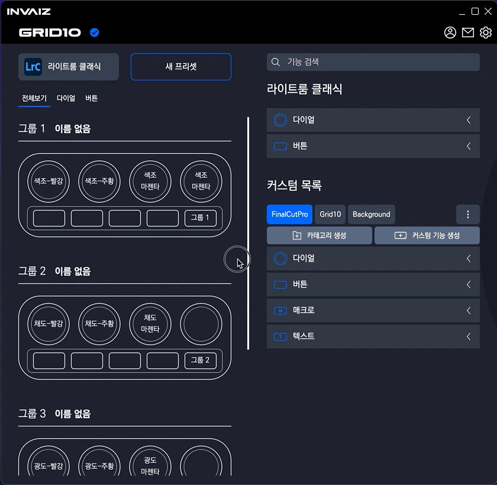
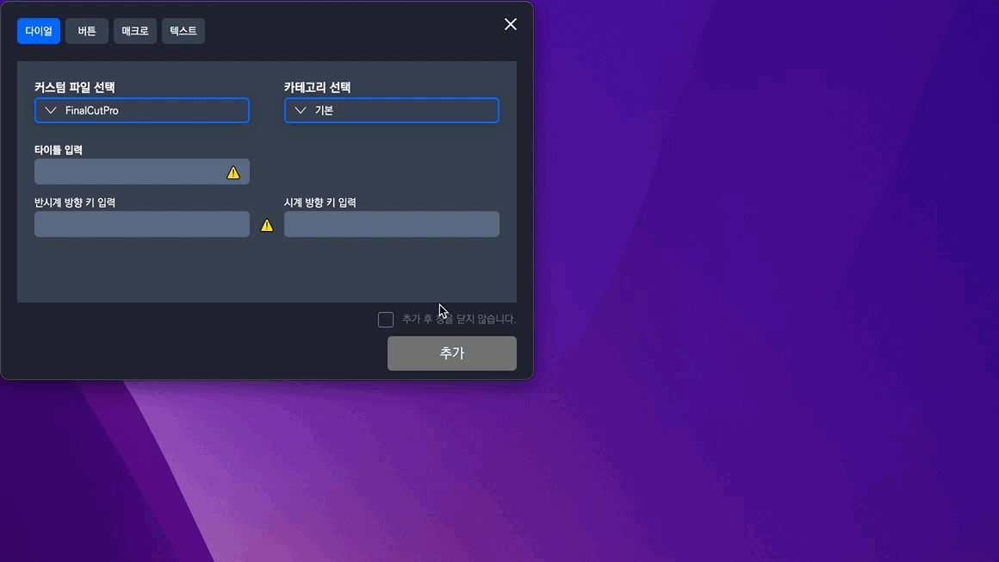
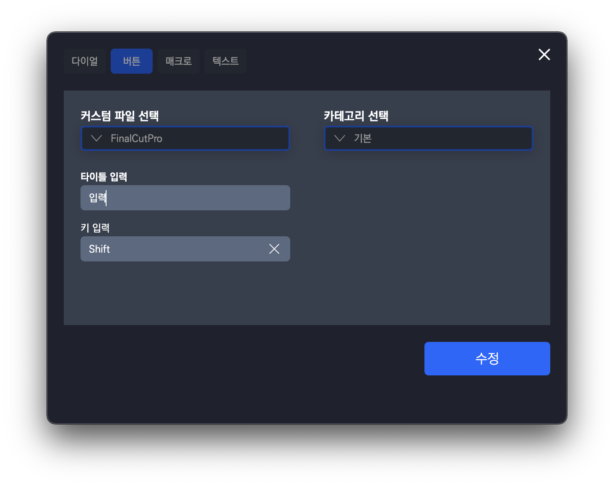
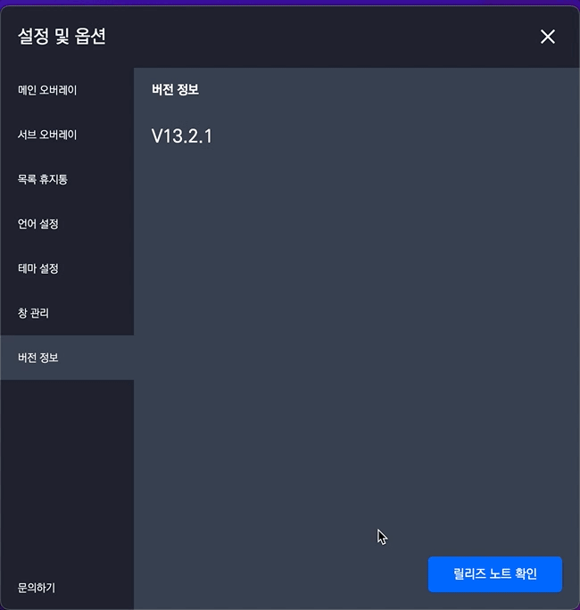
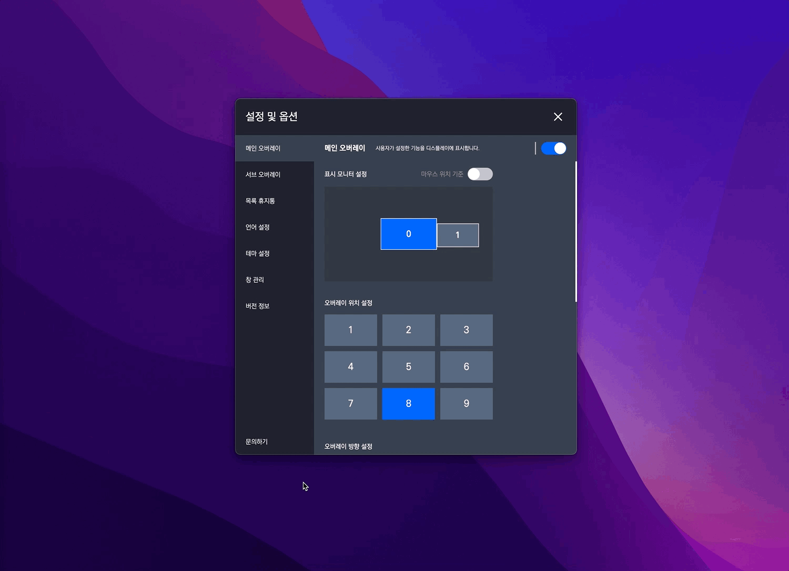
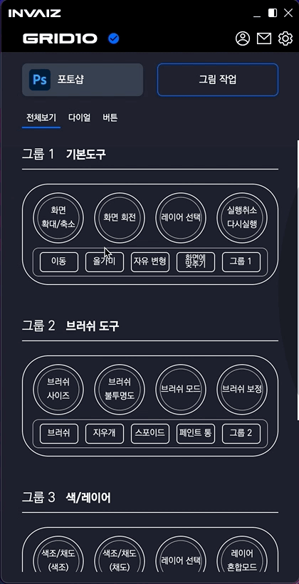
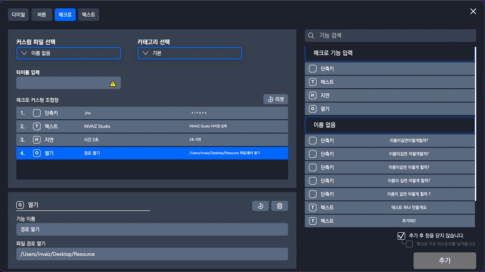
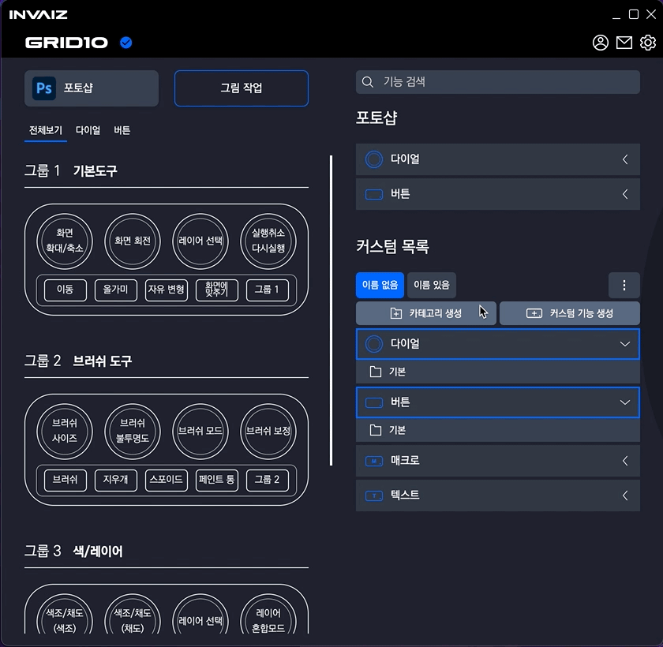
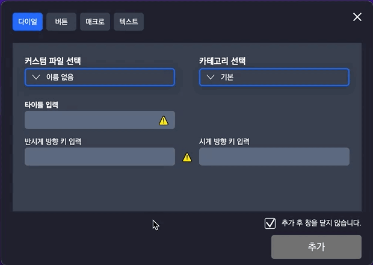

# 2021/12 4주차 주간 리포트

## 주간 작업 목록

- [매크로 매핑에서 커스텀 목록 리스트 가져오기 ✅](#매크로-매핑에서-커스텀-목록-리스트-가져오기-)
- [릴리즈 노트 추가 ✅](#릴리즈-노트-추가-)
- [크기 조절하는 영역 추가 ✅](#크기-조절하는-영역-추가-)
- [`Windows` 프로그램 리스트 사진 오류 분석 ✅](#windows-프로그램-리스트-사진-오류-분석-)
- [`Windows` 프로그램 자동 전환 오류 수정 ✅](#windows-프로그램-자동-전환-오류-수정-)
- [`Windows` 한글 키 입력 버그 수정 ✅](#windows-한글-키-입력-버그-수정-)
- [디테일 수정 ✅](#디테일-수정-)

---

---

## 매크로 매핑에서 커스텀 목록 리스트 가져오기 ✅

#### 작업 상세 설명

- 매크로를 입력할 때 기존에 추가했던 커스텀 목록에서 버튼, 텍스트 기능을 가져올 수 있습니다.
- 카테고리와는 상관없이 커스텀 파일 기준으로 나열됩니다.

- 또한 매크로에 기능을 추가할 때, 추가한 기능을 바로 수정할 수 있도록 활성화 됩니다.
- 만약 현재 보이는 범위를 초과하여 기능이 생성되었을 경우, 활성화된 기능을 볼 수 있도록 스크롤이 이동됩니다.

#### 고려 사항

- 선택된 매크로 기준으로 추가가 되어야 할지.
- 커스텀 목록 리스트에 카테고리를 넣어야 할지.

---

## 릴리즈 노트 추가 ✅

#### 작업 상세 설명

- 릴리즈 노트를 볼 수 있게 추가하였습니다.
- 기존의 옵션 창에서 버전 정보 탭 아래의 버튼을 통해 확인 가능합니다.

#### 고려 사항

- 릴리즈 노트의 글씨나 배치 등 디자인이 좀 이쁘지 않음.
- 닫기 버튼이 없어서 `ESC` 혹은 바깥 음영을 클릭해야 꺼짐.

---

## 크기 조절하는 영역 추가 ✅

#### 작업 상세 설명

- 창 크기를 편하게 조절할 수 있도록 넓은 범위의 영역을 생성하였습니다.

#### 고려 사항

- 화살표와 같은 시각 요소가 필요할 것 같음.

---

## `Windows` 프로그램 리스트 사진 오류 분석 ✅

#### 작업 상세 설명

- 이해는 안되지만, 메인 모니터가 아닌 서브 모니터에서 `INVAIZ Studio`를 실행시켰을 때, 이미지가 로드 되지 않는 버그의 발생 빈도가 더 높습니다.
- 이에 현재 불러오는 프로그램 리스트에 중복되거나`[Ex) 카카오톡만 뜨는게 아닌, 카카오톡 창 하나하나 다 뜨는 것과 같이]` 사용하지 않는 백그라운드 프로그램은 제외하고 로드하면 해결되지 않을까 하여 시도 중입니다.

#### 고려 사항

- 계속해서 연구하고 있습니다.

---

## `Windows` 프로그램 자동 전환 오류 수정 ✅

#### 작업 상세 설명

- 지원하는 프로그램의 자동 전환 오류를 모두 수정하였습니다.

#### 고려 사항

- 사용자 추가 프로그램에서 오류가 발생할 가능성이 많습니다.
- 프로그램이 다양하기 때문에 테스트 기간이 길 것으로 예상됩니다.

---

## `Windows` 한글 키 입력 버그 수정 ✅

#### 작업 상세 설명

- 한글로 키 입력될 때, 입력이 되지 않고 `Process`라고 뜨는 버그를 수정하였습니다.

#### 고려 사항

- 하지만 연속해서 계속 입력 시 `INVAIZ Studio App`이 꺼지는 버그는 여전히 존재합니다.

---

## 디테일 수정 ✅

#### 작업 상세 설명

#### 전체적인 디테일과 소소한 버그를 픽스함.

- 미리보기 글씨 `-` 수정

  

  - `-`의 경우 공백 다음 순서로 먼저 자르고, 제거하였습니다.
  - 완벽하게 실제 문자가 렌더링 되는`[Ex) 한글, 브라우저 등]` 프로그램보단 부족하지만 계속 개선해나갈 예정입니다.

- 기능 생성 창에서 커스텀 파일, 체크박스 유지

  

  - 기능 생성 창에서 작업 도중 다른 탭으로 이동해도 미리 선택해둔 커스텀 파일, 체크 상태가 유지됩니다.
  - 매크로의 경우 매크로 구조 히스토리 체크 또한 유지됩니다.

- 기능 생성 창에서 현재 선택된 커스텀 파일, 카테고리 표시

  

  - 현재 선택된 커스텀 파일, 카테고리가 어떤 요소인지 활성화된 색을 적용하였습니다.

- 수정 상태 표시

  

  - 카테고리 수정 시 타입을 변경할 수 없도록 비활성화 되었습니다.
  - "생성"이라는 버튼의 글자가 "수정"으로 변경되었습니다.

  

  - 기능 수정 시 타입을 변경할 수 없고, 커스텀 파일, 카테고리를 선택할 수 없도록 비활성화 되었습니다.
  - 창을 열거나 닫음을 설정하는 체크박스가 사라집니다.
  - "생성"이라는 버튼의 글자가 "수정"으로 변경되었습니다.

- 라이트룸 `HSL 패널` 기능 추가

  

  - `Adobe Lightroom Classic`에서 `HSL 패널`의 기능이 추가되었습니다.

- 릴리즈 노트 새로운 윈도우

  

  - 기존의 릴리즈 노트는 옵션 창 내부에 작은 창으로 띄워졌으나, 이를 새로운 윈도우 창에 띄울 수 있도록 수정하였습니다.

- 문의하기 페이지 열기로 변경

  

  - 문의하기를 클릭하면(셋팅창, 옵션창) [INVAIZ 홈](https://www.invaiz.com/)페이지를 엽니다.

- 메뉴 기능 추가

  

  - 기존의 옵션, 기능 설정, 열기, 종료 외에 새로운 기능을 추가하였습니다.
  - 지원 센터: [지원 센터](https://dynamic-position-46c.notion.site/INVAIZ-V-1-0-4174e58b8cfe4161ae3a2c0f9579a982) 페이지를 엽니다.
  - 홈페이지: [INVAIZ 홈](https://www.invaiz.com/)페이지를 엽니다.
  - 버전 정보: 버전 정보를 보여주고, 클릭 시 릴리즈 윈도우를 엽니다.

- `Dialog` 추가

  

  

  

  - 기존의 알림 창과, 확인 창의 디자인을 변경하여 적용하였습니다.

- `Snackbar` 추가

  

  

  

  

  - 어떠한 행동을 했을 때, 그 행동을 각인(확실하게 인지) 하기 위해서 펼쳐진 모드일 경우 우측 하단, 접은 모드일 경우 하단에 알림 요소를 띄웠습니다.

- 카테고리 생성/수정 디테일

  - 카테고리 수정 후 수정 버튼을 클릭하면 창이 닫히면서 수정 버튼이 생성 버튼으로 바뀌는 디테일을 수정하였습니다.

- `Drga & Drop` 요소에서 클릭이 제대로 안 되는 버그 수정

  - `Drag & Drop` 요소에서 클릭하면 바로 `Drag` 모드로 전환되어 기존 요소에 클릭이 잘 되지 않던 버그를 수정하였습니다.

- `Windows`에서 기능 생성 창 크기 수정

  - `Windows`와 `Mac`에서 기능 생성 창의 크기가 일정하지 않던 버그를 수정했습니다.

---

---

## 전달 사항

> 2021.12.22(수) 소프트웨어 2.0.2 버전 런칭.

### 이번 주 추가 리스트

- `Windows` 프로그램 자동 전환 오류 수정
- 기능 생성 창에서 커스텀 파일, 체크박스 유지
- 매크로 기능 추가 시 해당 기능 활성화 및 스크롤 포커싱
- 기능 수정 시 수정 글자 표시 및 체크박스 제거
- 수정 시 커스텀 파일, 카테고리, 타입 비활성화 표시
- 기능 생성 창에서 커스텀 파일, 카테고리 선택 표시
- 매크로 매핑 시 커스텀 목록 리스트 가져오기
- `Drga & Drop` 요소에 클릭 시 100% 제대로 클릭 되지 않는 버그
- 문의하기 페이지 열기로 변경
- 릴리즈 노트 새로운 윈도우
- `Dialog` 디테일 추가
- 오버레이 회전 기능 구현
- 릴리즈 노트 링크 구현

### 이번 주 구현 리스트

- `Mac`에서 설치 시 자동으로 손쉬운 사용 체크하는 방법 탐구
- 매크로 매핑 시 커스텀 목록 리스트 가져오기
- 릴리즈 노트 추가
- 프로그램 포커싱 호환 확인 및 버그 확인
- `Windows` 프로그램 자동 전환 오류 수정
- 기능 생성 창에서 커스텀 파일, 체크박스 유지
- 매크로 기능 추가 시 해당 기능 활성화 및 스크롤 포커싱
- 기능 수정 시 수정 글자 표시 및 체크박스 제거
- 수정 시 커스텀 파일, 카테고리, 타입 비활성화 표시
- 기능 생성 창에서 커스텀 파일, 카테고리 선택 표시
- 매크로 매핑 시 커스텀 목록 리스트 가져오기
- `Drga & Drop` 요소에 클릭 시 100% 제대로 클릭 되지 않는 버그
- 문의하기 페이지 열기로 변경
- 릴리즈 노트 새로운 윈도우
- `Dialog` 디테일 추가
- 기능 추가 시 `snackbar` 띄우기

### 현재 구현이 필요한 기능 리스트(미구현 리스트)

- 자동 업데이트 환경 구성
- 목록 휴지통 기능 구현 - Design 설계 중.
- 서브 오버레이?
- `Func` 형식에 `id` 추가
- `Func` 형식에서 `sendCepScript`의 경우 `fcode`에 `id` 값 매핑 후 실행
- 매크로 여러 개 클릭하여 한 번에 복사 / 붙여넣기
- 모든 데이터 구조 ID 형식 변경 `number` -> `string`
- 키보드 모드
- `Mac`에서 설치 시 `CEP` 프로그램 종료 시키기
- `Windows`에서 프로그램 리스트 잘 안뜨는 버그
- `Windows` 한글로 키 입력 시 종료되는 버그
- 오버레이 회전 기능 구현
- 릴리즈 노트 링크 구현
