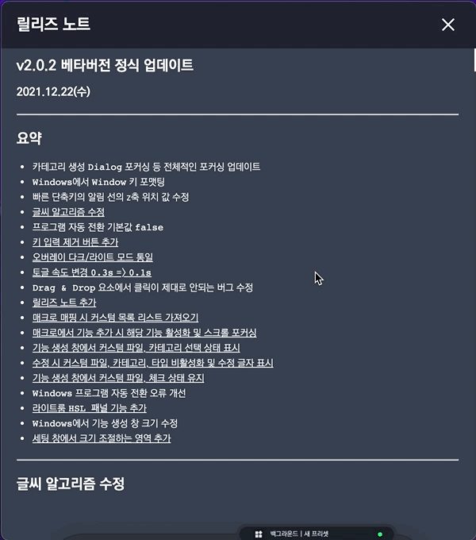

# 2021/12 5주차 주간 리포트

## 주간 작업 목록

- [광고 영상 손 출연 ✅](#광고-영상-손-출연-)
- [`Clip Studio Paint` 프리셋 추가 ✅](#clip-studio-paint-프리셋-추가-)
- [파일/폴더/웹사이트 입력 분할 ✅](#파일폴더웹사이트-입력-분할-)
- [`Windows` 호환 조사 및 픽스 ✅](#windows-호환-조사-및-픽스-)
- [`node-gyp` 조사 ✅](#node-gyp-조사-)
- [`Mac`에서 `CameraRaw` 조사 ✅](#mac에서-cameraraw-조사-)
- [디테일 수정 ✅](#디테일-수정-)

---

---

## 광고 영상 손 출연 ✅

#### 작업 상세 설명

- 광고 영상을 촬영하기 위해 `Adobe Lightroom Classic`의 시연 영상을 촬영하였습니다.

---

## `Clip Studio Paint` 프리셋 추가 ✅

#### 작업 상세 설명

- `Windows`에서 `Clip Studio Paint`의 추천 프리셋이 뜨지 않는 버그를 수정하였습니다.

#### 고려 사항

- 모든 추천 프리셋이 현재 한/영 번역이 완벽하지 않습니다.

---

## 파일/폴더/웹사이트 입력 분할 ✅

##### 작업 상세 설명

- 기존의 파일/폴더 통합 선택 시 `Windows`에서는 파일이 선택되지 않는 상태가 나타났습니다.
- 이에 파일 열기, 폴더 열기, 웹사이트 열기를 분할하여 선택할 수 있도록 수정하였습니다.

---

## `Windows` 호환 조사 및 픽스 ✅

#### 작업 상세 설명

- `Windows`에서 `Adobe XD`의 자동 전환이 정상적으로 동작하지 않는 버그를 수정하였습니다.
- `Windows`에서 한글 입력 시 꺼지는 버그의 원인을 발견했습니다.

  - `Windows`의 경우 `IME Mode`가 한글로 설정되어 있으면, 한글은 자음과 모음의 조합을 해야하기 때문에 `Process`. 즉, 처리 중이라는 의미로 표현합니다.
  - 그렇기 때문에 조합이 완료된 후에 조합 값을 입력 받을 수 있습니다.
  - 이를 처리하기 위해선 `onKeyDown` 이벤트가 아닌 `onChange` 이벤트 등 다른 이벤트로 처리해야 합니다.
  - 이 경우 입력 받은 한글 값을 `ㄱ` -> `r` 등으로 변환할 맵을 만들어야 하는데 현재로는 비효율적이라 판단됩니다.
  - 다른 방법이 더 있는지 조사할 예정입니다.

- `Windows`에서 아이콘이 로드 안되는 버그는 명확한 원인을 발견하지 못하였습니다.

  - 보조 모니터에서 아이콘이 로드 안 될 확률이 높은 것은 맞지만 명확한 이유는 확인하지 못하였습니다.
  - 직접 네이티브 프로그래밍(윈도우 프로그래밍)을 하여 테스트 해본 후 기존 소스에 결함을 확인해보는 방향으로 진행 예정입니다.

#### 고려 사항

- 조사한 정보는 [여기](https://github.com/ghooz1204/weekly-summary/tree/master/research/javascript/ime-mode.md)에서 확인할 수 있습니다.

---

## `node-gyp` 조사 ✅

#### 작업 상세 설명

- `Node.js`는 `V8` 엔진을 기반으로한 `JavaScript` 런타임 플랫폼으로, 기본적으로 네이티브 프로그래밍을 할 수 없습니다.
- `node-gyp`를 통해 `C/C++`로 작성된 언어를 `Node.js` 모듈로 빌드하여 사용할 수 있습니다.
- 빌드된 파일을 `Node.js`의 크로스 플랫폼 데스크탑 애플리케이션 프레임워크인 `Electron.js`에서도 불러와 사용할 수 있습니다.
- 즉, `Windows`와 `Mac`의 네이티브 프로그래밍을 `Electron.js`에 포함시킬 수 있게 됩니다.
- 이를 통해 현재 구현되어 있지 않은 기능인 `Mac`에서 `CameraRaw` 개발, `Windows`에서 단축키 한/영 전환 등의 기능을 구현할 수 있을 것으로 예상됩니다.
- 구현 가능할 것으로 예상되는 기능 목록
  - `Mac`에서 `CameraRaw` 개발.
  - `Windows`에서 구현된 `CameraRaw`의 `DLL` 파일을 `node-gyp`를 통해 구현.(`Mac`과 코드 통합 후 크로스 플랫폼 화)
  - 마우스 위치를 기준으로 다이얼 회전시 `X`축, `Y`축 드래그 실행.
  - 기능을 예상치 못한 프로그램에 실행시키는 버그를 줄일 수 있도록 현재 프로그램으로 단축키 입력 직접 전송.
  - `Shift`, `Control` 등의 특수 키를 독립적으로 사용할 수 있는 기능.
  - 모든 프로그램을 커스텀 `Protocol`을 통해 단축키 접근이 아닌 직접 접근.

#### 고려 사항

- `OS`의 네이티브 프로그래밍이 지원하지 않는 범위. 즉, 네이티브 프로그래밍 프레임워크(`WIN32 API`, `Cocoa Framework`)에서 지원하지 않는 기능의 경우에는 구현하기 어렵습니다.
- 아직까지는 미지의 영역으로 봐도 무방한 수준이며, 탐구를 계속 진행해야할 것으로 예상됩니다.
- 조사한 정보는 [여기](https://github.com/ghooz1204/weekly-summary/tree/master/research/node-gyp) 에서 확인할 수 있습니다.

---

## `Mac`에서 `CameraRaw` 조사 ✅

#### 작업 상세 설명

- `Windows`에서는, 직접 `CameraRaw` 창의 핸들을 조작하여 그 창의 하위 핸들에 접근하는 방법을 사용합니다.
- `Mac`에서도 윈도우 프로그래밍과 같은 네이티브 프로그래밍을 하기 위한 조사를 진행하였습니다.
- `Mac`에서 네이티브 프로그래밍을 하기 위한 언어로는 `Objective-C`와 `Swift`가 존재합니다.
- `Objective-C`를 사용하면 `node-gyp`를 통해 `Node.js`와 호환이 가능하기 때문에 이를 기준으로 조사였습니다.
- `Objective-C`에는 `Appkit`, `Core Graphics`, `Foundation`, `Core Foundation`, `XPC` 등 다양한 네이티브 접근 라이브러리가 존재하는 것을 확인했습니다.

  - `Appkit` 라이브러리

    - 애플리케이션의 이벤트 루프 실행, 리소스, 애플리케이션 윈도우 관리, 알림 전달, `UI` 조작, `Dock`, `Touchbar` 등을 관리하고, 애플리케이션에서 파일 처리를 하며, 실행, 활성화, 숨기기, 애플리케이션의 정보를 가져올 수 있는 기능 수행할 수 있습니다.

    > 하지만 창에 직접 접근하여 하위 기능을 조작하는 기능은 확인할 수 없었습니다.

  - `Core Graphics`

    - 디스플레이 하드웨어 제어 및 관리, 애플리케이션 마우스, 키보드, 스크롤 이벤트 제어 및 관리, 애플리케이션 윈도우 관리 등의 기능을 수행할 수 있습니다.
    - 마우스, 키보드, 스크롤 등의 이벤트를 직접 실행할 수 있습니다.
    - 이 기능을 잘 제어하면 마우스 드래그를 실행할 수 있고, 특정 위치에서 마우스 드래그 조작 등의 기능을 구현할 수 있습니다.
    - `IME-Mode`와 관련된 기능이 존재하는지 확인 중에 있으나, 현재는 발견하지 못했습니다.

    > 하지만 창에 직접 접근하여 하위 기능을 조작하는 기능은 확인할 수 없었습니다.

  - `Foundation`

    > 기본 계층 라이브러리에 관한 정보가 있으며, 역시나 창에 직접 접근하여 하위 기능을 조작하는 기능은 확인할 수 없었습니다.

  - `Core Foundation`, `XPC`, `AppleScript` 등의 문서가 아직 더 있으며, 이 문서들을 더 탐구할 예정입니다.

  - `Apple Script`에서도 창에 직접 접근하여 조작할 수 있는지 조사할 예정입니다. 아직까지는 발견하지 못했습니다.

> `Objective-C`, `Swift`가 구현되어 있는 기반 프레임워크의 이름이 `Cocoa Framework`인 것으로 확인되어 최종적으로는 `Cocoa Framework`를 조사해야할 것으로 예상됩니다.

#### 고려 사항

- `Windows`에서 창의 핸들을 조작하여 하위 핸들에 접근하는 방법을 윈도우 프로그래밍 기법이라는 이름 외에 다른 이름을 발견하지 못 했습니다.
- 이에 `Mac`에서도 해당 기능을 부르는 이름이 있다면 더욱 발견하기 쉬울 것 같습니다.
- 혹시나 정보를 알게 된다면 말씀해주시면 감사하겠습니다.
- 조사한 정보는 [여기](https://github.com/ghooz1204/weekly-summary/tree/master/research/objective-c) 에서 확인할 수 있습니다.

---

## 디테일 수정 ✅

#### 작업 상세 설명

- 릴리즈 노트 링크 구현

  

  - 릴리즈 노트의 목차에서 링크를 눌러 이동할 수 있으나, 몇몇 링크는 제대로 이동이 되지 않는 현상이 발생합니다.

- 오버레이 회전 기능 임시 삭제

  - 오버레이 회전 기능이 정상적으로 작동하지 않는 것이 확인되어 일시적으로 삭제하였습니다.

---

---

## 전달 사항

> 2021.12.29(수) 소프트웨어 2.0.3 버전(베타버전 최종) 런칭.

### 이번 주 추가 리스트

- 파일/폴더/웹사이트 입력 분할
- Clip Studio 프리셋 추가
- XD Windows 호환

### 이번 주 구현 리스트

- 파일/폴더/웹사이트 입력 분할
- 릴리즈 노트 링크 구현
- Clip Studio 프리셋 추가
- XD Windows 호환

### 현재 구현이 필요한 기능 리스트(미구현 리스트)

- 자동 업데이트 환경 구성
- 목록 휴지통 기능 구현 - Design 설계 중.
- 서브 오버레이?
- Func 형식에 id 추가
- Func 형식에서 sendCepScript의 경우 fcode에 id 값 매핑 후 실행
- 매크로 여러 개 클릭하여 한 번에 복사 / 붙여넣기
- 모든 데이터 구조 ID 형식 변경 number -> string
- 키보드 모드
- Mac에서 설치 시 CEP 프로그램 종료 시키기
- Windows에서 프로그램 리스트 잘 안뜨는 버그
- Windows 한글로 키 입력 시 종료되는 버그
- 오버레이 회전 기능 구현
