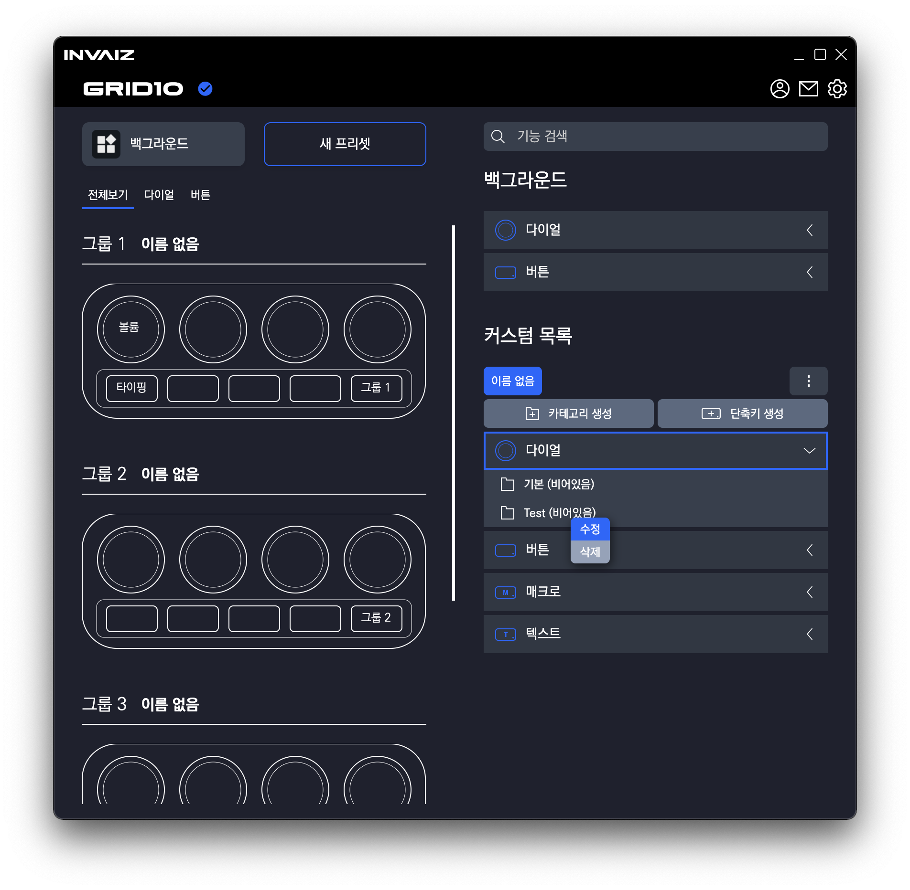
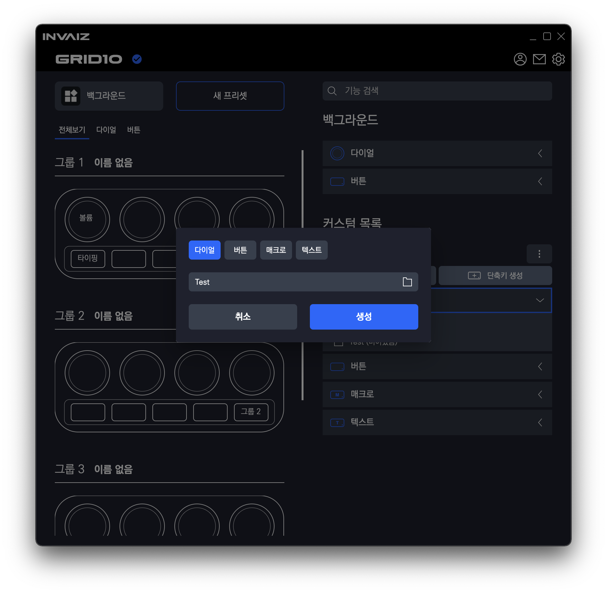
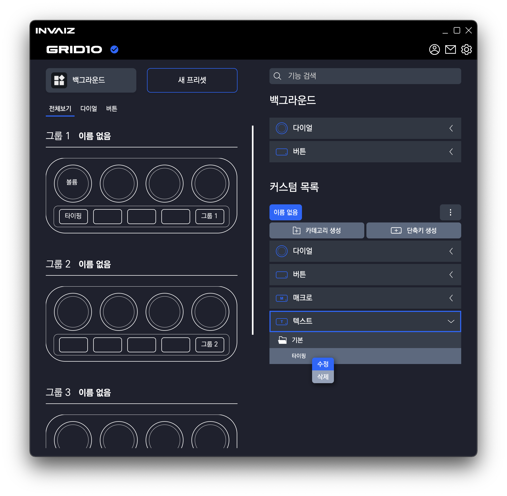
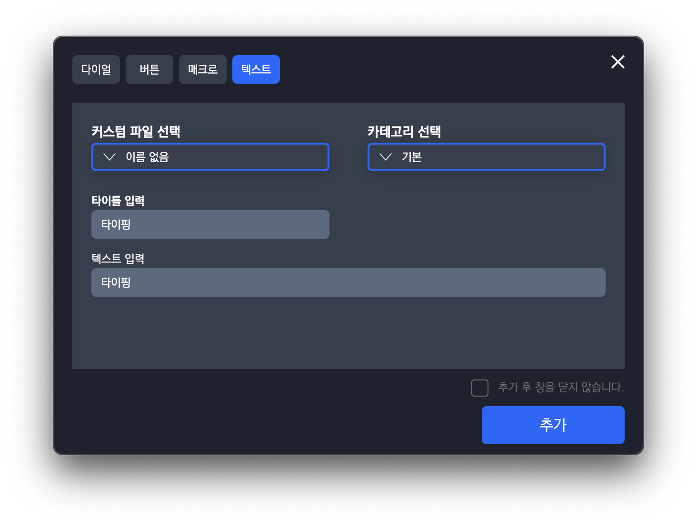
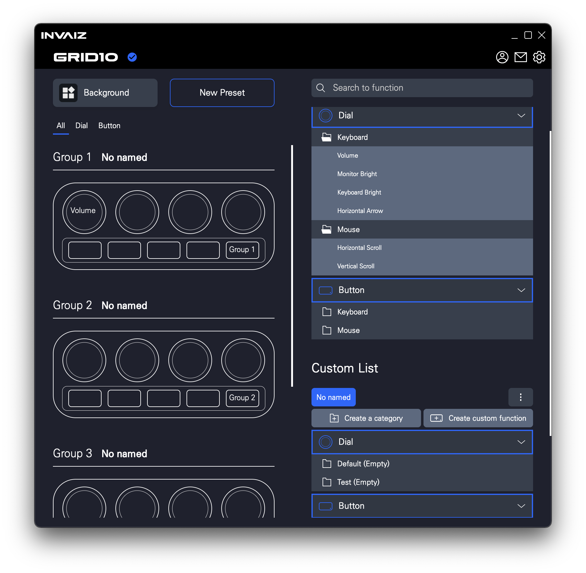

# 2021/12 2주차 주간 리포트

## 주간 작업 목록

- [새로운 아이콘 적용 ✅](#새로운-아이콘-적용-)
- [`Grid Pro HID` 연결 테스트 ✅](#grid-pro-hid-연결-테스트-)
- [오버레이 디자인 변경 ✅](#오버레이-디자인-변경-)
- [기능 추가/삭제/수정/제거 Context 기능 구현 ✅](#기능-추가삭제수정제거-context-기능-구현-)
- [`INVAIZ Studio` 리뉴얼 베타버전 런칭 ✅](#invaiz-studio-리뉴얼-베타버전-런칭-)
- [빠른 단축키 입력 구현 ❌](#빠른-단축키-입력-구현-)
- [펑션베이 Python example code 작성 ✅](#펑션베이-python-example-code-작성-)
- [고객과의 미팅 ✅](#고객과의-미팅-)

---

## 새로운 아이콘 적용 ✅

#### 작업 상세 설명

`INVAIZ Studio 2.0`에서 보여질 새로운 아이콘을 적용하여 패키징.

- 상단 아이콘

  

- 아이콘 1

  

- 아이콘 2

  

#### 고려 사항

원래 아이콘 초안이 약 12개고, 선명도가 낮은거부터 높은 것까지 있어서  
`INVAIZ Studio`의 버전 업데이트가 진행될 때마다 차차 선명도를 높일까 했는데  
막상 낮은 선명도로 패키징을 해보니 이미지가 별로라 가장 높은 선명도로 선택.

---

## `Grid Pro HID` 연결 테스트 ✅

#### 작업 상세 설명

`SerialPort`가 아닌 `HID`로 개발된 `Grid Pro` 제품을 `INVAIZ Studio`와 연결하여
키 입력을 테스트 함.

후에 포디브 측에서 고정키(`Shift`, `Control` 등) 기능을 탑재 후에 재 테스트 하면 완벽해질 것으로 판단.

현재 입력은 매우 잘 되는 것을 확인.

#### 고려 사항

`Grid Pro`의 추천 프리셋을 설정하면, 실제 동작을 확인해볼 수 있음.

---

## 오버레이 디자인 변경 ✅

#### 작업 상세 설명

대표님의 아이디어를 따라, 서브 오버레이의 기능인 현재 프로그램, 프리셋을 기존 오버레이에 탑재.


#### 고려 사항

여전히 글씨가 작다는 문제가 있으며, 길이에 따라 초록 점과의 간격 차이가 발생하는 버그? 존재.

---

## 기능 추가/삭제/수정/제거 Context 기능 구현 ✅

#### 작업 상세 설명

- 커스텀 카테고리 수정

  

- 커스텀 카테고리 수정 예시

  

- 커스텀 기능 수정

  

- 커스텀 기능 수정 예시

  

또한 카테고리 리스트를 여러 개 볼 수 있도록 수정함

- 기능 여러 개 열기 가능

  

---

## `INVAIZ Studio` 리뉴얼 베타버전 런칭 ✅

#### 작업 상세 설명

2021.12.08(수) 12시 경 `INVAIZ Studio` 베타 버전을 런칭함.

피드백을 받으며 매주 수요일에 2.0.x 버전으로 업데이트 예정.

---

## 빠른 단축키 입력 구현 ❌

#### 작업 상세 설명

기존에 추가할 예정이었으나, 피드백에도 제시된 기능.

#### 고려 사항

우클릭 시 `Context Menu`를 통해 빠른 단축키를 켜는 것이 아닌 좌클릭으로 바로 켜는게 나아보임.

---

## 펑션베이 Python example code 작성 ✅

#### 작업 상세 설명

2021.12.06(월)에 (주)펑션베이의 수석 연구원에게서 `Grid10` 제품을 구입하여 사용하고 있는데, 자사의 소프트웨어인 [`RecurDyn`](https://functionbay.com/ko)과 연동하여 INPUT 장비로 사용하기 위한 자문을 구함.

이는 `Grid10`을 통해 자사의 소프트웨어를 직접 접근하는 기능을 구현하려는 것으로 판단.  
즉, 우리 제품과의 100% 연동(제휴) 하는 소프트웨어가 생기게 됨.

> `Adobe`의 `CEP` 기능처럼 소프트웨어를 직접 조작하는 행위를 우리 제품으로 이용하겠다.

이에 `INVAIZ Studio` 처럼 `Grid10`의 데이터를 수신하는 `Python` 소스코드를 작성하여 전달하기로 함.

```python
# -*- coding:utf-8 -*-
import time
import serial
import threading
import serial.tools.list_ports as sp


class Protocol(object):
    """\
    Protocol as used by the ReaderThread. This base class provides empty
    implementations of all methods.
    """

    def connection_made(self, transport):
        """Called when reader thread is started"""

    def data_received(self, data):
        """Called with snippets received from the serial port"""

    def connection_lost(self, exc):
        """\
        Called when the serial port is closed or the reader loop terminated
        otherwise.
        """
        if isinstance(exc, Exception):
            raise exc


class ReaderThread(threading.Thread):
    """\
    Implement a serial port read loop and dispatch to a Protocol instance (like
    the asyncio.Protocol) but do it with threads.
    Calls to close() will close the serial port but it is also possible to just
    stop() this thread and continue the serial port instance otherwise.
    """

    def __init__(self, serial_instance, protocol_factory):
        """\
        Initialize thread.
        Note that the serial_instance' timeout is set to one second!
        Other settings are not changed.
        """
        super(ReaderThread, self).__init__()
        self.daemon = True
        self.serial = serial_instance
        self.protocol_factory = protocol_factory
        self.alive = True
        self._lock = threading.Lock()
        self._connection_made = threading.Event()
        self.protocol = None

    def stop(self):
        """Stop the reader thread"""
        self.alive = False
        if hasattr(self.serial, 'cancel_read'):
            self.serial.cancel_read()
        self.join(2)

    def run(self):
        """Reader loop"""
        if not hasattr(self.serial, 'cancel_read'):
            self.serial.timeout = 1
        self.protocol = self.protocol_factory()
        try:
            self.protocol.connection_made(self)
        except Exception as e:
            self.alive = False
            self.protocol.connection_lost(e)
            self._connection_made.set()
            return
        error = None
        self._connection_made.set()
        while self.alive and self.serial.is_open:
            try:
                # read all that is there or wait for one byte (blocking)
                data = self.serial.read(self.serial.in_waiting or 1)
            except serial.SerialException as e:
                # probably some I/O problem such as disconnected USB serial
                # adapters -> exit
                error = e
                break
            else:
                if data:
                    # make a separated try-except for called used code
                    try:
                        self.protocol.data_received(data)
                    except Exception as e:
                        error = e
                        break
        self.alive = False
        self.protocol.connection_lost(error)
        self.protocol = None

    def write(self, data):
        """Thread safe writing (uses lock)"""
        with self._lock:

            print(data)
            self.serial.write(data)

    def close(self):
        """Close the serial port and exit reader thread (uses lock)"""
        # use the lock to let other threads finish writing
        with self._lock:
            # first stop reading, so that closing can be done on idle port
            self.stop()
            self.serial.close()

    def connect(self):
        """
        Wait until connection is set up and return the transport and protocol
        instances.
        """
        if self.alive:
            self._connection_made.wait()
            if not self.alive:
                raise RuntimeError('connection_lost already called')
            return (self, self.protocol)
        else:
            raise RuntimeError('already stopped')

    # - -  context manager, returns protocol

    def __enter__(self):
        """\
        Enter context handler. May raise RuntimeError in case the connection
        could not be created.
        """
        self.start()
        self._connection_made.wait()
        if not self.alive:
            raise RuntimeError('connection_lost already called')
        return self.protocol

    def __exit__(self, exc_type, exc_val, exc_tb):
        """Leave context: close port"""
        self.close()


# 프로토콜


class rawProtocal(Protocol):
    # 연결 시작시 발생
    dialState = [0, 0, 0, 0]
    buttonState = [False, False, False, False, False]

    def connection_made(self, transport):
        self.transport = transport
        self.running = True

    # 연결 종료시 발생
    def connection_lost(self, exc):
        self.transport = None

    # 데이터가 들어오면 이곳에서 처리함.
    def data_received(self, data):
        bfSplit = data.decode('utf-8').replace("\r\n", "").split(',')
        bfSplit.pop(0)
        if len(bfSplit) > 0:
            dialArray = bfSplit[0:16]
            buttonArray = bfSplit[16:21]

            for i in range(4):

                dial_value = dialArray[(i * 4) + 1]
                dial_vector = dialArray[(i * 4) + 2]
                if (dial_vector != '0'):
                    onRotateDial(i, dial_vector, dial_value)

                self.dialState[i] = dial_vector

            for i in range(5):

                button_state = buttonArray[i] == '1'
                if (button_state != self.buttonState[i]):
                    onClickButton(i, button_state)

                self.buttonState[i] = buttonArray[i] == '1'

    # 데이터 보낼 때 함수
    def write(self, data):
        print(data)
        self.transport.write(data)

    # 종료 체크
    def isDone(self):
        return self.running


def connectDevice():
    list = sp.comports()

    connected = []

    for i in list:
        if i.vid == 1155:
            connected.append(i)
            print("Connected COM ports: ", str(i))

    # 연결
    for c in connected:
        device = serial.serial_for_url(
            str(c.device), baudrate=115200, timeout=0)

    return device


# 다이얼 실행 함수
def onRotateDial(index, vector, value):
    print("number ", (index + 1), " dial")
    if (vector == 1):
        print("rotate to clockwise ", value)
    else:
        print("rotate to counter clockwise ", value)

# 버튼 실행 함수


def onClickButton(index, state):
    print("number ", (index + 1), " button")
    if (state == 1):
        print("press down")
    else:
        print("press up")


device = connectDevice()

# 쓰레드 시작
with ReaderThread(device, rawProtocal) as p:
    while p.isDone():
        time.sleep(1)

```

#### 고려 사항

소스코드 전달 후 해당 연구원과 지속적 대화를 통해 소프트웨어 연동 및 제휴를 추진할 계획.

---

## 고객과의 미팅 ✅

#### 작업 상세 설명

`instagram`으로 고객님의 피드백 미팅 제의가 들어와 2021.12.09(목) 오후 2시에 양정역에서 대면 미팅 진행.

자세한 내용은 파일로 업로드 되어 있음.

#### 고려 사항

우리의 기획에 참여 요청하여 함께 대화해보는 것이 좋아 보임.

---

## 전달 사항

### 현재 구현이 필요한 기능 리스트(미구현 리스트)

- 자동 업데이트 환경 구성
- 프로그램 포커싱 - 객체 Design 고민.
- 목록 휴지통 기능 구현 - Design 설계 중.
- 오버레이 및 미리보기 글씨 알고리즘 수정
- 서브 오버레이?
- `Func` 형식에 `id` 추가
- `Func` 형식에서 `sendCepScript`의 경우 `fcode`에 `id` 값 매핑 후 실행
- 매크로 매핑 시 커스텀 목록 리스트 가져오기
- 매크로 여러 개 클릭하여 한 번에 복사 / 붙여넣기
- 기능 추가 시 `snackbar` 띄우기
- 모든 데이터 구조 ID 형식 변경 `number` -> `string`
- 키보드 모드
