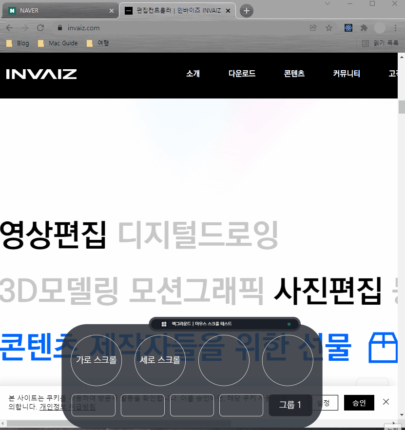

# 2022/01 1주차 주간 리포트

## 주간 작업 목록

- [`Windows` 스크롤 버그 수정 ✅](#windows-스크롤-버그-수정-)
- [`node-gyp` 조사 ✅](#node-gyp-조사-)
- [`macOS`에서 `Camera Raw` 조사 ✅](#macos에서-camera-raw-조사-)

---

---

## `Windows` 스크롤 버그 수정 ✅

#### 작업 상세 설명

- `Windows`에서 마우스 가로, 세로 스크롤이 동작하지 않는 버그를 수정하였습니다.

#### 고려 사항

- 마우스 스크롤을 어떻게 매핑할 것인가 키보드 모드 말고도 고안을 해보아야할 것 같습니다.

---

## `node-gyp` 조사 ✅

#### 작업 상세 설명

- 기존 `AXUIElementRef`를 실험한 코드를 작성한 `XCode`로 부터, 개발 환경을 `window-handle`이라는 프로젝트로 옮겨와서 코드 작성을 진행하였습니다.
- `XCode`에서 사용하는 `Objective-C` 문법과 `node-gyp`로 컴파일되는 `Objective-C` 문법에는 간소한 차이가 있어 호환 코드를 작성하지 않으면 오류가 발생합니다.
  - `CFTypeRef`를 `AXUIElementRef`로 자동 타입 변환이 안 되거나, `CFRelease` 함수에서 오류가 발생하는 등의 오류. 즉, `node-gyp`가 타입 추적이 좀 더 까다롭습니다.
- `node-addon-api`를 활용하여 `JavaScript`에서 사용가능한 네이티브 모듈을 보다 쉽게 빌드할 수 있습니다.
- `node-addon-api`의 `Napi::Env`, `Napi::CallbackInfo`, `Napi::String`, `Napi::Value`를 통해서 함수를 접근하고, `JavaScript`에서 `value` 값을 인수로 넘겨 연산 시 `+` 혹은 `-`를 할 수 있게 구현하였습니다.
- `node-gyp`와 `node-addon-api`를 활용하여 `window-handle`이라는 네이티브 모듈을 생성하였습니다.

  

- 해당 모듈을 실행시켜 가속도 값에 따라 `Camera Raw`에서 접근 가능한 모든 `AXTextField` 요소의 값을 `+value`할 수 있습니다.

  

- 네이티브 모듈을 실행하는 `Node.js` 파일에서 `try ... catch ...` 문법으로 에러 핸들링을 해도 네이티브 모듈 내에서 에러가 발생하면 애플리케이션이 강제 종료됩니다.

- 현재는 값만 바꾸는 예제 코드를 작성하였으며, 실제로 값이 적용되지는 않습니다.
- 값을 실제로 적용하기 위해서는 해당 영역에 포커스를 해야하는 것으로 확인되었습니다.

#### 고려 사항

- 조사한 정보는 [여기](https://github.com/ghooz1204/weekly-summary/tree/master/research/node-gyp) 에서 확인할 수 있습니다.

---

## `macOS`에서 `Camera Raw` 조사 ✅

#### 작업 상세 설명

- `Objective-C`의 `Core Foundation`, `Application Service` 라이브러리를 조사하였습니다.

  - `Core Foundation`

    > 기본 계층 라이브러리인 `Foundation`의 `Low-level` 구현 버전으로 `Foundation` 라이브러리와 호환이 가능합니다.

  - `Application Service`

    > `Carbon` 애플리케이션에 필수적인 여러 서비스를 포함하는 애플리케이션 서비스 프레임워크에 대한 `API` 참조를 제공합니다.

    - `macOS`에서 `Objective-C`의 `Application Service` 라이브러리를 활용하면 실행 중인 애플리케이션과 통신, 제어 가능한 것을 확인하였습니다.
    - `macOS`에서는 `Windows`의 `Handle` 개념이 `AXUIElement`. 즉, 접근 가능한 애플리케이션 요소라는 이름으로 구현되어 있습니다.
    - `Adobe Photoshop`에 접근 가능한 `AXUIElementRef`를 생성한 후, 하위 창인 `Camera Raw`에 접근하여 `AXUIElementRef`의 `AXTextField` 요소에 직접 접근하여 값을 변경합니다.
    - `Camera Raw`에서 접근 가능한 모든 `AXTextField`의 값을 가져온 후, `+1`하여 적용하는 소스 코드를 작성하여 실행한 결과입니다.
      

- `macOS`의 `Accessibility Inspector`라는 도구를 사용하면 해당 애플리케이션 창에 있는 접근 가능한 요소를 확인할 수 있습니다.

  

  - 해당 도구를 활용하여 보여지지 않는 요소는 `AXTextField`가 접근할 수 없다는 것을 확인했습니다.

> `Application Service`, `Core Graphics`, `Appkit` 라이브러리를 잘 활용하면 `Camera Raw`를 지원은 물론이고, 다양한 이벤트 관리와 같은 추가 기능 및 성능 향상이 가능할 것으로 사료됩니다.

#### 고려 사항

- `macOS`에서 `Camera Raw` 창이 활성화되어 있지 않거나, 활성화되어 있더라도 해당 요소가 보여지고 있지 않은 경우, 해당 `AXTextField`에 접근할 수 없어 조작이 불가능합니다.
- 이에 해당 영역의 스크롤로 이동을 시키는 방법을 고안하거나, 전체화면 기준에서 정상 작동 한다고 명시를 해야하는 두 가지 방법 중 한 가지를 선택해야할 것 같습니다.
- `Loupedeck`은 현재 요소가 보여지고 있지 않은 경우 다른 `AXTextField`에 접근하는 오류가 발생합니다.
- 조사한 정보는 [여기](https://github.com/ghooz1204/weekly-summary/tree/master/research/objective-c) 에서 확인할 수 있습니다.

---

---

## 전달 사항

### 이번 주 추가 리스트

- `Windows`에서 마우스 스크롤 안되는 버그 수정

### 이번 주 구현 리스트

- `Windows`에서 마우스 스크롤 안되는 버그 수정

### 현재 구현이 필요한 기능

- 자동 업데이트 환경 구성
- 목록 휴지통 기능 구현 - Design 설계 중.
- 서브 오버레이
- `Func` 형식에 `id` 추가
- `Func` 형식에서 `sendCepScript`의 경우 `fcode`에 `id` 값 매핑 후 실행
- 매크로 여러 개 클릭하여 한 번에 복사 / 붙여넣기
- 모든 데이터 구조 ID 형식 변경 `number` -> `string`
- 키보드 모드
- `Mac`에서 설치 시 `CEP` 프로그램 종료 시키기
- `Windows`에서 프로그램 리스트 잘 안뜨는 버그
- `Windows` 한글로 키 입력 시 종료되는 버그
- 오버레이 회전 기능 구현
