# 2022/01 2주차 주간 리포트

## 주간 작업 목록

- [`L`사의 `Camera Raw` 분석](#l사의-camera-raw-분석-)
- [`node-gyp`로 `macOS` `Camera Raw` 개발](#node-gyp로-macos-camera-raw-개발-)
- [릴리즈 노트 양식 변경 ✅](#릴리즈-노트-양식-변경-)
- [디테일 수정 ✅](#디테일-수정-)

---

---

## `L`사의 `Camera Raw` 분석

#### 작업 상세 설명

- `Camera Raw`의 기능을 완벽하게 숙지하지 못한 관계로 다이얼 기능을 중심으로 분석하였습니다.

##### 배치 및 구성

- 우선 `L`사의 소스 코드를 리버싱하여 분석하였습니다.

  - `macOS`에서의 기능 구현 원리를 발견하여 개발에 도움이 됐습니다.
  - 소스 코드 자체는 꼬여 있으나, 불필요한 분기문과, 데이터의 저장 방식 등 후에 버그가 발생했을 때 수정하기 어려운 방식으로 개발이 되어 있는 것을 확인했습니다. 이는 추후 의존 중인 애플리케이션에 변경이 생길 경우 피드백 및 수정이 늦어질 것으로 예상됩니다.
  - 이에 `C#`으로 구현된 소스 코드를 참고하여 `C/C++`로 옮기고, 코드의 간략화 작업을 추진 중입니다.

- `L`사에서는 자동 업데이트를 지원하지는 않고 선택적 알림으로 업데이트 소식을 전달합니다.

  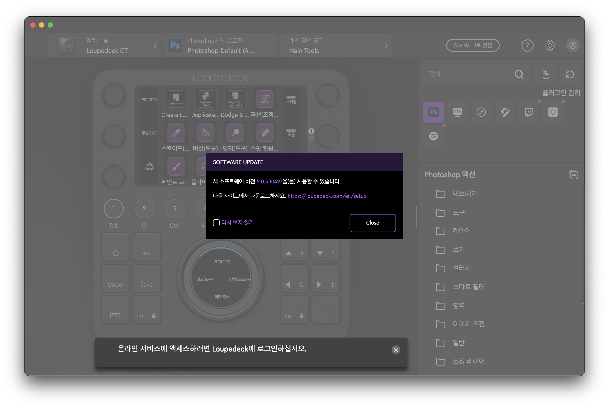

- 기능의 카테고리를 22가지로 구분하여 정리하였습니다. 또한, 모든 파라미터 값을 조절할 수 있지 않고 제한된 기능을 제공하고 있습니다.

  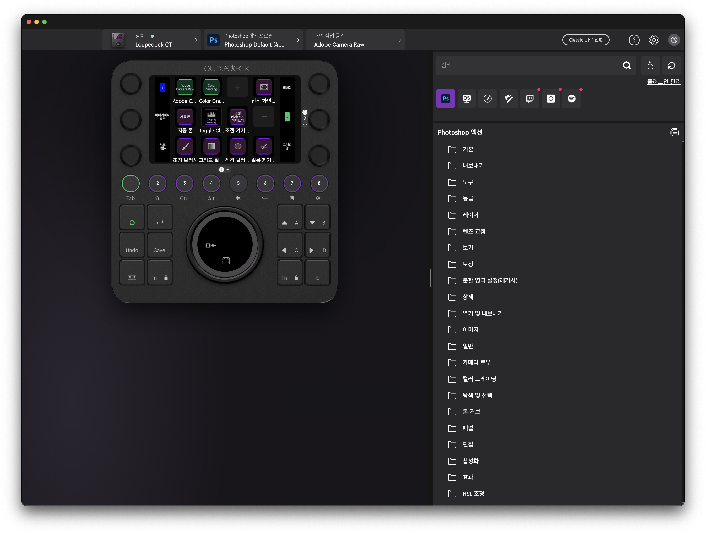

  - 패널 열기, 도구 선택, 내보내기 등 버튼으로 활용할 수 있는 요소들을 잘 정리하였습니다.

- 기능 자체가 영어 정렬인지, 실제 `UI`와 다르게 정렬되어 있어 직관적이지 않습니다.

##### 오류

- 영어 기준이다 보니 한글화에 취약하며 공통되어 있지 않은 용어를 많이 사용합니다.

  > [어두운 영역 = 그림자 = 음영] 등.

- 제공되는 오버레이가 `Camera Raw` 창에 가려집니다.

  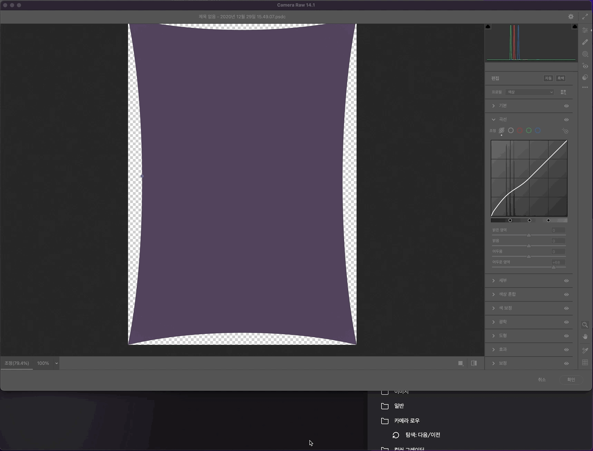

- `Camera Raw`보다 `Photoshop`을 먼저 잡는 현상이 발생합니다.

  

- 노출 조작 후 -5.0, +5.0 범위를 벗어나며, 포커스를 이동했을 때 알림이 뜹니다.

  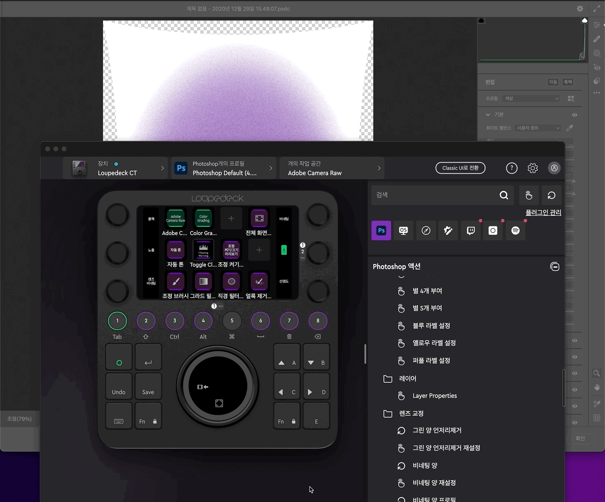

- 렌즈 교정 전체(비네팅 양, 그린 양 언저리 제거) 등 곳곳에서 버그가 발생합니다.

  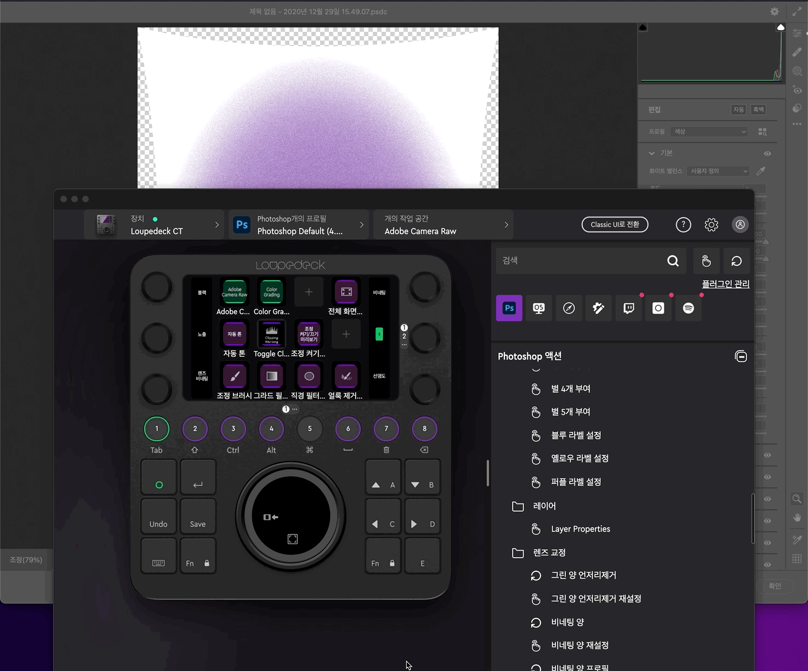

  - 전체화면인 경우에도 오류가 미미하게 존재하므로, 완벽하다고 볼 수 없는 지원 상태.

- `Camera Raw`의 사이즈가 작거나, 기능에 해당하는 패널의 텍스트 영역의 갯수가 다르면 기능이 정상적으로 실행되지 않습니다.

  - 이는 `macOS`에서, 안 보이는 텍스트 영역을 가져올 수 없기 때문에 발생하는 문제입니다.
  - 개선하는 방법은 해당 영역으로 스크롤을 이동시키는 등의 방식이 있으나, 이는 마지막 요소에는 적용되기 힘듭니다.
  - 때문에 `Camera Raw` 설정에서 패널 동작 편집의 값을 단일이 아닌 반응형, 다중으로 선택하게 되면 패널이 여러 개 동시에 열려 정상적인 동작을 할 수 없게 됩니다.

  - 텍스트 영역의 갯수가 안 맞으면 발생하는 오류
    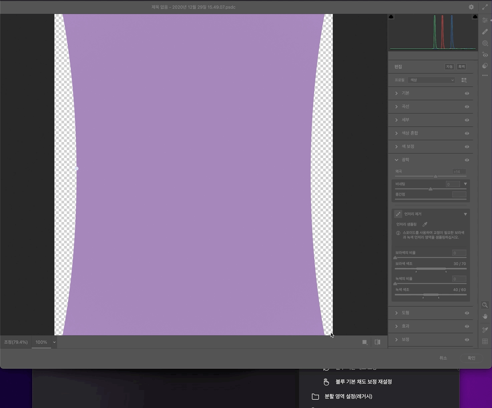

  - `Camera Raw` 창의 사이즈가 작아 텍스트 영역이 덜 보이면 발생하는 오류
    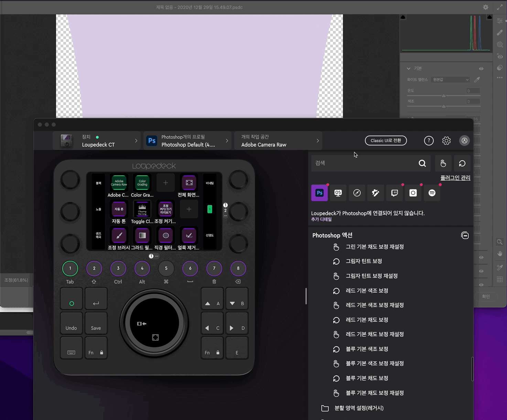

  - `Camera Raw` 패널의 설정이 단일이 아닌 다중으로 선택된 상태에서, 여러 패널이 동시에 열렸을 때 발생하는 오류
    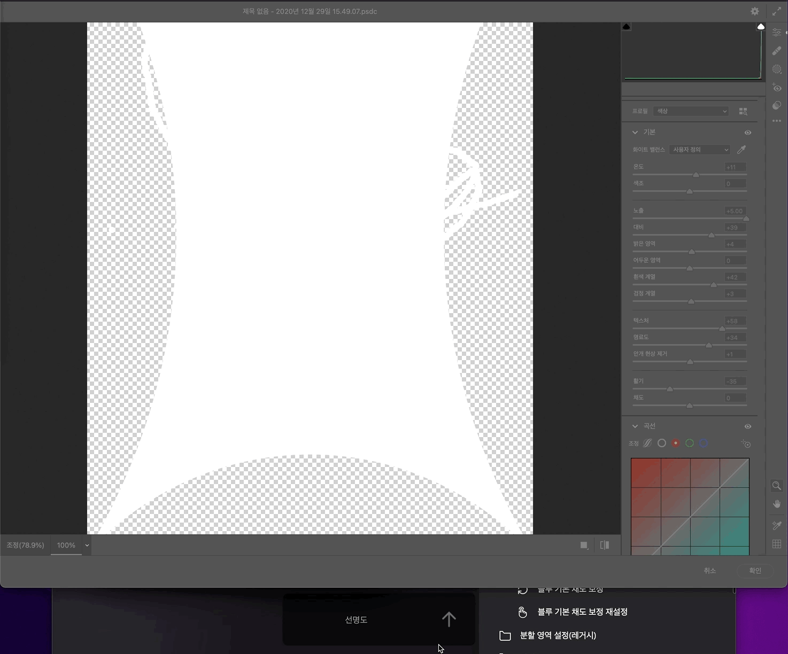

#### 고려 사항

- `L`사에서 지원 중인 기능 구현만 하더라도 시간이 많이 소요될 것으로 예상됩니다.
- `L`사 또한 기능의 버그를 100% 잡지 못하였으며, 이는 따로 `API`가 제공되는 형태가 아닌 강제적으로 직접 접근하는 굉장히 의존적인 방식이기 때문에 발생하는 문제점입니다.
- `L`사와 별개로 `Camera Raw` 자체가 `macOS`에서 조작을 많이 하다보면 키 입력이 잘 안되고, `Photoshop` 애플리케이션이 꺼지지 않아 활성 프로세스 강제 종료로 종료해야 하는 버그가 있습니다.
  - `Camera Raw` 자체가 `macOS`와 잘 안 맞는 것 같습니다.

---

## `node-gyp`로 `macOS` `Camera Raw` 개발

#### 작업 상세 설명

- `XCode`로 모든 소스의 호환성을 확인하여, 호환 가능한 소스를 `node-gyp` 양식에 맞추어 작성 진행하였습니다.
- `window-handle` 모듈을 빌드하여 해당 모듈을 `INVAIZ Studio` 사용합니다.

  - `node-gyp` 구성 파일

  ```json
  {
    "targets": [
      {
        "target_name": "window-handle",
        "cflags!": ["-fno-exceptions"],
        "cflags_cc!": ["-fno-exceptions"],
        "conditions": [
          [
            "OS=='win'",
            {
              "sources": ["lib/windows.cc"]
            }
          ],
          [
            "OS=='mac'",
            {
              "sources": ["lib/macos.mm"],
              "libraries": [
                "-framework AppKit",
                "-framework ApplicationServices"
              ]
            }
          ]
        ],
        "include_dirs": ["<!@(node -p \"require('node-addon-api').include\")"],
        "defines": ["NAPI_DISABLE_CPP_EXCEPTIONS"]
      }
    ]
  }
  ```

  - `macos.mm` 파일에서 `Node.js` 모듈로 내보내기하는 소스

  ```objective-c
  Napi::Object Init(Napi::Env env, Napi::Object exports) {
    exports.Set(
      Napi::String::New(env, "sendMessageToCameraRaw"),
      Napi::Function::New(env, sendMessageToCameraRaw)
    );

    return exports;
  }

  NODE_API_MODULE(addon, Init)
  ```

- `INVAIZ Studio`에서 `Camera Raw` 테스트를 진행하였습니다.

  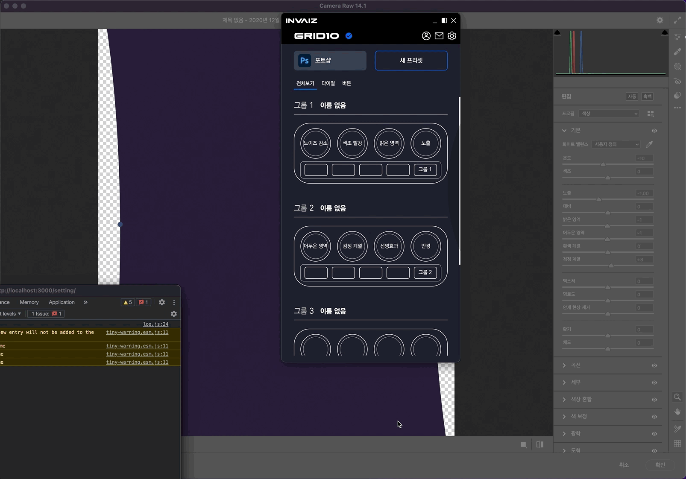

  - 동작 자체는 정상적으로 동작하며, 기능을 매핑하여 이용할 수 있습니다.

- `Windows`에서 사용 중인 `Camera Raw`의 기능 데이터를 `macOS`로 이식하여 형식을 추가하였습니다.

  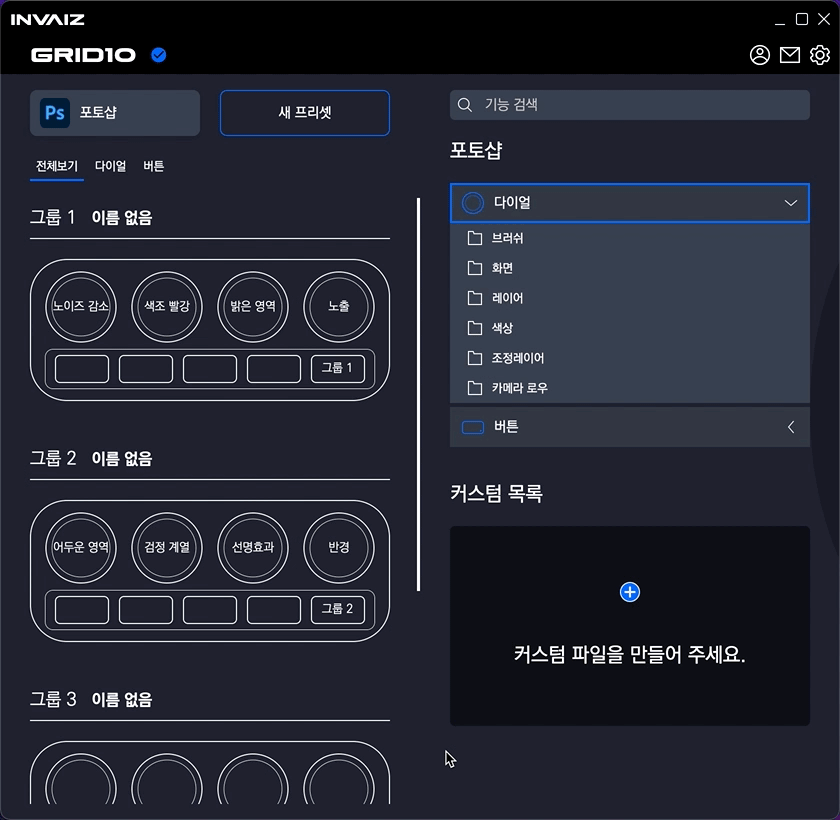

  - 추가한 데이터 형식 예시

  ```json
  [
    {
      "messageType": "CameraRaw",
      "actionType": "adjustmentNormalValue",
      "typeKey": "Saturation"
    },
    {
      "messageType": "CameraRaw",
      "actionType": "adjustmentToneCurveValue",
      "typeKey": "ToneCurveHighlights"
    }
  ]
  ```

  - `messageType`: 사용할 메세지의 타입(`Camera Raw`에서 사용할 메세지이므로 `CameraRaw`).
  - `actionType`: `Camera Raw`에서의 탭과 같은 한 기능의 타입.
  - `typeKey`: 탭에서 조작할 상세한 기능 제시.

#### 고려 사항

- `macOS`에서 모든 기능에 대하여 테스트를 진행해보지 못하였습니다.
- 현재 탭 이동 시 비정상 종료 되는 현상이 존재합니다.
- 몇 몇 패널로 이동하기 위해서는 텍스트 영역에 포커스를 해제한 후에 사용해야 하는 문제점이 있습니다.
- `macOS`의 한계로 지원할 수 없는 탭이 존재할 것으로 예상됩니다.

---

## 릴리즈 노트 양식 변경 ✅

#### 작업 상세 설명

- 릴리즈 노트 요약

  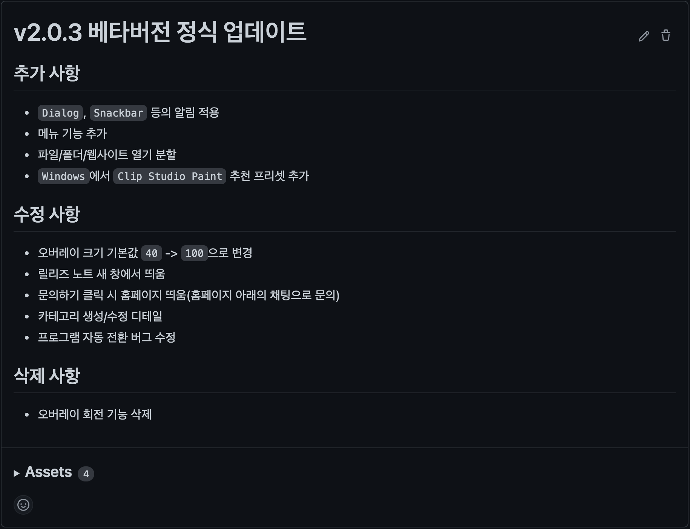

- 릴리즈 노트 상세 보기

  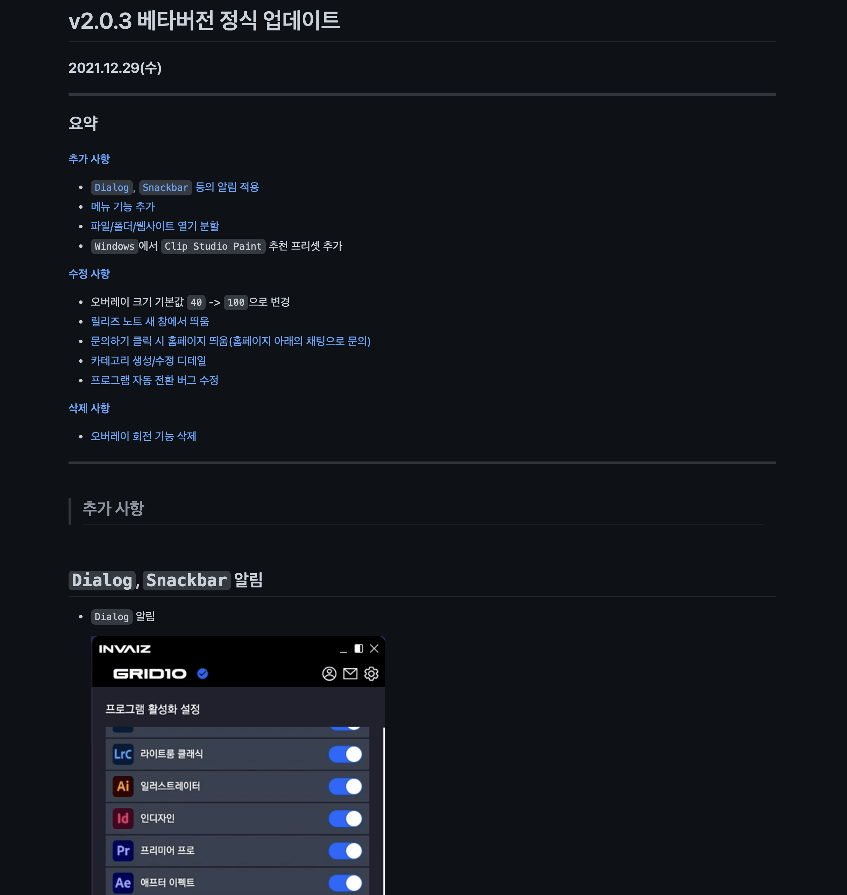

- 소프트웨어 릴리즈 노트 보기

  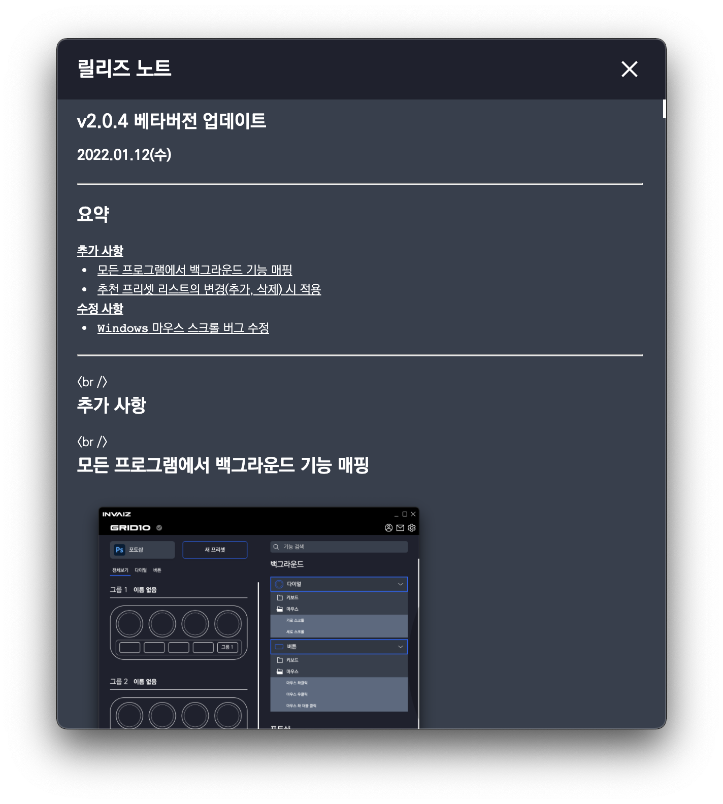

- 릴리즈 노트의 양식을 추가 사항, 수정 사항, 삭제 사항 이렇게 세 분류로 나누었습니다.
- 다운로드 받는 경로(배포 경로)에서는 릴리즈 노트의 요약 버전을 열람 가능하고, 상세 보기 경로에서 자세한 릴리즈 노트를 열람 가능합니다.
- 소프트웨어에서 열람하는 릴리즈 노트는 상세 보기 경로의 릴리즈 노트와 동일합니다.

#### 고려 사항

#### 참고

- [릴리즈 노트 상세 보기](https://github.com/INVAIZ/invaiz-studio-renewal-release/tree/main/release)
- [설치 파일 다운로드 및 릴리즈 노트 간략하게 보기](https://github.com/INVAIZ/invaiz-studio-renewal-release/releases)

---

## 디테일 수정 ✅

#### 작업 상세 설명

- 모든 프로그램에서 백그라운드 기능 매핑 가능하게 변경

  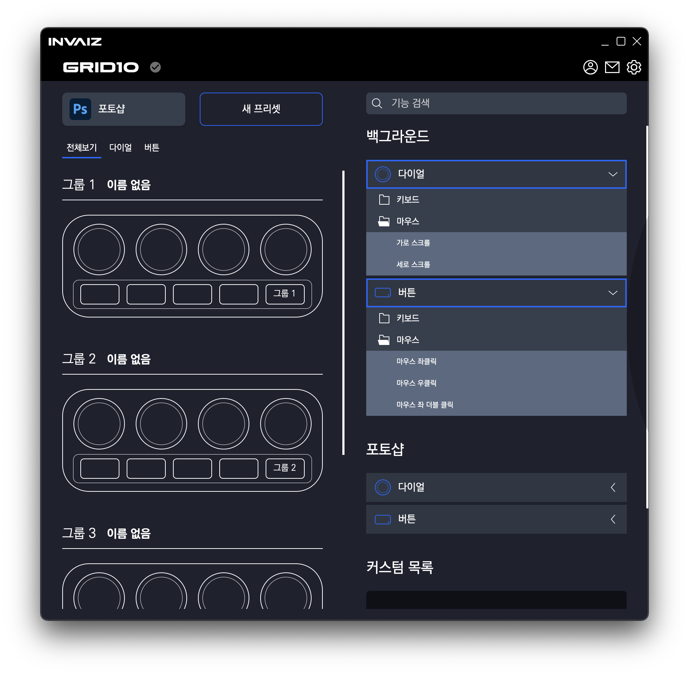

  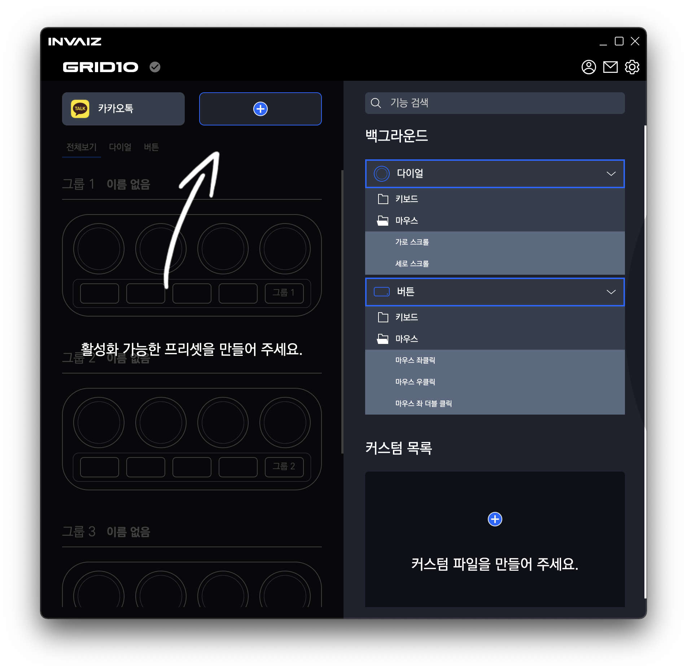

  - 모든 프로그램에서 백그라운드의 기능(키보드, 마우스 등)을 적용할 수 있도록 수정하였습니다.

- 추천 프리셋 리스트의 변경(추가, 삭제) 시 적용

  - 이제부터 추천 프리셋이 업데이트되면 유저의 컴퓨터에 정상적으로 적용이 됩니다.
  - 혹여나 추천 프리셋이 삭제될 경우, 이전의 추천 프리셋 데이터는 사라지고 해당 자리에 "새 프리셋"으로 빈 데이터만 남습니다.

---

---

## 전달 사항

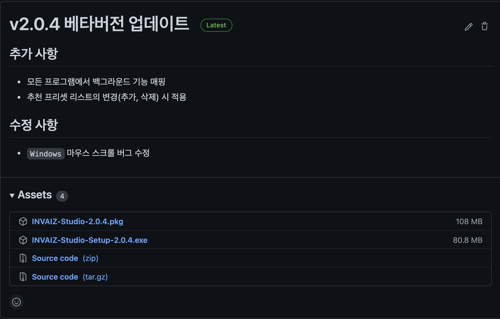

> 2022.01.12(수) 소프트웨어 2.0.4 버전(베타버전 추가) 런칭.

### 이번 주 추가 리스트

- 모든 프로그램에서 백그라운드 기능 매핑 가능하게 변경
- 추천 프리셋 리스트 변경(추가, 삭제) 시 적용
- 추천 프리셋, 기본 제공 프리셋 점검
- 커스텀 단축키 생성 솔루션(양식에 맞춰진 데이터)
- `macOS` `Camera Raw` 구현

### 이번 주 구현 리스트

- 모든 프로그램에서 백그라운드 기능 매핑 가능하게 변경
- 추천 프리셋 리스트 변경(추가, 삭제) 시 적용

### 현재 구현이 필요한 기능

- 자동 업데이트 환경 구성
- 목록 휴지통 기능 구현 - Design 설계 중.
- 서브 오버레이
- `Func` 형식에 `id` 추가
- `Func` 형식에서 `sendCepScript`의 경우 `fcode`에 `id` 값 매핑 후 실행
- 매크로 여러 개 클릭하여 한 번에 복사 / 붙여넣기
- 모든 데이터 구조 ID 형식 변경 `number` -> `string`
- 키보드 모드
- `Mac`에서 설치 시 `CEP` 프로그램 종료 시키기
- `Windows`에서 프로그램 리스트 잘 안뜨는 버그
- `Windows` 한글로 키 입력 시 종료되는 버그
- 오버레이 회전 기능 구현
