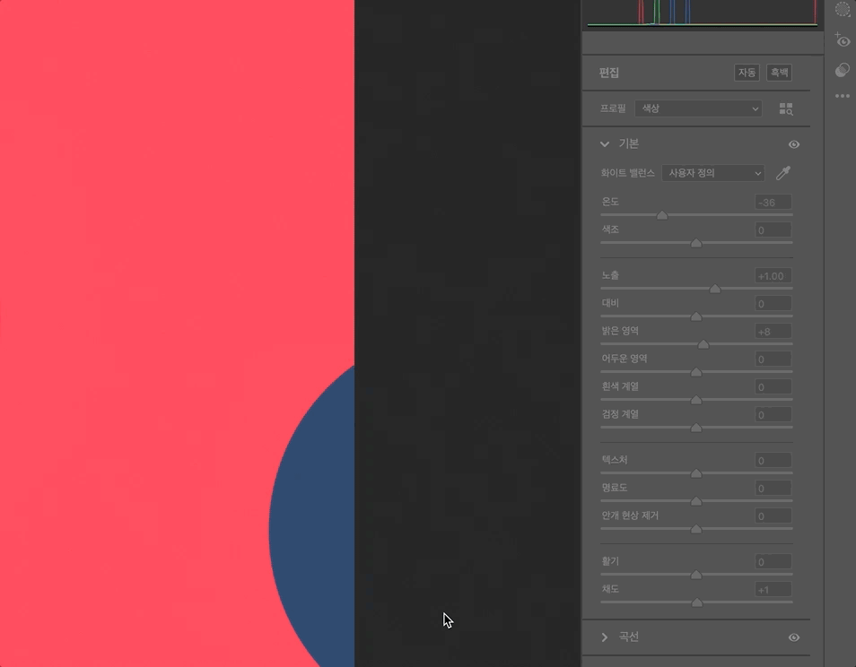

# 2022/01 3주차 주간 리포트

## 주간 작업 목록

- [지원 가능한 `OS` 정보 및 버전 조사 ✅](#지원-가능한-os-정보-및-버전-조사-)
- [`macOS` `Camera Raw` 개발 ✅](#macos-camera-raw-개발-)
- [키보드 모드 개발 ✅](#키보드-모드-개발-)
- [용어 정리 ✅](#용어-정리-)

---

---

## 지원 가능한 `OS` 정보 및 버전 조사 ✅

#### 작업 상세 설명

- [`Electron.js` 공식 문서](https://www.electronjs.org/docs/latest/tutorial/support#supported-versions)의 내용입니다.

  

  - `Electron.js`는 8주기 릴리즈를 통해 최대 3개의 안정적인 버전을 출시한다고 합니다.
  - 이는 `INVAIZ Studio`가 최신 `Electron.js` 정책을 따른 후 24주기 내에 새로운 정책으로 이동해야 한다는 뜻입니다.
  - 만약 24주기 내에 새로운 정책으로 이동하지 못하면, 정식 지원되지 않는 구버전의 `Electron.js`를 사용하고 있다고 볼 수 있습니다.
  - 현재 `INVAIZ Studio`의 `Electron.js` 버전은 `13`으로, 2021년 릴리즈 목록에는 안정적인 버전으로 포함되어 있으나, 2022년 릴리즈 목록의 범위에는 포함되지 않아 상반기 중 `Electron.js`의 버전 업데이트가 있을 예정입니다.

  

  - `Electron.js`는 `Windows 7` 이상, `OS X EL Capitan(10.11)` 이상, `Linux`의 경우 `Ubuntu 14.04` 이상, `Fedora 24` 이상, `Debian 8` 이상을 지원합니다.

  - `Windows`와 `macOS`의 모든 지원 정보
    - `Windows`
      - `Windows 7`, `Windows 8`, `Windows 8.1`, `Windows 10`, `Windows 11` 지원
      - `32bit`(`x86`, `ia32`), `64bit`(`x64`, `amd64`) 바이너리 지원
      - `arm64` 추가 지원
    - `macOS`
      - `OS X EL Capitan(10.11)`, `macOS Sierra(10.12)`, `macOS High Sierra(10.13)`, `macOS Mojave(10.14)`, `macOS Catalina(10.15)`, `macOS Big Sur(11)`, `macOS Monterey(12)` 지원
      - `64bit` 바이너리만 지원
      - `Apple Silicon`(`arm64`) 추가 지원

#### 고려 사항

- 8주기 릴리즈 정책을 따를 때, 버전 업데이트 진행 후 구버전 `INVAIZ Studio` 소스가 새로운 `Electron.js`와 호환이 안 될 경우 호환성을 갖추는 작업에 시간이 소요됩니다.
- 지원 가능한 `OS` 정보는 실제로 테스트해 본 정보는 아니기 때문에 확신할 순 없으니 참고 용입니다.
- `Windows`, `macOS` 모두 위 버전과 별개로 설치 파일에 오류가 있어 설치가 안 되는 경우도 발생할 수 있습니다.

---

## `macOS` `Camera Raw` 개발

#### 작업 상세 설명

- 다이얼 사용 도중 다른 패널의 기능을 사용하여 패널이 전환될 때(패널 열기) 프로그램이 비정상 종료되는 버그를 수정하였습니다.
- `Camera Raw`가 안 켜져있을 때 기능을 실행하면 비정상 종료되는 버그를 수정하였습니다.
- `Adobe Photoshop`이 안 켜져있을 때 기능을 실행하면 비정상 종료되는 버그를 수정하였습니다.
- `Adobe Photoshop`, `Camera Raw`가 켜져있는 상태에서 작업하다가 `Adobe Photoshop`을 재실행하여 다시 작업하려하면 `Camera Raw`가 안 켜져있다는 메세지가 뜨는 오류를 수정하였습니다.
- `Camera Raw`를 조작하다가 값의 범위를 초과하여 근삿값으로 지정한다는 알림 창이 떴을 때 `Grid` 제품을 조작하면 비정상 종료되는 버그를 수정하였습니다.

  

- 패널 간 전환이 부드러워 졌으며, `Camera Raw` 조작 결과 수치를 오버레이에 표시하였습니다.

  

#### 고려 사항

- 이 버전을 배포할지 말지 여부를 결정하기 위해선 `macOS`에서 `Camera Raw`의 수요가 얼마나 있는지 확인해야 합니다.
- 또한, 추후 포토샵의 픽셀 유동화의 포함 여부 또한 사전 조사를 바탕으로 진행되어야 할 것 같습니다.

---

## 키보드 모드 개발 ✅

#### 작업 상세 설명

- 기능 설정 창의 마지막 기능인 키보드 모드를 구현하였습니다.

- `Windows` 키보드 모드
  

- 키보드 모드를 켜는 상황
  

  - 기능을 매핑해서 사용할 수 없는 경우(`fn`, `Scroll Lock`, `Num Lock` 등 키 입력 외적인 조작) 톤을 낮춤으로 사용할 수 없다는 것을 표시하였습니다.
  - 또한 `Adobe XD`의 디자인에서는 매크로 모드와 키보드 모드 둘 다 큰 화면이지만, `10px` 정도의 크기 차이가 있었는데, 이를 통일하는 방향으로 진행하였습니다.

- 특수 키를 입력하는 상황
  

  - 각 사용 가능한 키에 마우스를 호버하면, 크기가 약간 확대되는 애니메이션을 설정하였습니다.
  - 또한 다이얼에서 키보드 모드가, 어떠한 곳에 매핑을 해야하는지 애매한 규정을 마우스 클릭 시 주변에 테두리를 통해 확인할 수 있도록 구성하였습니다.

- 조합 키를 입력하는 상황
  

- 다수의 키를 입력했을 때, 텍스트 영역 공간 초과 시 보이는 상태

  

  - 기능을 너무 많이 매핑했을 때, 길이가 초과되어 기능 초기화 버튼이 기능 이름을 가리는 현상이 발생합니다.

#### 고려 사항

- 현재 마우스 클릭, 스크롤 등에서, 다이얼과 버튼 각각 마우스의 사용을 어디까지 제한할 지에 대한 결정이 나지 않은 상태입니다.
- 때문에 기존 고려해뒀던 설계와의 차이가 발생해 사용 제한 결정 후 재설계 및 개발을 진행해야 합니다.
- 지금 당장은 버그 발생 빈도를 고려하면, 마우스는 다이얼에서 수직/수평 스크롤 유무 선택만 가능하게 하고, 클릭이나 커스텀 휠 조작 등은 최대한 기본 제공 기능을 통해 전달하는 편이 가장 좋은 사용성이라 생각됩니다.
- 키보드 모드 내의 기능 이름 중 한글이 있는데, 현재는 이 한 두 개의 한글 이름 때문에 언어팩을 지원하기 애매한 상황입니다. 따라서 영어로 통일할지 결정해야 합니다.

---

## 용어 정리 ✅

#### 작업 상세 설명

- `INVAIZ`에서 사용하는 용어들을 외부에 표현하고자 할 때, 정리되어 있지 않고 한 단어를 다르게 사용하면 혼란을 야기할 수 있습니다.
- 이에 자주 사용하거나, `INVAIZ`와 관련된 용어를 통일하여 정리하였습니다.

- 운영체제

  - 윈도우, 윈도, Window, Windows 등 => `Windows`.

    - `Microsoft` 사 운영체제의 정식 명칭은 `Windows`이므로, 대소문자와 끝 `s`를 포함하여 통일합니다.
    - 버전을 붙여야하는 경우 한 칸 띄우고 뒤에 기입합니다.
    - 한글로 사용해야 할 경우, 가급적 "윈도우"를 사용합니다.
    - Ex) `Windows 8.1`, `Windows 11`, 윈도우 11 등

  - 맥, Mac, mac, 매킨토시, 애플 => `macOS`.

    - `Mac`은 `Apple` 사에서 출시한 컴퓨터를 칭하는 표현입니다.
    - 따라서 운영체제를 표현할 때는 정식 명칭인 `macOS`를 대소문자와 띄어쓰기 확인하여 통일합니다.
    - 버전을 붙여야 하는 경우, 버전 언어 표현(`Bigsur`와 같은), 숫자 표현을 각각 띄어쓰기로 구분하여 기입합니다.
    - Ex) `macOS Mojave 10.14`, `macOS Monterey 12` 등

      > 과거 버전의 경우 `OS X`라고 표현하는 경우도 있습니다.

  - 리눅스, 유닉스, 우분투, linux 등 => `Linux`.

    - `UNIX`(유닉스)는 `Linux`의 상위 호환 운영체제로, `macOS`와 `Linux`의 공통 조상입니다.
    - 또한 리눅스에는 `Ubuntu`와 같은 모델이 있지만, 다양하므로 일반적으로 칭할 땐 `Linux`를 대소문자 확인하여 통일합니다.

  - 안드로이드, `Android` => 둘다 사용.
    버전을 붙여야 하는 경우, 버전 언어 표현(`Bigsur`와 같은), 숫자 표현을 각각 띄어쓰기로 구분하여 기입합니다.

  - ios, IOS => `iOS`.

    - 정식 명칭을 사용합니다.
    - 버전을 붙여야하는 경우 한 칸 띄우고 뒤에 기입합니다.
    - `iPadOS`와는 다르므로 구분하여 사용합니다.

  - ipados, ipadOS => `iPadOS`.

    - 정식 명칭을 사용합니다.
    - 버전을 붙여야하는 경우 한 칸 띄우고 뒤에 기입합니다.
    - `iOS`와는 다르므로 구분하여 사용합니다.

#### 고려 사항

---

---

## 전달 사항

### 이번 주 추가 리스트

- 커스텀 기능 목록에서 `Drag & Drop` 기능 구현

### 이번 주 구현 리스트

- 키보드 모드
- `macOS` `Camera Raw` 구현

### 현재 구현이 필요한 기능

- 자동 업데이트 환경 구성
- 목록 휴지통 기능 구현 - Design 설계 중.
- 서브 오버레이
- `Func` 형식에 `id` 추가
- `Func` 형식에서 `sendCepScript`의 경우 `fcode`에 `id` 값 매핑 후 실행
- 매크로 여러 개 클릭하여 한 번에 복사 / 붙여넣기
- 모든 데이터 구조 ID 형식 변경 `number` -> `string`
- `Mac`에서 설치 시 `CEP` 프로그램 종료 시키기
- `Windows`에서 프로그램 리스트 잘 안뜨는 버그
- `Windows` 한글로 키 입력 시 종료되는 버그
- 오버레이 회전 기능 구현
- 추천 프리셋, 기본 제공 프리셋 점검
- 커스텀 단축키 생성 솔루션(양식에 맞춰진 데이터)
