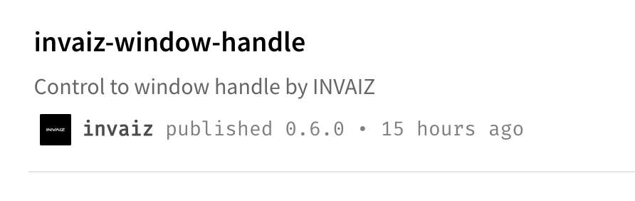
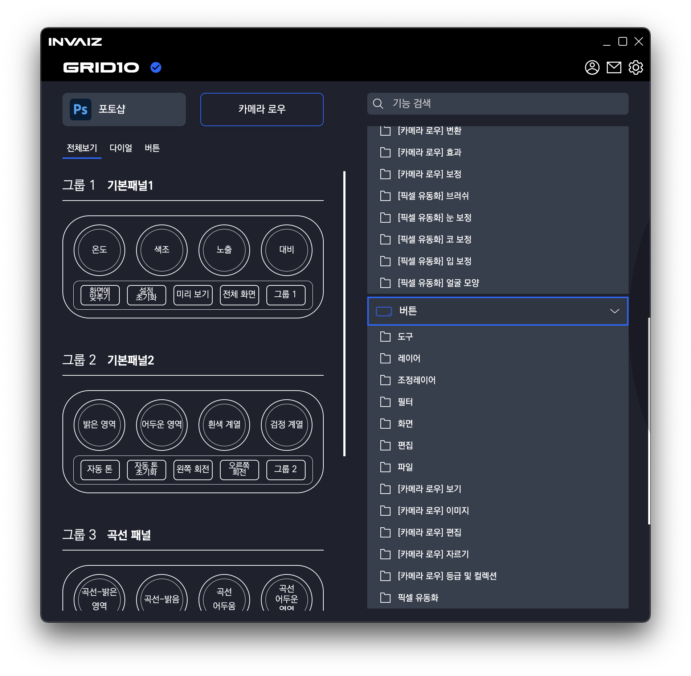
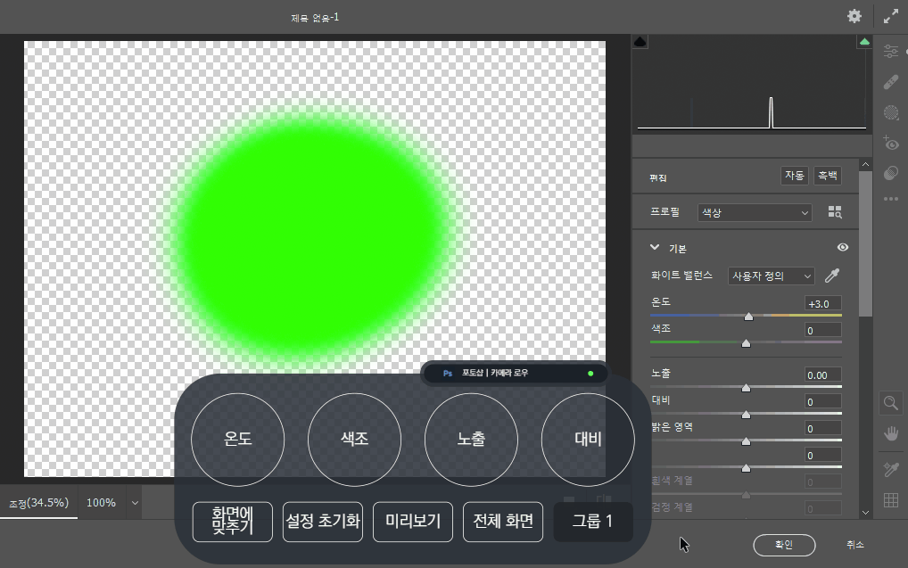
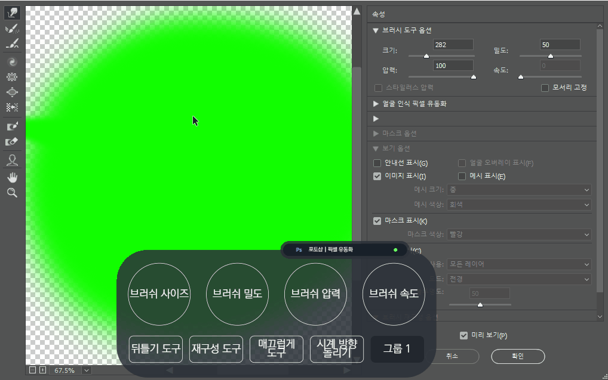
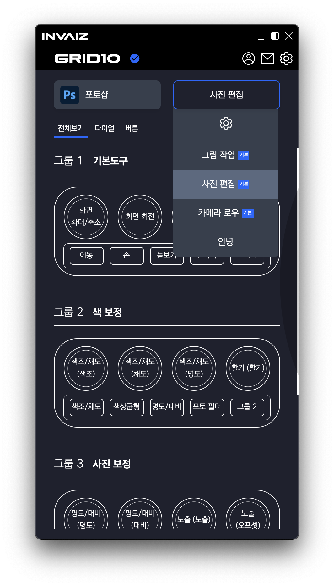
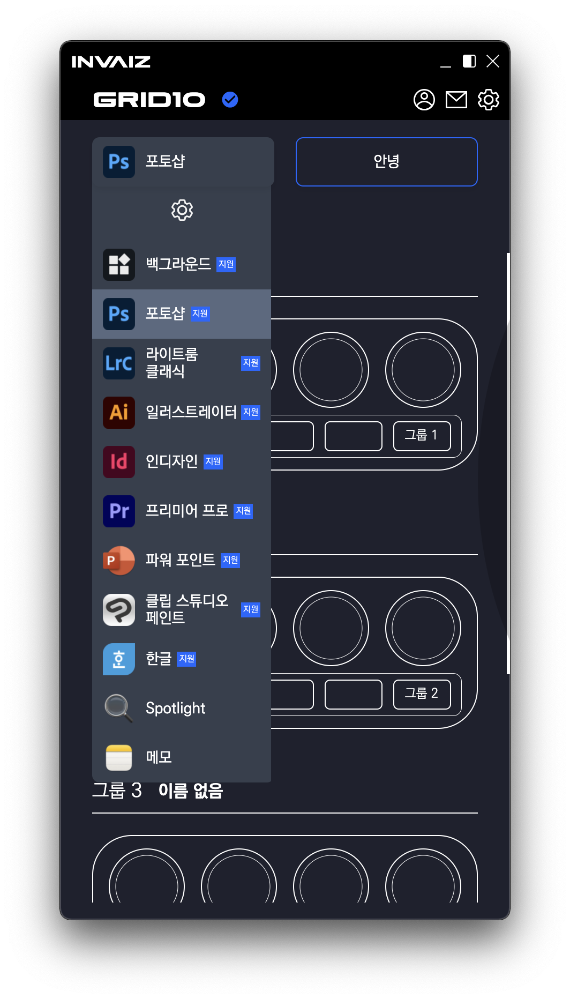
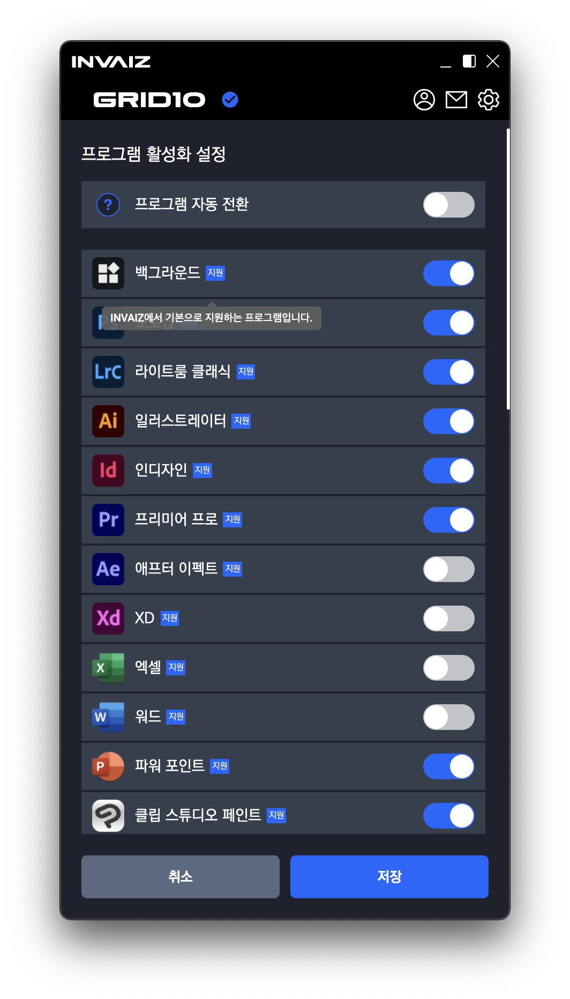
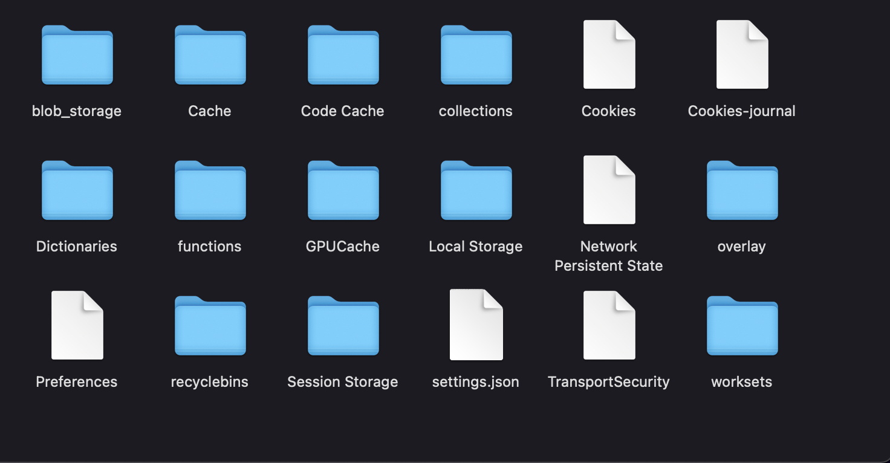
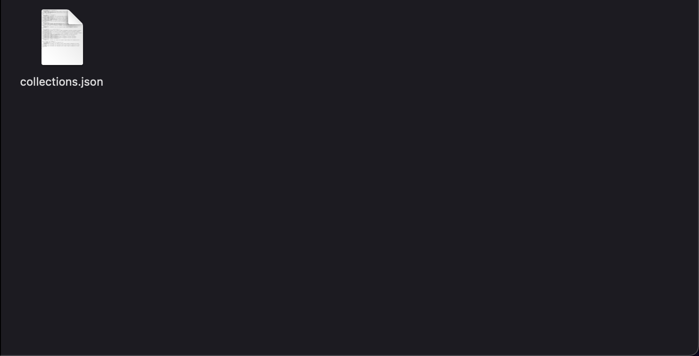
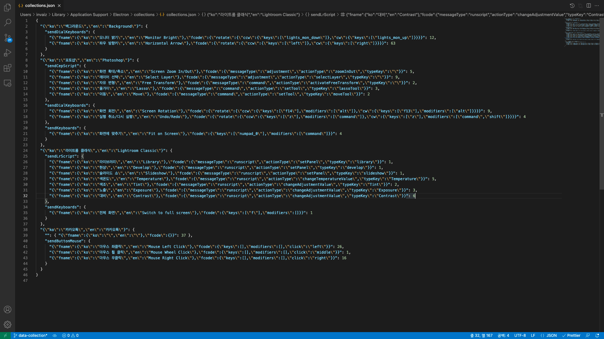

# 2022/01 4주차 주간 리포트

## 주간 작업 목록

- [`invaiz-window-handle` 패키지 `npm`에 업로드 ✅](#invaiz-window-handle-패키지-npm에-업로드-)
- [`v1.8.0`에 구현된 `Windows`의 `Camera Raw`, 픽셀 유동화 옮기기 ✅](#v180에-구현된-windows의-camera-raw-픽셀-유동화-옮기기-)
- [기본 제공 프리셋, 지원 프로그램 시각 표시 ✅](#기본-제공-프리셋-지원-프로그램-시각-표시-)
- [기본 제공 기능, 기본 제공 프리셋 언어 번역 ✅](#기본-제공-기능-기본-제공-프리셋-언어-번역-)
- [데이터 수집 알고리즘 테스트 ✅](#데이터-수집-알고리즘-테스트-)

---

## `invaiz-window-handle` 패키지 `npm`에 업로드 ✅

#### 작업 상세 설명

- [`npm` 저장소](https://www.npmjs.com/package/invaiz-window-handle)
- [`Github` 저장소](https://github.com/INVAIZ/invaiz-window-handle)

- `Camera Raw`와 픽셀 유동화 등을 조작하는 `node-gyp` 네이티브 모듈을 효과적으로 사용하기 위해 `npm` 저장소에 업로드 하였습니다.
- 공개 저장소이지만 소스 코드가 업로드된 것이 아닌 이진으로 인코딩되어 볼 수 없는 `.node` 파일이 업로드 되었기 때문에 유출을 방지하였습니다.

#### 고려 사항

- 공개 저장소를 사용해야 할 지, `npm`에 월 마다 `7$`를 지불하여 계정 업데이트 후 비공개 저장소를 사용해야 할 지 고민해 보아야 할 것 같습니다.

---

## `v1.8.0`에 구현된 `Windows`의 `Camera Raw`, 픽셀 유동화 옮기기 ✅

#### 작업 상세 설명

- `INVAIZ Studio v1.8.0`에 만 있던 `Camera Raw`, 픽셀 유동화의 기능을 `INVAIZ Studio 2.x.x` 버전에도 추가하였습니다.
- 기능 또한 정상적으로 동작하며, 이로써 `INVAIZ Studio v1.x.x` 버전 대의 지원을 정식 중단하여도 무방합니다.

  
  

- `macOS`의 경우에도 일단 추가해두었으나, 픽셀 유동화는 추후 추가하도록 하고 `Camera Raw`는 사용 후 안 되는 기능을 정리한 후 검토할 예정입니다.

#### 고려 사항

- `macOS`의 지원 여부 판단이 빠를 수록 좋을 것 같습니다.
- `INVAIZ Studio v1.x.x` 버전 대의 지원 중단을 어떻게 알릴 지 고려해야 합니다.

---

## 기본 제공 프리셋, 지원 프로그램 시각 표시 ✅

#### 작업 상세 설명

- 기본 제공 프리셋, 지원 프로그램을 시각적으로 표시하였습니다.
- 기본 제공 프리셋

  - 기본 제공 프리셋 표시

  

  - 기본 제공 프리셋 툴팁

  

- 지원 프로그램

  - 지원 프로그램 표시

  

  - 지원 프로그램 툴팁

  

#### 고려 사항

- 기본 제공 프리셋, 지원 프로그램에서의 제약 조건을 제시해야 합니다.

`Ex)` 기본 제공 프리셋은 변경이 불가능하며 키 매핑을 사용할 수 없음, 지원 프로그램은 리스트에서 제거할 수 없음 등

---

## 기본 제공 기능, 기본 제공 프리셋 언어 번역 ✅

#### 작업 상세 설명

- `INVAIZ Studio 2.0.4` 버전까지 완벽하지 않은 상태의 번역을 정리하였습니다.
- 너무 오래되어 제대로 동작하지 않는 기능, 프리셋을 테스트하여 수정하였습니다.
- 일반화되어 있지 않은 언어들을 최대한 일반화시켰습니다.

  `Ex)` 실행취소 다시실행 => 실행 취소/다시 실행, 투명도 or 불투명도 => 불투명도 등

#### 고려 사항

- 지속적으로 개선해나갈 예정입니다.
- 현재 `Microsoft Office` 제품군과 `한글`의 경우 `Windows`와 `macOS`의 호환의 완벽하지 않아 언어가 다르고, 또한 기능의 수가 타 프로그램에 비해 많아 오래 걸릴 것으로 예상됩니다.

---

## 데이터 수집 알고리즘 테스트 ✅

#### 작업 상세 설명

- 사용자가 `INVAIZ Studio`를 어떻게 사용하는지에 대한 데이터를 수집하는 알고리즘의 초안을 작성했습니다.
- 사용자 컴퓨터 `AppData`에 1차적으로 저장한 후, 특정 주기 마다 서버에 업로드 하는 방식으로 진행할 예정입니다.
- 수집 폴더 구조

  

  

- 수집 파일 내용 구조

  

#### 고려 사항

- 초안이기 때문에 수집하는 데이터의 가독성은 보장할 수 없습니다.
- 어떠한 데이터를 어떻게 수집해야하는 지에 따라 데이터 수집 구조를 변경해야할 것 같습니다.

---

## 전달 사항

### 이번 주 추가 리스트

- `INVAIZ Studio v1.8.0`에 구현된 `Windows`의 `Camera Raw`, 픽셀 유동화 옮기기.
- 기본 제공 프리셋, 지원 프로그램 시각 표시
- 기본 제공 기능, 기본 제공 프리셋 언어 번역
- 데이터 수집

### 이번 주 구현 리스트

- `INVAIZ Studio v1.8.0`에 구현된 `Windows`의 `Camera Raw`, 픽셀 유동화 옮기기.
- 기본 제공 프리셋, 지원 프로그램 시각 표시
- 데이터 수집

### 현재 구현이 필요한 기능

- 자동 업데이트 환경 구성
- 목록 휴지통 기능 구현 - Design 설계 중.
- 서브 오버레이
- `Func` 형식에 `id` 추가
- `Func` 형식에서 `sendCepScript`의 경우 `fcode`에 `id` 값 매핑 후 실행
- 매크로 여러 개 클릭하여 한 번에 복사 / 붙여넣기
- 모든 데이터 구조 ID 형식 변경 `number` -> `string`
- `Mac`에서 설치 시 `CEP` 프로그램 종료 시키기
- `Windows`에서 프로그램 리스트 잘 안뜨는 버그
- `Windows` 한글로 키 입력 시 종료되는 버그
- 오버레이 회전 기능 구현
- 추천 프리셋, 기본 제공 프리셋 점검
- 커스텀 단축키 생성 솔루션(양식에 맞춰진 데이터)
- 기본 제공 기능, 기본 제공 프리셋 언어 번역
