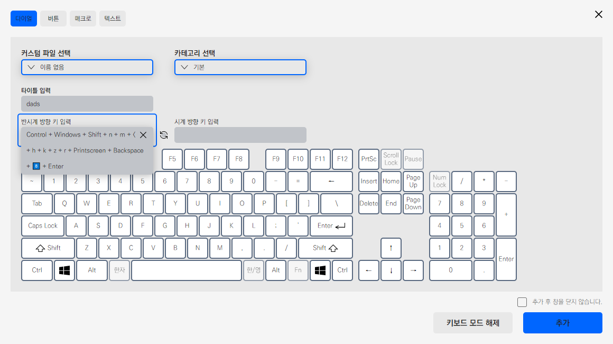

# 2022/02 1주차 주간 리포트

## 주간 작업 목록

- [데이터 수집 알고리즘 서버 전송 적용 ✅](#데이터-수집-알고리즘-서버-전송-적용-)
- [`modifiers` 단일 입력 ✅](#modifiers-단일-입력-)
- [설계 및 구상 ✅](#설계-및-구상-)
- [디테일 수정 ✅](#디테일-수정-)
- [기존 프리셋 호환성 테스트 ❌](#기존-프리셋-호환성-테스트-)
- [Apple 개발자 등록 신청 ❌](#apple-개발자-등록-신청-)

---

## 데이터 수집 알고리즘 서버 전송 적용 ✅

#### 작업 상세 설명

- 크리에이티브 다이얼과 익스프레스 키의 입력 횟수를 나타내는 데이터를 수집할 수 있도록 `INVAIZ Studio`에서 주기적으로 전송하는 기능을 구현하였습니다.
- 크리에이티브 다이얼의 경우 기능을 가속도 값을 기준으로 몇 회 실행되었는가를 수집합니다.

  

- 익스프리스 키의 경우 기능이 몇 회 실행되었는가를 수집합니다.

  

- 현재는 `INVAIZ Studio`에서 10분마다 한 번씩 서버로 데이터를 전송하나, 추후 개선이 필요할 것으로 예상됩니다.
- 서버에 데이터를 전송하면 사용자의 컴퓨터에서는 실행된 기능의 값들을 초기화합니다.
- 또한, 네트워크 연결이 불안정하거나, 서버에서의 비정상적인 응답으로 제대로 수신하지 못 했을 경우, 로컬에 암호화된 파일로 저장하도록 구현하였습니다.

  
  

  - 이렇게 파일로 저장된 경우 실행된 기능의 값들이 초기화되지 않고 저장되며, 프로그램 재실행 시에도 데이터를 어느정도 유지할 수 있어 데이터 손실을 최소화하였습니다.

#### 고려 사항

- 어떤 데이터를 어떤 사용자에게 어떻게 수집할건지, 상세한 데이터 수집 목적과 필요한 데이터를 나열해야 더 효과적인 수집이 가능할 것으로 예상됩니다.
- 아마 데이터의 저장 빈도와 서버 전송 빈도를 다르게 설정해야할 것으로 예상됩니다.

---

## `modifiers` 단일 입력 ✅

#### 작업 상세 설명

- 기존에는 `Control`, `Alt`, `Shift`, `Windows`, `Option`, `Command` 키는 단일로 입력될 수 없었으나, 단일 입력 가능하도록 수정하였습니다.

  

#### 고려 사항

---

## 설계 및 구상 ✅

#### 작업 상세 설명

- `INVAIZ Studio v2.1.0` 정식 배포 이후 어떠한 개발을 순서대로 진행할 것인지, 개발 소스 코드의 설계와 함께 구상하였습니다.
- 개발 순서

  1. 배포 전/후로 버그 픽스
  2. 커스텀 단축키 생성 솔루션(양식에 맞춰진 데이터)
  3. `Func` 형식에서 `sendCepScript`의 경우 `fcode`에 `id` 값 매핑 후 실행
  4. 번역 파일 내보내기/불러오기 솔루션 작성
  5. 프리셋/커스텀 파일 이전 버전 호환 가능하도록 하는 호환성 개발
  6. `INVAIZ Studio` 기능 보완
  7. 관리자 페이지 리뉴얼

- 만약 이 순서로 진행할 경우, `INVAIZ` 홈페이지 리뉴얼 이후 `INVAIZ Community`를 잠시 내리고, `API` 서버를 보완하여 관리자 페이지에 집중. `Playground` 비슷한 기능을 하는 직원용 페이지를 업데이트하는 것이 좋을 것 같다는 생각을 하게 됐습니다.
- 즉, 직원용 페이지에서 `2`, `4`, `5` 등의 기능 및 추천 프리셋 제작 등 개발자와 협업해야 하는 잡다한 업무를 서버에서 처리하도록 분리할 수 있을 것 같습니다.
- `3`에 매핑하는 것은 기존에 기본 제공 기능과 추천 프리셋에서 똑같은 기능을 두 번 작성해야하는 경우를 제거하기 위한 방법으로, 중복된 기능의 이름이 달라지는 경우 제거 및 새로운 언어 번역 시 작업량을 줄일 수 있는 효과를 가져올 것으로 예상되어 설계 중에 있습니다.
- `4`는 `3`이 진행되지 않았을 때 작업해야 하며,

  - 정적 언어 팩

  ```json
  {
    "TITLE": {
      "main-overlay": {
        "title": {
          "ko": "메인 오버레이",
          "en": "Main Overlay"
        },
        "sub_title": {
          "ko": "사용자가 설정한 기능을 디스플레이에 표시합니다.",
          "en": "The function set by the user is displayed on the display."
        }
      }
    }
  }
  ```

  - 기능 언어팩

  ```json
  {
    "name": {
      "ko": "글꼴",
      "en": "Text"
    },
    "functions": [
      {
        "fname": {
          "ko": "굵게",
          "en": "Bold"
        }
      }
    ]
  }
  ```

  - 위처럼 두 가지 파일의 형식이 다르고, 기능 언어팩의 경우 작업을 위해 모든 데이터를 넘겨주면 `execute_type`, `funnction_code`까지 넘어가 데이터가 누설될 수 있으므로 위험하여 카테고리 이름, 기능 이름을 추출하는 코드를 작성하는 알고리즘을 설계 및 구상하였습니다.

- `5`의 경우 기본적으로 `INVAIZ Studio v1.x.x` 대 버전과 `INVAIZ Studio v2.x.x` 버전의 프리셋이 호환되지 않는 문제점도 있었고, `INVAIZ Studio v2.x.x` 버전에서도 업데이트가 지속됨에 따라 기능이 추가하여 프리셋/커스텀 파일 등의 형식이 바뀔 수도 있어 모든 버전의 호환성을 갖추는 방법에 대해 구상하였습니다.

#### 고려 사항

- 개발 순서는 `100%` 확정이 아니며, 추가 및 우선 순위에 따라 변경될 수 있습니다.
- 설계 및 구상 또한 아직 마무리된 단계는 아니며, 상당항 시간이 소요될 것으로 예상됩니다.

---

## 디테일 수정 ✅

#### 작업 상세 설명

- 단축키 입력 칸 초과 시 보여주기

  

  - `macOS`는 매직 마우스, 터치 패드의 가로 스크롤이 용이하여 큰 문제 없으나, `Windows`에서는 칸을 초과할만큼 단축키를 입력하면 보기 힘든 문제가 있습니다.
  - 임시로 단축키 입력 칸을 초과했을 경우 보여줄 디자인을 설정하여 적용하였습니다.
  - 애니메이션은 따로 적용하지 않고, 호버했을 경우 보이도록 하였습니다.

- 키보드 모드에서 상태에서 입력 제거 버튼이 선택되지 않는 버그 제거

  

  - 다이얼의 단축키를 입력하는 키보드 모드에서 현재 선택된 입력 창의 입력 제거 버튼이 선택되지 않아 초기화할 수 없는 버그를 수정하였습니다.

- `Windows`에서 현재 실행 중인 프로그램의 아이콘을 가져오지 못하는 버그 수정

  

  - `Windows`에서 간혹 실행 중인 프로그램의 아이콘을 가져오지 못하는 버그를 수정하였습니다.
  - 기존에 `64px`의 아이콘을 가져올 때 버그가 발생하는 것으로 판단하여 `32px`로 줄여서 약 50~60회 가량 테스트해 본 결과 이상없었습니다.
  - `32px`의 아이콘이라 화질이 깨져보일 우려가 있었으나 예상과는 다르게 정상적으로 보입니다.

- 커스텀 파일 없을 경우 기능 설정 창 열리지 않도록 수정

  - 커스텀 파일이 없으면 기능 설정 창의 의미가 없으므로 열리지 않도록 수정하였습니다.
  - 열리는 행동을 취하기 전 시각적으로 열 수 없다고 알려주는 편이 좋을 것으로 생각됩니다.

#### 고려 사항

---

## 기존 프리셋 호환성 테스트 ❌

#### 작업 상세 설명

- 기존 프리셋을 테스트하여 호환성이 부족한 부분을 점검하는 작업을 하였습니다.

  

- 대부분의 기능을 `fix` 하였고, `CEP`와 연동되는 기능에서 문제가 발생한 경우 정식 배포 이전까지 업데이트 할 계획입니다.

#### 고려 사항

- 기능 이름과 실행 방법에 대해 혼동하는 경우가 잦은 것으로 예상되는데, 이를 확실하게 서비스 해야 사용자들도 혼동되지 않을 것이라고 생각됩니다.

---

## Apple 개발자 등록 신청 ❌

#### 작업 상세 설명

- 개인 아이디로 등록되어 있던 `Apple Developer`가 2022년 2월 20일에 만료되어, 다음 배포를 위해 `(주) INVAIZ`의 법인 아이디로 `Apple Developer`에 가입, 개발자 등록을 하는 절차를 진행하였습니다.
- [이 사이트](https://app-dev.mytory.net/2021/03/22/register-apple-developer-program-as-organization/)를 참고하여 진행하였습니다.
- 등록하기 위해 필요한 데이터

  

  - 다음과 같이 `D-U-N-S` 번호를 발급 받아야 하는데, 이는 `Apple` 개발자 홈페이지에서 신청이 가능하여 진행하였습니다.

  

#### 고려 사항

- `D-U-N-S` 번호가 발급되는 데까지 3일 정도 소요된다고 하며, 발급 후 바로 신청할 예정인데 추후 결제하기 위해서 인증하는 작업이 한 단계 더 있어 추가로 1일 정도 소요된다고 합니다.

---

## 전달 사항

### 이번 주 추가 리스트

- `Microsoft Office`, `한글` 제공 기능, 기본 제공 프리셋 언어 번역
- 데이터 수집 서버 적용
- `modifiers` 단일 입력
- 단축키 입력 칸 초과 시 보여주기
- 키보드 모드에서 상태에서 입력 제거 버튼이 선택되지 않는 버그 제거
- 커스텀 파일 없을 경우 기능 설정 창 열리지 않도록 수정

### 이번 주 구현 리스트

- 기본 제공 기능, 기본 제공 프리셋 언어 번역
- 데이터 수집 서버 적용
- `modifiers` 단일 입력
- 단축키 입력 칸 초과 시 보여주기
- 키보드 모드에서 상태에서 입력 제거 버튼이 선택되지 않는 버그 제거
- 커스텀 파일 없을 경우 기능 설정 창 열리지 않도록 수정
- `Windows`에서 프로그램 리스트 잘 안뜨는 버그

### 현재 구현이 필요한 기능

- 자동 업데이트 환경 구성
- 목록 휴지통 기능 구현 - Design 설계 중.
- 서브 오버레이
- `Func` 형식에 `id` 추가
- `Func` 형식에서 `sendCepScript`의 경우 `fcode`에 `id` 값 매핑 후 실행
- 매크로 여러 개 클릭하여 한 번에 복사 / 붙여넣기
- 모든 데이터 구조 ID 형식 변경 `number` -> `string`
- `macOS`에서 설치 시 `CEP` 프로그램 종료 시키기
- `Windows` 한글로 키 입력 시 종료되는 버그
- 오버레이 회전 기능 구현
- 추천 프리셋, 기본 제공 프리셋 점검
- 커스텀 단축키 생성 솔루션(양식에 맞춰진 데이터)
- `Microsoft Office`, `한글` 제공 기능, 기본 제공 프리셋 언어 번역
