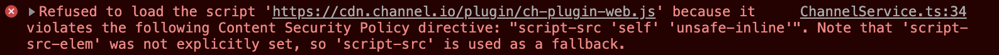
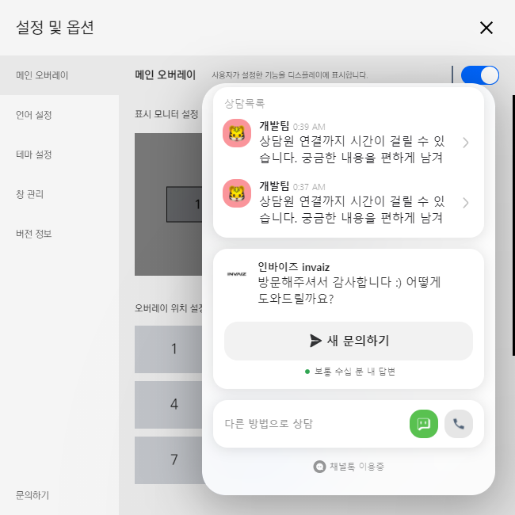
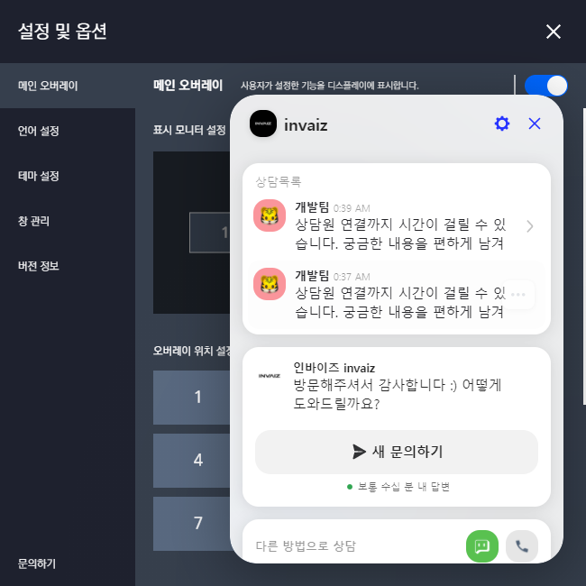
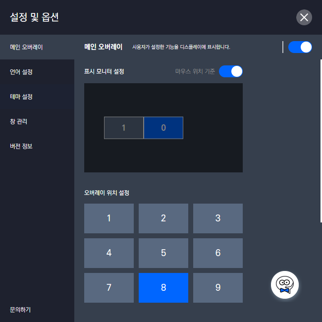
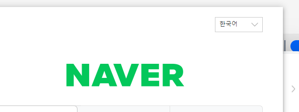
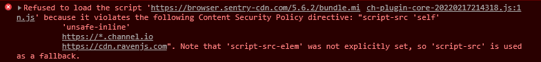
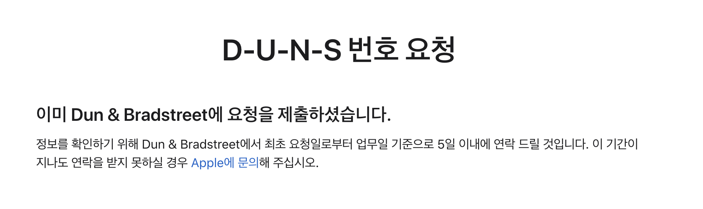
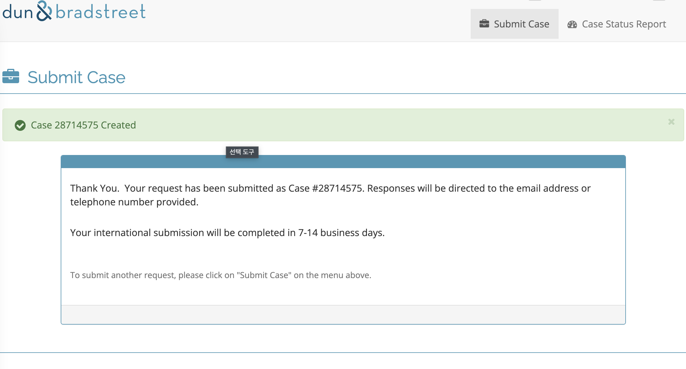

# 2022/02 3주차 주간 리포트

## 주간 작업 목록

- [관리자 페이지 `TypeScript` 전환 ✅](#관리자-페이지-typescript-전환-)
- [데이터 수집 미리보기 ✅](#데이터-수집-미리보기-)
- [개인 데이터 수집 추가 ✅](#개인-데이터-수집-추가-)
- [`INVAIZ Studio v2`에 `Channel.io` 연동 ✅](#invaiz-studio-v2에-channelio-연동-)
- [`Apple` 개발자 등록 신청 ❌](#apple-개발자-등록-신청-)

---

## 관리자 페이지 `TypeScript` 전환 ✅

#### 작업 상세 설명

- 기존 소스를 손쉽게 유지보수 하기 위하여 있던 관리자 페이지를 `TypeScript`로 전환하는 작업 도중, 해당 소스를 리팩터링 하는 비용보다 새로운 프로젝트를 설계하여 개발하는 것이 훨씬 효율적일 것으로 판단되어 기존 소스를 모두 삭제 후 새로운 프로젝트를 만들었습니다.
- 기존 소스에 사용하지 않는 더미 파일이 너무 많고, 코드가 난잡하며 일관적이지 않으며, 완성도 또한 딱히 높지는 않은 것으로 판단되어 작업의 노선을 변경하였습니다.
- 소스를 모두 뒤엎고 다시 작성하는 작업으로, 많은 시간이 소요됩니다.
- 기존의 `invaiz-admin` 리포지토리는 남겨둔 채로, `INVAIZ Studio` 리뉴얼과 같이 `invaiz-admin-v2` 리포지토리를 개설하였습니다.
- `invaiz-admin-v2` 리포지토리에서 `invaiz-admin`의 기능 대부분을 지운 후 로그인, 수집 데이터 분석 부분만 이식하여 `TypeScript`로 전환하였습니다.
- `TypeScript`로 전환 함과 동시에 스타일 구성에 있어서 호환성이 떨어지는 `node-sass`, `.module.scss` 모듈을 사용하지 않고 `CSS-in-JS` 방식인 `@emotion`으로 전환하였습니다.

#### 고려 사항

- 변경 도중 삭제한 프로젝트를 `Git`에 저장은 해두었습니다.
- 관리자 페이지 전환 완료 후 `API` 서버를 `TypeScript`로 새롭게 작성하는 작업이 예정되어 있습니다.

---

## 데이터 수집 미리보기 ✅

#### 작업 상세 설명

- 수집한 데이터를 미리 보기하는 프로젝트를 개설하여 디자인적인 요소 없이 텍스트만 렌더링하는 작업을 마쳤습니다.
- 이전에 수집한 데이터의 일부가 계속 삭제 되는 버그를 발견하여 해당 버그를 제거한 후, 버그를 픽스한 코드를 서버에 업로드하여 정상적인 데이터 수집이 진행되고 있습니다.
  - `Ex) Dial 데이터가 Button 데이터에 의해 덮어 씌워짐.`

#### 고려 사항

- 백그라운드의 사용자가 매우 많은 것으로 보이는데, 아마도 다른 프로그램 추가 기능의 사용 방법이 명확하게 제시되지 않아서 그러지 않을까 생각됩니다.
- 현재는 10분마다 수집하지만, 간격을 조금 더 길게 하여 약 1~2시간마다 수집해도 유의미한 데이터가 발생할 것으로 예상됩니다.

---

## 개인 데이터 수집 추가 ✅

#### 작업 상세 설명

- 기존에는 사용자 전체의 데이터를 통합하여 갱신하였는데, 이를 기기의 데이터, 서버 요청하는 `IP` 주소에 맞춰 분리하여 수집할 수 있는 `DB`를 새롭게 구성하였습니다.
- 해당 `DB`에는 `serial numbebr`, `ip`, 사용 로그를 저장합니다.

#### 고려 사항

- 분석에 용이하도록 데이터를 시각화하는 방법을 고안하고 있습니다.

---

## `INVAIZ Studio v2`에 `Channel.io` 연동 ✅

#### 작업 상세 설명

- [`Channel.io` 개발자 문서](https://developers.channel.io/docs)에 작성된 메뉴얼대로, `INVAIZ Studio v2`에 소스 코드를 삽입하였으나, 예상대로 `CORS` 문제가 발생했습니다.

  

- 해당 문제는 `HTTP` 통신의 안정성을 부여하기 위해 정해진 규약을 어겨 발생하는 문제로, 이를 `HTML`의 `meta` 태그를 사용하여 콘텐츠 보안 정책(`Content Security Policy`, `CSP`)를 수정하여 해결하는 방법을 사용하였습니다.
- 적용 후, 정상적으로 `Channel.io` 채팅 버튼이 렌더링 되는 것을 확인했습니다.

  - 라이트 모드

  

  - 다크 모드

  

  - 아이콘

  

- 렌더된 채팅 자체에 타 웹페이지를 여는 링크가 적용되어 있고 그 링크를 누르면 새 창을 열게 되어 있는데, 이때 열리는 창의 상단 영역(최대화, 최소화, 닫기 등의 버튼이 있는 영역)이 포함되지 않는 상태입니다.

  
  

  - 따라서 창을 끄거나 크기를 조절하는 데 불편함이 있을 것으로 예상되어 이를 해결 해야 합니다.

- 또한 `CSP` 문제가 완전하게 해결되지 않았는지 또 다른 오류가 발생하는 모습입니다.

  

#### 고려 사항

- `CSP` 문제는 보안과 직결되는 요소이므로 최대한 안정성을 갖추면서 `Channel.io` 시스템을 적용할 수 있는 방안을 마련해야 합니다.

---

## `Apple` 개발자 등록 신청 ❌

#### 작업 상세 설명

- `Apple` 개발자 등록 페이지에 접속하자, 정상적으로 다음 절차 진행이 가능하게 되어 등록을 위한 결제를 진행하였습니다.

  

- 결제가 완료되고, 개발자 페이지에서 프로필을 보니 개인 회원으로 등록되어 있어 `D-N-U-S` 번호 발급 여부를 확인했으나, 아직 발급이 되어 있지 않았습니다.
- 이에 `Apple`에서 재요청을 하니 이미 요청된 정보라는 답변을 받았습니다.

  

- `Apple`에 문의 후 자료를 찾아보니, `Dun & Bradstreet` 홈페이지에서 직접 `D-N-U-S`를 등록해야 한다는 답변을 받아, 발급을 요청하였습니다.

  

- 발급까지 7~14일 소요됩니다.

#### 고려 사항

- 발급 후 현재 개인 회원으로 등록된 계정을 법인 회원으로 전환 가능한 것으로 보입니다.

---

## 전달 사항

### 이번 주 추가 리스트

- `Channel.io` 연동

### 이번 주 구현 리스트

- `Channel.io` 연동

### 현재 구현이 필요한 기능

- 자동 업데이트 환경 구성
- 목록 휴지통 기능 구현 - Design 설계 중.
- `Func` 형식에 `id` 추가
- `Func` 형식에서 `sendCepScript`의 경우 `fcode`에 `id` 값 매핑 후 실행
- 매크로 여러 개 클릭하여 한 번에 복사 / 붙여넣기
- 모든 데이터 구조 ID 형식 변경 `number` -> `string`
- `macOS`에서 설치 시 `CEP` 프로그램 종료 시키기
- `Windows` 한글로 키 입력 시 종료되는 버그
- 오버레이 회전 기능 구현
- 커스텀 기능 목록에서 `Drag & Drop` 기능 구현
- `Microsoft Office`, `한글` 제공 기능, 기본 제공 프리셋 언어 번역
