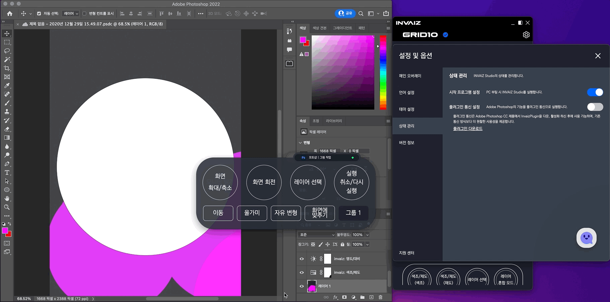

# 2022/03 1주차 주간 리포트

## 주간 작업 목록

---

- [`Adobe Photoshop` 플러그인 통신으로 선택 가능 ✅](#adobe-photoshop-플러그인-통신으로-선택-가능-)
- [`INVAIZ Studio v2` 업데이트 가능 상태 표시 ✅](#invaiz-studio-v2-업데이트-가능-상태-표시-)
- [`INVAIZ Studio v2` `Windows`에서 알림 이미지 표시 ✅](#invaiz-studio-v2-windows에서-알림-이미지-표시-)
- [`INVAIZ Studio` 메뉴에서 프로그램, 프리셋 전환 기능 ❌](#invaiz-studio-메뉴에서-프로그램-프리셋-전환-기능-)
- [사업계획서 초안 작성 및 기술 분석 ✅](#사업계획서-초안-작성-및-기술-분석-)

---

## `Adobe Photoshop` 플러그인 통신으로 선택 가능 ✅

#### 작업 상세 설명

- **`Mac M1`에서 동작 가능하도록 `UXP`선택 기능**을 구현하였습니다.

  

- 옵션 창에서 설정이 가능하며, ON 상태에서는 `Adobe Creative Cloud`의 플러그인 마켓에서 `InvaizPlugin`을 설치 후 활성화 한 이후에 정상 동작하므로, 플러그인을 다운로드 받을 수 있는 링크를 걸어두었습니다.
- 기본적으로 OFF 상태로 설치되며, 현재 두 통신 방식의 가속도 값이 미세하게 다릅니다.

#### 고려 사항

- 옵션 창에 두어야 할 기능인지, 설명에 부족함이 없는지 검토가 필요합니다.

---

## `INVAIZ Studio v2` 업데이트 가능 상태 표시 ✅

#### 작업 상세 설명

- `Windows`의 경우 자동 업데이트를 지원하므로 큰 의미가 없으나, `macOS`의 경우 자동 업데이트가 지원되지 않아 사용자가 업데이트 관련 소식을 제공받지 못 할 수 있으므로, 간접적으로 업데이트를 유도할 수 있도록 표시하였습니다.

  

- 업데이트 가능한 상태일 경우 아이콘에 표시되며, 이전에는 메뉴에서 버전 정보 클릭 시 릴리즈 노트 창이 떴으나, 해당 상태에서는 옵션 창의 버전 정보 탭으로 이동됩니다.
- 버전 정보 옆에 업데이트라는 버튼이 추가되었으며, 해당 버튼 클릭 시 사용 중인 `OS`에 맞는 설치 파일이 자동으로 브라우저에서 다운로드 됩니다.
- 업데이트 버튼은 일정 시간마다 점프하는 애니메이션을 추가하였습니다.
- 메뉴에 호버하거나, 버전 정보에 마우스를 호버하게 되면, 업데이트 가능이라는 표시가 됩니다.

#### 고려 사항

- 시각적으로 잘 보이는지, 전달이 잘 되는지 확인할 필요가 있을 듯 합니다.

---

## `INVAIZ Studio v2` `Windows`에서 알림 이미지 표시 ✅

#### 작업 상세 설명

- `Windows`의 알림에서 부실했던 부분을 보완하였습니다.

  

- 기존엔 상단에 `com.electron.invaiz`와 같은 이름으로 출력되었으나, 변경하였습니다.
- 아이콘은 현재 사용 중인 `INVAIZ Studio v2`의 로고를 채택하였습니다.

#### 고려 사항

- 알림 내용을 변경할 필요가 있어 보입니다.

---

## `INVAIZ Studio` 메뉴에서 프로그램, 프리셋 전환 기능 ❌

#### 작업 상세 설명

- 버전 정보 업데이트를 메뉴에 표시할 수 있도록 설계를 변경하면서, 메뉴에서 현재 활성화된 프로그램과 프리셋을 표시하는 것은 물론이고, 클릭을 통해 변경할 수 있도록 기능 추가가 가능할 것으로 예상되어 작업 도중에 있습니다.
- 프리셋을 수동으로 변경하는 것에 대한 불편함과 해소 니즈가 많아 필요하다고 판단됩니다.
- 또한 프리셋을 `Grid10` 기기로 변경할 수 있도록 그룹 버튼을 두 번째 눌렀을 때 프리셋 변경 창을 고안하고 있습니다.

#### 고려 사항

- 해당 기능 구현을 완료하게 되면 `v2.1.1`로 배포할지, `v2.2.0`으로 배포할지 확정은 아니지만, 업데이트 계획입니다.

---

## 사업계획서 초안 작성 및 기술 분석 ✅

#### 작업 상세 설명

- 사업계획서에 작성할 기술의 내용을 점검하고, 어떠한 내용을 풀이할지 고민하여 초안에 들어갈 뼈대를 작성하였습니다.
- 어떠한 기술을 어디에 적용할지 고안하였습니다.

#### 고려 사항

---

## 전달 사항

### 이번 주 추가 리스트

- `Adobe Photoshop` 플러그인 통신으로 선택 기능
- `Mac M1`에서 `UXP` 통신 기능 추가
- 소프트웨어 업데이트 가능 상태 표시
- 메뉴에서 프로그램, 프리셋 전환 기능
- `macOS`에서 `Camera Raw` 최적화
- 그룹 버튼으로 프리셋 변경 모드 설정 기능 추가

### 이번 주 구현 리스트

- `Adobe Photoshop` 플러그인 통신으로 선택 기능
- `Mac M1`에서 `UXP` 통신 기능 추가
- 소프트웨어 업데이트 가능 상태 표시

### 현재 구현이 필요한 기능

- 자동 업데이트 환경 구성
- 목록 휴지통 기능 구현 - Design 설계 중.
- `Func` 형식에 `id` 추가
- `Func` 형식에서 `sendCepScript`의 경우 `fcode`에 `id` 값 매핑 후 실행
- 매크로 여러 개 클릭하여 한 번에 복사 / 붙여넣기
- 모든 데이터 구조 `id` 형식 변경 `number` -> `string`
- `macOS`에서 설치 시 `CEP` 프로그램 종료 시키기
- `Windows` 한글로 키 입력 시 종료되는 버그
- 오버레이 회전 기능 구현
- 커스텀 기능 목록에서 `Drag & Drop` 기능 구현
- `Microsoft Office`, `한글` 제공 기능, 기본 제공 프리셋 언어 번역
- 메뉴에서 프로그램, 프리셋 전환 기능
- `macOS`에서 `Camera Raw` 최적화
- 그룹 버튼으로 프리셋 변경 모드 설정 기능 추가
