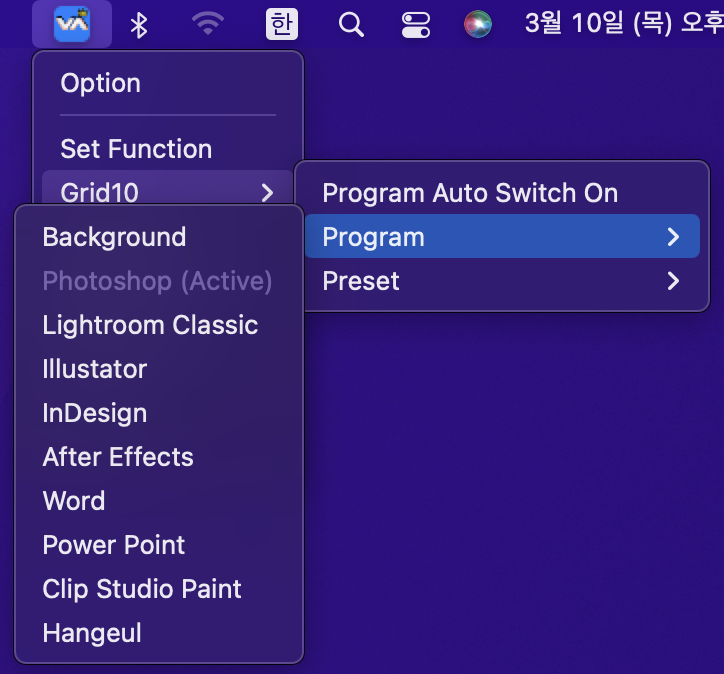

# 2022/03 2주차 주간 리포트

## 주간 작업 목록

---

- [`INVAIZ Studio` 메뉴에서 프로그램, 프리셋 전환 기능 ✅](#invaiz-studio-메뉴에서-프로그램-프리셋-전환-기능-)
- [`INVAIZ Studio` 언어 지원 확대 ✅](#invaiz-studio-언어-지원-확대-)
- [그룹 변경 모드 애니메이션 수정 ✅](#그룹-변경-모드-애니메이션-수정-)
- [플러그인 다운로드 링크 ✅](#플러그인-다운로드-링크-)

---

## `INVAIZ Studio` 메뉴에서 프로그램, 프리셋 전환 기능 ✅

#### 작업 상세 설명

- 기존에는 프로그램 혹은 프리셋을 변경하기 위해서 세팅 창을 켜야하는 번거로움이 있었는데, 이제는 메뉴에서 프로그램 혹은 프리셋을 변경할 수 있게 하여 조오오오오오금은 더 빠르게 접근할 수 있습니다.
- 현재 활성화된 프로그램 혹은 프리셋은 선택할 수 없으며, 프로그램 자동 전환 상태도 변경 가능합니다.

  

#### 고려 사항

- 이 방법도 불편할 수 있으므로 조금 더 편한 방법을 고안해야 할 것 같습니다.

---

## `INVAIZ Studio` 언어 지원 확대 ✅

#### 작업 상세 설명

- 기존 `INVAIZ Studio`에서는 셋팅 창, 옵션 창과 같은 창에서만 언어팩 지원이 되었는데, 이제는 알림 창이나, 메뉴, 툴팁 등에도 언어팩이 적용됩니다.

  

#### 고려 사항

- 변수와 함께 글을 띄워야하는 경우, 언어 지원이 미흡하여 100% 지원은 아직 구현하지 못 했습니다.

---

## 그룹 변경 모드 애니메이션 수정 ✅

#### 작업 상세 설명

- 좌우로 흔들리는 애니메이션은 시각적으로 불편함이 있어 `Apple` 제품을 오마주한 애니메이션을 구현하였습니다.

  

- 통통 튀는 애니메이션을 추가해 볼 계획입니다.

#### 고려 사항

- 애니메이션의 디테일을 수정하면 더 좋을 것 같습니다.

---

## 플러그인 다운로드 링크 ✅

#### 작업 상세 설명

- 플러그인을 직접 찾아서 다운로드 하기에 번거로움이 있을 수 있어, 다운로드 가능한 링크를 걸어두었습니다.

  

#### 고려 사항

- 현재는 `Adobe Creative Cloud`가 켜지는 것이 아닌 웹사이트가 켜지므로 완벽한 사용성에는 부족합니다.

---

## 전달 사항

### 이번 주 추가 리스트

- 그룹 변경 모드 애니메이션 수정

### 이번 주 구현 리스트

- 그룹 변경 모드 애니메이션 수정
- 메뉴에서 프로그램, 프리셋 전환 기능

### 현재 구현이 필요한 기능

- 자동 업데이트 환경 구성
- 목록 휴지통 기능 구현 - Design 설계 중.
- `Func` 형식에 `id` 추가
- `Func` 형식에서 `sendCepScript`의 경우 `fcode`에 `id` 값 매핑 후 실행
- 매크로 여러 개 클릭하여 한 번에 복사 / 붙여넣기
- 모든 데이터 구조 `id` 형식 변경 `number` -> `string`
- `macOS`에서 설치 시 `CEP` 프로그램 종료 시키기
- `Windows` 한글로 키 입력 시 종료되는 버그
- 오버레이 회전 기능 구현
- 커스텀 기능 목록에서 `Drag & Drop` 기능 구현
- `Microsoft Office`, `한글` 제공 기능, 기본 제공 프리셋 언어 번역
- `macOS`에서 `Camera Raw` 최적화
- 그룹 버튼으로 프리셋 변경 모드 설정 기능 추가
