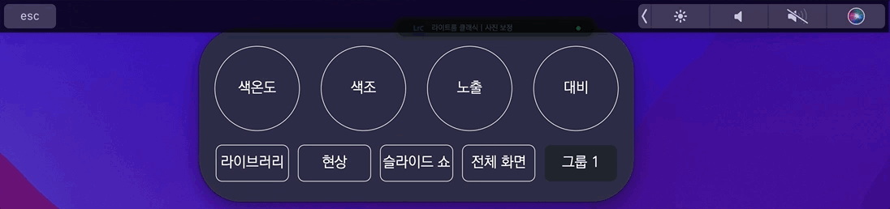

# 2022/03 4주차 주간 리포트

## 주간 작업 목록

---

- [`@emotion` 모듈 스타일 오류 수정 ✅](#emotion-모듈-스타일-오류-수정-)
- [`Macbook` 터치 바 지원 ✅](#macbook-터치바-지원-)
- [손 쉬운 사용 설정 유도 ✅](#손-쉬운-사용-유도)
- [`macOS`에서 `Camera Raw` 최적화 ✅](#macos에서-camera-raw-최적화-)

---

## `@emotion` 모듈 스타일 오류 수정 ✅

#### 작업 상세 설명

- `styled-components`에서 `@emotion`으로 모듈 변경 후, 리스트를 렌더링 할 때 스타일이 제대로 적용되지 않는 버그가 발생했습니다.

  

- 이 버그는 리스트 요소에서 특정 아이템이 특수한 상태를 가질 경우(선택 표시, 토글, 열기/닫기 등) 그 리스트 상 하위 요소에 간격이 유지되지 않는 등의 버그였는데, `@emotion`에서 해당 문법을 지원하지 않아서 다른 문법을 통해 적용, 수정하였습니다.

  

#### 고려 사항

- 모듈 전체를 바꿨기 때문에, 해당 버그 말고 다른 버그가 발생할 가능성이 있습니다.

---

## `Macbook` 터치 바 지원 ✅

#### 작업 상세 설명

- 단종 되긴 했으나, `Macbook M1` 사용자가 많은 것으로 보아 터치 바 또한 수요가 있을 것으로 판단. 변경이 어려운 프로그램 및 프리셋 변경을 터치 바로 지원할 수 있는 기능을 구현하였습니다.
- 두 가지 방식으로 설정할 수 있는데, 터치 바 특성 상 설정 등의 `INVAIZ Studio` 창을 포커싱 한 상태에서만 사용 가능하다는 단점이 있습니다.

  1. 버튼 형
     

     - 현재 선택 상태를 쉽게 판단할 수 있다는 장점이 있으나, 일정 길이를 초과할 시 선택할 수 없는 단점.
     - 각 요소 간의 간격 또한 설정할 수 없는 것으로 보임.

  2. 슬라이드 형
     

     - 길이에 구애 받지 않고 선택할 수 있다는 장점이 있으나, 현재 선택 상태가 초기에 렌더링 되지 않는 단점.
     - 글자 수의 제약이 있다는 단점도 존재.
     - 또한, 슬라이드를 너무 빨리할 경우, 프로그램 혹은 프리셋이 짧은 시간 내에 여러 번 변경되어 렉이 좀 걸리는 문제가 있음.

#### 고려 사항

- 두 가지 버전 모두, 터치 바를 통해서 변경하지 않고 셋팅 창에서 변경할 경우, 실시간으로 반영되지 않아 삭제 혹은 비활성화된 프로그램, 프리셋을 선택할 수 있는 버그가 존재합니다.
- 옵션 창에서도 옵션 창만의 터치 바를 만들어도 괜찮을 것 같습니다.

---

## 손 쉬운 사용 설정 유도 ✅

#### 작업 상세 설명

- `macOS`의 고질적인 문제점인 손 쉬운 사용 설정과 관련하여, `INVAIZ Studio` 실행 시 손 쉬운 사용이 체크되어 있지 않은 상태이면, 체크를 유도하도록 하는 기능을 추가하였습니다.

  

#### 고려 사항

- 자동으로 시스템 환경설정 - 보안 및 개인 정보 보호 - 손 쉬운 사용 창을 열어주긴 하나, 해당 메세지를 거부했을 때는 어쩔 수 없이 재 실행해야 하는 단점이 있습니다.
  - 이 경우는 창을 한 번 더 띄워 유도하거나, 거부할 경우 소프트웨어를 종료하게 하는 등의 방법을 적용해봐도 좋을 듯 합니다.

---

## `macOS`에서 `Camera Raw` 최적화 ✅

#### 작업 상세 설명

#### 고려 사항

---

## 전달 사항

### 이번 주 추가 리스트

- `@emotion` 모듈 스타일 오류 수정
- `Macbook` 터치 바 지원
- 손 쉬운 사용 설정 유도
- `Final Cut Pro` 지원

### 이번 주 구현 리스트

- `@emotion` 모듈 스타일 오류 수정
- `Macbook` 터치 바 지원
- 손 쉬운 사용 설정 유도

### 현재 구현이 필요한 기능

- 자동 업데이트 환경 구성
- 목록 휴지통 기능 구현 - Design 설계 중.
- `Func` 형식에 `id` 추가
- `Func` 형식에서 `sendCepScript`의 경우 `fcode`에 `id` 값 매핑 후 실행
- 매크로 여러 개 클릭하여 한 번에 복사 / 붙여넣기
- 모든 데이터 구조 `id` 형식 변경 `number` -> `string`
- `macOS`에서 설치 시 `CEP` 프로그램 종료 시키기
- `Windows` 한글로 키 입력 시 종료되는 버그
- 오버레이 회전 기능 구현
- 커스텀 기능 목록에서 `Drag & Drop` 기능 구현
- `macOS`에서 `Camera Raw` 최적화
- 그룹 버튼으로 프리셋 변경 모드 설정 기능 추가
- `Final Cut Pro` 지원
