# 2022/02 2주차 주간 리포트

## 주간 작업 목록

- [기능 언어팩 변환 알고리즘 ✅](#기능-언어팩-변환-알고리즘-)
- [이전 버전 프리셋 불러오기 호환 ✅](#이전-버전-프리셋-불러오기-호환-)
- [기본 제공 프리셋 호환성 테스트 ✅](#기본-제공-프리셋-호환성-테스트-)
- [일본어 정적 언어 적용 테스트 ✅](#일본어-정적-언어-적용-테스트-)
- [기술 개발 로드맵 조사 ✅](#기술-개발-로드맵-조사-)
- [`v2.1.0` 버전 정식 배포 및 홈페이지 오픈 ✅](#v210-버전-정식-배포-및-홈페이지-오픈-)
- [`(주)펑션베이` 이메일 송신 ✅](#주펑션베이-이메일-송신-)
- [`Wix` 문의 내용 정리 ✅](#wix-문의-내용-정리-)
- [커스텀 파일 생성 솔루션 ✅](#커스텀-파일-생성-솔루션-)
- [`Apple` 개발자 등록 신청 ❌](#apple-개발자-등록-신청-)
- [디테일 수정 ✅](#디테일-수정-)

---

## 기능 언어팩 변환 알고리즘 ✅

#### 작업 상세 설명

- 기능 데이터의 일본어 번역을 위해 민감한 데이터는 제거하고 언어 부분만 분리하여 추출 후 새로운 파일을 생성하였습니다.

  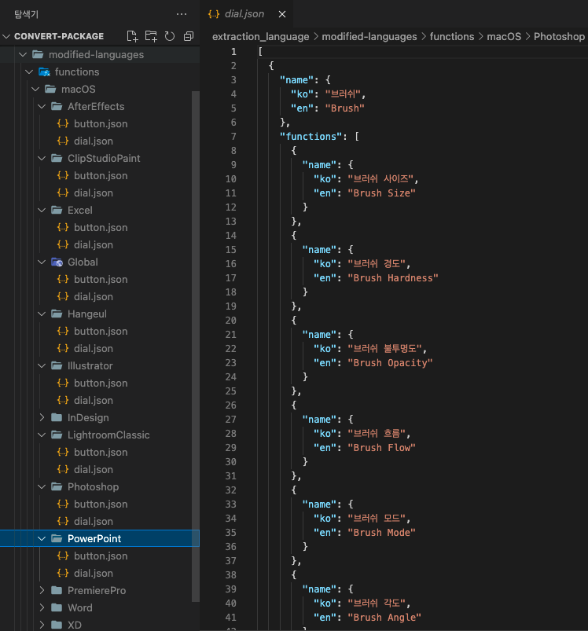

- 언어로 분리된 파일에 `"ja"`영역이 추가되면, 추가된 파일을 기존 기능 데이터 파일에 덮어 씌우는 방식으로 진행할 예정입니다.

#### 고려 사항

- 추후에 다른 언어를 지원하기 위해선 이 방법보다 더 효율적인 방법을 고안해내야할 것 같습니다.

---

## 이전 버전 프리셋 불러오기 호환 ✅

#### 작업 상세 설명

- `v1.x.x` 버전 대의 프리셋은 언어팩이 지원되지 않고, `v2.x.x` 버전 대로 넘어오면서 데이터 형식이 변경된 점이 많아 불러오기 시 오류가 발생하였는데, 호환성을 갖추는 작업을 진행하였습니다.

  

#### 고려 사항

- `100%` 모든 프리셋의 연동은 확인되지 않았고, 다양한 경우의 수가 발생할 것으로 예상되어 혹여나 버그 발생 시 아직까진 수작업으로 프리셋 재설정을 해야할 것 같습니다.

---

## 기본 제공 프리셋 호환성 테스트 ✅

#### 작업 상세 설명

- 기존 `Windows`의 요청과 `macOS`의 추가 호환성까지 점검 및 수정을 완료하였습니다.

  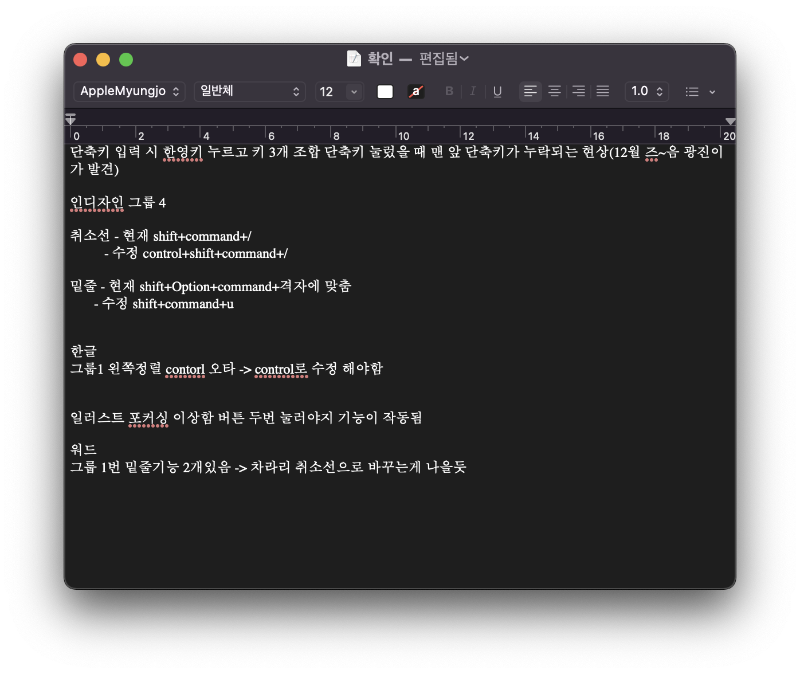

#### 고려 사항

- 호환성을 점검한 버전이 여러 버전으로 분할되어 새 버전에서 점검이 안된 기능이 있을 수 있습니다. 계속해서 점검 진행하며 수정/보완해야할 것 같습니다.

---

## 일본어 정적 언어 적용 테스트 ✅

#### 작업 상세 설명

- 일본 번역 팀 측으로부터 `"ja"` 영역이 추가된 정적 언어 번역 `.json` 파일을 전달 받아 `INVAIZ Studio`에 테스트 적용하였습니다.

  - 프로그램 & 프리셋 설정

    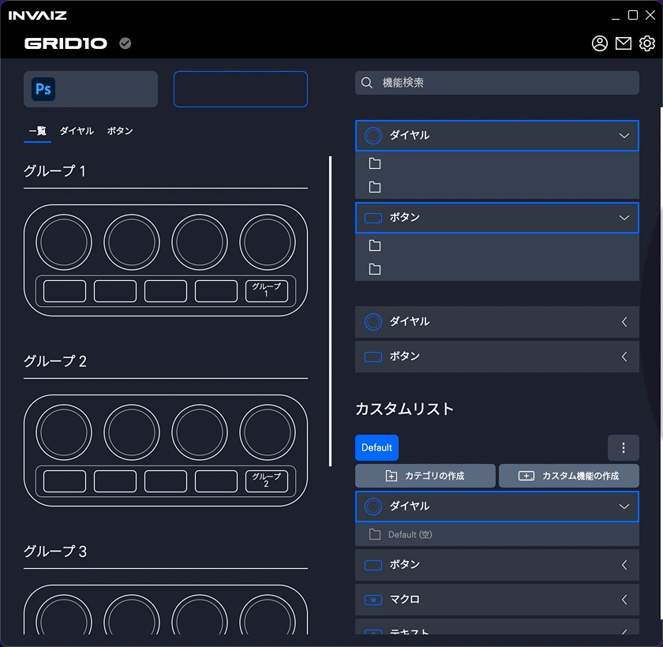

  - 프리셋 추가 & 키 매핑

    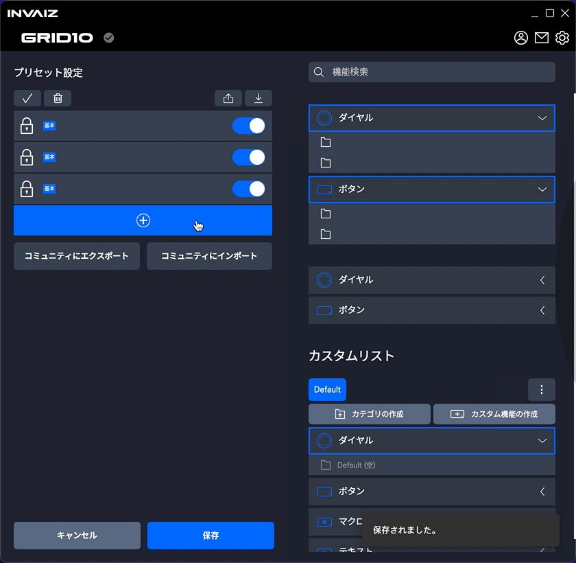

  - 키 매핑 & 툴팁

    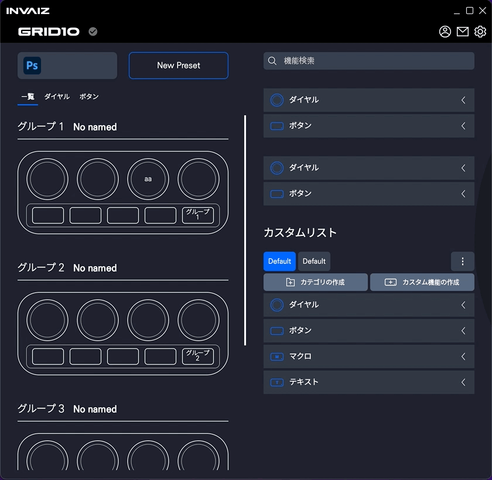

  - 기능 & 커스텀 파일

    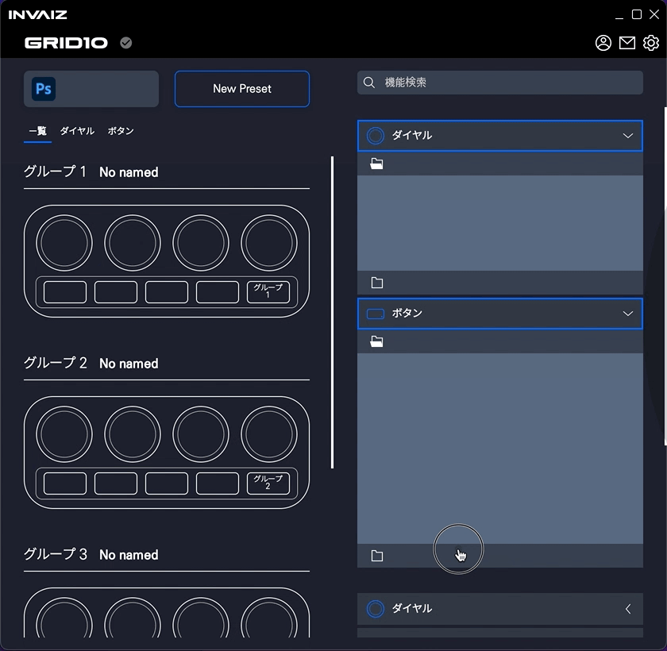

  - 기능 설정 창

    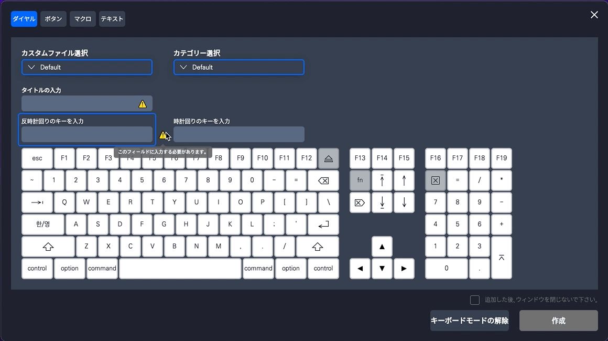

  - 옵션 창

    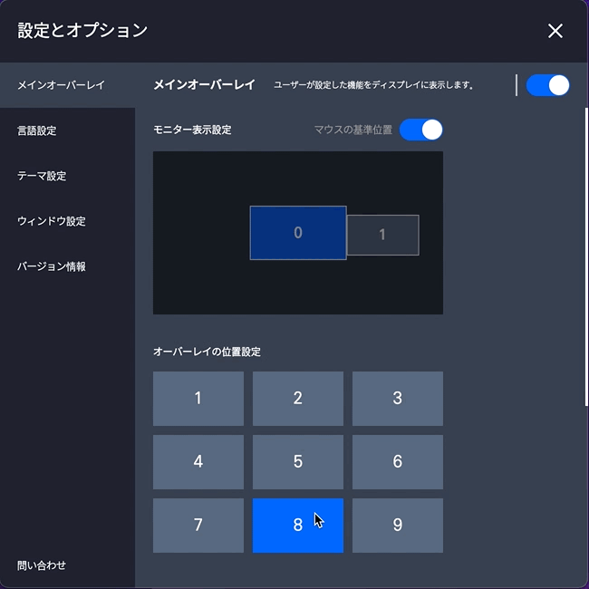

#### 고려 사항

---

## 기술 개발 로드맵 조사 ✅

#### 작업 상세 설명

- 기술 개발 로드맵 작성을 위해 필요한 사전 특허 조사를 진행하였습니다.
- 특허 조사를 토대로 특허로 진행할 만한 기술에 대해 작성 후 도면 초안을 작성하였습니다.
- 작업한 내용은 `Notion`에 업로드하였습니다.

#### 고려 사항

---

## `v2.1.0` 버전 정식 배포 및 홈페이지 오픈 ✅

#### 작업 상세 설명

- `v2.1.0`을 런칭함과 동시에 리뉴얼한 홈페이지의 도메인을 전환하는 작업을 마쳤습니다.

  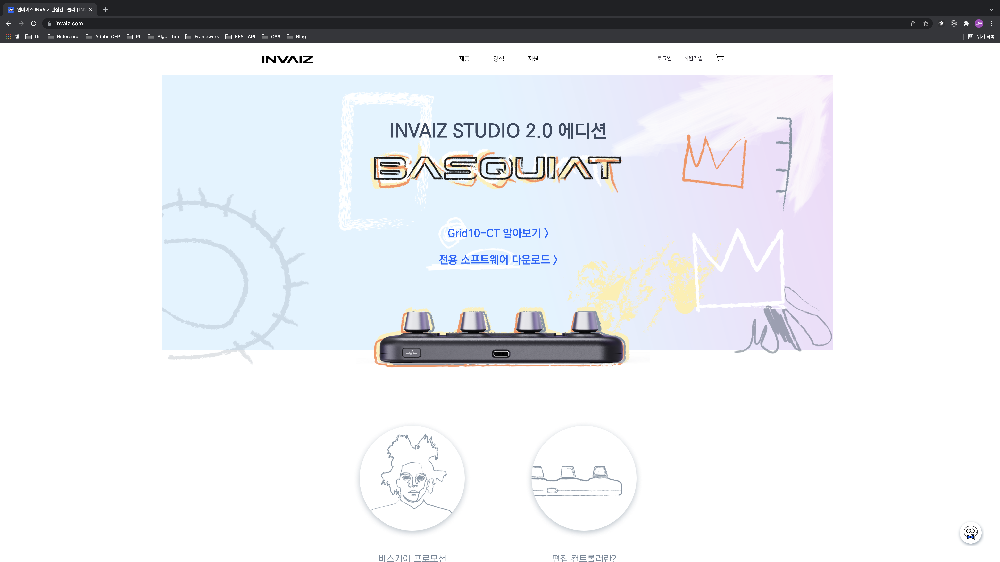

- 홈페이지의 `Software` 탭에서 `INVAIZ Studio v2.1.0` 버전을 다운로드 받을 수 있습니다.

  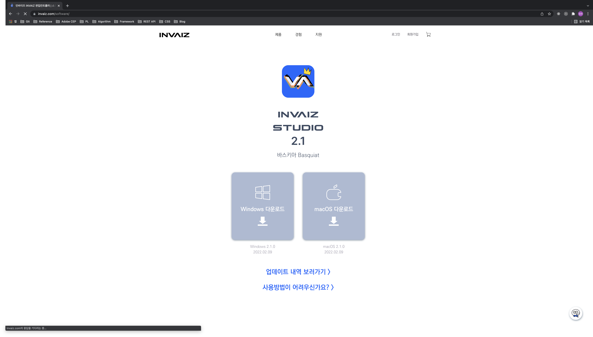

#### 고려 사항

---

## `(주)펑션베이` 이메일 송신 ✅

#### 작업 상세 설명

- 협업 제안에 대한 대화를 진행하기 위해 `(주)펑션베이` 측에 확인용 이메일을 송신하였습니다.

#### 고려 사항

---

## `Wix` 문의 내용 정리 ✅

#### 작업 상세 설명

- `WordPress`로 홈페이지를 이전 함에 따라 이전 홈페이지인 `Wix`의 문의 내용을 정리하였습니다.
- 일자, 성함, 이메일, 연락처, 문의 타입, 문의 내용, 답변 내용, 해결 여부, 답변 시간, 답변 횟수를 정리하여 특이 사항을 표시해둘 예정입니다.
- 정리한 내용은 `Google SpreadSheets`에 업로드 하였습니다.

#### 고려 사항

- 다른 문의처의 문의 내용 또한 모두 통합하여 정리할 수 있는 양식을 만들면 좋을 것 같습니다.

---

## 커스텀 파일 생성 솔루션 ✅

#### 작업 상세 설명

- 타 프로그램의 원활한 지원을 위해서 단축키 목록을 조사하여 `Google Sheets`에 저장한 `Excel` 파일(`.xlsx`)을 `INVAIZ Studio v2`에서 사용 가능한 `.ivz` 커스텀 파일로 변환하는 로직을 작성하였습니다.
- 모든 `.xlsx` 파일을 한 번에 파싱하여 암호화된 `.ivz` 파일로 변환하여 저장합니다.

  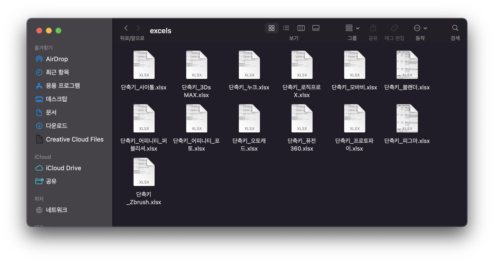

  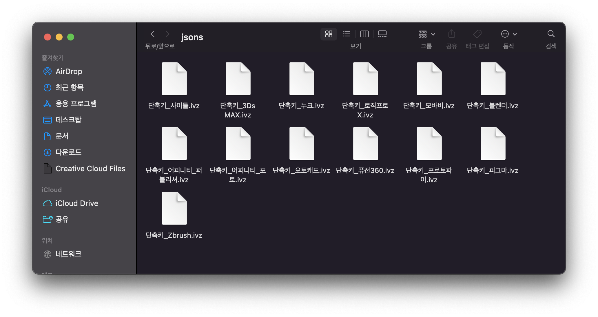

- `INVAIZ Studio v2`에서 정상적으로 로드됩니다.

  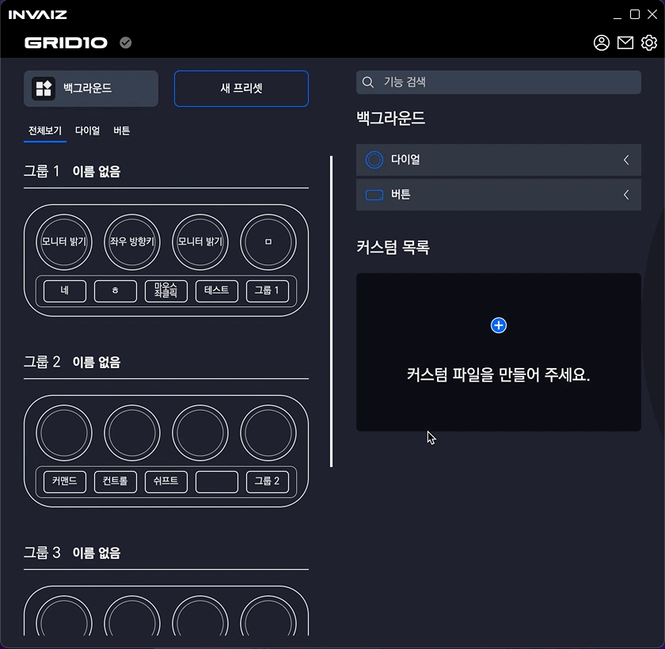

#### 고려 사항

- 매크로, 텍스트 영역에 조사한 데이터가 없다면 비워두는 것이 좋을 것 같습니다.
- 출력한 커스텀 파일의 이름(파일 명이 아닌, `INVAIZ Studio` 내에서 확인 가능한)을 지정해야합니다.
- 조사한 데이터에 언어 및 띄어쓰기가 일관적이지 않고, 형식에 `100%` 부합하지 않는 기능이 있어 점검해야 합니다.
- 버튼 영역에서 `MouseDrag`와 같은 마우스 설정, 매크로에서 다이얼에 대한 표시, 매크로에서 대문자가 적용되어 있는 등의 형식 오류가 있습니다.

---

## `Apple` 개발자 등록 신청 ❌

#### 작업 상세 설명

- 3~5일이 지나도 `D-U-N-S` 번호에 대한 이메일 회신이 없어 재 요청 및 문의를 전송하였습니다.

  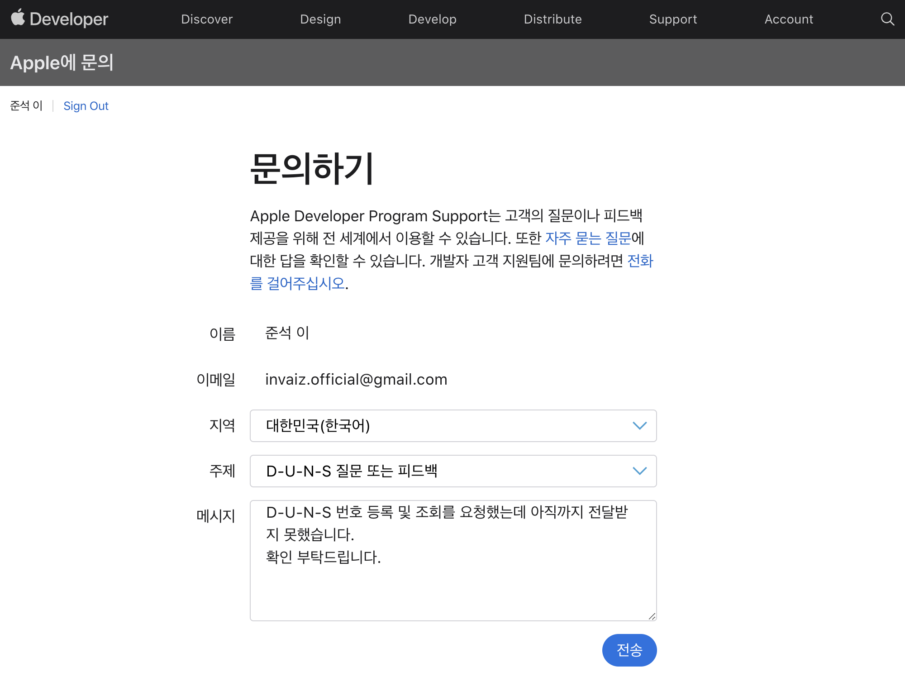

#### 고려 사항

---

## 디테일 수정 ✅

#### 작업 상세 설명

- 기본 제공 프리셋 삭제되는 버그 수정

  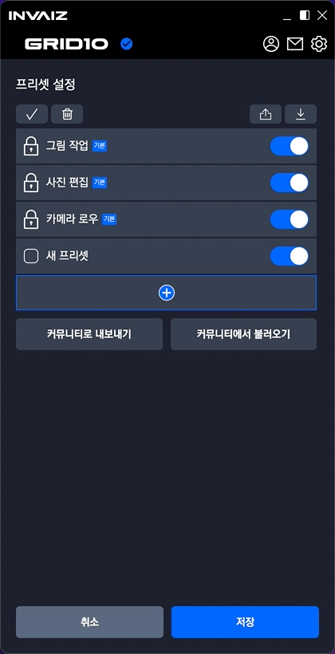

  - 버전이 업데이트 되면서 전체 선택 후 삭제 시 기본 제공 프리셋이 한꺼번에 사라지는 버그가 발생했는데, 이를 수정하였습니다.

- 서브 오버레이 제거

  - `INVAIZ Studio v2.1.0` 이후로 서브 오버레이 관련 소스 코드를 아예 삭제하였습니다.

#### 고려 사항

---

## 전달 사항

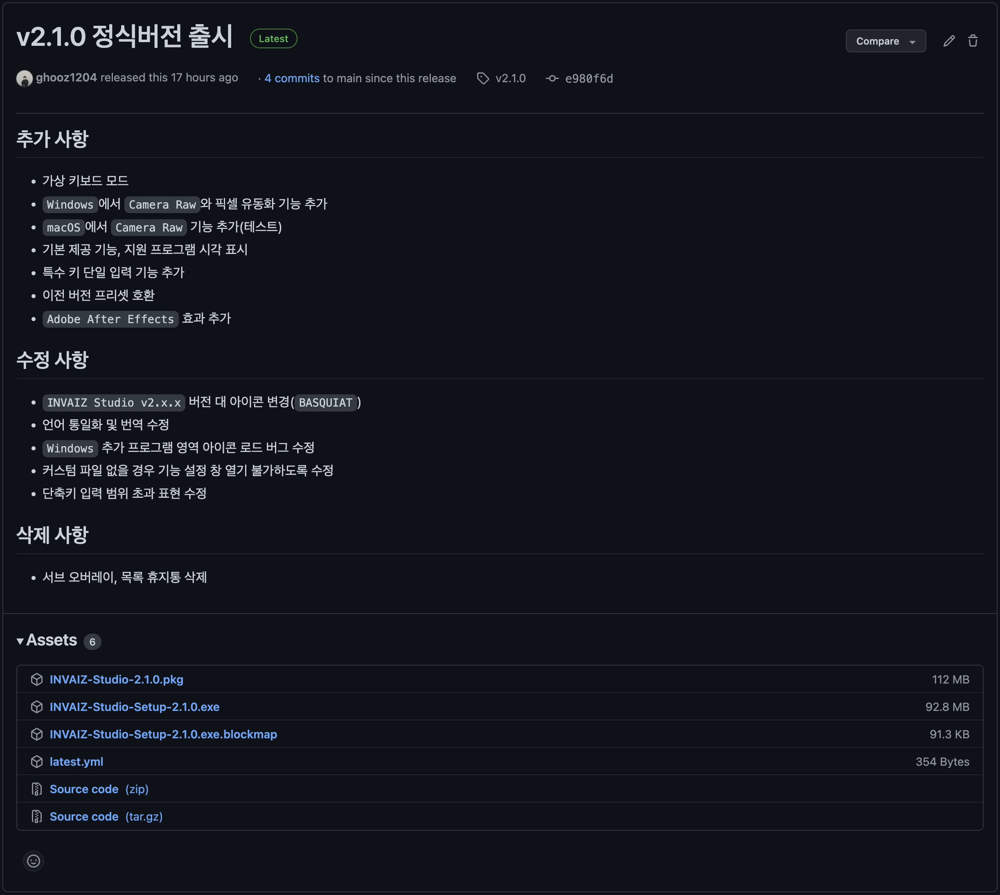

> 2022.02.09(수) `INVAIZ Studio` 2.1.0 버전(정식버전) 런칭.

### 이번 주 추가 리스트

- 언어팩 변환 알고리즘
- 이전 버전 프리셋 불러오기 호환
- 빌트인 프리셋 삭제되는 버그 수정

### 이번 주 구현 리스트

- 기본 제공 기능, 기본 제공 프리셋 점검
- 서브 오버레이
- 언어팩 변환 알고리즘
- 이전 버전 프리셋 불러오기 호환
- 빌트인 프리셋 삭제되는 버그 수정
- 커스텀 단축키 생성 솔루션(양식에 맞춰진 데이터)

### 현재 구현이 필요한 기능

- 자동 업데이트 환경 구성
- 목록 휴지통 기능 구현 - Design 설계 중.
- `Func` 형식에 `id` 추가
- `Func` 형식에서 `sendCepScript`의 경우 `fcode`에 `id` 값 매핑 후 실행
- 매크로 여러 개 클릭하여 한 번에 복사 / 붙여넣기
- 모든 데이터 구조 `id` 형식 변경 `number` -> `string`
- `macOS`에서 설치 시 `CEP` 프로그램 종료 시키기
- `Windows` 한글로 키 입력 시 종료되는 버그
- 오버레이 회전 기능 구현
- 커스텀 기능 목록에서 `Drag & Drop` 기능 구현
- `Microsoft Office`, `한글` 제공 기능, 기본 제공 프리셋 언어 번역
