# 2022/02 4주차 주간 리포트

## 주간 작업 목록

- [`Channel.io` 보완 및 활성화 ✅](#channelio-보완-및-활성화-)
- [그룹 변경 오버레이 설명 추가 ✅](#그룹-변경-오버레이-설명-추가-)
- [오버레이 라이트 모드 추가 ✅](#오버레이-라이트-모드-추가-)
- [개발자를 위한 문서 작성 ✅](#개발자를-위한-문서-작성-)
- [`TypeScript` 전환 작업 ✅](#typescript-전환-작업-)
- [디테일 수정 ✅](#디테일-수정-)

---

## `Channel.io` 보완 및 활성화 ✅

#### 작업 상세 설명

- `INVAIZ Studio`에서 `Channel.io`를 사용할 수 있도록 안정성 보완 작업을 진행하였습니다.
- 이전에 발생하던 보안 경고 표시가 발생하지 않으며, 다른 창(셋팅, 기능 설정, 오버레이, 릴리즈 노트)에서는 `Channel.io`와 같은 외부 리소스를 불허하여 불안 요소를 최대한 제거하였습니다.
- `Channel.io`의 기록은 컴퓨터마다 따로 저장되며, 한 컴퓨터에서는 같은 이름으로 서버(관리자 측)에 메세지가 전송됩니다.

  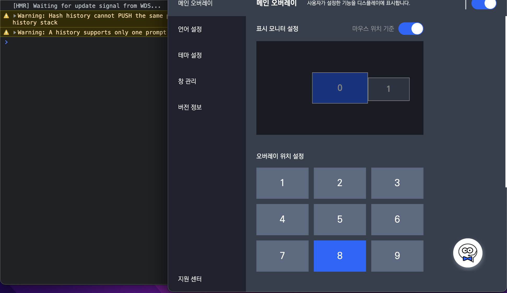

- 기존의 문의하기 버튼은 지원 센터로 변경하고, 버튼 클릭 시 https://invaiz.com/support 로 이동합니다.

#### 고려 사항

- 플랜이 낮아서 그런지 전화번호 및 상세 정보를 사용자가 입력하여도 노출되지 않습니다.

---

## 그룹 변경 오버레이 설명 추가 ✅

#### 작업 상세 설명

- 사용자 피드백으로 나온 "그룹 변경 모드라는 것을 인식시킬 수 있는 방법"을 반영하여 그룹 변경 모드에서 설명을 통해 그룹 변경 모드라는 것을 노출하였습니다.

  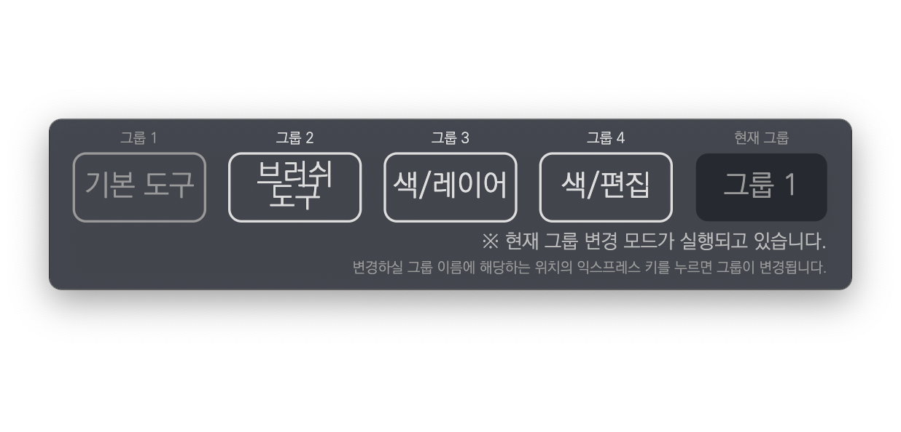

- 현재 그룹의 색상 톤을 낮추어 다른 그룹을 누를 수 있는 모드라는 것을 인지할 수 있게 시선을 분산시켰습니다.
- 또한, 그룹 변경 모드임을 인지시키기 위해 진동을 통해 클릭 시 변화가 있을 예정이라는 포인트를 주었습니다.

  

#### 고려 사항

- 더 좋은 디자인이 있으면 반영하도록 하겠습니다.

---

## 오버레이 라이트 모드 추가 ✅

#### 작업 상세 설명

- 기존에 오버레이는 테마를 설정하더라도 동일한 다크 모드 테마를 유지했는데, 라이트 모드 테마를 추가하였습니다.
- 라이트 모드 기본

  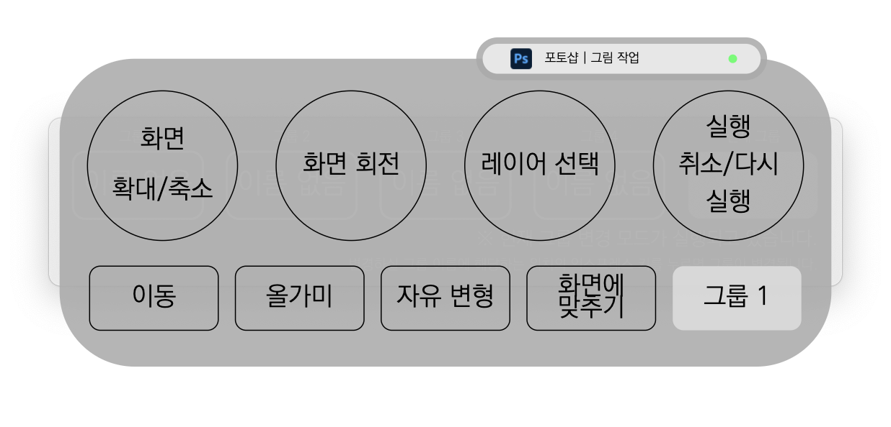

- 라이트 모드 사용

  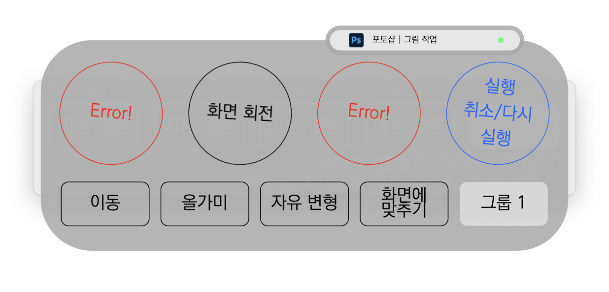

- 라이트 모드 그룹 설정

  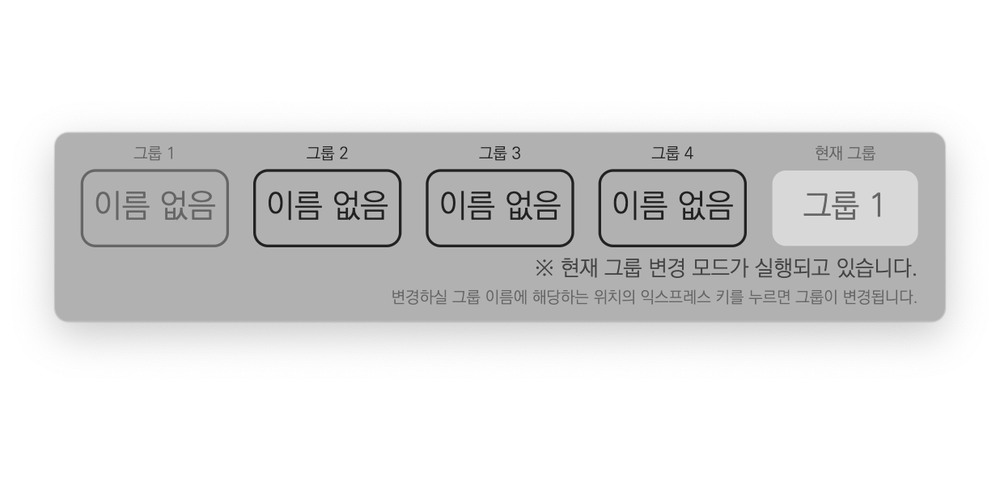

#### 고려 사항

- 색을 임의로 지정하여 시각적인 피로도가 발생할 수 있습니다.
- 따라서 지금은 딱히 좋은 디자인은 아닌 것 같습니다.
- 오버레이는 기존 테마와 묶어서 선택하는 것이 아닌, 따로 설정해야할 것 같습니다.

---

## 개발자를 위한 문서 작성 ✅

#### 작업 상세 설명

- 추후 `INVAIZ`에서 근무할 다른 개발자를 위해 재빨리 인수인계가 가능하고 구조를 쉽게 이해할 수 있도록 참고 문서를 작성하였습니다.
- 프로젝트들의 구조 및 사용법, 프로젝트의 목적 등을 기술하였습니다.
- `INVAIZ`의 [`Github Organization`](https://github.com/INVAIZ)을 생성하고, `INVAIZOFFICIAL`이라는 [`Github`](https://github.com/INVAIZOFFICIAL) 계정 또한 새로 생성하여 업무와 관련된 프로젝트를 관리할 수 있도록 구성하였습니다.

  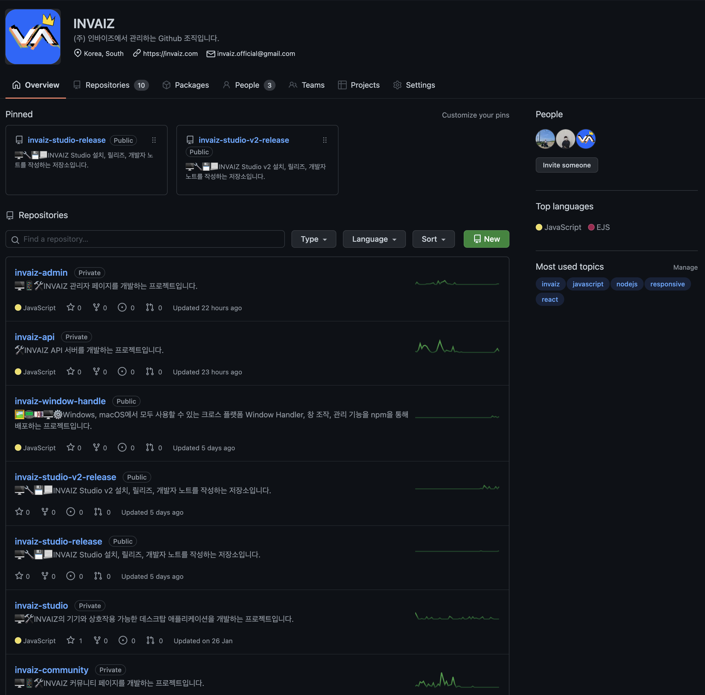

  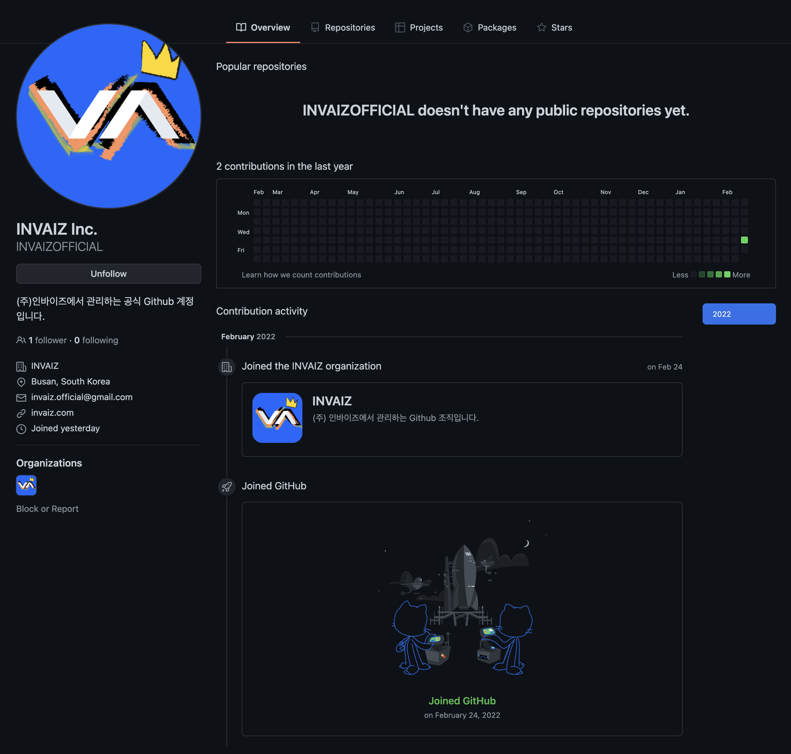

#### 고려 사항

- `INVAIZOFFICIAL` 계정을 `Github Pro` 팩으로 전환할 수 있는 [`Github Education`](https://education.github.com/benefits?type=student) 서비스가 있는데, 신청하는 것이 좋을 것 같습니다.

---

## `TypeScript` 전환 작업 ✅

#### 작업 상세 설명

- 기존 `JavaScript`로 구성된 프로젝트 소스 코드를 `TypeScript`를 사용하기 위한 상세한 `Webpack` 설정, 프로젝트 구성 변경을 진행하고 있습니다.

#### 고려 사항

---

## 디테일 수정 ✅

#### 작업 상세 설명

- 사용하지 않는 기능 제거

  - 더이상 사용하지 않아 불필요한 기능인 셋팅 창의 로그인 버튼, 문의하기 버튼을 삭제하였습니다.
  - 로그인 버튼은 의미가 없게 되었으며, 문의하기 버튼은 설정 버튼을 누를 시 바로 `Channel.io`로 연동되어 메세지 전달이 가능하므로 제거하였습니다.

  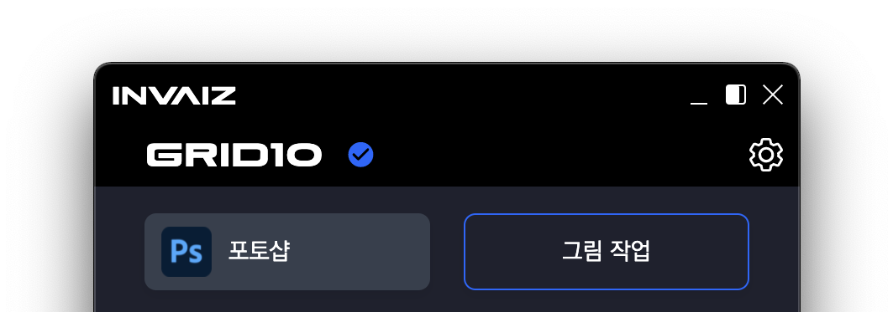

- 데이터 수집 추가

  - 수집 요소 중 `serial_number`, `ip` 외에 `model_type`, `os_type`을 추가하여 조금 더 활용성 있는 데이터의 수집 및 향후 새로운 제품의 대한 수집 대책도 마련하였습니다.

- 창 관리 => 상태 관리로 변경

  - 기존의 "창 관리" 탭은 단어 선택이 애매하여 해당 탭에서 관리하는 내용이 무엇인지 유추하기 어렵게 했습니다.

  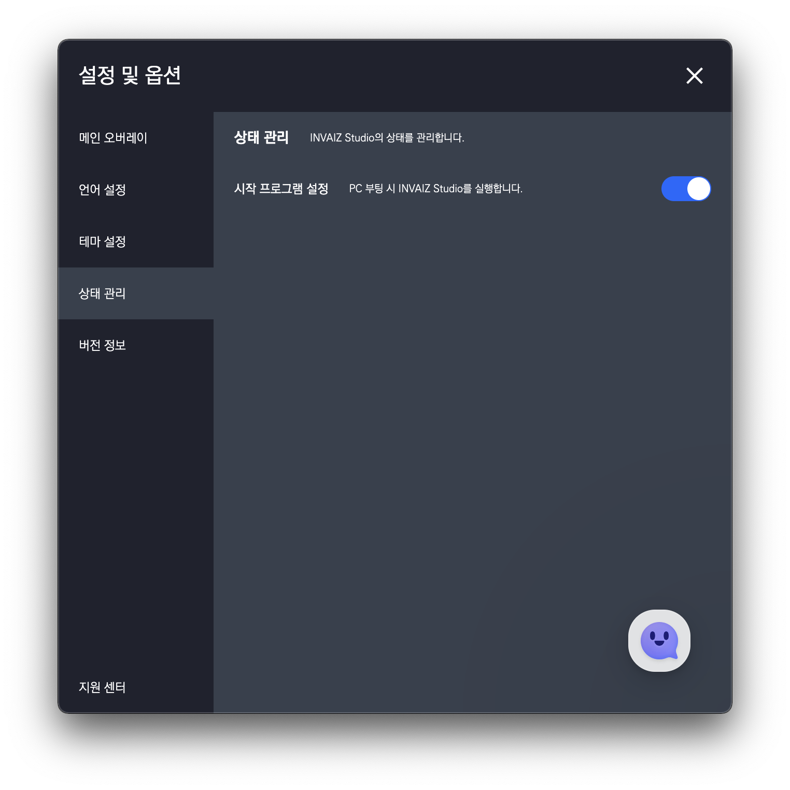

  - 따라서 "창 관리" 보다 조금은 더 포용성 있는 "상태 관리"("Manage State")라는 이름을 선택하였습니다.

- 버전 정보에 프로젝트 설명 추가

  - 기존의 버전 정보 탭에는 전달하는 정보에 비해서 영역의 크기가 너무 커서 비어 보이는 상태였는데, 이에 내용을 채워넣고자 `INVAIZ Studio v2`가 진행하는 프로젝트의 대한 설명을 추가했습니다.

  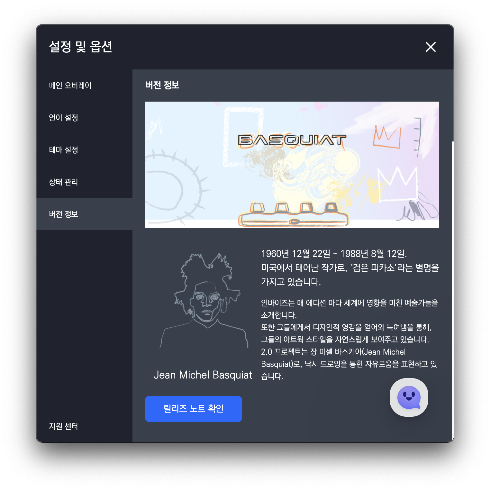

  - 또한 `Channel.io`로 인해 릴리즈 노트 확인 버튼이 가려져 왼쪽으로 위치를 옮겼습니다.

- 메인 오버레이 끄기 시 음영 버그 수정

  - 옵션 창의 메인 오버레이 영역에서 아래로 스크롤 한 후 오버레이를 끄면, 음영이 비정상적으로 렌더되는 버그가 있었습니다.

  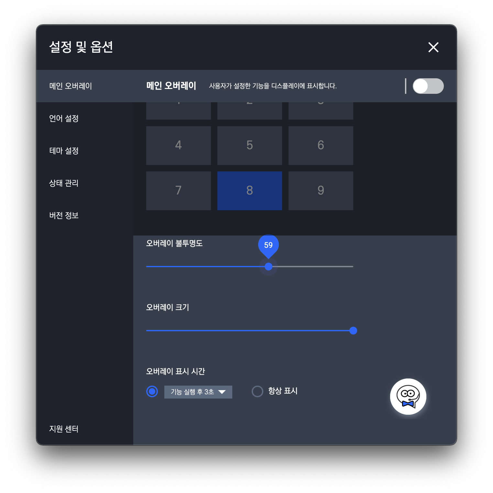

  - 음영이 가리지 않는 부분은 오버레이가 꺼져 있음에도 불구하고 설정이 되는 문제점이 있었는데, 이를 수정하였습니다.

  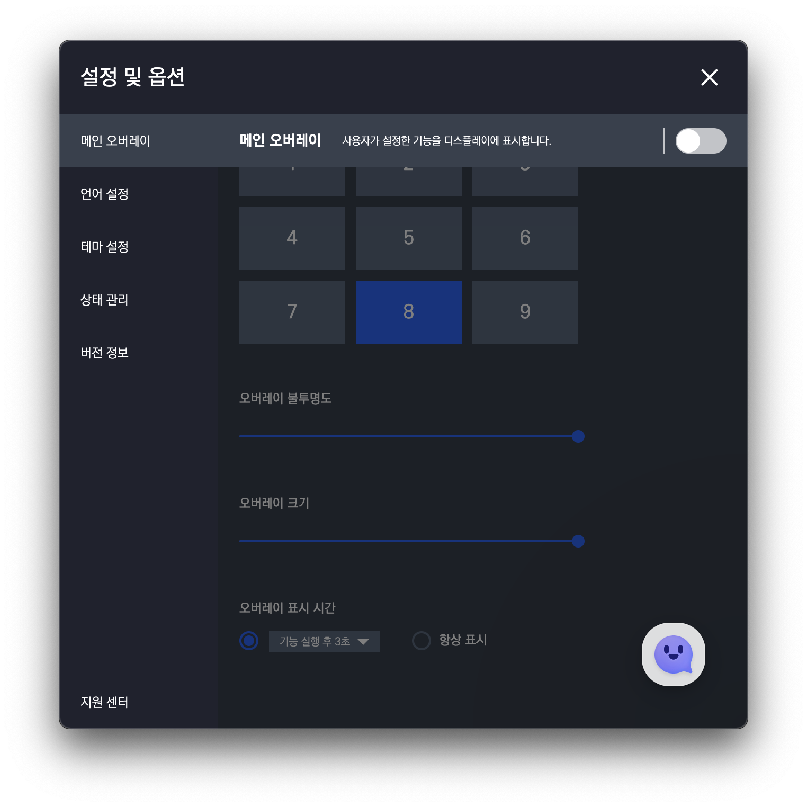

- 릴리즈 노트 수정

  - 릴리즈 노트가 한 번에 모든 내용이 보여 스크롤이 너무 긴 상태여서 선택적으로 열람할 수 있도록 수정하였습니다.
  - 또한 글씨 크기를 조금 키웠으며, ` `이 렌더링 되는 버그나, 링크 클릭 시 영어나 특수 문자가 있는 링크로는 이동이 되지 않는 버그를 수정하였습니다.

  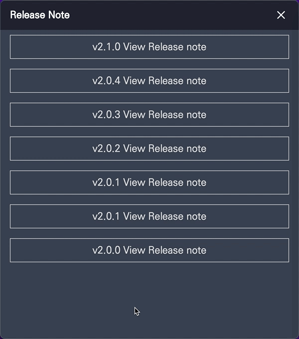

- 펼치기 버튼 수정

  - 셋팅 창의 모드를 변경하는 펼치기 버튼이 직관적이지 못하여 화살표를 추가하고 크기를 조정하였습니다.

  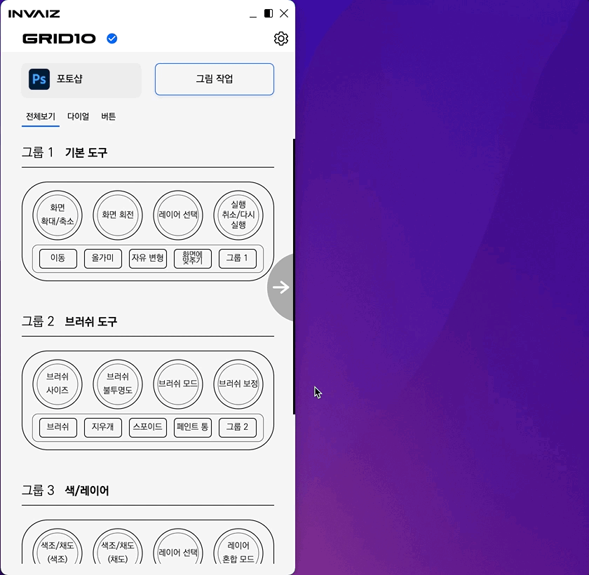

#### 고려 사항

---

## 전달 사항

### 이번 주 추가 리스트

- `Channel.io` 보완 및 활성화
- 사용하지 않는 기능 제거
- 그룹 변경 오버레이 설명 추가
- 오버레이 라이트 모드
- 버전 정보에 프로젝트 설명 추가

### 이번 주 구현 리스트

- `Channel.io` 보완 및 활성화
- 사용하지 않는 기능 제거
- 그룹 변경 오버레이 설명 추가
- 오버레이 라이트 모드
- 버전 정보에 프로젝트 설명 추가

### 현재 구현이 필요한 기능

- 자동 업데이트 환경 구성
- 목록 휴지통 기능 구현 - Design 설계 중.
- `Func` 형식에 `id` 추가
- `Func` 형식에서 `sendCepScript`의 경우 `fcode`에 `id` 값 매핑 후 실행
- 매크로 여러 개 클릭하여 한 번에 복사 / 붙여넣기
- 모든 데이터 구조 `id` 형식 변경 `number` -> `string`
- `macOS`에서 설치 시 `CEP` 프로그램 종료 시키기
- `Windows` 한글로 키 입력 시 종료되는 버그
- 오버레이 회전 기능 구현
- 커스텀 기능 목록에서 `Drag & Drop` 기능 구현
- `Microsoft Office`, `한글` 제공 기능, 기본 제공 프리셋 언어 번역
