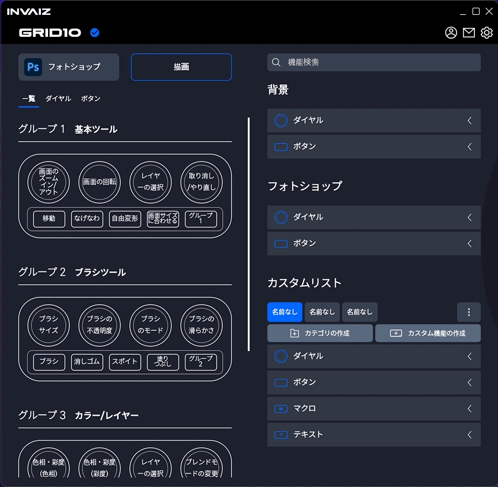
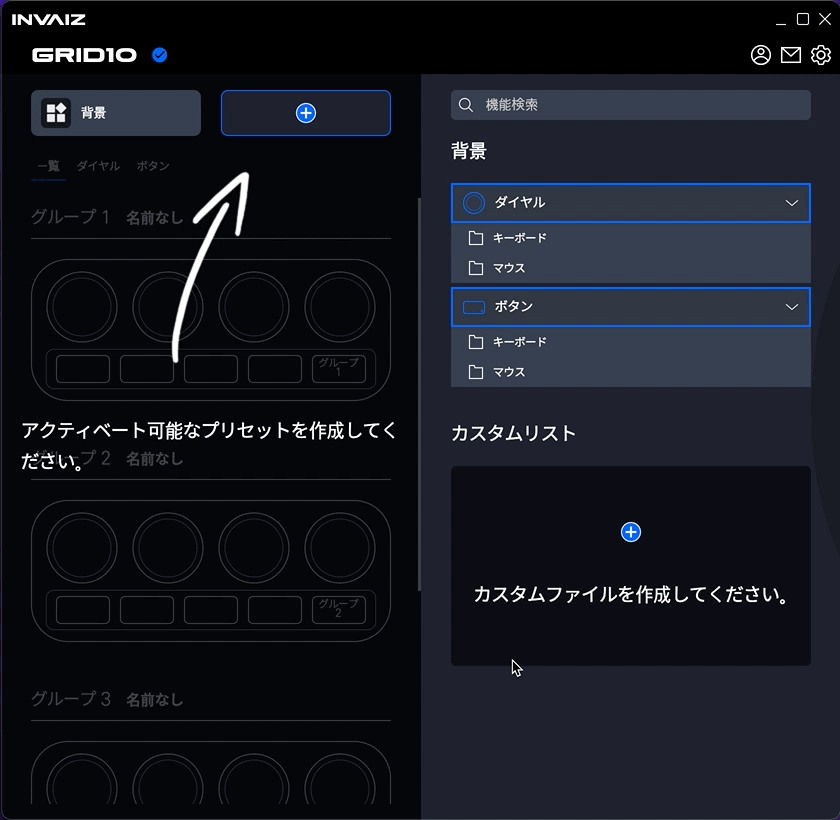
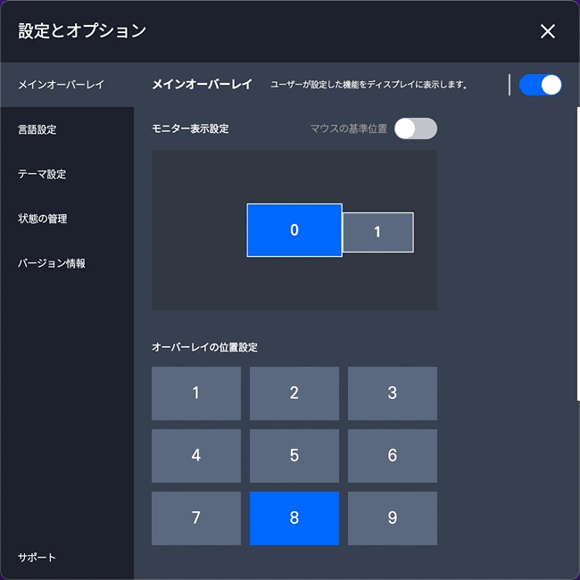
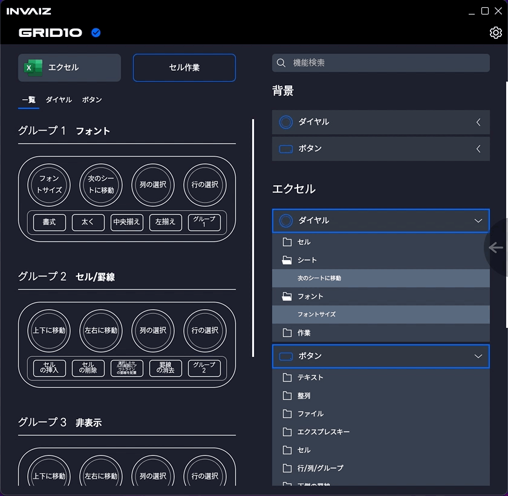

# 2022/03 2주차 주간 리포트

## 주간 작업 목록

---

- [`INVAIZ Studio` 메뉴에서 프로그램, 프리셋 전환 기능 ✅](#invaiz-studio-메뉴에서-프로그램-프리셋-전환-기능-)
- [`INVAIZ Studio` 언어 지원 확대 ✅](#invaiz-studio-언어-지원-확대-)
- [그룹 변경 모드 애니메이션 수정 ✅](#그룹-변경-모드-애니메이션-수정-)
- [플러그인 다운로드 링크 ✅](#플러그인-다운로드-링크-)
- [`v2.1.1` 버전 정식 업데이트 ✅](#v211-버전-정식-업데이트-)
- [일본어 번역 적용 ✅](#일본어-번역-적용-)
- [`Microsoft Office`, `한글` 번역 마무리 ✅](#microsoft-office-한글-번역-마무리-)

---

## `INVAIZ Studio` 메뉴에서 프로그램, 프리셋 전환 기능 ✅

#### 작업 상세 설명

- 기존에는 프로그램 혹은 프리셋을 변경하기 위해서 세팅 창을 켜야하는 번거로움이 있었는데, 이제는 메뉴에서 프로그램 혹은 프리셋을 변경할 수 있게 하여 조오오오오오금은 더 빠르게 접근할 수 있습니다.
- 현재 활성화된 프로그램 혹은 프리셋은 선택할 수 없으며, 프로그램 자동 전환 상태도 변경 가능합니다.

  

#### 고려 사항

- 이 방법도 불편할 수 있으므로 조금 더 편한 방법을 고안해야 할 것 같습니다.

---

## `INVAIZ Studio` 언어 지원 확대 ✅

#### 작업 상세 설명

- 기존 `INVAIZ Studio`에서는 셋팅 창, 옵션 창과 같은 창에서만 언어 팩 지원이 되었는데, 이제는 알림 창이나, 메뉴, 툴팁 등에도 언어 팩이 적용됩니다.

  

#### 고려 사항

- 변수와 함께 글을 띄워야하는 경우, 언어 지원이 미흡하여 100% 지원은 아직 구현하지 못 했습니다.

---

## 그룹 변경 모드 애니메이션 수정 ✅

#### 작업 상세 설명

- 좌우로 흔들리는 애니메이션은 시각적으로 불편함이 있어 `Apple` 제품을 오마주한 애니메이션을 구현하였습니다.

  

- 통통 튀는 애니메이션을 추가해 볼 계획입니다.

#### 고려 사항

- 애니메이션의 디테일을 수정하면 더 좋을 것 같습니다.

---

## 플러그인 다운로드 링크 ✅

#### 작업 상세 설명

- 플러그인을 직접 찾아서 다운로드 하기에 번거로움이 있을 수 있어, 다운로드 가능한 링크를 걸어두었습니다.

  

#### 고려 사항

- 현재는 `Adobe Creative Cloud`가 켜지는 것이 아닌 웹사이트가 켜지므로 완벽한 사용성에는 부족합니다.

---

## `v2.1.1` 버전 정식 업데이트 ✅

#### 작업 상세 설명

- 오버레이 그룹 변경 모드, 라이트 모드, `UXP` 플러그인을 통한 `Mac M1`의 `Adobe Photoshop` 지원, 업데이트 정보 확인, 기기 관리 메뉴 등의 기능을 추가하고, 버그 및 디테일을 수정한 버전으로 업데이트하였습니다.
- 다음 버전에는 일본어 지원, `Final Cut Pro` 테스트, `macOS`에서 `Camera Raw` 디테일 수정 등을 업데이트할 계획입니다.

#### 고려 사항

- 추가 예정이었던 `Channel.io`의 탑재는 `INVAIZ Studio`의 창(렌더러 프로세스)가 로컬 환경에서 실행되어 서버의 접근할 경우 `CORS` 문제를 해결할 수 없어 잠정 보류하였습니다.
- 로컬 환경에서 실행하는 것으로는 해결할 수 없고, 옵션 창을 서버에 업로드하여 `INVAIZ Studio`의 옵션 창은 웹 뷰어 형식으로 실행하면 사용 가능하지만, 보안 등의 문제로 어려움이 있습니다.

---

## 일본어 번역 적용 ✅

#### 작업 상세 설명

- 일본어 번역 파일이 도착하여 적용하였습니다.
- 번역 요청 파일을 보낸 시점인 `v2.0.4` 기준으로 우선 적용하여 테스트해보았습니다.

  - 셋팅 기능 뷰

    

  - 셋팅 지원 프로그램

    

  - 셋팅 커스텀 파일

    

  - 셋팅 프로그램 프리셋

    

  - 기능 설정 창

    

- 이후 최근 업데이트 버전인 `v2.1.1` 기준으로 적용하려고 하니, `v2.0.4` ~ `v2.1.1` 사이에 추가된 기능은 번역 본이 없어 `Google` 번역기의 힘을 빌려 추가 작업하였습니다.

  - 옵션 창

    

  - 릴리즈 노트

    

  - 오버레이

    

  - 그룹 변경 모드

    

#### 고려 사항

- 번역기로 작업한 내역은 오역이 있을 수 있습니다.
- 또한 한 번 검수를 거쳤지만, 오타 혹은 이전 데이터와의 충돌로 기능의 버그가 발생할 수 있습니다.
- 옵션 창에서 버전 정보 아래 프로젝트 소개는 영어 번역도 함께 진행하였습니다.
- 번역이 안된 부분으로 몇 가지 알림 창 만이 남아있습니다.

---

## `Microsoft Office`, `한글` 번역 마무리 ✅

#### 작업 상세 설명

- 일본어 번역과 동시에 기존에 불완전한 상태로 마무리 짓지 못한 `Microsoft Office`, `한글`의 번역을 완료하였습니다.
- `Microsoft Office`의 경우는 언어 별로 번역을 거쳤으나, `한글`은 한글이라는 존재 자체가 외국어와는 궁합이 맞지 않아 모든 언어에서 한글로 보여주는 방식을 채택했습니다.

  - 영어 번역

    

  - 일본어 번역

    

#### 고려 사항

- 같은 뜻을 가진 여러 단어(이름)이 흩어져 있을 수 있습니다.
- 앞으로 언어를 추가할 때 눈 앞이 캄캄합니다.

---

## 전달 사항

> 2022.03.10(목) `INVAIZ Studio` 2.1.1 버전(정식버전) 런칭.

### 이번 주 추가 리스트

- 그룹 변경 모드 애니메이션 수정
- 일본어 번역 적용

### 이번 주 구현 리스트

- 그룹 변경 모드 애니메이션 수정
- 메뉴에서 프로그램, 프리셋 전환 기능
- 일본어 번역 적용
- `Microsoft Office`, `한글` 제공 기능, 기본 제공 프리셋 언어 번역

### 현재 구현이 필요한 기능

- 자동 업데이트 환경 구성
- 목록 휴지통 기능 구현 - Design 설계 중.
- `Func` 형식에 `id` 추가
- `Func` 형식에서 `sendCepScript`의 경우 `fcode`에 `id` 값 매핑 후 실행
- 매크로 여러 개 클릭하여 한 번에 복사 / 붙여넣기
- 모든 데이터 구조 `id` 형식 변경 `number` -> `string`
- `macOS`에서 설치 시 `CEP` 프로그램 종료 시키기
- `Windows` 한글로 키 입력 시 종료되는 버그
- 오버레이 회전 기능 구현
- 커스텀 기능 목록에서 `Drag & Drop` 기능 구현
- `macOS`에서 `Camera Raw` 최적화
- 그룹 버튼으로 프리셋 변경 모드 설정 기능 추가
