# 2022/03 3주차 주간 리포트

## 주간 작업 목록

---

- [`Apple` 개발자 등록 및 코드사인 ✅](#apple-개발자-등록-및-코드사인-)
- [`INVAIZ Studio` 패키징 수정 ✅](#invaiz-studio-패키징-수정-)
- [패키지 파일 최적화 ✅](#패키지-파일-최적화-)
- [`macOS`에서 `Camera Raw` 최적화 ❌](#macos에서-camera-raw-최적화-)
- [`Final Cut Pro` 플러그인 조사 ❌](#final-cut-pro-플러그인-조사-)

---

## `Apple` 개발자 등록 및 코드사인 ✅

#### 작업 상세 설명

- [2022/02 3주차](../../2월/3주차/README.md#apple-개발자-등록-신청-)에 진행한 `D-N-U-S` 번호가 발급되어 개발자 법인 전환 절차를 진행하였습니다.
- 검수 요청을 제출한 후 법인 정보 등록 절차에 관한 메일을 답변 받았습니다.

  

- 법인 정보를 등록하여 접수하였습니다.

  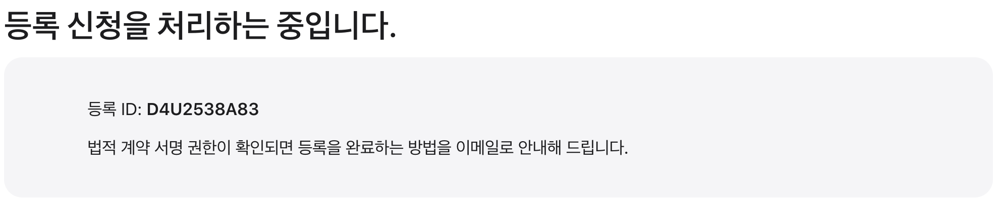

  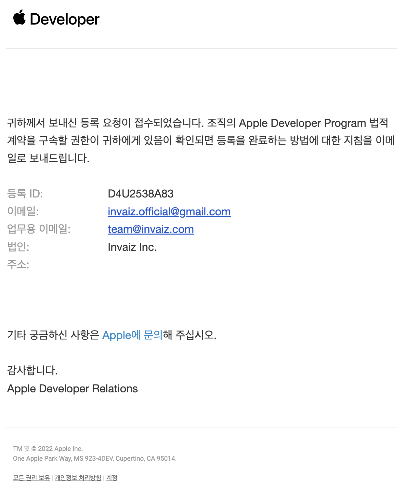

- 2022.03.16(수)에 회사 전화로 최종 절차 진행 여부 확인 받은 후 신청이 완료되었습니다.

  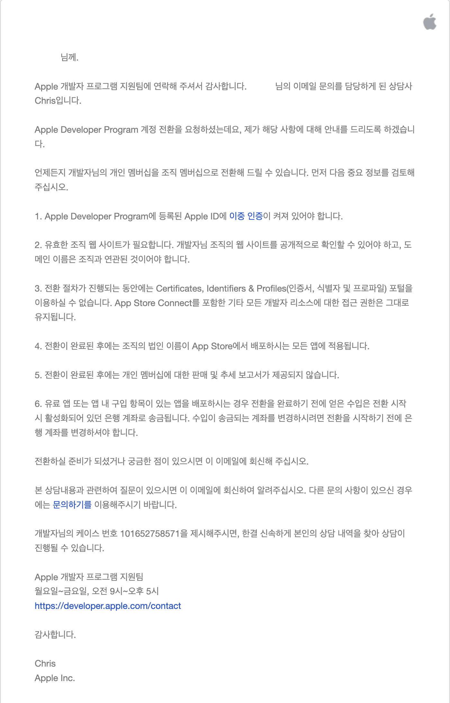

- 법인 정보 등록이 완료되었습니다.

  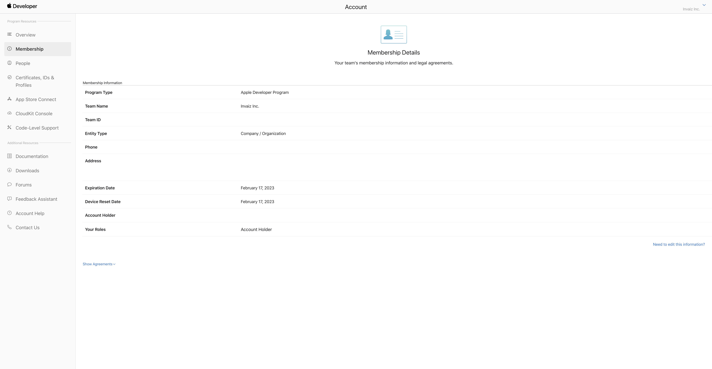

- 이후 기존 개인 사업자의 Codesign 용 인증서를 제거 후 법인 사업자 인증서를 발급 받았습니다.

  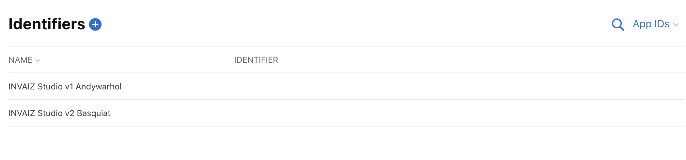

  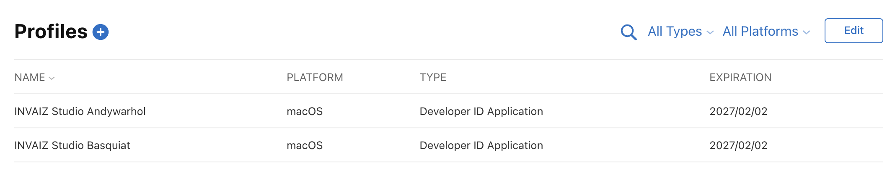

- 이후 `INVAIZ Studio` 배포 파일 코드사인 생성 후 패키지 파일을 실행하면 `Invaiz Inc.`로 서명되어 있는 것을 확인할 수 있습니다.

  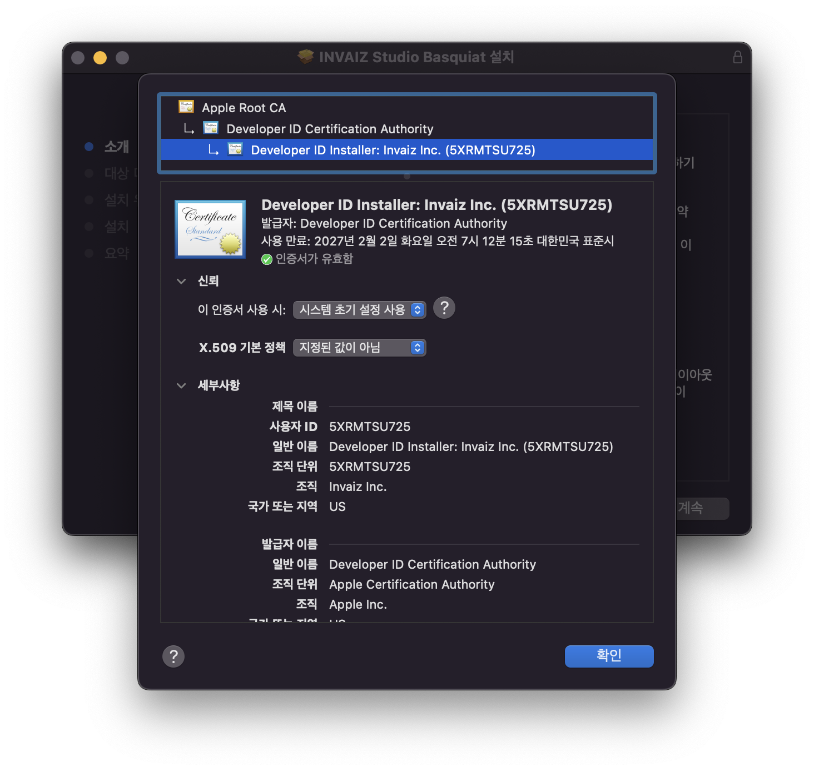

- 이유는 모르겠으나 법인 영문 명이 `INVAIZ Inc.`가 아닌 `Invaiz Inc.`로 되어 있어서 대문자 변경을 요청하였습니다.

  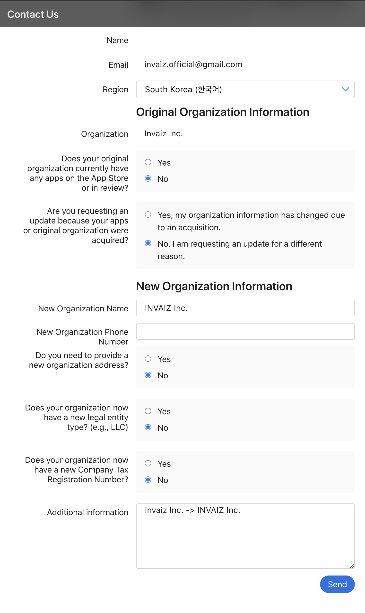

- 대문자 변경 처리에 대한 답변을 받았습니다.

  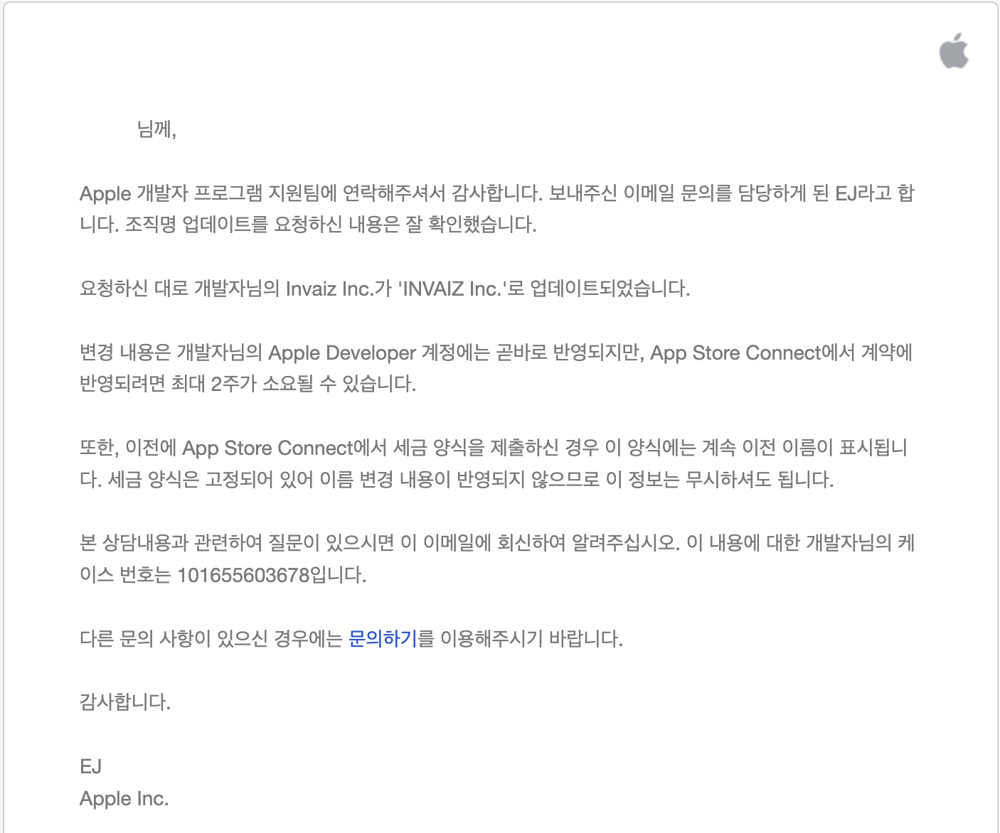

- 법인 정보 변경이 완료되었습니다.

  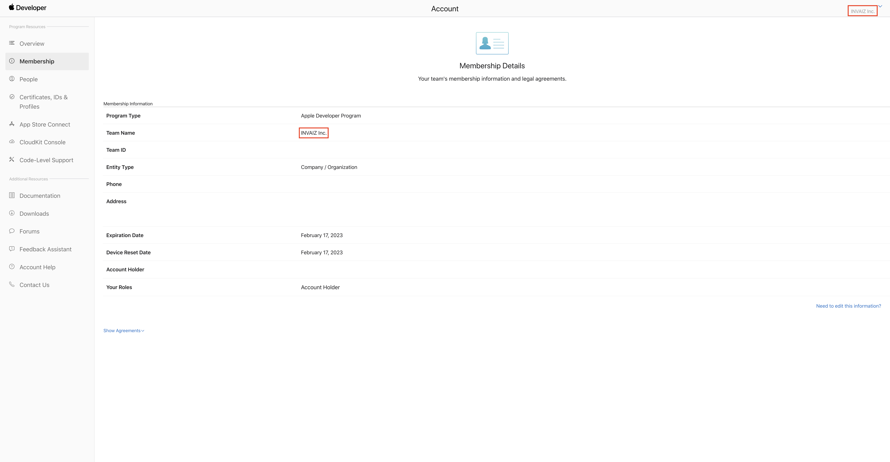

- 인증서 발급 절차를 재진행 한 후, `INVAIZ Studio` 배포 파일 서명을 확인하여 정상적으로 서명되어 있음을 확인하였습니다.

  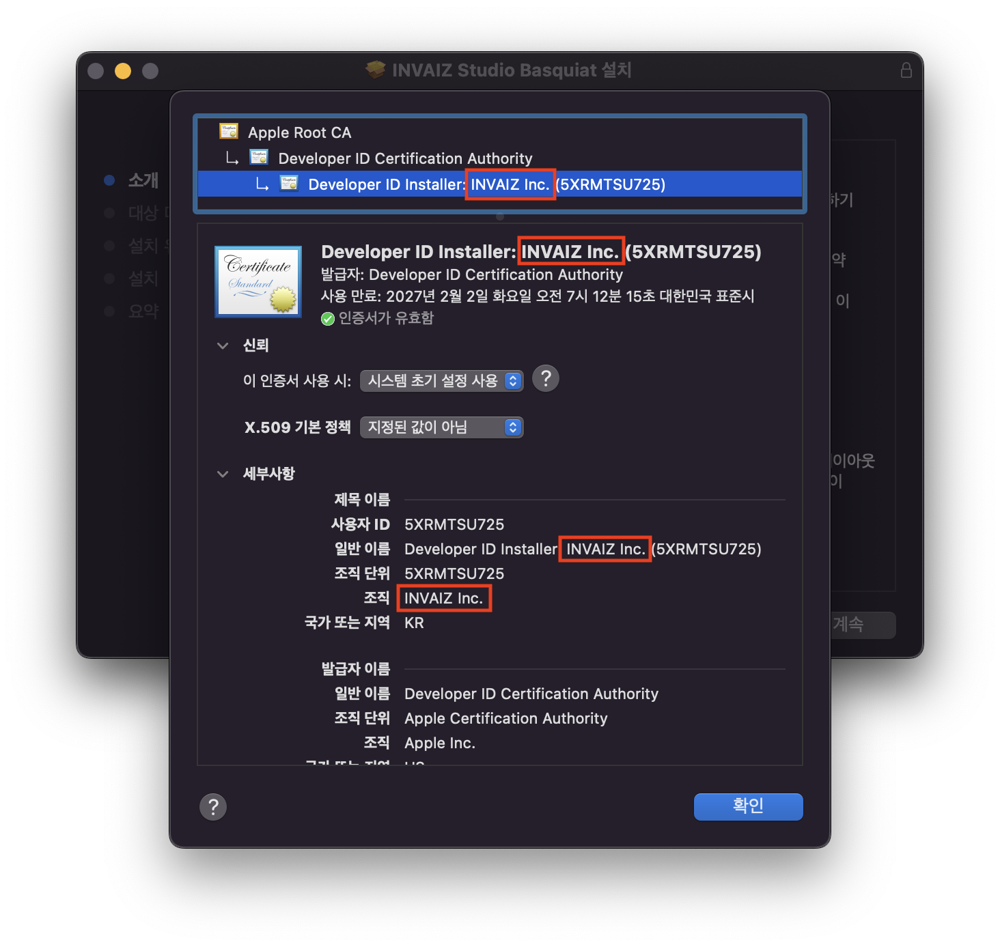

#### 고려 사항

- 법인 사업자 및 인증서를 사용한 후 추후 여러 종류의 애플리케이션 배포를 위해 소프트웨어 배포 명을 `INVAIZ Studio`가 아닌 `INVAIZ Studio {프로모션 명}`과 같이 변경 후 업데이트 고려 중인데, 만약 하게 된다면 기존 버전 사용자는 기존 버전의 프리셋, 커스텀 파일을 모두 내보내고 삭제한 후 업데이트 소프트웨어 설치 후 불러오기 하는 작업을 진행해야 합니다.
- 기존의 패키지 `AppId`가 `com.electron.invaiz`이기 때문에 추후 추가될 타 소프트웨어와 구분이 힘들어 `com.invaiz.studio-basquiat`과 같은 새로운 `AppId`를 설정했기 때문에 발생한 문제입니다.

---

## `INVAIZ Studio` 패키징 수정 ✅

#### 작업 상세 설명

- `INVAIZ Studio` 패키징을 업데이트하였습니다.
- 추후 소프트웨어와 프로모션 버전 관리 등의 용이성을 위해 `INVAIZ Studio Basquiat`으로 이름을 변경하였습니다.

  

  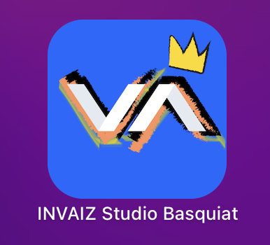

- `macOS`에서 설치파일 실행 시 텍스트 표시(일반적으로 동의할 문서 및 설명)란에 내용을 새로이 작성하였습니다.

  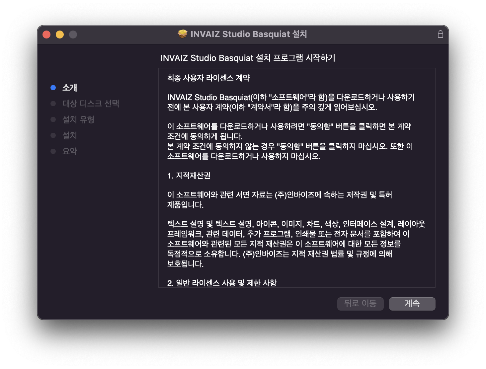

- `macOS`에서 설치 완료 시 완료 문구와 버그 발생하지 않도록 유도하는 텍스트를 작성하였습니다.

  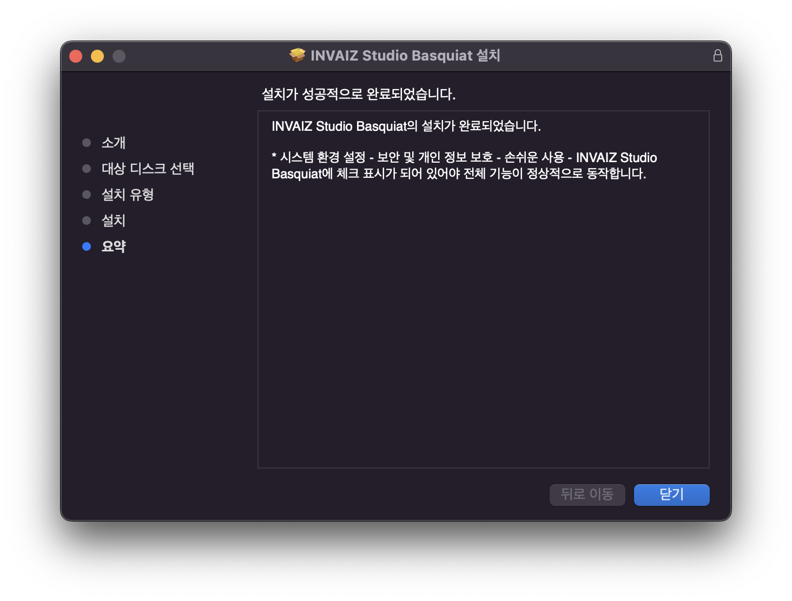

- 추가로 `Mac` 기기 뿐만 아니라 `Macbook Air`, `Macbook M1 Pro` 기기에서도 배포 파일 생성 및 코드 사인이 가능하도록 환경 설정하였습니다.
  - `Mac` 기기 외의 다른 장소에서도 배포 파일을 생성할 수 있습니다.

#### 고려 사항

---

## 패키지 파일 최적화 ✅

#### 작업 상세 설명

- `INVAIZ Studio`의 용량이 점점 커져, 레거시 코드를 삭제하고 최적화하는 작업을 진행 중에 있습니다.
- 더이상 사용하지 않는 모듈인 `node-loader`, `react-saga`, `styled-components`, `@material-ui/core`, `@material-ui/styles`를 삭제하고, `electron`, `@emotion`, `@mui/material` 모듈을 최신 버전으로 업데이트 후 마이그레이션 진행하였습니다.
- `CSS-in-JS`를 사용하고 있기 때문에, `CSS`와 관련된 `loader`, `plugin`을 삭제하면 패키지 용량이 줄어들 것으로 판단되어 진행했으나, `CSS` 관련 모듈을 전혀 사용하지 않아 실제 용량과는 전혀 무관한 것을 확인했습니다.

#### 고려 사항

- `react-router-dom` 모듈 등등 몇 가지 모듈을 더 마이그레이션 할 계획입니다.
- `electron`, `@emotion`과 같이 마이그레이션 한 모듈로 인해, `INVAIZ Studio` 환경이 조금 변해 버그가 발생할 수 있습니다.
- `@emotion`의 스타일 요소에 버그를 발견하여 수정 중에 있습니다.

---

## `macOS`에서 `Camera Raw` 최적화 ❌

#### 작업 상세 설명

- `Adobe Bridge`, 로우 파일 등의 예외 처리 및 각 파라미터마다 다른 가속도를 부여하는 작업을 할 수 있도록 소스 코드 설계 진행 중에 있습니다.
- 설계 및 작성 후 직접 테스트하면서 적절한 가속도 값을 찾고, 버그를 수정하는 방식으로 최적화를 진행할 계획입니다.

#### 고려 사항

---

## `Final Cut Pro` 플러그인 조사 ❌

#### 작업 상세 설명

- `Mac M1`에 있는 `Final Cut Pro`를 실행하며 `GUI`를 적응하고 기능을 조사하고 있습니다.
- [`Apple Developer Document`](https://developer.apple.com/documentation/professional_video_applications?language=objc)에 있는 `Professional Vedio Applications`에서 제공하는 `API`는, `Capture One`과 같이 플러그인을 개발할 수 있는 문서를 제공하는 것으로 보입니다.
  - `Mac M1`에서 플러그인을 직접 작성, 실행하면서 조사할 계획입니다.

#### 고려 사항

---

## 전달 사항

### 이번 주 추가 리스트

### 이번 주 구현 리스트

### 현재 구현이 필요한 기능

- 자동 업데이트 환경 구성
- 목록 휴지통 기능 구현 - Design 설계 중.
- `Func` 형식에 `id` 추가
- `Func` 형식에서 `sendCepScript`의 경우 `fcode`에 `id` 값 매핑 후 실행
- 매크로 여러 개 클릭하여 한 번에 복사 / 붙여넣기
- 모든 데이터 구조 `id` 형식 변경 `number` -> `string`
- `macOS`에서 설치 시 `CEP` 프로그램 종료 시키기
- `Windows` 한글로 키 입력 시 종료되는 버그
- 오버레이 회전 기능 구현
- 커스텀 기능 목록에서 `Drag & Drop` 기능 구현
- `macOS`에서 `Camera Raw` 최적화
- 그룹 버튼으로 프리셋 변경 모드 설정 기능 추가
