# 2022/03 5주차 주간 리포트

## 주간 작업 목록

---

- [`Final Cut Pro` 기능, 스크립트, 플러그인 조사 ✅](#final-cut-pro-기능-스크립트-플러그인-조사-)
- [`Final Cut Pro` 경쟁사 조사 ✅](#final-cut-pro-경쟁사-조사-)
- [`macOS`에서 `Adobe Camera Raw` 전체 호환 ✅](#macos에서-adobe-camera-raw-전체-호환-)
- [`Windows` 한글 입력 시 종료되는 버그 조사 ✅](#windows-한글-입력-시-종료되는-버그-조사-)
- [`Windows`에서 `Typing` 기능 `HUX8` 입력 버그 조사 ✅](#windows에서-typing-기능-hux8-입력-버그-조사-)
- [`Grid Pro` 환경 세팅 ✅](#grid-pro-환경-세팅-)
- [디테일 수정 ✅](#디테일-수정-)

---

## `Final Cut Pro` 기능, 스크립트, 플러그인 조사 ✅

#### 작업 상세 설명

- `Final Cut Pro` 업데이트를 위해 지원할 수 있는 기능과 강제 입력 외에 사용할 수 있는 스크립트, 플러그인이 존재하는지 조사하였습니다.
- 우선 조작할 수 있는 값이나, 수치 조작 패널 등의 위치 등을 조사하였습니다.
- 수치 조작 패널은 총 4가지가 있는 것으로 확인되었습니다.

  - `Color Board`

    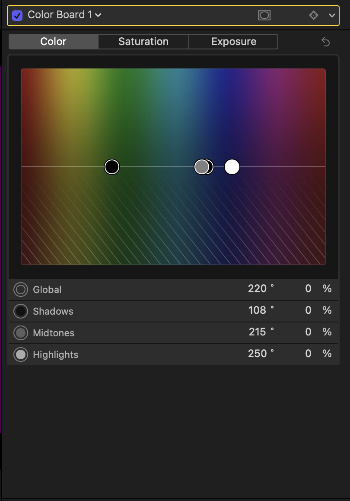

  - `Color Curves`

    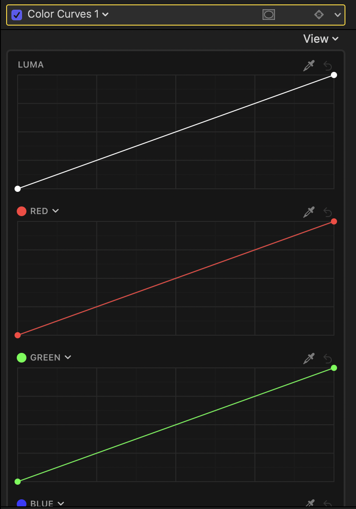

  - `Color Wheels`

    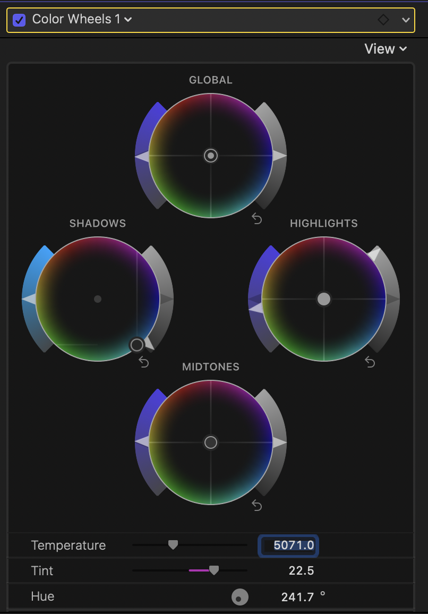

  - `Hue/Saturation Curves`

    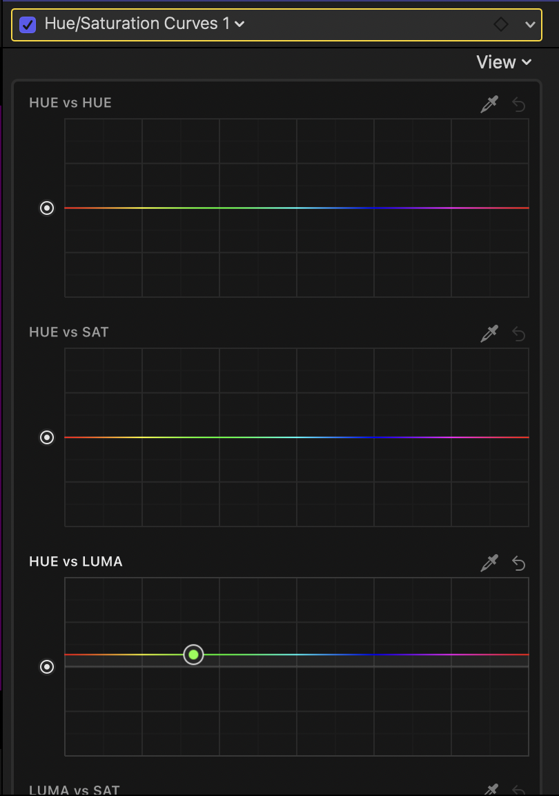

- 단축키의 경우, 사용자마다 다르게 설정할 수 있는 듯 하며 이를 파일화 할 수도 있는 것 같습니다.
- 이러한 단축키 설정 값을 `Commands`라고 합니다.

  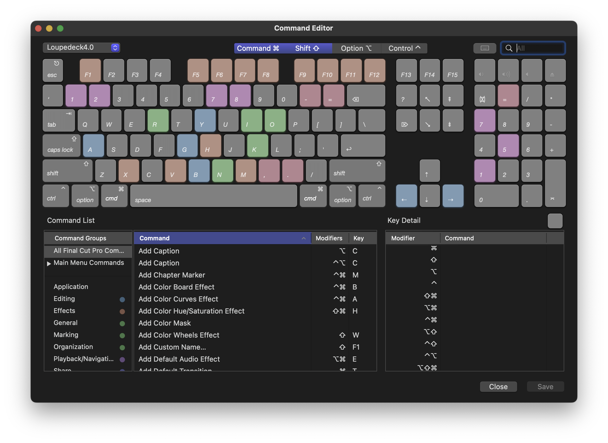

#### 고려 사항

---

## `Final Cut Pro` 경쟁사 조사 ✅

#### 작업 상세 설명

- `Final Cut Pro` 본격 지원에 앞서 경쟁사 `L`사의 기능을 분석하였습니다.
- `L`사는 대체로 단축키를 강력하게 지원하고 있으며, 수치 조작의 경우 `Camera Raw`를 조작하는 것과 마찬가지로 직접 `TextField`에 접근하여 값을 조작하는 듯 합니다.
- 따로 스크립트나 플러그인은 사용하지 않는 것으로 확인되었습니다.
- 지원하는 단축키 기능에 비하여 다이얼의 기능은 빈약한 듯 합니다.

  - 다이얼 지원 기능

    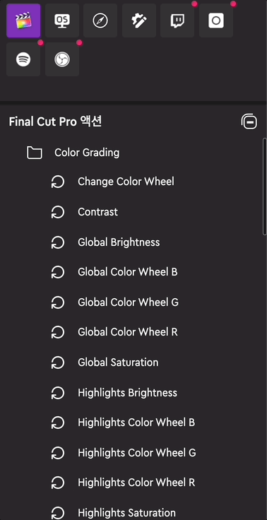

    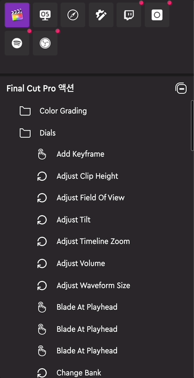

  - 버튼 지원 기능

    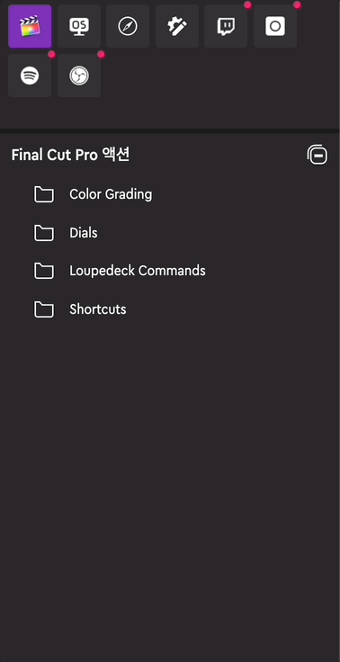

- `L`사 만의 커스터마이징 `Commands`를 자동으로 로드해둔 것을 확인하였습니다.

  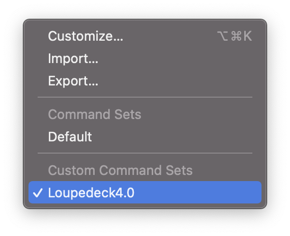

- 또한 다이얼 기능의 경우 수치 조작 패널 종류가 `Color Board`, `Color Curves`, `Color_Wheels`, `Hue/Saturation Curves` 등이 있는 것으로 확인되었는데, 그 중 `Color_Wheels`만 제대로 지원하고 있습니다.

#### 고려 사항

- `L`사의 기능을 따라 구현하는 것은 커스터마이징 `Commands`를 제외하면 오래 걸리지 않을 것 같습니다.

---

## `macOS`에서 `Adobe Camera Raw` 전체 호환 ✅

#### 작업 상세 설명

- `macOS`에서 `Adobe Camera Raw`의 전체 호환 작업을 마무리하였습니다.
- `Adobe Photoshop`에서 실행하는 `Camera Raw` 필터 뿐만 아니라 `Adobe Bridge`에서 실행하는 `Camera Raw` 필터도 사용 가능합니다.

  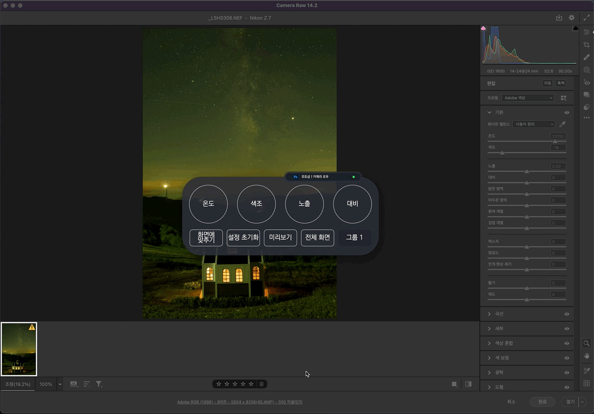

- 만약 `Adobe Photoshop`의 `Camera Raw`와 `Adobe Bridge`의 `Camera Raw`가 동시에 켜져 있을 때는 다음과 같이 동작합니다.

  1. 동시에 켜진 상태에서 기능을 처음 실행 - `Adobe Photoshop`에서 동작.
  2. `Adobe Photoshop`에서 기능 1회 이상 실행 후, `Adobe Bridge`가 켜고 기능을 실행 - `Adobe Photoshop`에서 동작.
  3. `Adobe Bridge`에서 기능 1회 이상 실행 후, `Adobe Photoshop`가 켜고 기능을 실행 - `Adobe Bridge`에서 동작.

  - 일반적으로 `Adobe Photoshop`이 우선 순위가 높다고 생각하시면 편할 듯 합니다.

- 또한, 실행 중인 `Camera Raw`가 꺼지면 나머지 `Camera Raw`에서 기능이 실행됩니다.

  

#### 고려 사항

- 현재 `Adobe Bridge`에서 정상적으로 작동하려면 프로그램 자동 전환 기능을 `off` 한 후 사용하여야 합니다.
- `Camera Raw`를 또 다른 지원 프로그램으로 묶어서 관리할 지 고민입니다.

---

## `Windows` 한글 입력 시 종료되는 버그 조사 ✅

#### 작업 상세 설명

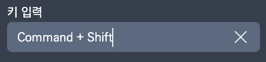

- 단축키를 입력하는 텍스트 필드에서, `Windows`의 경우 현재 키보드 입력 언어 상태가 "한글"일 경우, 짧은 시간 내에 자주 입력하게 되면 `INVAIZ Studio`가 비정상적으로 종료되는 버그가 발생하고 있습니다.
- 소프트웨어 충돌 이벤트, 에러 처리 로직 등을 작성하여도 종료되는 버그를 잡아낼 수 없는 현상입니다.
- 한글 입력의 경우, 영어와는 다르게 조합 글자이므로 컴퓨터가 유의미한 조합이 완성될 때, 한 단어가 끝날 때(포커스가 풀리거나, `Space` 혹은 `ESC` 등)까지 조합 모드를 유지합니다.
- 이러한 조합 모드를 `JavaScript`에서는 `isComposing` 상태로 알 수 있습니다.
  - `macOS`는 이 상태를 사용하지 않는 반면에, `Windows`는 이 상태를 사용하고 있습니다.
- 일반적인 텍스트 필드에서 한글 모드로 정상적으로 단어를 입력하다보면, `isComposing` 상태가 켜졌다가 꺼지는 행위가 반복되면서 동작해야 하는데, 단축키를 입력하는 텍스트 필드는 단어를 입력하면 입력했던 단어가 나열되는 것이 아니라, 키의 위치에 해당하는 알파벳으로 전환하여 입력되기 때문에, 소프트웨어가 인지하는 입력된 단어와 실제 입력된 단어가 달라 `isComposing` 상태를 끄지 못하면서 생기는 버그로 추정되고 있습니다.
  - 예를 들어, 한글 모드로 `ㅇ`을 입력하더라도, 단축키를 입력하는 텍스트 필드에서는 `ㅇ`이 입력되지 않고 `d`이 입력됩니다.
  - 소프트웨어는 `ㅇ`이 입력되었을 거라 알고 있기 때문에 `isComposing` 상태를 `true`(조합되어야 하는 상태) 보고 다음 입력을 조합하기 위한 준비를 합니다.
  - 하지만 실제로 입력된 `d`에는 다음 문자로 모음을 입력하더라도 실제로 한글로의 조합이 되지 않으므로 `isComposing` 상태를 계속해서 `true` 유지하면서 버그가 발생합니다.
  - 아무래도 `isComposing`을 추적하는 스택같은 것이 있어 그 스택이 초과해버리는 것이 아닐까 추측하고 있습니다.
  - 실제로 조합이 종료되었을 때 나타나는 이벤트인 `compositionend` 이벤트가 절대로 발생하지 않고 있는 것을 확인하였습니다.
- 이에 `JavaScript`에서 `isComposing`을 강제로 `false`로 만들어 버리는 방법, `compositionstart`와 `compositionupdate`, `compositionend` 이벤트를 조작하는 방법 등 다양한 방법을 시도해보았으나, 성과는 미미합니다.
- 이에 가상의 텍스트 필드를 생성하고, 가상 텍스트 필드는 `invisible` 상태로 만든 뒤에 실제 텍스트 필드에 포커싱할 경우, 가상 텍스트 필드로 포커싱되게 하고, 가상 텍스트 필드의 `keydown` 이벤트 값을 통해 실제 텍스트 필드로 반영하는 방법을 사용하였습니다.
  - 이렇게 하면 가상 텍스트 필드에서는 정상적으로 타이핑이 되므로 `isComposing` 문제가 해결됩니다.
    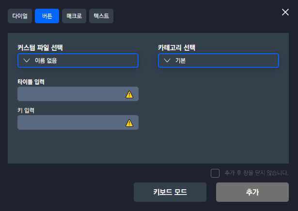
  - 하지만, 가상 텍스트 필드에 포커싱이 된 상태이기 때문에, 일반적인 텍스트 필드의 깜빡이는 커서 효과가 실제 텍스트에는 나타나지 않게 된다는 단점이 있습니다.
  - 따라서 가상 텍스트 필드에 포커싱이 되면, 실제 텍스트 필드에 테두리를 표시하는 방법을 사용하였습니다.
    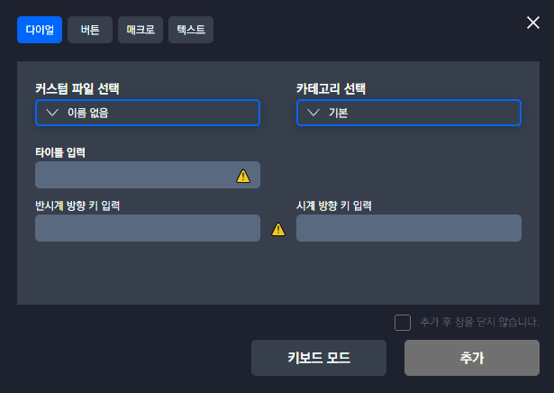

#### 고려 사항

- 단축키를 입력하는 텍스트 필드에 포커싱될 때마다 영어로 전환하는 방법도 찾고 있으나, 아직 `Windows`와 `macOS`에서 한/영 키를 조작하거나 상태를 관리하는 소스(`IME-Mode`)를 제대로 찾지 못하였습니다.

---

## `Windows`에서 `Typing` 기능 `HUX8` 입력 버그 조사 ✅

#### 작업 상세 설명

- `Windows`에서는 텍스트 입력 기능에 한글을 매핑하게될 경우, 어떠한 텍스트든 `HUX8`이 입력되는 현상이 있습니다.
- 해당 현상은 현재 입력을 담당하는 `robotjs` 모듈에서 `UTF-8`의 인코딩을 지원해주지 않아서 생기는 문제로 보입니다.
- 소스 코드를 분석한 결과, `UTF-8`의 한글 인코딩을 `node-gyp`를 통해 만들어진 네이티브 모듈에서 해석할 수 없는 상태를 확인하였습니다.

  - 네이티브 모듈에서 받는 문자 데이터 출력 결과

    ```shell
    $ node index.js
    안녕하세요:
    ?덈뀞?섏꽭?
    H50504 U45397 X54616 849464 ?0836


    반갑습니다:
    諛섍컩?듬땲?
    48152 44049 ?9845 ?5768 ?5796
    ```

  - 결과 값에 해당하는 유니코드

    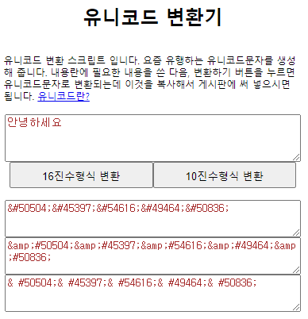

  - 10진수 형식으로 변환하여 확인해보니, 마지막 부분과 같이 근소한 차이가 발생하는 것으로 확인되었습니다.
  - `UTF-8`을 올바로 받아들이는 방법을 여러가지 적용해보았으나, 모두 정상적으로 동작하지 않았습니다.
  - 조사해보니 해당 인코딩을 수정하여 `C++`에서 `UTF-8`의 인코딩을 사용하더라도 현재 사용하고 있는 입력 메서드인 `SendInput`이 문자열을 입력하는 것이 아니라, 강제 입력 방식처럼 실제로 해당 키를 연속해서 입력하는 방식이기 때문에 해결되지 않는 것으로 확인되었습니다.
  - 연속해서 입력하는 방식이기 때문에, 입력할 자판에 해당하는 영문 타자를 매핑 후, 현재 타이핑 언어 설정을 한글인 상태로 실행하게 되면 정상적으로 한글 타이핑이 됩니다.
    - `Ex) dkssudgktpdy -> 안녕하세요`

#### 고려 사항

- 다양한 방법을 시도해본 후 안정적인 해결책을 찾아내야할 것 같습니다.

---

## `Grid Pro` 환경 세팅 ✅

#### 작업 상세 설명

- `Grid Pro`를 지원하기 위해 `INVAIZ Studio`에서 다시 `Grid Pro` 모델을 추가하고, 데이터를 추가할 수 있도록 버그가 있는 소스를 수정하였습니다.

  

  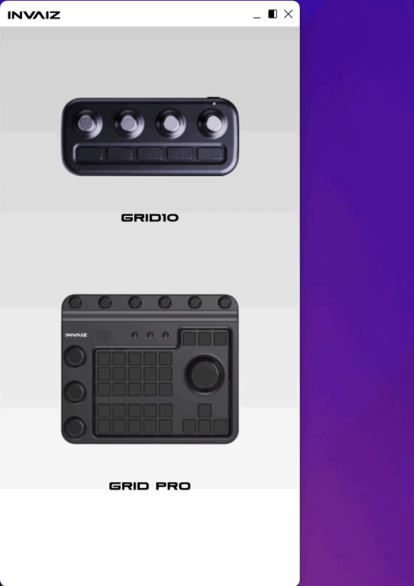

  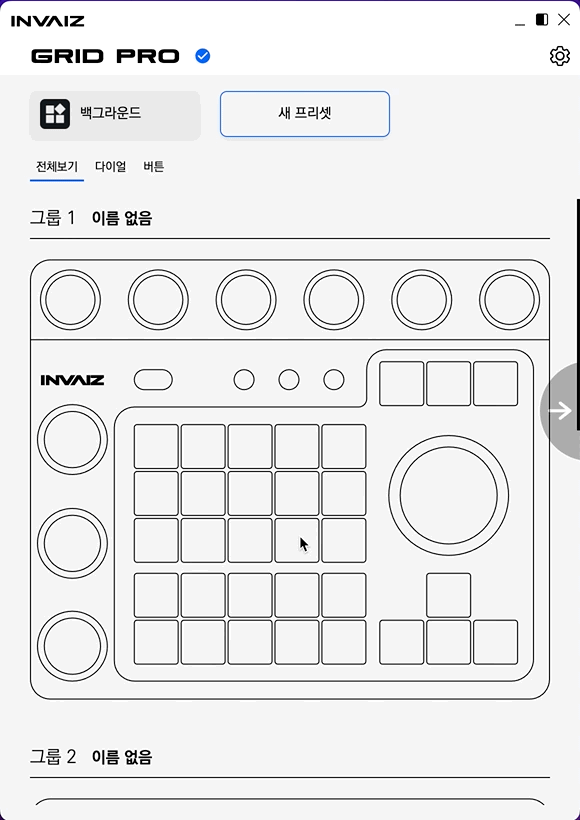

- `Tray` 및 메뉴에서 상태를 설정할 수 있는 기능을 `Grid Pro` 모델도 추가하였습니다.

  

- 또한, `Grid Pro`에서 간단한 기능 매핑을 미리 구현하였습니다.

  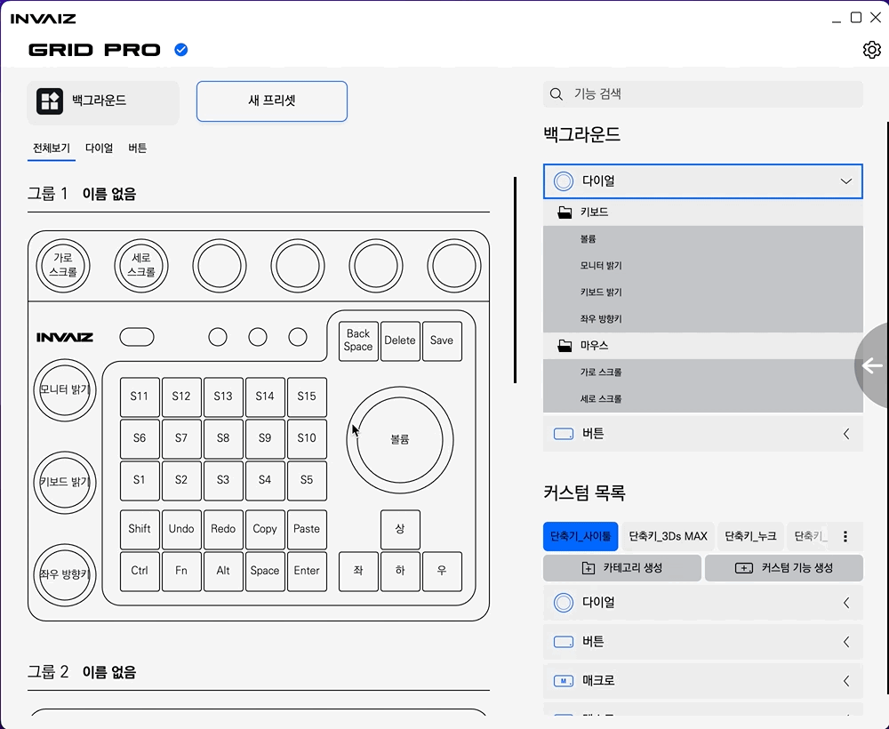

- 향후 추가될 `Grid Pro` 오버레이는, 기존 오버레이와 독립된 창으로 생성할 계획이며, 이에 `Grid Pro`를 동작하더라도 기존 오버레이는 발생하지 않습니다.

#### 고려 사항

- `Drag & Drop` 요소를 새로 그려야하는데 기존 `Grid10`과 중복되지 않을 것 같은 소스 코드가 많아 매핑 기능에 시간이 어느정도 쓰일 것으로 예상됩니다.

---

## 디테일 수정 ✅

#### 작업 상세 설명

- 기능 설정 창에서 커스텀 파일 리스트를 열면, 리스트 아래 있어야 할 요소인 알림 표시가 리스트 위로 출력되는 버그를 수정하였습니다.

  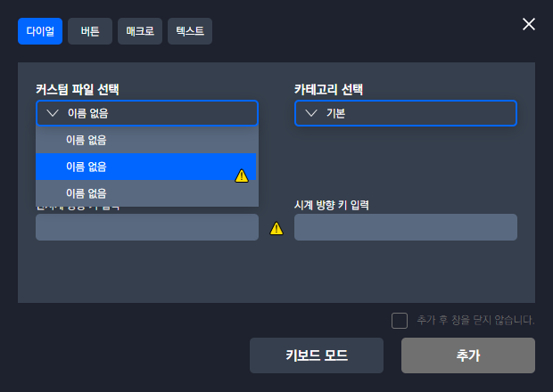

  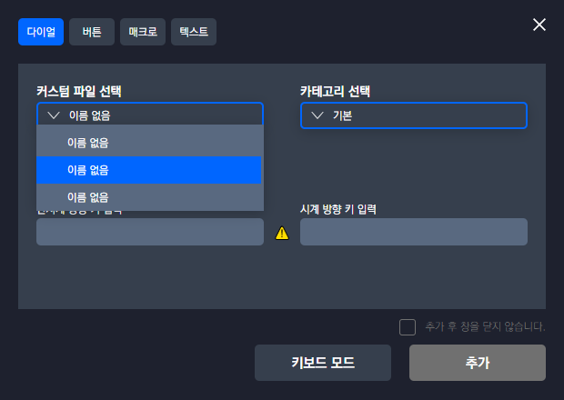

#### 고려 사항

---

## 전달 사항

### 이번 주 추가 리스트

- `Grid Pro` 지원

### 이번 주 구현 리스트

- `macOS`에서 `Camera Raw` `Bridge`, `ACR` 실행 환경 구분

### 현재 구현이 필요한 기능

- 자동 업데이트 환경 구성
- 목록 휴지통 기능 구현 - Design 설계 중.
- `Func` 형식에 `id` 추가
- `Func` 형식에서 `sendCepScript`의 경우 `fcode`에 `id` 값 매핑 후 실행
- 매크로 여러 개 클릭하여 한 번에 복사 / 붙여넣기
- 모든 데이터 구조 `id` 형식 변경 `number` -> `string`
- `macOS`에서 설치 시 `CEP` 프로그램 종료 시키기
- `Windows` 한글로 키 입력 시 종료되는 버그
- 오버레이 회전 기능 구현
- 커스텀 기능 목록에서 `Drag & Drop` 기능 구현
- 그룹 버튼으로 프리셋 변경 모드 설정 기능 추가
- `Final Cut Pro` 지원
- `Tooltip` 스타일 적용
- 프로그램 추가 후 제거 시 다시 추가할 수 없는 버그
- `Grid Pro` 지원
