# 2022/04 1주차 주간 리포트

## 주간 작업 목록

---

- [`INVAIZ Studio v2` 개발 환경 업데이트 ✅](#invaiz-studio-v2-개발-환경-업데이트-)
- [`Grid Pro` 사전 작업 ✅](#grid-pro-사전-작업-)
- [`Final Cut Pro` 동작 코드 작성 ✅](#final-cut-pro-동작-코드-작성-)
- [`INVAIZ Studio` 파일 불러오기, 저장 시 유효성 검사 ✅](#invaiz-studio-파일-불러오기-저장-시-유효성-검사-)
- [`Windows`에서 `Typing` 기능 `HUX8` 입력 버그 수정 ✅](#windows에서-typing-기능-hux8-입력-버그-수정-)
- [디테일 수정 ✅](#디테일-수정-)

---

## `INVAIZ Studio v2` 개발 환경 업데이트 ✅

#### 작업 상세 설명

- 패키지 파일을 빌드할 때, `Code Sign`을 포함하면 시간이 오래 소요되므로 `Code Sign` 하지 않는 테스트용 패키지 파일을 빌드할 수 있도록 구조 및 스크립트를 수정하였습니다.
  - 따라서 `Code Sign` 파일이 없더라도 개발 환경만 구성되어 있다면 임시로 패키지 파일을 빌드할 수 있습니다.
- `Main Process`에서 파일이 변경되면, 프로젝트를 재실행해야 하므로 번거로움과 시간 소모가 부당되었는데, `Main Process`의 파일 변경을 감지하여 자동으로 프로젝트를 재실행해주는 환경을 구성하였습니다.
- 개발 모드를 사용하기 위해서 기존에는 여러가지 명령어들을 동시에 실행해야 했었지만, 이를 하나의 명령어로 통합할 수 있도록 스크립트 구조를 재정의하였습니다.

#### 고려 사항

---

## `Grid Pro` 사전 작업 ✅

#### 작업 상세 설명

- 본격적인 `Grid Pro` 개발에 앞서서, `Grid10`과 오버레이를 분리하여 관리하기 위해 기존 소스로부터 `Grid10` 오버레이, `Grid Pro`를 추출하였습니다.
- `Grid Pro` 오버레이도 대체로 `Grid10`과 같은 설정 값을 가지지만, 오버레이 회전 기능은 필요없을 것으로 판단되어 고려하지 않았습니다.
- 옵션 창에서도 기본 "메인 오버레이"라는 탭 이름을 사용하지 않고 "`Grid10` 오버레이", "`Grid Pro` 오버레이"로 탭을 분리하였습니다.
  
- `HID` 방식이 최초로 도입된 `Grid Pro`는 현재 가속도 값이 적용되지 않고 모든 회전 값에 대해 `1`, `-1`로 입력됩니다.

  - 때문에 가속도가 적용되지 않아 한 바퀴 돌릴 경우 너무 많은 값이 좁은 폭으로 입력되는 문제가 발생합니다.

    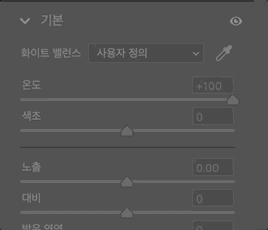

  - 이에 특정 시간(현재 약 `20ms`) 동안 들어오는 값들을 합산하여 한 번에 적용하는 임의 가속도 값 소스 코드를 작성하였습니다.

    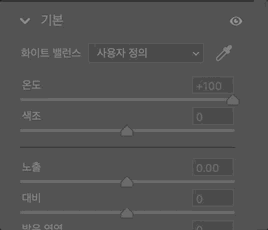

#### 고려 사항

- 오버레이는 동시에 뜰 수도 있기 때문에, 같은 위치에 오버레이를 띄울 경우 겹쳐 보일 수 있습니다.
- 현재 가속도 값 문제 뿐만 아니라, 굉장히 빨리 회전시켰을 때 값이 튀는 현상이 심각하게 발생합니다.

---

## `Final Cut Pro` 동작 코드 작성 ✅

#### 작업 상세 설명

#### 고려 사항

---

## `INVAIZ Studio` 파일 불러오기, 저장 시 유효성 검사 ✅

#### 작업 상세 설명

- 기존에는 버전 업데이트 등의 이유로 데이터 형식이 변경되더라도, 이전 버전 사용자가 새로운 버전을 사용할 때 이전 형식 그대로 새로운 버전에서 사용하게 되어 형식이 맞지 않는 버그가 발생하였습니다.
- 때문에 기존에 이러한 버그를 미리 인지하여 하나하나 예외 코드를 작성해주면서 호환성을 갖추어야만 했는데, 이는 다양한 버전을 호환할 수 없는 방식으로 판단되었습니다.
  - 원인은 엄격하게 타입 체크를 하지 않았기 때문입니다.
  - 기존의 방식은 심각한 오류를 초래할 가능성이 높고, 버그를 사전에 발견하기 어려웠던 부분이 있습니다.
  - `Ex) 기본 제공 프로그램, 프리셋의 데이터가 유효하지 않아도 빌드가 되고 실행이 됨.`
- 대표적인 예시로 언어 팩이 추가됐을 때 기존 사용자들의 파일에는 새로 추가된 언어 팩의 데이터가 존재하지 않기 때문에 해당 언어로는 아무 것도 볼 수가 없으며, 수정하려고 하면 치명적인 오류가 뜨게 됩니다.

  - 언어 팩 추가 후 커스텀 파일, 프리셋의 데이터 상태
    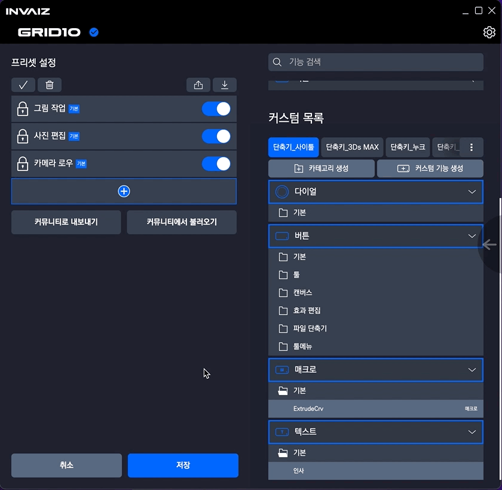
  - 언어 팩 추가 후 프리셋에서 새로운 언어 팩으로 데이터 변경을 시도했을 때 발생하는 버그
    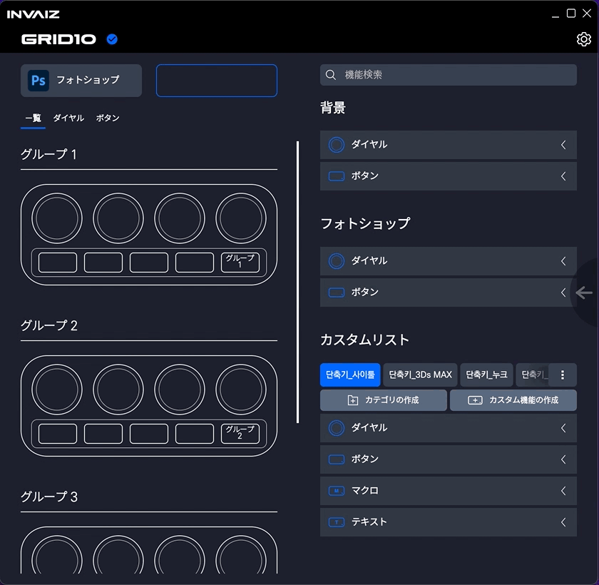

- 이에 타입을 사용하는 거의 대부분의 소스 코드에 엄격한 타입 체크, 타입 가드를 작성하여 비정상적인 데이터를 감지했을 때 그에 따른 처리를 할 수 있는 로직을 추가하였습니다.

  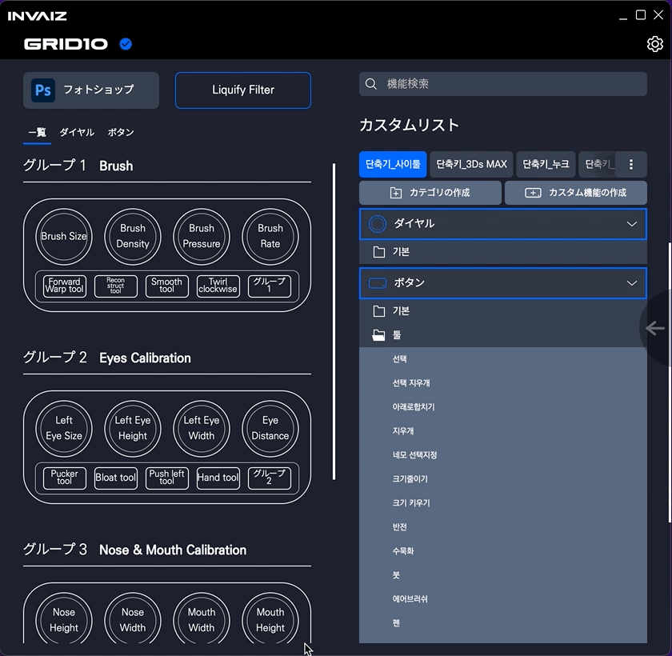

  - 이전 버전의 프리셋, 커스텀 파일을 로드해도 언어 팩은 영어 기준으로 잘 보이는 것을 확인할 수 있습니다.

#### 고려 사항

- 파일을 읽어오거나 내보내기 하는 등에서 타입 검사는, 버전이 다를 때마다 각각 처리를 모두 작성해줘야 하기 때문에 버그가 발생할 가능성이 존재합니다.

---

## `Windows`에서 `Typing` 기능 `HUX8` 입력 버그 수정 ✅

#### 작업 상세 설명

- `Windows`에서 텍스트 입력 기능에 한글을 매핑하게될 경우, `HUX8`과 같은 비정상적인 텍스트가 입력이 되는 버그를 수정하였습니다.

  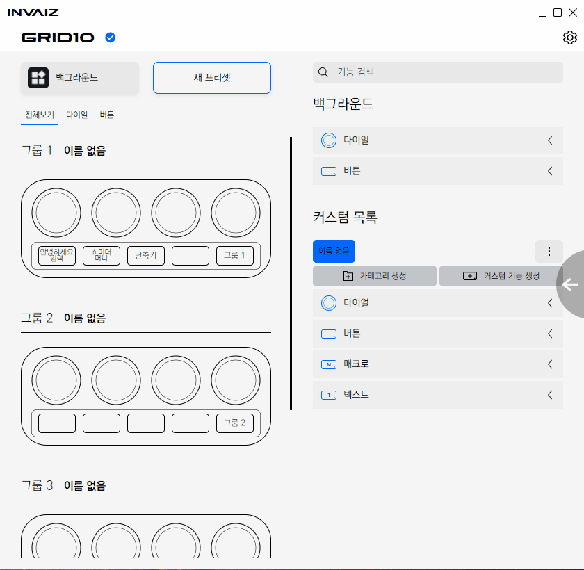

- `Win32 API`에 유니코드로 `SendInput`을 보내는 방법을 활용하였습니다.
- 기존의 문자열에 해당하는 단축키(영어에서만 사용 가능)를 순서대로 나열하여 작성하는 방법과 다르게, 입력되는 속도도 굉장히 빠르며, 소프트웨어이 단축키 기능 또한 실행하지 않습니다.
  - `Ex) Ctrl을 누른 채로 c를 타이핑하더라도 복사가 되지 않음.`

#### 고려 사항

- `Windows`에서는 현재 활성화된 `IME-Mode`(한글/영어)를 감지할 수 있을 것으로 보이는 `API`를 발견하여 이것까지 적용하면 타이핑, 단축키와 관련된 이슈는 거의 해결됐다고 볼 수 있게 됩니다.

---

## 디테일 수정 ✅

#### 작업 상세 설명

- 빠른 단축키 입력 표시 버그 수정

  - 한글 입력 시 종료되는 버그를 수정하면서, 실제 텍스트 필드의 값을 `defaultValue`로 입력하였는데, 이 방식을 사용하니 특정 상황에서 실제 텍스트 필드의 값이 갱신되지 않는 현상이 발생하였습니다.

    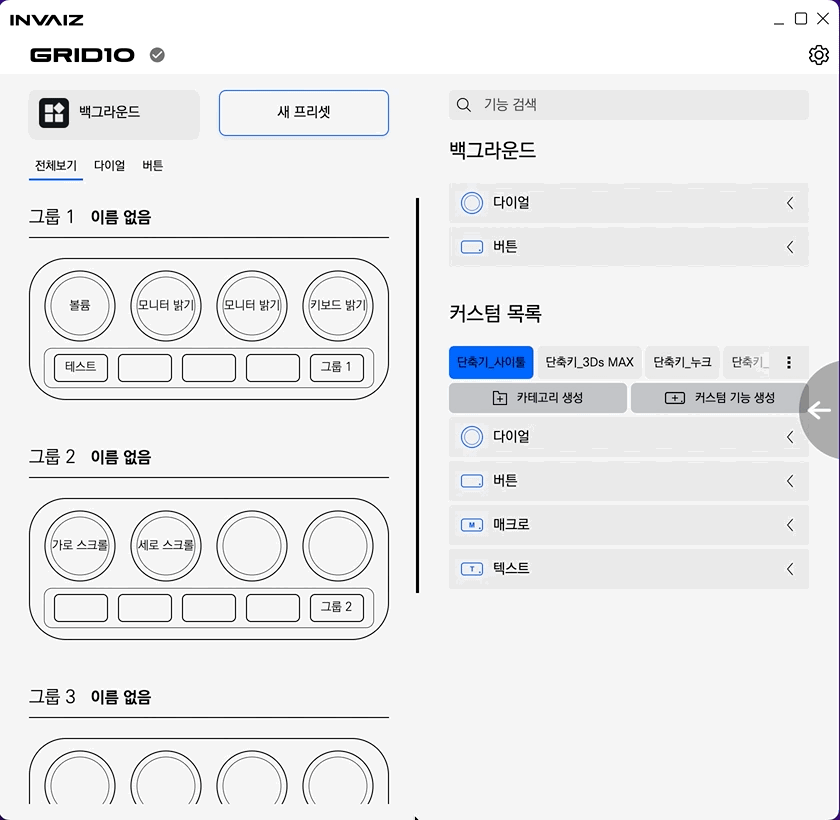

  - 호버 했을 때만 입력한 값을 확인할 수 있는 상태입니다.

    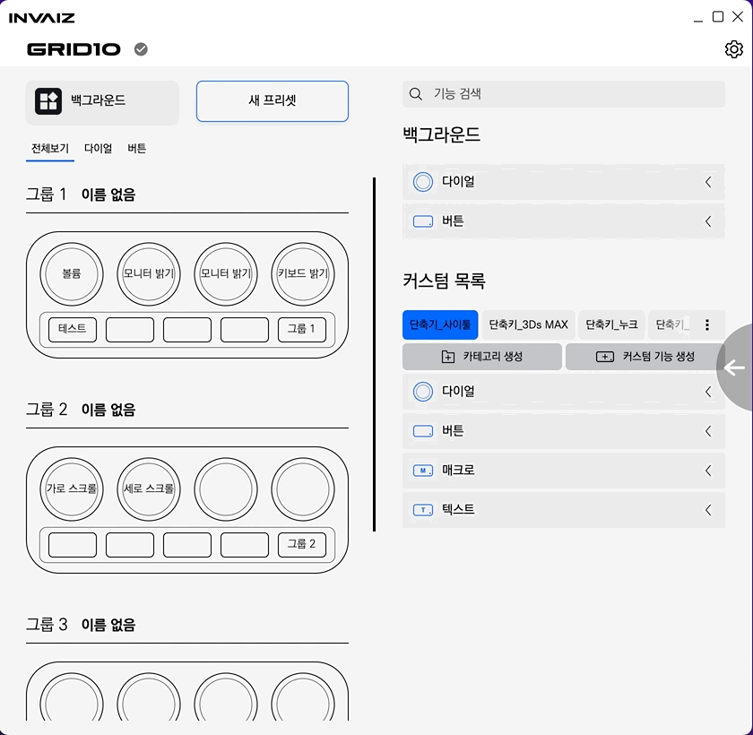

  - 해당 버그를 수정하였습니다.

- 기능 설정 창 상태 유지 버그 수정

  - 기능 설정 창을 수정 모드로 연 뒤에, 셋팅 창이 아닌 트레이 메뉴로 기능 설정 창을 열게 되면, 이전의 수정하는 기능의 상태가 유지되는 버그를 수정하였습니다.

    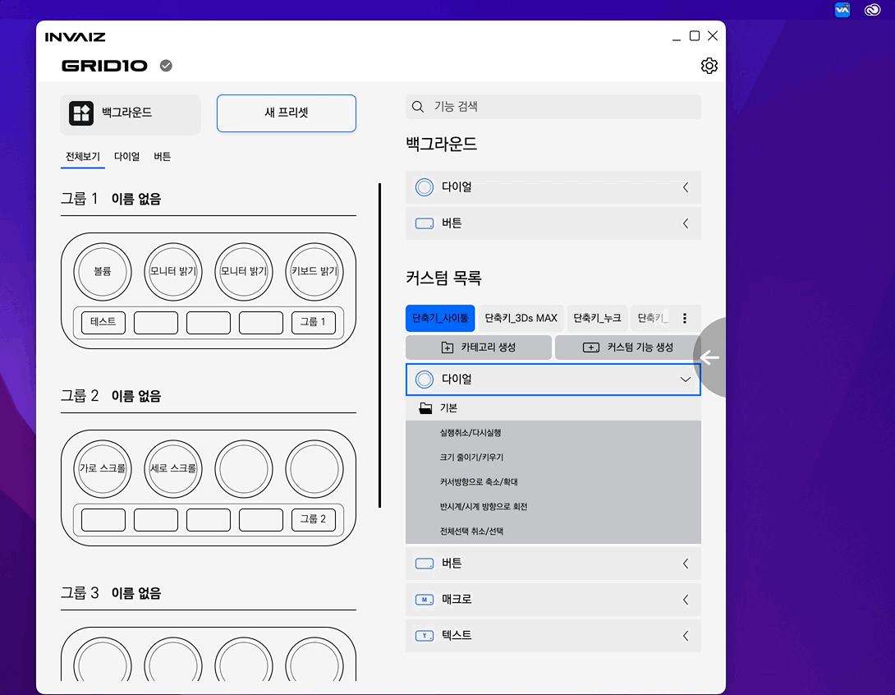

    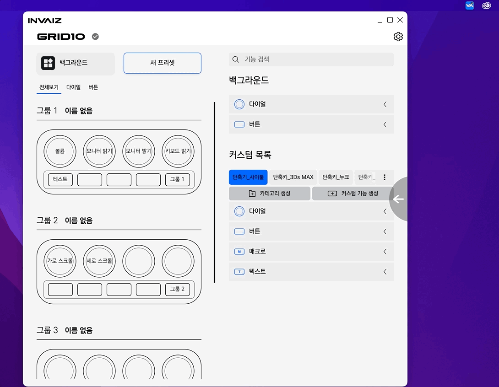

- 기능 설정 창 선택 리스트 디테일 수정

  - 기능 설정 창 리스트 알림 표시 버그를 수정하면서 하위 리스트가 상위 버튼보다 위에서 표시되는 현상이 발생하여 이를 수정하였습니다.

    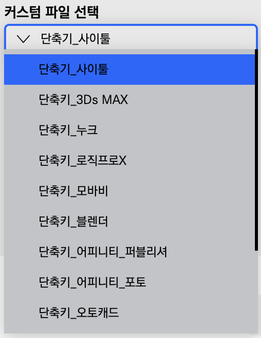

    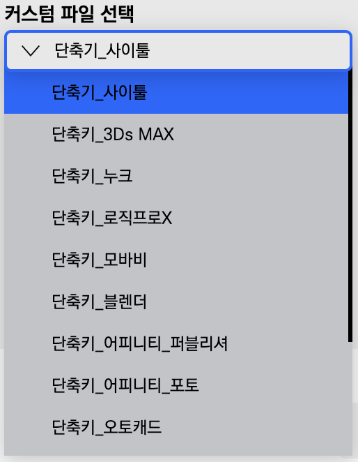

- 기능 설정 창 카테고리 기본 값 버그 수정

  - 기능 설정 창 카테고리에서 초기 선택 `id`를 `1`로 설정 했을 때 아무 것도 선택되지 않는 버그가 발생합니다.

    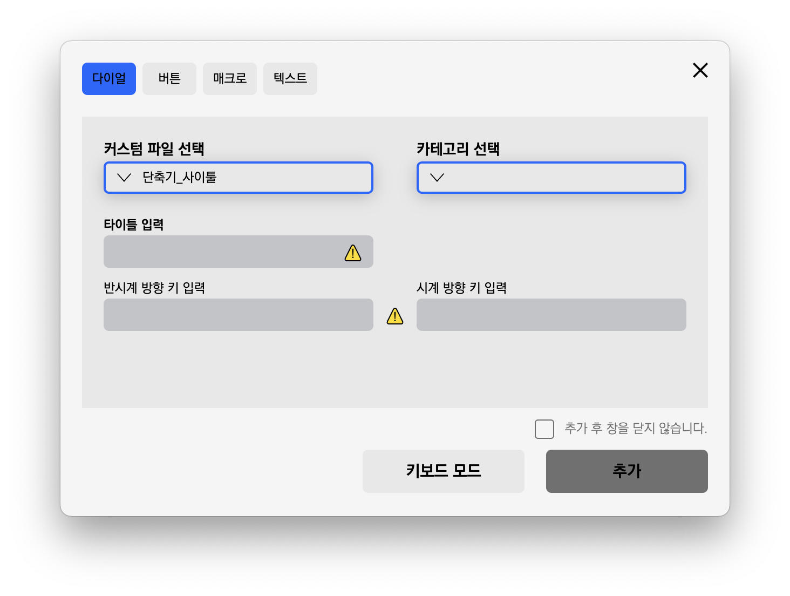

  - 일반적으로는 카테고리의 기본 `id` 값이 `1`인데 특수한 경우 `1`이 아닐 수 있으므로 이를 현재 선택할 수 있는 카테고리 중 첫 번째 카테고리로 선택하도록 변경하였습니다.

    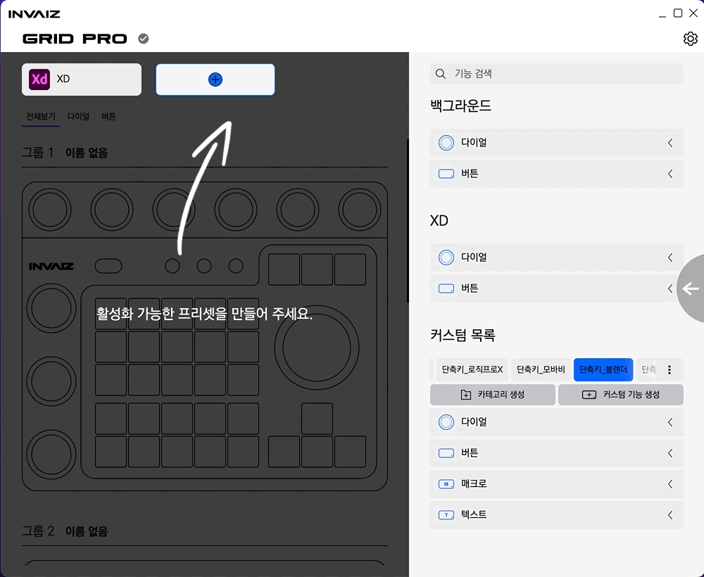

- 커스텀 목록 디자인 디테일 수정

  - 커스텀 목록에서 끝 부분이 튀어나와 보이는 현상이 발견되어 이를 수정하였습니다.

    

    

- 페이지 이동 시 발생하는 경고 및 오류 제거

  - 개발 모드로 실행할 때, 각 창에서 페이지 이동을 할 때마다 발생하는 경고 및 오류를 삭제하였습니다.

    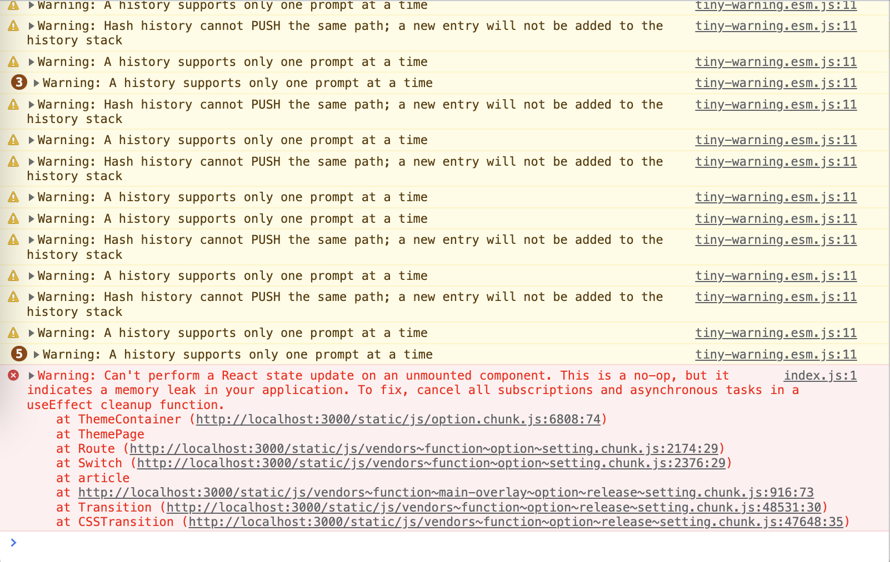

  - 실제 소프트웨어에 큰 문제를 일으키는 요소는 아니지만 혹시 모를 문제를 방지하기 위해 미리 제거해 두었습니다.

    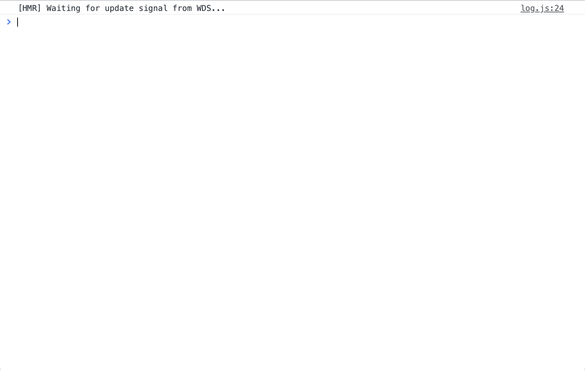

- `Grid Pro`의 `close` 문제로 인한 소프트웨어 정상 종료 안되는 버그 수정

  - `Grid Pro`는 `HID` 통신을 사용하는데, 해당 제품이 연결되어 있는 상태에서 소프트웨어를 종료하면 통신 포트가 끊겨있지 않아 소프트웨어아 멈추는 현상이 발생하였습니다.
  - 해당 현상은 `Grid Pro`의 연결을 직접 끊고나면 해결되지만, 매번 소프트웨어를 끌 때마다 `Grid Pro`를 종료해주는 것은 번거롭다고 판단. 소프트웨어 종료 이벤트 발생 시 직접 `close` 이벤트를 발생시켜 수정하였습니다.

#### 고려 사항

---

## 전달 사항

### 이번 주 추가 리스트

### 이번 주 구현 리스트

### 현재 구현이 필요한 기능

- 자동 업데이트 환경 구성
- 목록 휴지통 기능 구현 - Design 설계 중.
- `Func` 형식에 `id` 추가
- `Func` 형식에서 `sendCepScript`의 경우 `fcode`에 `id` 값 매핑 후 실행
- 매크로 여러 개 클릭하여 한 번에 복사 / 붙여넣기
- 모든 데이터 구조 `id` 형식 변경 `number` -> `string`
- `macOS`에서 설치 시 `CEP` 프로그램 종료 시키기
- `Windows` 한글로 키 입력 시 종료되는 버그
- 오버레이 회전 기능 구현
- 커스텀 기능 목록에서 `Drag & Drop` 기능 구현
- 그룹 버튼으로 프리셋 변경 모드 설정 기능 추가
- `Final Cut Pro` 지원
- `Tooltip` 스타일 적용
- 프로그램 추가 후 제거 시 다시 추가할 수 없는 버그
- `Grid Pro` 지원
