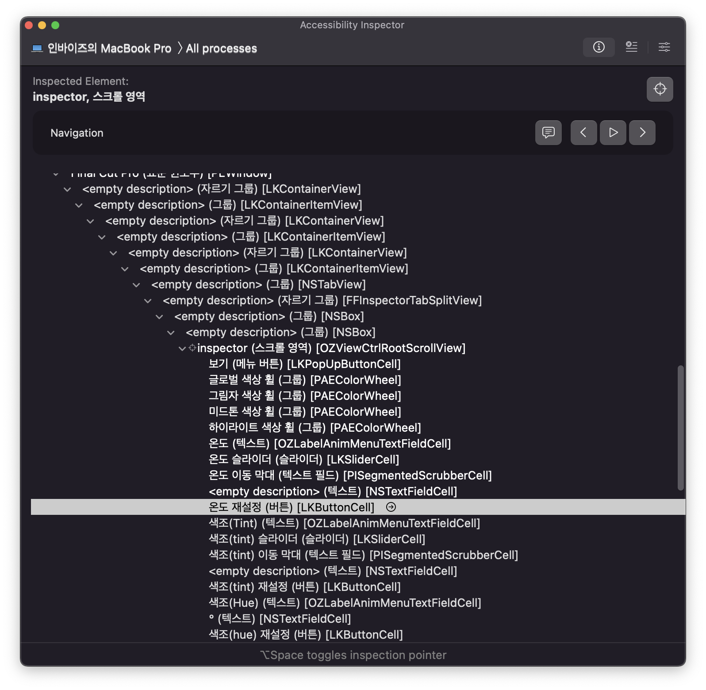
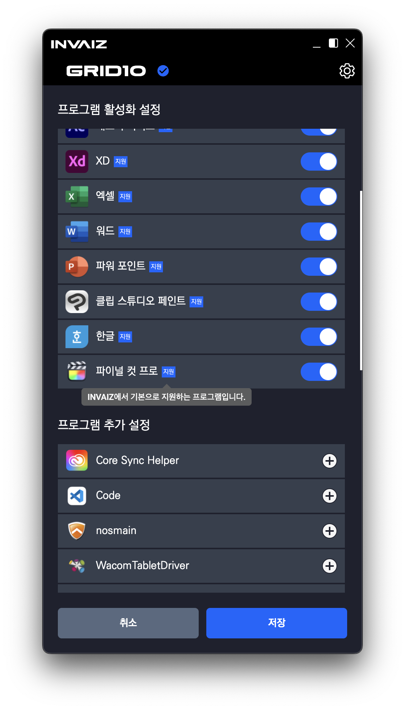
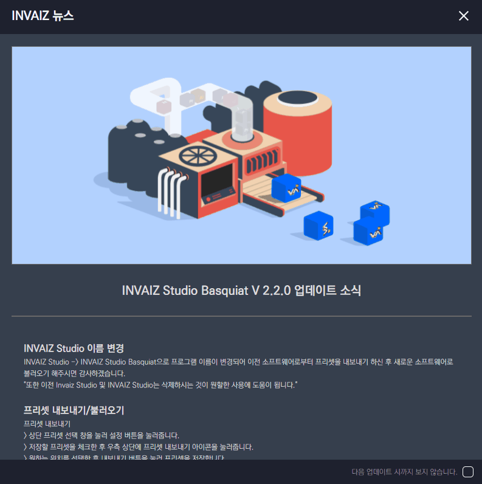

# 2022/04 2주차 주간 리포트

## 주간 작업 목록

---

- [`Final Cut Pro` 동작 코드 작성 ✅](#final-cut-pro-동작-코드-작성-)
- [`INVAIZ Studio` 뉴스 창 생성 ✅](#invaiz-studio-뉴스-창-생성-)

---

## `Final Cut Pro` 동작 코드 작성 ✅

#### 작업 상세 설명

- `Final Cut Pro`의 수치 조작 패널 값을 임시로 조작하는 동작 코드를 작성하였습니다.
- `Adobe Camera Raw`와는 다르게 `Final Cut Pro`의 창 인터페이스 구조는 단계가 깊어 조작하는 패널을 찾아내는 부분이 난해했습니다.
  
- 또한, 해당 구조에서 단계별로 어떠한 요소를 가져와야할 지 식별할 이름에 대한 정보가 없는데, `Final Cut Pro`가 실행될 때마다 이에 해당하는 순서가 무작위로 변경되어 더욱 난해한 상황입니다.
  - 쉽게 말해, 껏다 켤 때마다 요소의 위치를 찾을 수 없게 됩니다.
- 이에 직접 `Final Cut Pro`를 켠 상태에서 코드를 작성하여 동작'만' 하도록 구현하였습니다.
  
- 기본 제공 프로그램에 `Final Cut Pro`을 추가하고, 임시 프리셋을 생성하여 테스트하였습니다.
  

#### 고려 사항

- 요소를 안정적으로 찾는 부분에 시간이 많이 투자될 것 같습니다.
- 기능 조작을 1순위로 작업하고, 어떠한 기능을 추가할 지를 고려하여 정식 배포해야할 것 같은데, 적절한 기능을 찾는 것도 난관이 예상됩니다.

---

## `INVAIZ Studio` 뉴스 창 생성 ✅

#### 작업 상세 설명

- 업데이트 시 사용자에게 더욱 직관적으로 정보를 알릴 수 있는 뉴스 창을 추가하였습니다.

  

- 뉴스 창에서는 업데이트 이후 크게 전달할 공지사항을 게시할 수 있으며, 각 업데이트의 핵심 내용을 포함해도 무방합니다.
- 기본적으로 `INVAIZ Studio Basquiat` 실행 시에 창이 켜지며, 아래의 "다음 업데이트 시까지 보지 않습니다." 체크박스를 활성화한 후 창을 종료하면, 다음 업데이트 시까지 창이 뜨지 않습니다.
- 이렇게 뉴스를 전달하면, 노가다를 통해 각 문장을 번역하는 방식으로 번역을 지원하기에 용이합니다.
- 혹여나 창을 종료했는데 다시 보고싶은 경우가 있을 수도 있어, 트레이 메뉴에도 뉴스 탭을 추가하였습니다.

#### 고려 사항

- 현재 체크박스 활성화 후 창을 종료하기 위해 상단까지 마우스를 이동하는 UX가 불편한 것 같습니다.

---

## 전달 사항

### 이번 주 추가 리스트

### 이번 주 구현 리스트

### 현재 구현이 필요한 기능

- 자동 업데이트 환경 구성
- 목록 휴지통 기능 구현 - Design 설계 중.
- `Func` 형식에 `id` 추가
- `Func` 형식에서 `sendCepScript`의 경우 `fcode`에 `id` 값 매핑 후 실행
- 매크로 여러 개 클릭하여 한 번에 복사 / 붙여넣기
- 모든 데이터 구조 `id` 형식 변경 `number` -> `string`
- `macOS`에서 설치 시 `CEP` 프로그램 종료 시키기
- 오버레이 회전 기능 구현
- 커스텀 기능 목록에서 `Drag & Drop` 기능 구현
- 그룹 버튼으로 프리셋 변경 모드 설정 기능 추가
- `Final Cut Pro` 지원
- `Tooltip` 스타일 적용
- 프로그램 추가 후 제거 시 다시 추가할 수 없는 버그
- `Grid Pro` 지원
