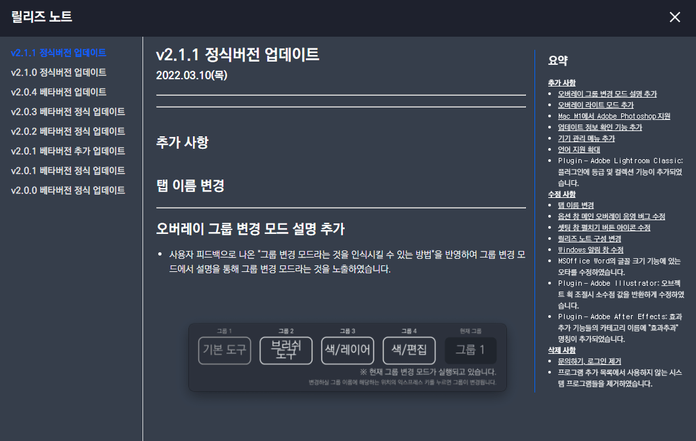
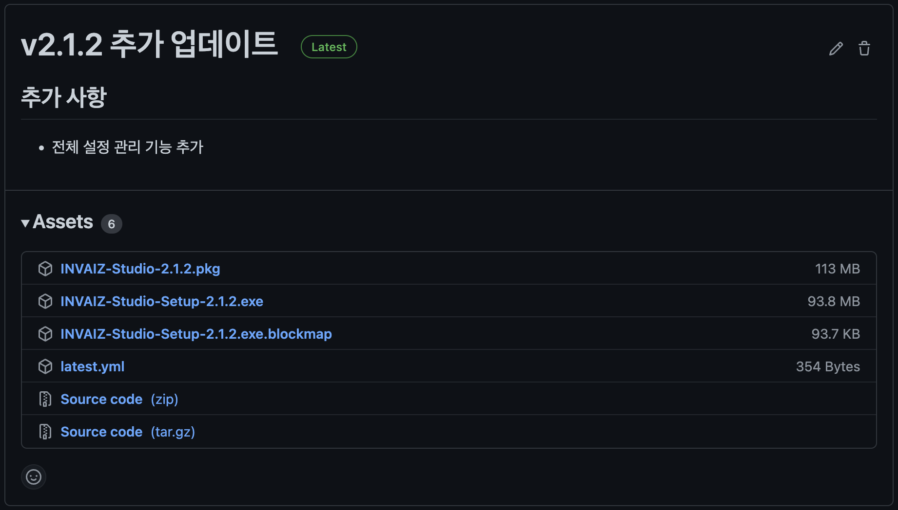

# 2022/04 3주차 주간 리포트

## 주간 작업 목록

---

- [릴리즈 노트 디자인 업데이트 ✅](#릴리즈-노트-디자인-업데이트-)
- [`Final Cut Pro` 동작 코드 업데이트 ✅](#final-cut-pro-동작-코드-업데이트-)
- [`INVAIZ Studio` 전체 설정 내보내기/불러오기 ✅](invaiz-studio-전체-설정-내보내기불러오기-)
- [디테일 수정 ✅](#디테일-수정-)

---

## 릴리즈 노트 디자인 업데이트 ✅

#### 작업 상세 설명

- 기존 릴리즈 노트는 디자인적으로 가독성이 떨어지는 것 같아 디자인을 변경하였습니다.
  
- 좌측에는 릴리즈 노트의 버전이 나열되어 있고, 중간 영역에 내용, 우측 영역에 요약 네비게이션을 배치하였습니다.

#### 고려 사항

- 우측 요약 영역에서, 현재 보고 있는 화면을 강조하는 기능을 개발 중에 있으나 현재 데이터 형식의 한계로 구현이 난해합니다.

---

## `Final Cut Pro` 동작 코드 업데이트 ✅

#### 작업 상세 설명

#### 고려 사항

---

## `INVAIZ Studio` 전체 설정 내보내기/불러오기 ✅

#### 작업 상세 설명

- `INVAIZ Studio`에서 관리하는 모든 설정 값을 불러오거나 내보낼 수 있는 창구를 만들었습니다.
  
- 전체 설정 내보내기 기능을 통해 내보낼 수 있는 설정 값들은 다음과 같습니다.
  - 커스텀 파일 설정
  - 전체 프리셋(워크셋) 설정
  - 테마 설정
  - PC 부팅 시 프로그램 자동 실행 설정
  - 플러그인 통신 설정
  - 언어 설정
  - 오버레이 설정
- 내보내기한 파일은 저장한 경로에 `.invst` 확장자를 가진 파일로 암호화 후 저장합니다.
- 불러오기 시 `.invst` 확장자를 가진 파일을 불러올 수 있으며, 이전에 사용하고 있던 설정 파일에 덮어 씌워지는 것이 아니라, 전부 삭제된 후 새롭게 설정되게 됩니다.

#### 고려 사항

- 덮어쓰기 기능은 현재 버전간 호환 및 `OS` 종속성 문제로 인해 개발이 지연되고 있습니다.

---

## 디테일 수정 ✅

#### 작업 상세 설명

- 자동 업데이트 알림 창 언어팩 설정
  - `Windows`에서 발생하는 자동 업데이트 시의 알림 창 또한 언어 팩이 적용될 수 있도록 설정하였습니다.
    ```json
    {
      "AUTO_UPDATE": {
        "message": {
          "ko": "새로운 업데이트가 발견되었습니다. INVAIZ Studio Basquiat을 업데이트 하시겠습니까?",
          "en": "A new update has been found. Update INVAIZ Studio Basquiat?",
          "ja": "新しいアップデートが見つかりました。 INVAIZスタジオバスキアを更新しますか?"
        },
        "update": {
          "ko": "업데이트",
          "en": "Update",
          "ja": "アップデート"
        },
        "cancel": {
          "ko": "취소",
          "en": "Cancel",
          "ja": "キャンセル"
        }
      }
    }
    ```
  - 위와 같이 번역되어 사용자들에게 맞은 언어팩으로 제공됩니다.
- 프로그램 추가 목록 동적 데이터 관리 수정
  - `INVAIZ Studio`가 켜진 이후에 실행된 프로세스가 포커스 된 후에 `INVAIZ Studio` 프로그램 추가 설정에서 감지되지 않는 버그를 수정하였습니다.
  - 기존 로직의 분기 처리에서 에러가 있는 것으로 확인되었습니다.

---

## 전달 사항



> 2022.04.20(수) `INVAIZ Studio` 2.1.2 버전(추가버전) 런칭.

### 이번 주 추가 리스트

- 커스텀 스크롤 구현
- 릴리즈 노트 디자인 업데이트
- 전체 설정 내보내기/불러오기

### 이번 주 구현 리스트

- 릴리즈 노트 디자인 업데이트
- 전체 설정 내보내기/불러오기

### 현재 구현이 필요한 기능

- 자동 업데이트 환경 구성
- 목록 휴지통 기능 구현 - Design 설계 중.
- `Func` 형식에 `id` 추가
- `Func` 형식에서 `sendCepScript`의 경우 `fcode`에 `id` 값 매핑 후 실행
- 매크로 여러 개 클릭하여 한 번에 복사 / 붙여넣기
- 모든 데이터 구조 `id` 형식 변경 `number` -> `string`
- `macOS`에서 설치 시 `CEP` 프로그램 종료 시키기
- 오버레이 회전 기능 구현
- 커스텀 기능 목록에서 `Drag & Drop` 기능 구현
- 그룹 버튼으로 프리셋 변경 모드 설정 기능 추가
- `Final Cut Pro` 지원
- `Tooltip` 스타일 적용
- 프로그램 추가 후 제거 시 다시 추가할 수 없는 버그
- `Grid Pro` 지원
- 커스텀 스크롤 구현
