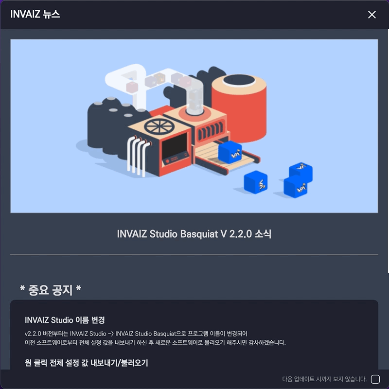
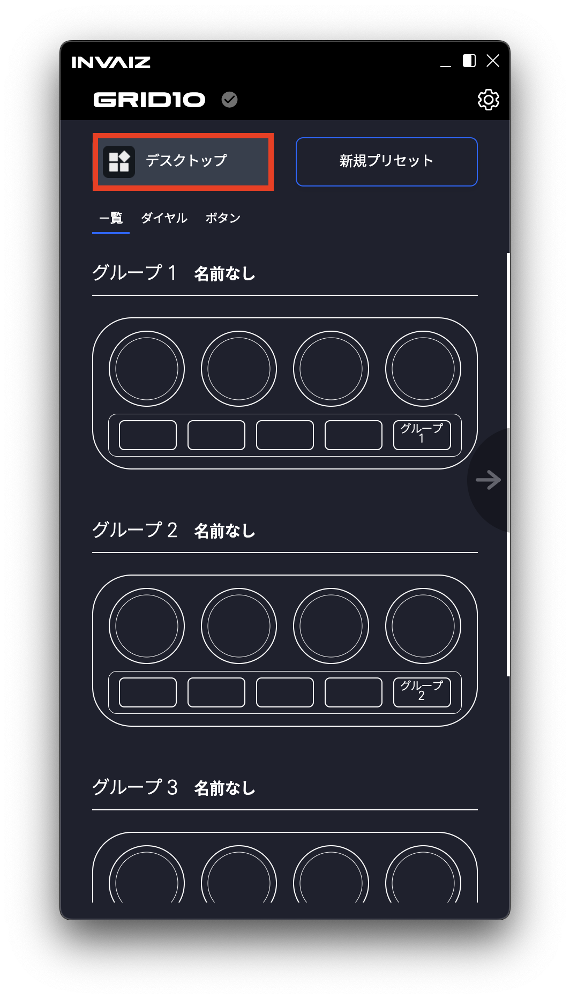
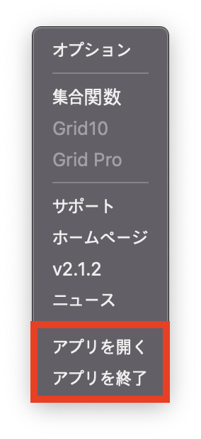
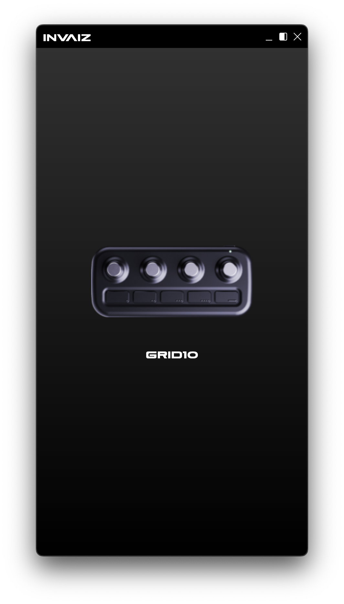
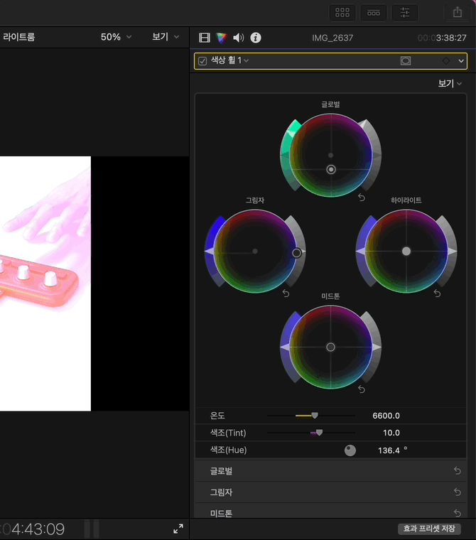
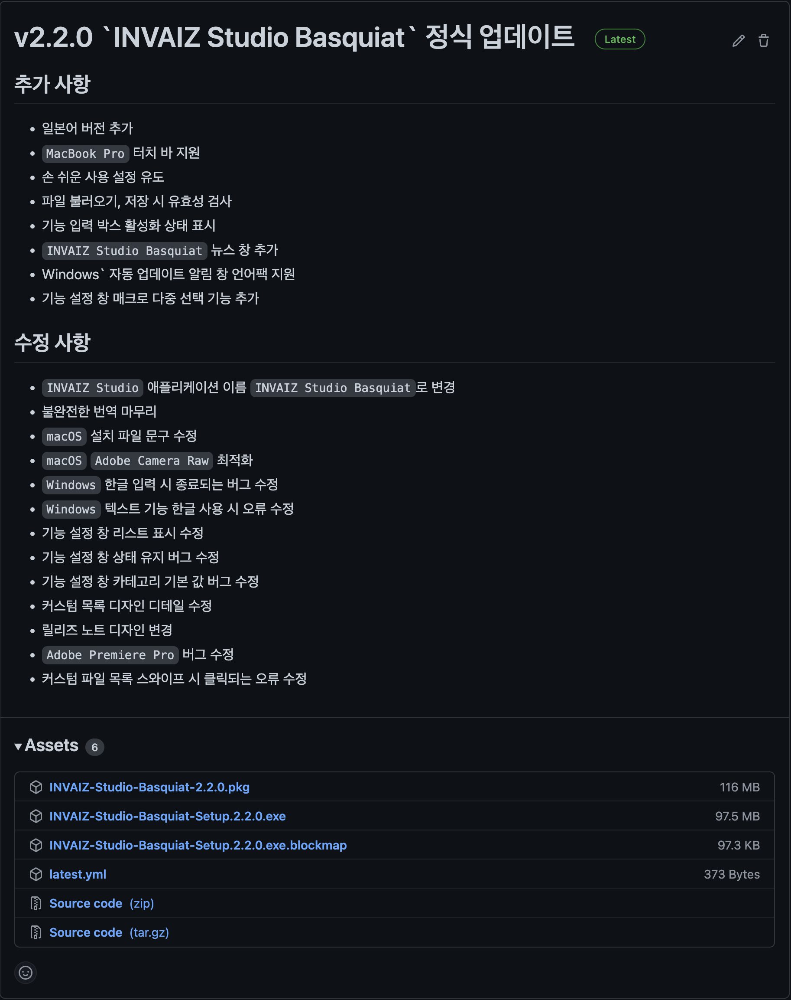

# 2022/04 4주차 주간 리포트

## 주간 작업 목록

---

- [뉴스 창 디자인 수정 ✅](#뉴스-창-디자인-수정-)
- [`INVAIZ Studio Basquiat` 이름 변경 버전 정식 업데이트 ✅](#invaiz-studio-basquiat-이름-변경-버전-정식-업데이트-)
- [`Final Cut Pro` 패널 기능 완성 ❌](#final-cut-pro-패널-기능-완성-)
- [개발 로드맵 회의 ✅](#개발-로드맵-회의-)

---

## 뉴스 창 디자인 수정 ✅

#### 작업 상세 설명

- 뉴스 창의 디자인을 좀 더 직관적으로 볼 수 있게 수정하였습니다.

  

#### 고려 사항

- 여전히 체크박스 부분의 `UX`가 신경쓰입니다.

---

## `INVAIZ Studio Basquiat` 이름 변경 버전 정식 업데이트 ✅

#### 작업 상세 설명

- `INVAIZ Studio`에서 `INVAIZ Studio Basquiat`로 애플리케이션 이름을 변경하여 배포하기 위한 작업을 진행하였습니다.
- 일본어 일부 수정

  

  

- `Grid Pro` 임시 제거

  

  - `Grid Pro` 제품의 출시가 확정되지 않았기 때문에 임시로 제거하여 배포했습니다.

- 프리셋 불러오기 `dialog` 사용

  - 기존에 프리셋 불러오기 버튼은 `HTML`의 `<input type="file" />`에 의존하고 있어, 파일이 변경되지 않으면 반영되지 않아 중복된 업로드가 불가한 단점이 있었습니다.
  - 이에 `dialog API`를 사용하여 다른 파일 업로드와 마찬가지로 네이티브 코드를 의존하도록 수정하였습니다.
  - 따라서, 불러오기 창의 제목, 버튼 명, 라벨 등에도 커스텀 네이밍과 언어 팩을 적용할 수 있습니다.

- 타입 가드 작성

  - 전체 설정 내보내기/불러오기에도 타입 가드를 적용할 수 있도록 소스를 작성했는데, 오류가 많이 발생하여 우선 적용은 시키지 않은 상태로 배포하였습니다.

#### 고려 사항

- 타입 가드 작성은 마쳤으나, 전체적으로 내보내기/불러오기 시 오류가 발생할 수 있어 많은 문의가 예상됩니다.
- 이에 따른 대응 방안을 마련하고 있습니다.

---

## `Final Cut Pro` 패널 기능 완성 ✅

#### 작업 상세 설명

- `Final Cut Pro`에 있는 4가지 패널 영역을 구분하여 값을 입력하는 로직을 작성하였습니다.
  - 따라서 4가지 패널 영역에 있는 모든 값을 분기를 설정하여 가져올 수 있으며, 값 또한 정상적으로 입력됩니다.
  - 현재는 색상 휠에만 동작할 만한 요소가 있어 색상 휠만 제공합니다.
- 색상을 지정하는 `RGB` 패널의 조작 또한 구현하였습니다.

  - 기존의 `Value` 영역은 `string`, `number` 타입으로 접근이 가능하여 덧셈/뺄셈이 간단했는데, `RGB` 영역의 경우, 데이터가 `rgb <r> <g> <b> <alpha>`와 같이 접근해야 하기 때문에, 덧셈/뺄셈이 난해합니다.
  - 난해한 이유는 단순 덧셈/뺄셈이 어려운 것이 아닌, 각각의 `<r> <g> <b>` 값이 서로 영향을 주고 있기 때문입니다.
  - `<r>` 값을 `1` 이상의 값으로 올릴 수 없는데, 만약 `1` 이상으로 올리게 될 경우, 밸런스를 맞추기 위해 다른 `<g>` 값이나 `<b>` 값을 낮추어 조금 더 순수한 빨간색에 가까워 지도록 설정되는 로직이 담겨있습니다.

    

- 다이얼로 조작 가능한 기능은 마무리가 된 것 같습니다.

#### 고려 사항

- 현재 `CPU` 점유량이 굉장히 높이 올라있는 현상을 확인하였는데, `invaiz-window-handle` 패키지와 관련되어 있는지 확인 후 최적화를 진행해야할 것 같습니다.
- 다이얼 기능 마무리 후, 단축키 기능을 읽어와 매핑하는 방식을 처리하기 위해 모든 단축키 기능을 등록하는 노가다를 마무리하고 나면 `Final Cut Pro`를 테스트 배포해도 무방할 것 같습니다.

---

## 개발 로드맵 회의 ✅

#### 작업 상세 설명

- 남은 2분기 동안의 개발 계획을 상세하게 수립하기 위해 개발 팀원 간의 개발 로드맵 회의를 진행하였습니다.
- `Software`, `Plugin`, `웹 서비스`, `구축` 4가지 큰 분야로 나누어 일정을 수립하였으며, 해야할 일 중 빨리 처리할 수록 좋은 작업을 나열하는 방식으로 작성하였습니다.
- 또한 올해동안 적용해보고 싶은 기술 및 구조를 작성해보고 이 중 어떤 기술을 어디에 적용해볼 수 있는지, 그리고 빨리 적용하기 위해선 어떤걸 먼저해야 하는지 비교해본 후 서브 프로젝트 / 스터디 방식으로 일정을 수립하였습니다.
- 마지막으로 지금까지 개발팀의 부족했던 점을 회고해보고, 앞으로 성장하기 위한 문화를 설정하여 적용해보기로 하였습니다.

#### 고려 사항

---

## 전달 사항

> 2022.04.27(수) `INVAIZ Studio Basquiat` 2.2.0 버전(정식버전) 런칭.
