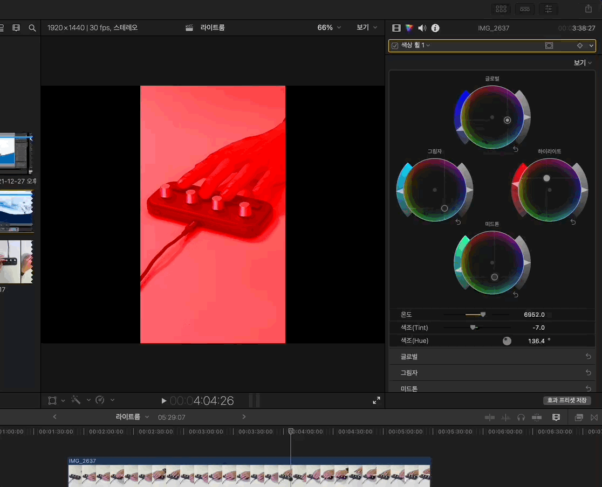

# 2022/05 1주차 주간 리포트

## 주간 작업 목록

---

- [`Final Cut Pro` 색상 휠 거리, 회전 조절 기능 ✅](#final-cut-pro-색상-휠-거리-회전-조절-기능-)
- [`Final Cut Pro` 단축키 기능 매핑 ✅](#final-cut-pro-단축키-기능-매핑-)

---

## `Final Cut Pro` 색상 휠 거리, 회전 조절 기능 ✅

#### 작업 상세 설명

- 색상 휠의 기능 중 기본 조작인 R, G, B와 채도, 밝기 조절 외에 추가 조작 기능으로 거리, 회전 기능을 탑재하였습니다.
  
- 거리 조절 기능은 원점을 기준으로 하는 색상 휠 포인트의 거리를 조절하는 기능입니다.
  - 거리가 0일때, 즉 Reset 상태 등을 이용하여 원점에 포인트가 조절할 경우 사용할 수 없습니다.
- 회전 기능은 원점을 기준으로 색상 휠 포인트의 위치를 회전하는 기능입니다.
  - 원점으로부터 같은 거리에 해당하는 위치들로 이동시킬 수 있습니다.
  - 거리 조절 기능과 마찬가지로, 거리가 0일때에는 사용하는 의미가 없습니다.

#### 고려 사항

- 색상 휠에 있는 RGB 영역 외에 채도, 밝기를 조절할 경우, 해당 휠을 포커싱하지 않으면 버벅거리는 현상이 있습니다.
- 색상 휠 기능이 아닌 온도나 색조 등을 조절하는 슬라이더는, 값은 변경되지만 실제로 적용이 되지 않는 현상이 있습니다.

---

## `Final Cut Pro` 단축키 기능 매핑 ✅

#### 작업 상세 설명

- 현재 활성화된 `.commandset` 파일을 가져와 해당하는 단축키를 인식하고 그 단축키를 실행시키는 코드를 작성하여 동작까지 테스트 성공했으나, 어떤 이유인지 `Final Cut Pro`와 관련된 `.plist` 파일, `.commandset` 파일이 모두 암호화되어 저장되도록 바뀌어 파일을 해석할 수 없습니다.
- 때문에 `com.FinalCut.plist`, `Default.commandset`, `INVAIZ .commandset` 등 어떤 파일도 읽을 수 없어 난관에 봉착한 상황입니다.
- 해당 암호화 파일의 원인을 파악할 수 있거나, 복호화만 성공한다면 바로 기능을 동작할 수 있으며, 약 400가지의 기능을 매핑만 하면 정상적으로 사용할 수 있게 됩니다.

#### 고려 사항

- 암호화 문제 해결 후 400가지의 기능을 버튼에 매핑하고, 그 중 다이얼로 설정 가능할 것 같은 기능만 추려내면 `Final Cut Pro`는 완성될 수 있을 것으로 보입니다.

---

## 전달 사항
