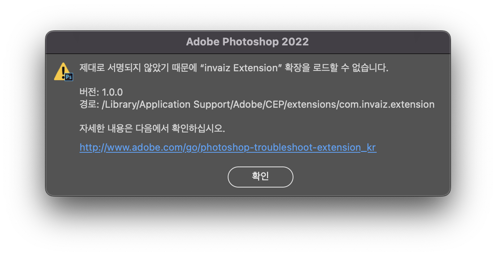

# 2022/05 2주차 주간 리포트

## 주간 작업 목록

---

- [`Final Cut Pro` 지원 ✅](#final-cut-pro-지원-)
- [개발 컨벤션 ✅](#개발-컨벤션-)
- [기술나눔 특허 자료 분석 ✅](#기술나눔-특허-자료-분석-)
- [데이터 수집 동의 ❌](#데이터-수집-동의-)
- [`macOS`에서 `INVAIZ Studio Basquiat` 패키징 시 `CEP` 서명 에러 수정 ✅](#macos에서-invaiz-studio-basquiat-패키징-시-cep-서명-에러-수정-)
- [가속도 알고리즘 계획 수립 및 자료 조사 ❌](#가속도-알고리즘-계획-수립-및-자료-조사-)

---

## `Final Cut Pro` 지원 ✅

#### 작업 상세 설명

#### 고려 사항

---

## 개발 컨벤션 ✅

#### 작업 상세 설명

- 현재 `INVAIZ Studio`, `Plugin`, `Server` 등 분야가 다른 프로젝트에 각각 다른 코딩 스타일 및 규칙이 적용되어 있어 소통 오류가 자주 발생하고 있습니다.
- 이에 개발팀의 업무 효율을 증가시키고 실수를 방지할 수 있으며, 개발팀 간의 소통을 원할하게 하기 위해 **컨벤션**을 작성하였습니다.
  - 개발 컨벤션: 개발팀이 작성하는 코딩 스타일, 데이터 전달 방식, 문서 작성 방식 등을 포함한 개발 시 발생하는 절차에 대해 규악을 정하는 것.
- 2022/05/10(화), 2022/05/11(수) 총 두 번의 회의를 거쳐 작성하였으며, `Github`, `Front-End`, `Back-End` 세 가지 큰 분야로 작업 내용 전달 방식, 오류 및 수정 사항 보고 방식, 업데이트와 배포 프로세스, 코딩 스타일(변수 명, 함수 명 등)을 포함하고 있습니다.
- 추후 새로운 개발자가 들어와도 쉽게 이해하고 적응할 수 있도록 헷갈림이 적고 가독성 좋은 방식으로 계속해서 수정하며 문서화할 계획입니다.
- 자세한 내용은 [Notion - 개발팀 컨벤션](https://www.notion.so/1a7e6b1b05034a1db54f0211823a9df3) 페이지에서 확인하실 수 있습니다.

#### 고려 사항

- 해당 내용은 실제로 협업하는 과정을 거치면서 다듬어 나갈 계획이므로, 계속해서 내용이 변경될 수 있습니다.

---

## 기술나눔 특허 자료 분석 ✅

#### 작업 상세 설명

- 산업통상자원부에서 주관하는 삼성전자 기술나눔 사업에 신청하기 위해 지원 내용으로 명시된 276건의 삼성전자 특허를 분석하고, 자사에서 적용할 수 있을 만한 기술을 분류하였습니다.
- 기술나눔 목록이 작성된 PDF를 확인하며 사용 가능할 만한 내용을 EXCEL에 빨간 글씨 및 비고로 표시하였습니다.
- 또한, 목적(영상, 서버 및 데이터, 플러그인 소프트웨어, 기타 등)에 따른 기술을 분류하여 정리하였고, 각 기술을 적용한 시나리오를 몇 가지 작성하였습니다.
- 자세한 내용은 [Notion - 삼성전자 기술나눔 시나리오 기획](https://www.notion.so/82d5b90a564f4bf6935be4651e7f6c8f) 페이지에서 확인하실 수 있습니다.

#### 고려 사항

- 이 중 플러그인 및 `INVAIZ Studio` 기능 추천의 1번 시나리오를 적용하여, **복수의 애플리케이션에 대한 사용자 인터페이스를 제공하는 방법 및 시스템**을 채택하였습니다.

---

## 데이터 수집 동의 ❌

#### 작업 상세 설명

#### 고려 사항

---

## `macOS`에서 `INVAIZ Studio Basquiat` 패키징 시 `CEP` 서명 에러 수정 ✅

#### 작업 상세 설명

- `INVAIZ Studio Basquiat`의 버전 `v2.2.0`를 배포하면서, `CEP` 서명 솔루션을 자동화하였는데 마침 `Adobe` 측의 `CEP` 서명 정책에 변화가 있었는지 `Windows`에서 압축 해제한 폴더를 `macOS`에서 접근하거나 배포하면 서명 오류가 발생하였습니다.
  
- 이에 타이밍 상 `CEP` 서명 솔루션에 문제가 있는 것으로 예상하여 버그를 추적하였는데 원인을 찾는데 오래 걸렸고, 원인 발견 후 기존의 배포 프로세스를 수정하는 방식으로 해결하였습니다.
  - 기존에는 `Windows` 설치 스크립트에서는 `.7z` 압축 파일을 해제하여 배포하였지만, `macOS` 설치 스크립트에서는 `extension` 결과 폴더를 이름만 변경하여 `CEP` 폴더에 삽입하였습니다.
  - 이 방식이 위의 서명 오류를 발생시킬 수 있기 때문에 `Windows`와 마찬가지로 `.7z` 압축 파일을 해제하는 스크립트를 작성하였습니다.
  - 기존에는 `extension` 폴더, `extension.7z`, `plugin` 폴더, `plugin.7z` 총 네 개의 파일을 프로젝트에서 관리하는 중복이 있었는데, 이 또한 제거할 수 있게 되었습니다.

#### 고려 사항

- `macOS`에서 `zip`을 해제하는 스크립트를 처음 적용하였기 때문에 버그의 발생 가능성이 있습니다.
- 따라서, `CEP` 서명 오류나 `Adobe Lightroom Classic` 플러그인 관련 문의가 올 수 있습니다.
- 버그가 발생했던 현재 버전인 `v2.2.0`의 배포 파일은 내리고 정상 동작하는 새로운 파일을 업로드하였기 때문에 현재 다운로드하는 고객님들에게는 버그가 발생하진 않습니다.

---

## 가속도 알고리즘 계획 수립 및 자료 조사 ❌

#### 작업 상세 설명

#### 고려 사항

---

## 전달 사항
