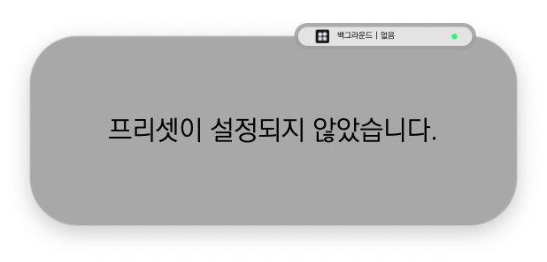

# 2022/05 3주차 주간 리포트

## 주간 작업 목록

---

- [`Final Cut Pro` 배포 ✅](#final-cut-pro-배포-)
- [기업 가치 설정 회의 ✅](#기업-가치-설정-회의-)
- [`macOS`에서 `Adobe Premiere Pro` 추천 프리셋 버그 수정 ✅](#macos에서-adobe-premiere-pro-추천-프리셋-버그-수정-)
- [`Grid Pro` 오버레이 작업 ✅](#grid-pro-오버레이-작업-)
- [오버레이 상태 바에서 프리셋 없을 시 표시 변경 ✅](#오버레이-상태-바에서-프리셋-없을-시-표시-변경-)
- [`Windows`에서 레이아웃 고정 현상 버그 수정 ✅](#windows에서-레이아웃-고정-현상-버그-수정-)
- [숏티지로 인한 사업화 방향 긴급 회의 ✅](#숏티지로-인한-사업화-방향-긴급-회의-)
- [가속도 알고리즘 계획 수립 및 자료 조사 ❌](#가속도-알고리즘-계획-수립-및-자료-조사-)
- [비 로그인으로 사용자 단말기 식별 알고리즘 조사 ❌](#비-로그인으로-사용자-단말기-식별-알고리즘-조사-)

---

## `Final Cut Pro` 단축키 작업 ✅

#### 작업 상세 설명

- 534개에 달하는 단축키를 계속해서 매핑하고 있으며, 이름을 통해 다이얼에 매핑 가능 여부를 함께 판단하여 다이얼도 추가 중에 있습니다.
- 다른 작업 도중 번아웃이 오거나 시간이 남을 때마다 계속 매핑하여 다음 주 중 패키징 가능할 것으로 예상됩니다.

#### 고려 사항

- 이 작업을 하고 있지만, 여전히 추천 프리셋을 어떻게 제공해줘야 할지 어렵습니다.
  - 도움을 주시면 감사하겠습니다.
- 그리고 기존 단축키 입력과 차이가 조금 있어 100% 호환을 장담할 수 없는 상태라 사내 테스트, 고객 테스트를 계속 해봐야할 것 같습니다.

---

## 기업 가치 설정 회의 ✅

#### 작업 상세 설명

- 위 수석님과 함께 2022/04/27(수) 진행했던 워크샵의 마무리로 계속 진행하지 못했던 기업 가치를 설정하는 전체 회의를 진행하였습니다.
- 2022/05/17(화)에 IBK 창공 오디토리움 회의실에서 진행하였으며 총 2장으로 구성된 파트 중 1장까지 진행하였습니다.
- 자세한 내용은 [Notion - IBK 전체 회의](https://www.notion.so/2022-05-17-IBK-739f70ba40464af1a40c7de15aba9071)에서 확인하실 수 있습니다.

#### 고려 사항

- 기업 가치 설정 가이드의 내용이 자사와 핏이 맞지 않는 것 같아 계속 진행해야할지 판단해 볼 필요가 있어 보입니다.

---

## `macOS`에서 `Adobe Premiere Pro` 추천 프리셋 버그 수정 ✅

#### 작업 상세 설명

- `CEP`에 넘겨줘야 할 데이터의 타입이 변경되면서 기존 추천 프리셋에서 사용 중인 `Lumetri` 기능들의 값 또한 변경해줘야 하는 작업이 있는데, `Windows`는 정상 진행하였지만 `macOS`에서는 데이터 변경이 누락되어 버그가 발생했습니다.
- 이에 우선 당장 처리하는 방법으로 기존 추천 프리셋을 복제함 -> 복제한 프리셋에 똑같은 기능을 우측에서 드래그하여 재매핑하는 방식이 있습니다.
- `macOS`에 누락된 데이터를 다시 정상적으로 수정하여 다음 업데이트 때 배포할 예정입니다.

#### 고려 사항

- `CEP`와 같은 공통 기능을 한 번에 관리할 수 있도록 시간을 투자해서라도 `id` 값의 `Key-Value` 페어로 기능을 찾는 `Dict` 자료 구조로 리팩터링해야할 필요가 느껴집니다.

---

## `Grid Pro` 오버레이 작업 ✅

#### 작업 상세 설명

- 2022/05/24(화)에 서울에서 진행하는 IBK 데모데이 및 전시회 행사에 앞서 `Grid Pro`를 시연하기 위해 `Grid Pro` 오버레아를 업데이트하였습니다.
- `Grid Pro` 오버레이는 전체 보기 모드 / 실행한 기능만 보기 모드 / 그룹 변경 인지 모드 / 프리셋 변경 인지 모드 / 끄기 모드로 동작합니다.
  - 전체 보기 모드
    
  - 실행만 기능만 보기 모드
  - 그룹 변경 인지 모드
  - 프리셋 변경 인지 모드

#### 고려 사항

- 디자인의 업데이트가 필요할 것 같습니다.

---

## 오버레이 상태 바에서 프리셋 없을 시 표시 변경 ✅

#### 작업 상세 설명

- 기존에는 프로그램만 추가되어 있고 프리셋이 없을 때, 오버레이의 상태 바에서 프리셋을 `undefined`로 표시하였는데, 이 표현보다 더 직관적인 방식으로 표현할 수 있도록 변경하였습니다.
  

#### 고려 사항

---

## `Windows`에서 레이아웃 고정 현상 버그 수정 ✅

#### 작업 상세 설명

- 약 한 달 전부터 계속해서 문의가 오는 한 고객분의 컴퓨터에서, 컴퓨터가 실행될 때마다 `INVAIZ Studio Basquiat`이 정상적으로 동작히지 않고 꺼지거나, 꺼진 후에 실행되지 않는 등의 치명적인 버그가 발생한다는 문의가 있었습니다.
  - 고객님의 컴퓨터 환경은 `Windows 10`이며, 사용 프로그램은 따로 정해져 있지 않았습니다.
- 해당 문제를 해결하기 위해 약 5번 이상의 배포 솔루션을 작성했지만, 버그가 계속해서 잡히지 않아 고객분과 계속 소통하고 있었습니다.
- 이에 `main.log` 파일 또한 지속적으로 분석하였는데, `Grid10` 기기의 연결부에서 오류가 발생하는 것을 확인하였습니다.
  - 첫 번째로 케이블 불량을 확인했지만 아닌 것으로 확인되었고, `USB`를 접촉하는 단자의 문제가 있는 건지 확인하기 위해 허브 사용 여부 및 본체 연결 확인을 했는 데도 문제가 없는 것 같았습니다.
  - 이에 기존 소스에 있던 에러 처리 로직에 빈틈을 발견했고, 수정하여 고객님께 다시 전달하였습니다.

#### 고려 사항

- 또 다시 에러가 발생할 가능성이 있지만, 지금까지 단 한 번도 확인되지 않던 버그가 특정 컴퓨터에서만 지속적으로 발생하기 때문에 어떻게 에러를 수정해야할지 난감한 상태입니다.

---

## 숏티지로 인한 사업화 방향 긴급 회의 ✅

#### 작업 상세 설명

- 2022/05/20(금)에 사업화 방향에 대한 긴급 회의를 진행하였습니다.

#### 고려 사항

---

## 가속도 알고리즘 계획 수립 및 자료 조사 ❌

#### 작업 상세 설명

- `Grid Pro` 오버레이 만들기 및 예상치 못한 문의 대응, 버그 수정으로 인해 지연되었습니다.

#### 고려 사항

---

## 비 로그인으로 사용자 단말기 식별 알고리즘 조사 ❌

#### 작업 상세 설명

- `Grid Pro` 오버레이 만들기 및 예상치 못한 문의 대응, 버그 수정으로 인해 지연되었습니다.

#### 고려 사항

---

## 전달 사항
