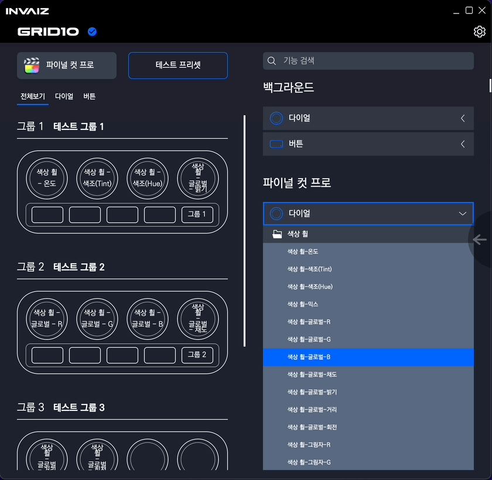
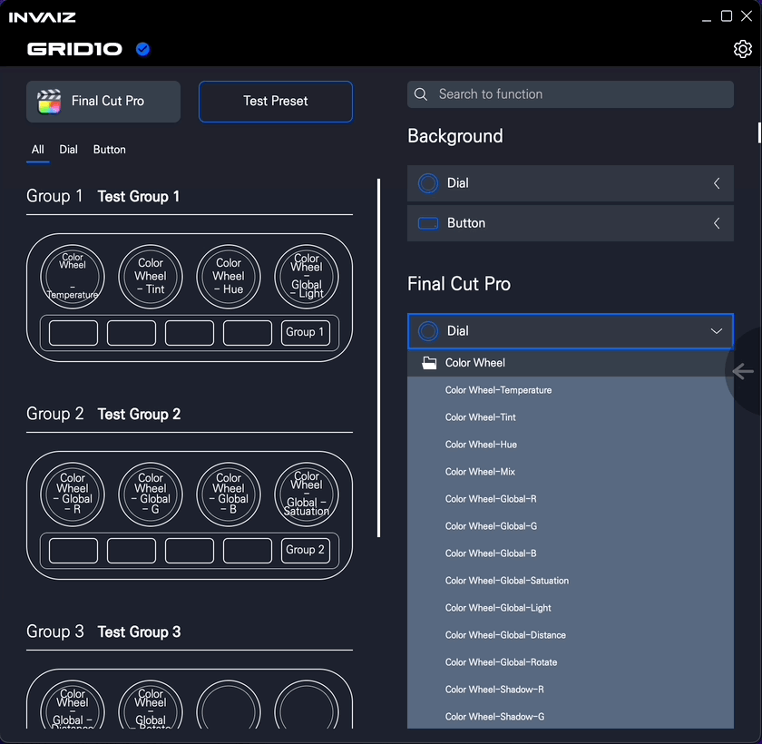
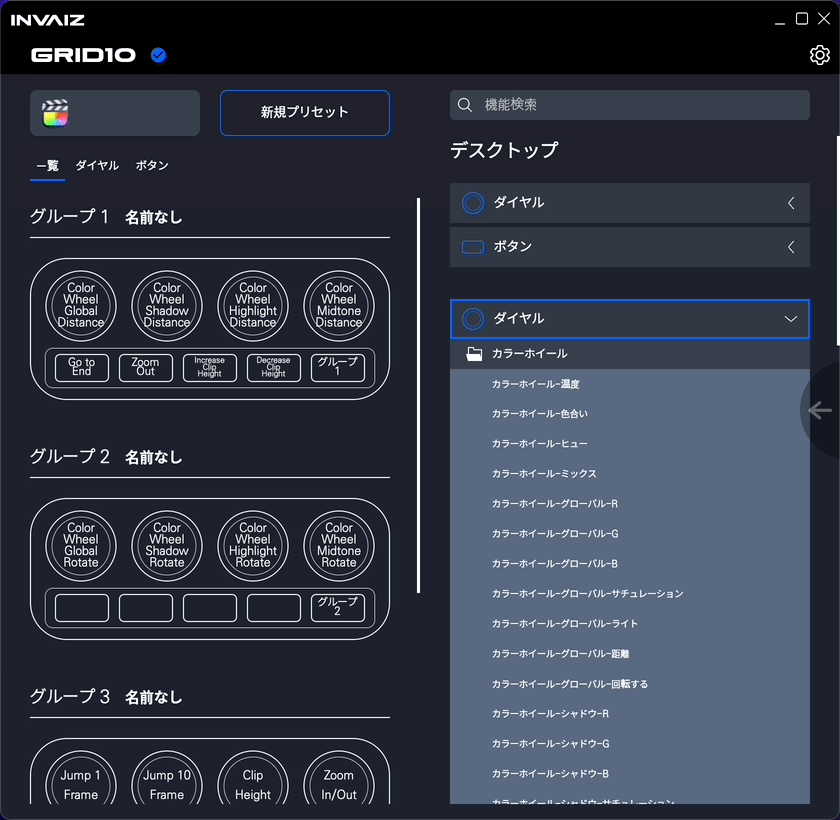
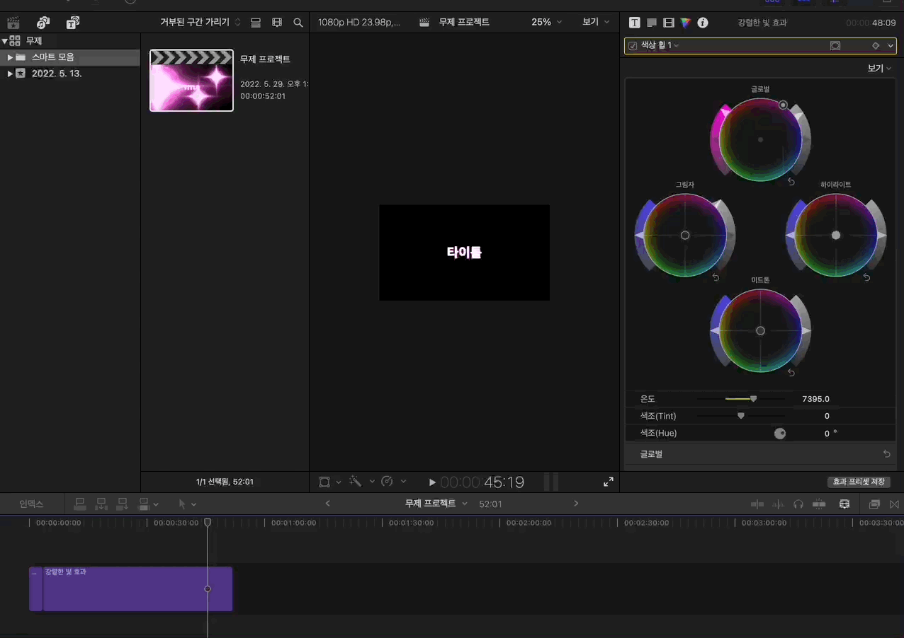
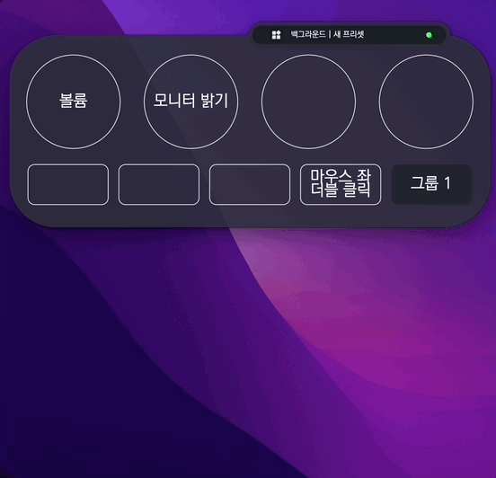

# 2022/05 4주차 주간 리포트

## 주간 작업 목록

---

- [IBK 창공 2022년 상반기 데모데이/전시회 ✅](#ibk-창공-2022년-상반기-데모데이전시회-)
- [`Final Cut Pro` 단축키 작업 ✅](#final-cut-pro-단축키-작업-)
- [강제 입력 오버레이 적용 ✅](#강제-입력-오버레이-적용-)

---

## IBK 창공 2022년 상반기 데모데이/전시회 ✅

#### 작업 상세 설명

- 2022/05/24(화) 서울 IBK 파이낸스 타워 5층에서 열린 IBK 창공 2022년 데모데이/전시회에 참여하였습니다.
- 데모데이 내용은 [2022년 상반기 IBK창공(創工) FLY HIGH! 데모데이 Day 1. Deep tech
  ](https://www.youtube.com/watch?v=UfkKg4XHqtY)에서 확인하실 수 있습니다.
- `Grid Pro`의 1차 오버레이 작업을 마친 후 전시하였습니다.

#### 고려 사항

- `H/W`의 수익 구조에서 `S/W`의 수익 구조로 전환하는 것이 어떻겠냐는 피드백이 있었습니다.
- 오버레이에 보이는 결과값 등에서 소수점의 자릿수가 일정하지 않은(예를 들면 `0.0000005`, `0.0003E-13` 등) 점에 대한 피드백이 있었습니다.

---

## `Final Cut Pro` 단축키 작업 ✅

#### 작업 상세 설명

- `Final Cut Pro`에서 명령 편집기로 단축키로 제공되는 모든 기능를 임의의 단축키로 설정한 후 `.plist`를 추출하였고 그 파일을 디코딩, 복호화하여 `XML`로 변환하였습니다.
- `XML` 파일에 작성된 단축키 `Key` 값을 함께 있는 `input` 값, 명령 편집기에 있는 단축키 `input` 값에 매핑하여 `INVAIZ Studio Basquiat`에서 사용할 수 있는 단축키 파일을 생성하였습니다.
- 카테고리 분류는 명령 편집기 좌측의 명령 그룹과 같이 분할하였고, 다이얼 기능의 경우 단축키 제공 기능 중 방향 벡터 값(상, 하, 좌, 우)이 있는 기능을 묶어서 등록하였습니다.
- `Final Cut Pro` 단축키 등록 상태
  - 한국어
    
  - 영어
    
  - 일본어
    
  - 일본어의 경우, 기능 하나하나의 이름을 직접 타이핑할 수가 없기 때문에(해석이 불가능 하며 복사가 용이하지 못함.) `INVAIZ`에서 만든 `Native` 기능(색상 휠 등의 수치 조작)에만 이름을 부여하였습니다.
- 사용 영상
  

#### 고려 사항

- 모든 단축키를 테스트하기엔 기능이 많으며, 특정 상황에서만 동작하는 단축키가 있으므로 우선 배포한 후 만약 정상적으로 동작하지 않는 기능이 있다면 피드백 수용 후 업데이트하는 방식을 채택해야할 것 같습니다.
- 만약 어떠한 기능을 사용하려고 하는데, 그 기능이 `Final Cut Pro`의 현재 단축키 세트에 매핑되어 있지 않은 기능이라면 동작시킬 수 없습니다.
  - 따라서 `L` 사처럼 기본적으로 모든 단축키가 매핑되어 있는 파일을 강제로 설치를 하는 방식을 채택해야할 지 결정해야 합니다.
- 주요 단축키 기능 테스트, 매핑 되어 있지 않은 단축키 실행 시 결과 값으로 "단축키가 매핑되어 있지 않습니다."등의 메세지를 띄우는 작업만 하면 테스트 배포가 가능할 것 같습니다.
  - 특수한 키의 경우 위치에 따라 달라질 수 있는데, 이게 어떻게 적용되는지 테스트해야 합니다.(기존의 숫자와 키패드의 숫자 혹은 기존의 `Delete`와, 키패드의 `Delete` 등)

---

## 강제 입력 오버레이 적용 ✅

#### 작업 상세 설명

- 강제 입력은 `CEP` 혹은 `Native`, `UXP` 등과 같이 어떠한 실행에 대한 결과 값(수치, 실행 결과, 에러 여부 등)을 전달받을 수 없어 기능의 이름만으로 어떠한 동작을 하는지 정확하게 판단하기 어려울 수 있습니다.
  - 또한 사용자의 입장에서 어떠한 기능이 `CEP` 등의 통신 기능인지 강제 입력 기능인지 알 방법이 없어 기능에 대한 이해도가 낮으며 문의 대응 시 혼란이 올 수 있었습니다.
- 이에 강제 입력 기능을 실행하더라도 어떠한 기능을 실행했는지 보여주는 방법을 적용해 보았습니다.
  

#### 고려 사항

- 단축키의 경우 너무 길어지면 디자인이 이쁘지 않다는 단점이 있으며, 매크로는 여전히 띄우기가 난해합니다.

---

## 전달 사항

- 2022/05/31(화)에 `Final Cut Pro`가 테스트 지원되는 `v2.2.1` 버전으로 업데이트 할 예정입니다.
