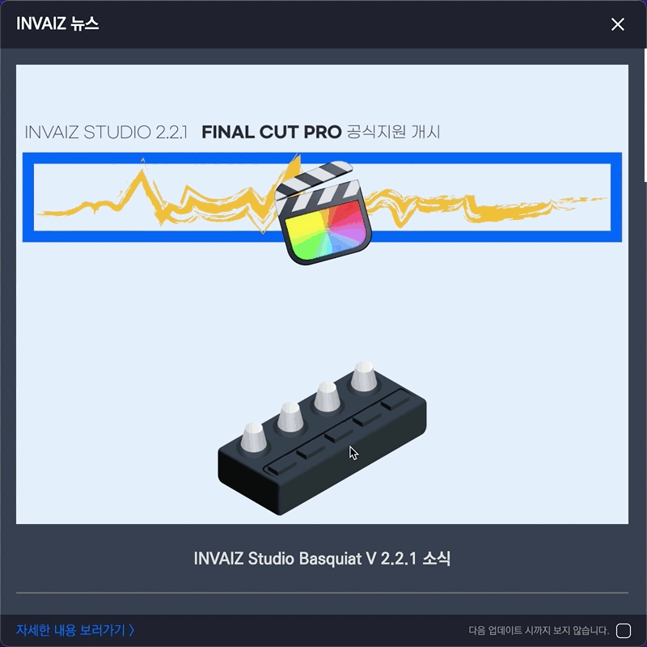
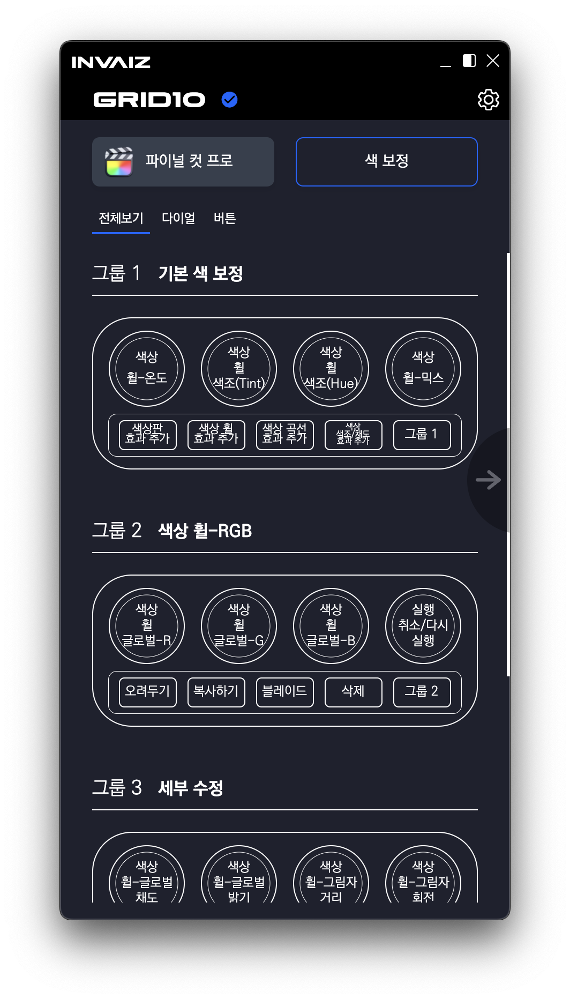
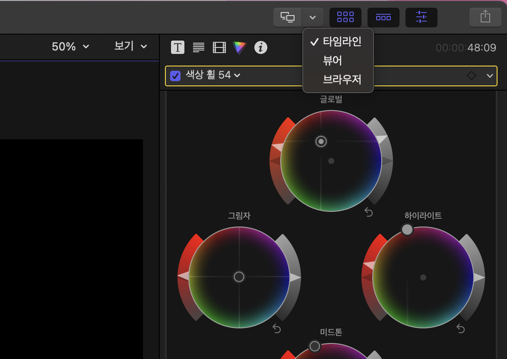
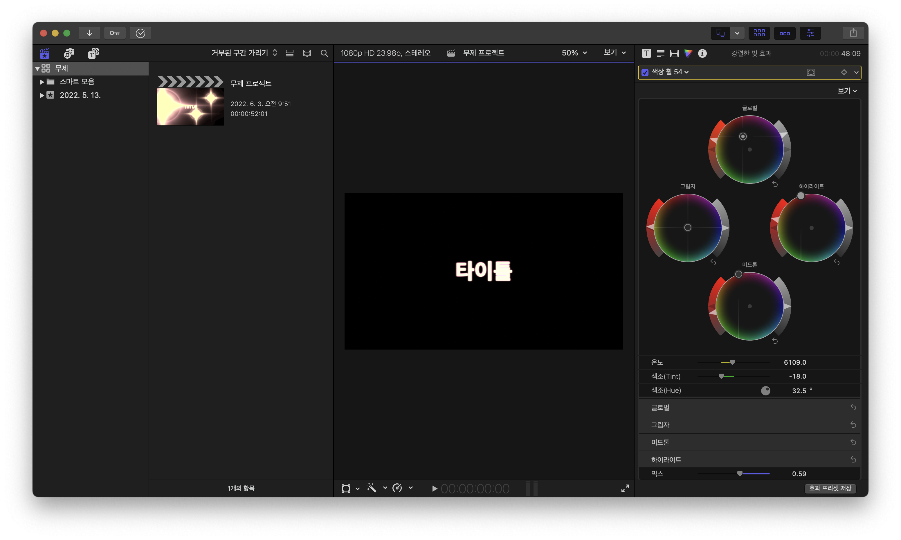
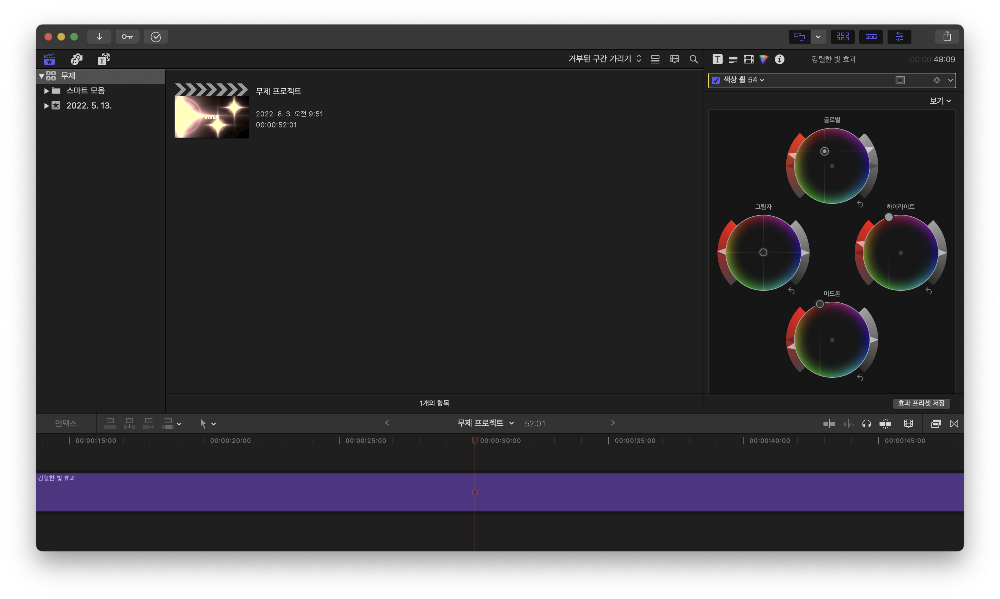
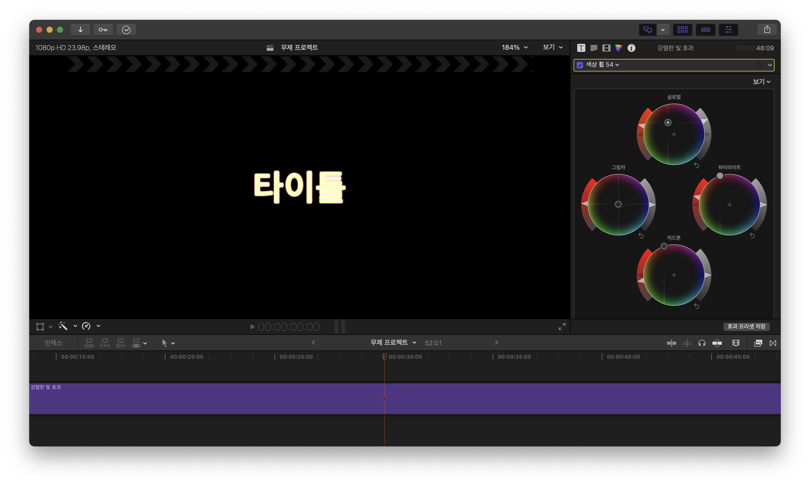
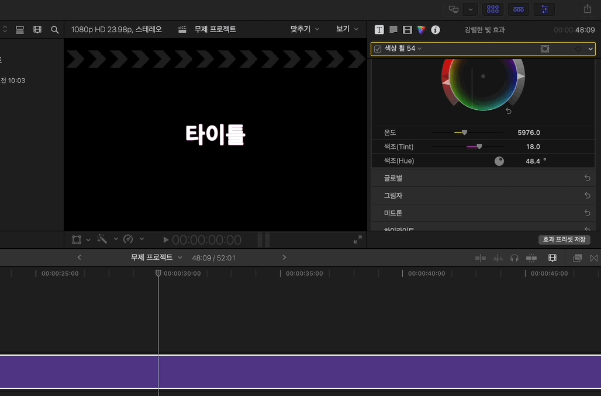
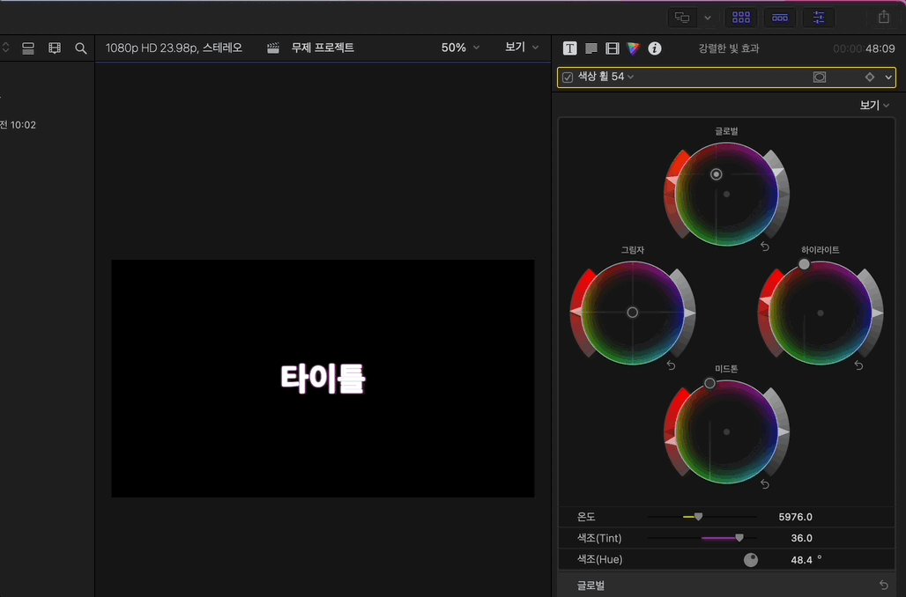
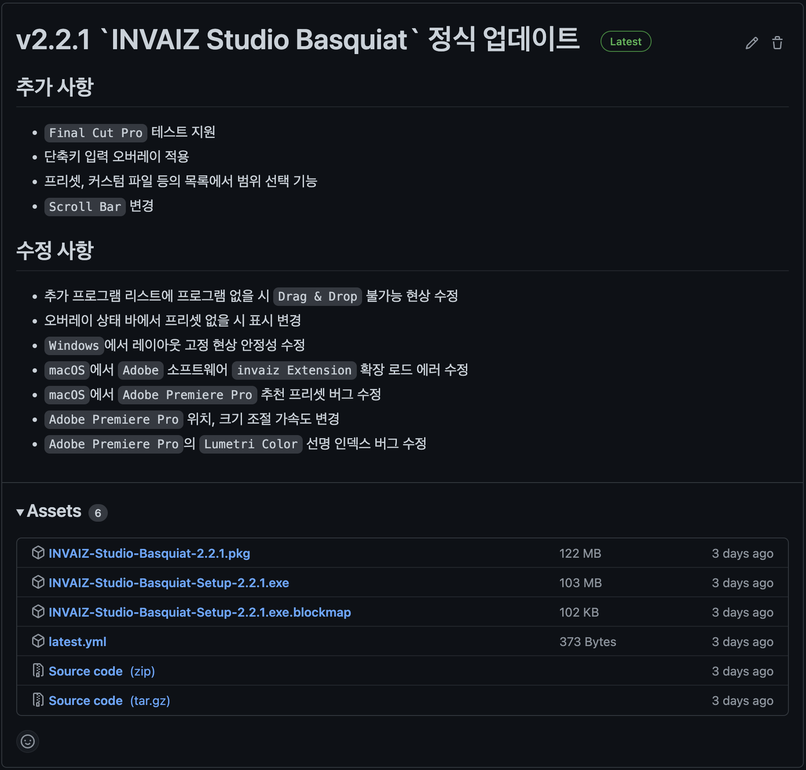

# 2022/05 5주차 주간 리포트

## 주간 작업 목록

---

- [`Final Cut Pro` 테스트 배포 ✅](#final-cut-pro-테스트-배포-)
- [네이버 광고 분석 스크립트 설치 ✅](#네이버-광고-분석-스크립트-설치-)
- [`Final Cut Pro` 듀얼 모니터 오류 수정 ✅](#final-cut-pro-듀얼-모니터-오류-수정-)
- [가속도 알고리즘 계획 수립 및 자료 조사 ❌](#가속도-알고리즘-계획-수립-및-자료-조사-)
- [비 로그인으로 사용자 단말기 식별 알고리즘 조사 ❌](#비-로그인으로-사용자-단말기-식별-알고리즘-조사-)

---

## `Final Cut Pro` 테스트 배포 ✅

#### 작업 상세 설명

- `Final Cut Pro`의 기능을 탑재한 `INVAIZ Studio Basquiat`의 `v2.2.1`을 성공적으로 배포하였습니다.
- 업데이트의 큰 내용들을 뉴스 창에 정리하여 배포하였으며, 테스트 버전임을 명시하여 버그 발생 가능성을 경고하였습니다.
  
- `Final Cut Pro`를 바로 체험해볼 수 있도록 추천 프리셋(색 보정) 1개를 제작하여 배포하였습니다.
  
- 업데이트 후 `Final Cut Pro`에 대한 피드백이 얼마나 오는 가에 따라서 정식 지원 표시 여부를 판단해봐도 좋을 것 같습니다.

#### 고려 사항

- 임의의 기능으로 추천 프리셋을 만들었기 때문에, 기능이 빈약할 수 있습니다.
- 전체적으로 추천 프리셋을 한 번 업데이트 해보는 것이 좋을 것 같습니다.

---

## 네이버 광고 분석 스크립트 설치 ✅

#### 작업 상세 설명

- 네이버 광고 분석 스크립트 설치를 위해 `WordPress`를 분석했습니다.
- 분석 도중 `Astra`와 `Elementor`의 플러그인 업데이트가 있어 업데이트 하였더니, 이전에 작성되어 있던 `Google` 태그 관리자와 `Analytics`의 스크립트가 모두 날아갔습니다.
  - 이에 `Google` 태그 관리자와 `Analytics`를 다시 삽입하였습니다.
- `Google` 태그 관리자
  - `<head>` 여는 태그 바로 뒤
    ```html
    <!-- Google Tag Manager -->
    <script>
      // 2022.06 INSERT By PCH
      (function (w, d, s, l, i) {
        w[l] = w[l] || [];
        w[l].push({ "gtm.start": new Date().getTime(), event: "gtm.js" });
        var f = d.getElementsByTagName(s)[0],
          j = d.createElement(s),
          dl = l != "dataLayer" ? "&l=" + l : "";
        j.async = true;
        j.src = "https://www.googletagmanager.com/gtm.js?id=" + i + dl;
        f.parentNode.insertBefore(j, f);
      })(window, document, "script", "dataLayer", "GTM-MVQQS76");
    </script>
    <!-- End Google Tag Manager -->
    ```
  - `<body>` 여는 태그 바로 뒤
    ```html
    <!-- Google Tag Manager (noscript) -->
    <!-- 2022.06 INSERT By PCH -->
    <noscript
      ><iframe
        src="https://www.googletagmanager.com/ns.html?id=GTM-MVQQS76"
        height="0"
        width="0"
        style="display:none;visibility:hidden"
      ></iframe
    ></noscript>
    <!-- End Google Tag Manager (noscript) -->
    ```
- `Google Analytics`

  ```html
  <!-- Global site tag (gtag.js) - Google Analytics -->
  <script
    async
    src="https://www.googletagmanager.com/gtag/js?id=${G_ANALYTICS_ID}"
  ></script>
  <script>
    // 2022.06 INSERT By PCH
    window.dataLayer = window.dataLayer || [];
    function gtag() {
      dataLayer.push(arguments);
    }
    gtag("js", new Date());

    gtag("config", "${G_ANALYTICS_ID}");
  </script>
  ```

- 네이버 광고 분석 스크립트

  ```html
  <script type="text/javascript" src="//wcs.naver.net/wcslog.js"></script>
  <script type="text/javascript">
    // 2022.06 INSERT By PCH
    var _nasa = {};
    if (window.wcs) {
      _nasa["cnv"] = wcs.cnv("1", "결제 금액 변수(variable)");
    }
  </script>
  <script type="text/javascript">
    // 2022.06 INSERT By PCH
    if (!wcs_add) {
      var wcs_add = {};
    }
    wcs_add["wa"] = "네이버 공통 키";
    if (!_nasa) {
      var _nasa = {};
    }
    if (window.wcs) {
      wcs.inflow("invaiz.com");
      wcs_do(_nasa);
    }
  </script>
  ```

- 네이버 광고 분석 스크립트의 경우, 결제 완료 페이지, 회원가입 완료 페이지, 장바구니 페이지 등에는 다음 스크립트를 속성 값만 변경하여 추가로 삽입해주었습니다.
  ```html
  <script type="text/javascript" src="//wcs.naver.net/wcslog.js"></script>
  <script type="text/javascript">
    // 2022.06 INSERT By PCH
    var _nasa = {};
    if (window.wcs) {
      _nasa["cnv"] = wcs.cnv("1", "결제 금액 변수(variable)");
    }
  </script>
  ```

#### 고려 사항

- 홈페이지 등에 태그를 삽입하는 메뉴얼이 필요할 것 같습니다.
- 또한, 해당 네이버 광고 분석 스크립트의 경우, 스크립트를 `<head>`에 삽입하지 말라고 명시되어 있는데, 누군가가 `<head>` 내부에 삽입해 둔 것으로 확인된 것과 더불어, 어디다 삽입했는지 찾지 못하고 있는 상황입니다.
  - 따라서 제대로 동작하고 있지 않을 가능성이 있습니다.

---

## `Final Cut Pro` 듀얼 모니터 오류 수정 ✅

#### 작업 상세 설명

- `Final Cut Pro`의 상단에서, 듀얼 모니터 모드 활성화할 수 있는 선택 박스가 있습니다.
  
- 해당 모드를 활성화 하게 되면, `Final Cut Pro`의 `Window` 형태가 바뀌어 기존의 `invaiz-window-handle` 패키지가 정상적으로 동작하지 않는 버그가 발생했습니다.
  - 듀얼 모니터 타임라인
    
  - 듀얼 모니터 뷰어
    
  - 듀얼 모니터 브라우저
    
- 이에 듀얼 모니터 모드의 활성화 상태에 따라 분기하는 로직을 추가하여 예외 처리하였습니다.
  
- 듀얼 모니터 모드에서도 색상 휠 등의 패널 수치 조작 기능이 정상적으로 사용 가능하도록 수정하였습니다.
  
- 수정한 배포 파일을 `v2.2.1` 설치 파일로 덮어 씌웠습니다.

#### 고려 사항

- 혹시나 트리플 모니터 기능이 있는건 아닌가 노심초사입니다.
- 분기하는 로직이 임시 처방에 가까워 마음에 들지 않는데, 이 방법 외에 별다른 방법이 있는지 알 수 없습니다.

---

## 가속도 알고리즘 계획 수립 및 자료 조사 ❌

#### 작업 상세 설명

- 조사 및 정리 중입니다.

#### 고려 사항

---

## 비 로그인으로 사용자 단말기 식별 알고리즘 조사 ❌

#### 작업 상세 설명

- 조사 및 정리 중입니다.

#### 고려 사항

---

## 전달 사항



> 2022.05.31(화) `INVAIZ Studio Basquiat` 2.2.1 버전(정식버전) 런칭.
