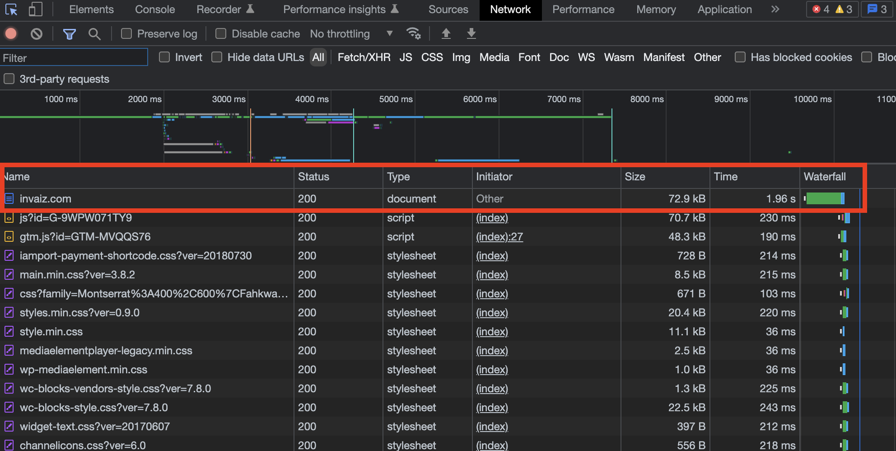
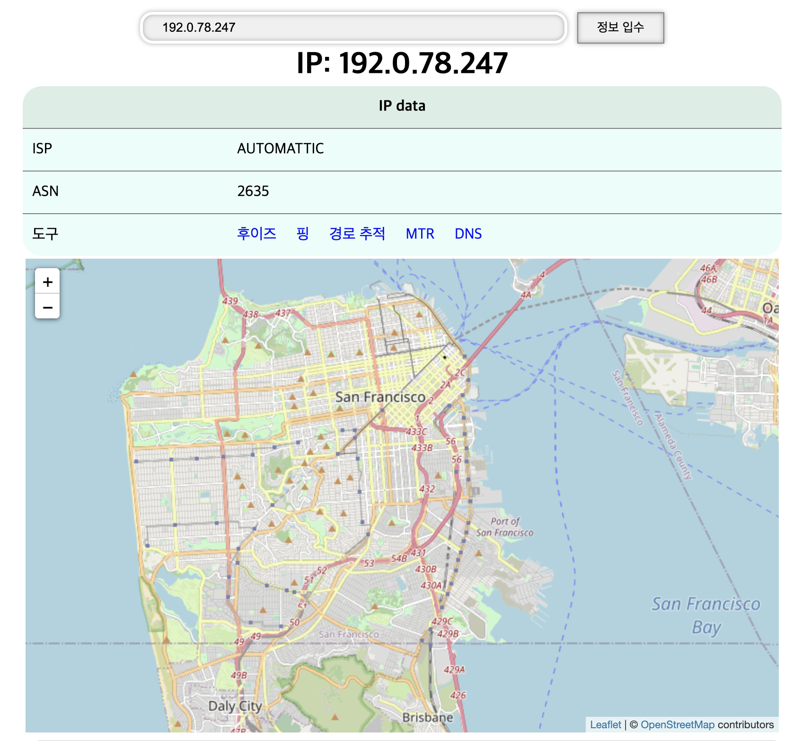
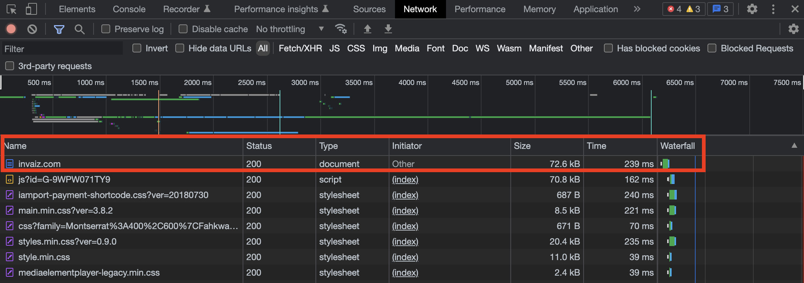
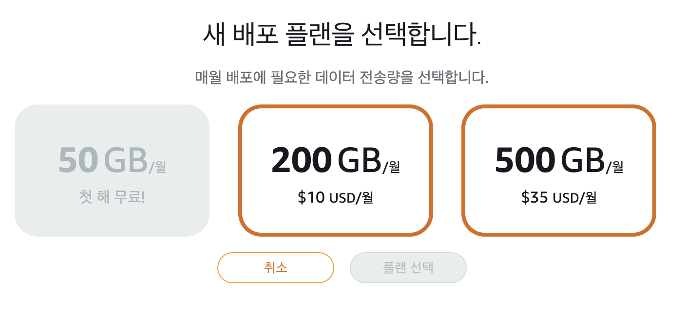

# 2022/06 2주차 주간 리포트

## 주간 작업 목록

---

- [가속도 알고리즘 계획 수립 및 자료 조사 ✅](#가속도-알고리즘-계획-수립-및-자료-조사-)
- [비 로그인으로 사용자 단말기 식별 알고리즘 조사 ❌](#비-로그인으로-사용자-단말기-식별-알고리즘-조사-)
- [홈페이지 최적화 조사 ✅](#홈페이지-최적화-조사-)
- [5월 현황 및 6월 계획 작성 ✅](#5월-현황-및-6월-계획-작성-)
- [디자인 시스템 프로젝트 구성 ❌](#디자인-시스템-프로젝트-구성-)
- [LG전자 오픈이노베이션 1:1 밋업 ❌](#lg전자-오픈이노베이션-11-밋업-)
- [관리자 페이지 데이터 가공 ❌](#관리자-페이지-데이터-가공-)

---

## 가속도 알고리즘 계획 수립 및 자료 조사 ✅

#### 작업 상세 설명

- 가속도 알고리즘을 위해 명칭에 대한 분석과 엔코더에 실제 적용되는 물리량을 우선 조사하였습니다.
- 조사 결과, 현재 해당 기능을 설명하는 알맞은 표현으로는 가속도 알고리즘이 아닌 각속도 알고리즘이 적절할 것으로 판단됩니다.
- (주)인바이즈의 현재 제품 라인업과, 추후 출시를 고려한 초기 알고리즘을 계획하여 수식으로 작성하였습니다.
- 자세한 내용은 [여기](../../../../researchs/solutions/function_acceleration.md)에서 확인할 수 있습니다.

#### 고려 사항

- 초기 알고리즘이므로 지속에서 식이 수정 및 보완될 수 있습니다.
- 보완 과정을 거친 후 해당 알고리즘을 잘 적용하면 인공지능을 어느 부분에 적용할 수 있을 지 또한 판단 가능할 것으로 예상됩니다.

---

## 비 로그인으로 사용자 단말기 식별 알고리즘 조사 ❌

#### 작업 상세 설명

- 조사 및 정리 중입니다.

#### 고려 사항

---

## 홈페이지 최적화 조사 ✅

#### 작업 상세 설명

- 현재 홈페이지의 로딩 속도에 가장 큰 영향을 미치는 것이 리소스의 다운로드가 아닌 `HTML` 페이지 자체의 응답 속도에 있음을 확인했습니다.
  
- 이는 크게 2가지의 경우로 나눌 수 있습니다.
  1. 홈페이지의 `HTML`을 렌더링하여 내보내주는 서버 측의 최적화가 제대로 진행되어 있지 않음.
  2. 서버의 위치가 멀어서(외국 등) 서버 소스 코드의 최적화와 관계 없이 `HTML` 전송하는 데에만 응답 시간(전송 시간)이 오래 걸림.
- 첫 번째 이슈를 먼저 고려하여 홈페이지 최적화를 위해 기존 플러그인 중 사용하지 않거나, 비효율적인 플러그인을 우선 제거하였습니다.
  - 제거한 플러그인
    - `Anywhere Elementor`
    - `GA Google Analytics`
    - `Google Listing and Ads`
    - `Simple Local Avatars`
    - `Wp User Profile Avatars`
    - 등
  - 제거한 플러그인 목록은 정확하지 않으며, 더 추가될 수 있습니다.
  - 또한, 플러그인으로 인한 이슈인지 제대로 확인하기 위해서는 모든 플러그인을 활성화/비활성화 하는 등의 테스트가 필요할 것 같습니다.
- 두 번째 이슈를 고려하기 위해 `CDN`을 적용해볼 수 있어 `AWS` 혹은 `CloudFlare` 등의 `CDN` 서비스를 고려하고 있습니다.
  - 서버 위치가 미국 샌프란시스코인 것으로 확인되어 거리에 의한 네트워크 지연 문제로 판단할 수 있습니다.
    
  - 따라서 `CDN`을 통해 서울에 콘텐츠를 가까이 두어 응답 속도를 개선하였습니다.
    
  - 현재 가장 가격대가 낮은 플랜($2.5 USD/월)으로 서비스를 신청하였으며, 첫 해는 무료입니다.
    

#### 고려 사항

- 해당 이슈들 이외에도 지나치게 큰 이미지, 외부 파일 로드, 사용하지 않는 파일들을 로드하는 등의 이슈도 성능에 영향을 미칠 수 있으므로 체크하는 것이 바람직합니다.
  - 또한 용량을 최적화하면 할수록 데이터 전송 할당량 등 요금에도 영향을 미치므로 가능한 빨리 개선하는 편이 좋습니다.
- `CDN`으로 배포되어 있기 때문에, 이제부터 실제 워드 프레스 서버 변경 이후 즉각적으로 적용이 되지 않을 수 있습니다.

---

## 5월 현황 및 6월 계획 작성 ✅

#### 작업 상세 설명

- 연구소 기업 R&BD에 필요한 5월 성과 현황 및 6월 계획을 작성하였습니다.
- 자세한 내용은 [`Flow`](https://flow.team/l/0dF84)에서 확인하실 수 있습니다.

#### 고려 사항

---

## 디자인 시스템 프로젝트 구성 ❌

#### 작업 상세 설명

- 조사 및 정리 중입니다.

#### 고려 사항

---

## LG전자 오픈이노베이션 1:1 밋업 ❌

#### 작업 상세 설명

- 조사 및 정리 중입니다.

#### 고려 사항

---

## 관리자 페이지 데이터 가공 ❌

#### 작업 상세 설명

- 조사 및 정리 중입니다.

#### 고려 사항

---

## 전달 사항
