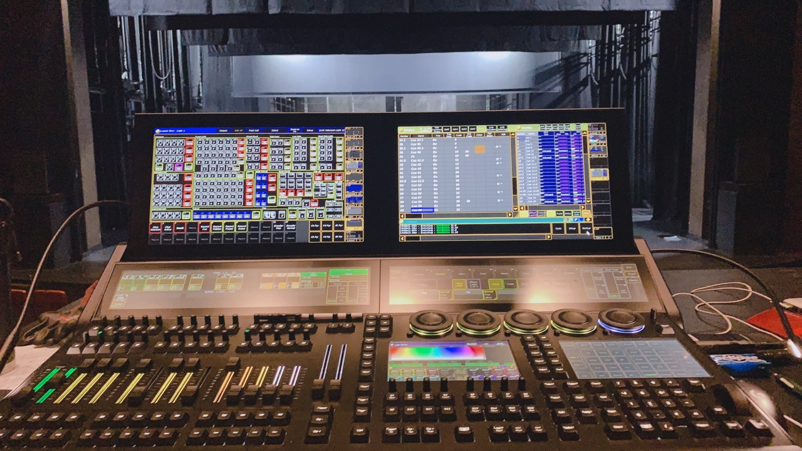
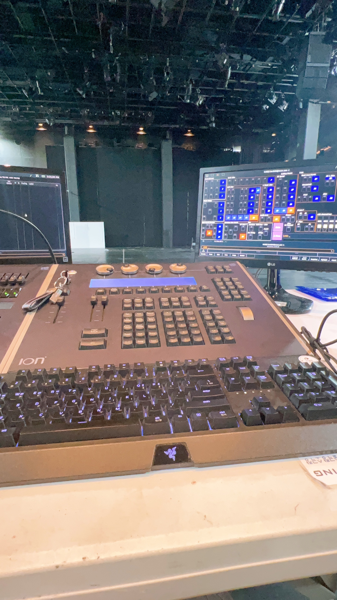
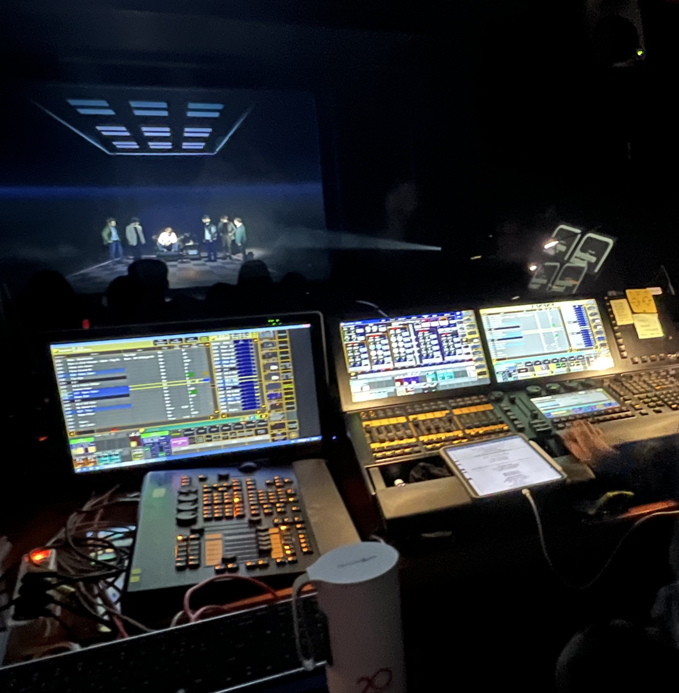

# 2022/06 4주차 주간 리포트

## 주간 작업 목록

---

- [`INVAIZ Studio Basquiat`에서 `id` 사전(맵) 생성 및 매핑 ✅](#invaiz-studio-basquiat에서-id-사전맵-생성-및-매핑-)
- [`MIDI`(조명 콘솔 프로그램) 입력 조사 ✅](#midi조명-콘솔-프로그램-입력-조사-)
- [`SketchUp` 입력 조사 ✅](#sketchup-입력-조사-)
- [관리자 페이지 데이터 시각화 ✅](#관리자-페이지-데이터-시각화-)

---

## `INVAIZ Studio Basquiat`에서 `id` 사전(맵) 생성 및 매핑 ✅

#### 작업 상세 설명

- 기능 사전 맵을 매핑하는 코드를 작성하여 자동으로 기존 기본 제공 기능, 추천 프리셋을 기능 사전 맵을 통해 키 값으로 접근할 수 있도록 하였습니다.
- 모든 기본 제공 기능과 추천 프리셋은 기능 전체 데이터가 아닌 기능 사전에 매핑된 `id` 값으로만 할당되어야 합니다.
- 자동적으로 매핑해주는 코드를 작성하긴 했는데, 수많은 데이터가 `Windows` - `macOS` 간의 이름 불일치 맞춤법 오류, 데이터 타입 불일치 등의 문제가 있어 이를 수작업으로 옮겼습니다.
  - 어느정도 불일치하는 이름의 경우 대부분 수정을 완료하였습니다.
- 이제 특정 기능에 오류가 발생해 변경이 필요할 경우, 하나하나 수정할 필요가 없이 사전에 있는 기능만 수정하면 됩니다.

#### 고려 사항

- `Microsoft Office`, 한글 등에는 `Windows`와 `macOS`의 단축키가 너무 달라 같은 기능을 함에도 불구하고 이름이 다른 경우가 몇몇 있습니다.
  - 이를 검수하는 작업이 필요할 것 같습니다.
- 또한, 기능 사전 맵을 적용한 후 혹시 모를 버그가 발생할 수 있는데, 이를 테스트 코드로는 한계(기능의 이름이 어떠한 기댓값을 요구하는지)가 있기 때문에 수작업을 통한 섬세한 테스트가 필요할 것 같습니다.

---

## `MIDI`(조명 콘솔 프로그램) 입력 조사 ✅

#### 작업 상세 설명

- 고객님의 문의로 `Windows`의 [`grandMA2`](https://www.malighting.com/downloads/products/grandma2/), `macOS`의 [`Eos Family`](https://www.etcconnect.com/Eos-Software/)라는 소프트웨어를 조사하였습니다.
- 해당 소프트웨어는 `MIDI` 입력을 기반으로 동작하는 조명 콘솔 프로그램으로, 기존에 있던 몇몇 니즈와 함께 조명 콘솔 작업자분들에게 좋은 사용성을 제공할 수 있을 것으로 예상된다는 문의로 인해 간단하게 조사를 진행하였습니다.
- 조명 콘솔은 엔코더들을 이용해서 조명기들의 속성값을 조절하는데 역할을 한다고 합니다.
- 상업 뮤지컬과 무용 등에 사용되는 세계적으로 통용되는 콘솔이라고 합니다.
  - 콘서트나 공연에서 화려하게 움직이는 조명을 "무빙 라이트"라고 하는데, 이를 `pan`/`Tilt` 값을 통해 상하좌우를 컨트롤하고, 컬러 값들의 `CMY` 값 혹은 `RGBW` 값을 각 엔코더에 할당하여 해당하는 엔코더 조절을 통해 상하를 컨트롤하고 좌우를 컨트롤하며 `CMY` / `RGBA`에 해당하는 엔코더들을 올리고 깎는 과정을 통해 배합을 한다고 합니다.
  - 작업 환경
    1. 
    2. 
    3. 
- 조명 콘솔 프로그램의 경우 패치(`patch`)라는 과정을 통해 각 기능(`attribute`)들을 활성화시킬 수 있는데, 조명기 같은 경우 세계적으로 다양한 제조사와 모델들이 있어 콘솔 프로그램에 다양한 기능들이 포함되어 있는 조명기 속히 라이브러리(`library`)에서 꺼내와 패치를 해주어야 한다고 합니다.
  - [`gradMA2` 패칭 예제](https://youtu.be/q2HMHn2maDg)
  - [`Eos Family` 패칭 예제](https://youtu.be/NKZt6-XHyXU)
- 하드웨어가 없더라도 소프트웨어 상 패치를 하게 된다면 동작 가능하며, 시뮬레이터를 통해 동작을 시연해볼 수 있습니다.
- 실제 상황에서 실물 콘솔이 없을 경우 마우스 휠을 통해 `pan`/`Tilt` 및 컬러 값들을 조절할 수 있습니다.
- `macOS`에서는 기본적으로 `Camera Raw`나 `Final Cut Pro`와 같이 `Window`에 직접 접근하여 값을 조작하는 등의 방법은 불가능한 것으로 확인되었습니다.
  - 해당 `Window`에 접근 가능한 요소가 보이지 않는 것이 그 이유입니다.
- 여러가지 시뮬레이션 영상 튜토리얼 등을 통해 직접 따라가보려고 했으나, `macOS`라서 그런지 인터페이스의 차이가 있어 시간이 많이 소요되었으며, 아직까지 인터페이스를 동일화하는 방안을 찾지 못하였습니다.
- `MIDI` 입력으로 값을 할당할 수 있으면, `INVAIZ Studio Basquiat`에서 `MIDI` 입력만 커스텀할 수 있게 하여 제공하는 방안을 사용할 수 있는지 확인 중에 있습니다.

#### 고려 사항

- `MIDI` 입력을 사용할 수 있게 되면 음악 프로그램 등도 함께 호환해볼 수 있을 것 같습니다.

---

## `SketchUp` 입력 조사 ✅

#### 작업 상세 설명

- 건축 모델링 프로그램인 [`SketchUp`](https://www.sketchup.com/ko)에서 낮/밤 시간 조절, 엔스케이프 재질 값 등으로 사용 가능한 지에 대한 고객님의 문의가 들어와 조사를 진행하였습니다.
- `SketchUp`은 자체 `SDK`를 제공하고 있으며, 공식 문서를 통해 손 쉽게 개발이 가능할 것 같습니다.
  - [개발자 홈페이지](https://developer.sketchup.com/developers/welcome)
  - [개발자 문서](https://ruby.sketchup.com/)
- `JavaScript`, `Python`와 같은 스크립트 언어, 동적 타이핑 언어, 객체 지향 프로그래밍 언어인 `Ruby`를 통해 개발할 수 있습니다.
  - 문서 확인 결과 [`Shadow`](https://ruby.sketchup.com/Sketchup/ShadowInfo.html)를 통해 낮/밤 시간 조절의 기능은 조작 가능할 것으로 예상되나, [엔스케이프(Enscape)](https://extensions.sketchup.com/extension/bc35cf5e-f2bd-4b65-8d9f-827302d7df55/enscape-for-sketch-up-real-time-rendering-and-virtual-reality) 기능 자체가 확장 프로그램이라 조작 여부 판별이 쉽지 않습니다.
- [개발자 등록 페이지](https://extensions.sketchup.com/application)에서 개발자 등록을 진행하면 `SDK`에 엑세스하고 확장 프로그램을 만들어 `SketchUp` 확장 커뮤니티인 `Extension Warehouse`에 업로드할 수 있는 것 같습니다.

#### 고려 사항

- `SketchUp`은 웹으로도 사용할 수 있을 만큼 거대한 플랫폼인 것 같습니다.
  - 따라서 진입했을 때의 영향력이 꽤나 클 것으로 기대가 됩니다.
- 웹 용 `SketchUp`
  - https://app.sketchup.com/app?hl=ko

---

## 관리자 페이지 데이터 시각화 ✅

#### 작업 상세 설명

- 관리자 페이지에서 열람할 수 있는 시각 그래프를 더 추가하였습니다.
- 대표님의 조사를 통해 알게된 두 가지 분석 솔루션 / 시각화 서비스를 조사하였습니다.
- [Amplitude](https://www.ab180.co/solutions/amplitude)
  - 해당 서비스는 국내 기업 [AB180](https://www.ab180.co/team)에서 서비스하고 있으며, 고객들이 소프트웨어 사용하고 있는 기능들을 코호트, 이벤트로 분할하여 관리할 수 있는 툴입니다.
  - 분석을 위한 다양한 차트와, 잘 사용하기 위해 [사용법](https://academy.ab180.co/) 또한 제공해주고 있습니다.
  - 도입하기 위해선 꼭 기업 간 연락 절차가 필요하며, 아마 유료일 것으로 예상됩니다.
  - 해외 기업 중 [동명의 서비스](https://amplitude.com/)가 있습니다.
- [Mixpanel](https://mixpanel.com/)
  - 해당 서비스는 해외 서비스로 한글 지원이 따로 있지는 않으나, 따로 결제를 하지 않고도 사용자가 `API`를 통해 소프트웨어로부터 데이터를 손쉽게 업로드할 수 있습니다.
  - [초기 진입을 위한 문서](https://mixpanel.com/report/2740237/view/3276241/setup/)와 [`SDK` 문서](https://developer.mixpanel.com/docs/nodejs)를 잘 정리해두었으며 `JavaScript`, `iOS - Objective-C`, `iOS - Swift`, `Android`, `Python`, `Java`, `PHP`, `Ruby`, `Node.js`, `React Native`, `Flutter`, `Unity` 등 다양한 언어의 `SDK`가 존재하기 때문에 웹, 데스크톱 앱, 모바일 앱 모두 사용하기에 용이합니다.
  - 데이터를 업로드하면 그 데이터들을 사용자가 분석하고 싶은 방식으로 그래프를 직접 생성해가며 확인할 수 있다는 자유로움이 굉장한 강점이면서, 또 유의미한 데이터를 얻기 위해 많은 시도 및 조사를 해야한다는 분석에 있어서 초기 진입에 난이도가 있을 수 있다는 단점이 있습니다.
  - 우선 해당 모듈을 통해 현재 분석하고 있는 방식을 대체할 수 있는지 확인하고 있습니다.

#### 고려 사항

- 현재 관리자 페이지는 테스트로 열람 그 자체의 가능성에 초점을 맞추었으며, 현재 로직이 추가되어 감에 따라 시간 소요가 발생하고 있습니다.
  - 이를 최적화하기 위해선 `Front`에서 로직을 작성하는 것이 아닌, `Back`에서 로직을 작성해야 하는데, 서버 소스를 `Nest.js`로 변경한 후에 진행할 지 그 전에 진행할 지 고민 중에 있습니다.

---

## 전달 사항
