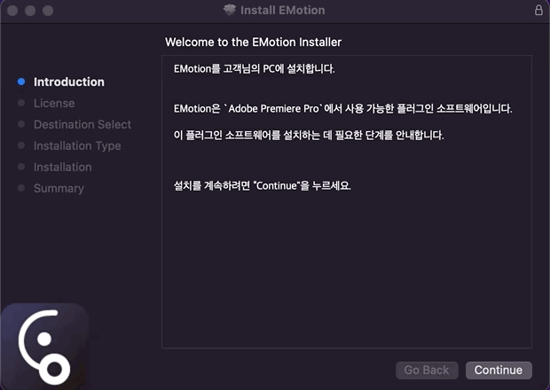

# 2022/06 5주차 주간 리포트

## 주간 작업 목록

---

- [`Prettier`, `ESLint`, `Github Actions` 적용 ✅](#prettier-eslint-github-actions-적용-)
- [현재 프로그램에 호환되지 않는 프리셋 로드 ❌](#현재-프로그램에-호환되지-않는-프리셋-로드-)
- [`Mixpanel` 테스트 탑재 ✅](#mixpanel-테스트-탑재-)
- [에러 처리 레이어 구성 ❌](#에러-처리-레이어-구성-)
- [스크롤 디테일 수정 ✅](#스크롤-디테일-수정-)
- [`macOS` 다중 선택 키 수정 ✅](#macos-다중-선택-키-수정-)
- [`EMotion` 배포 파일 생성 ✅](#emotion-배포-파일-생성-)
- [`macOS` 설치 시 `Adobe Software` 종료 ✅](#macos-설치-시-adobe-software-종료-)

---

## `Prettier`, `ESLint`, `Github Actions` 적용 ✅

#### 작업 상세 설명

- Design System에 적용한 것처럼 `INVAIZ Studio Basquiat`에도 `Prettier`, `ESLint`, `Github Actions`를 적용하였습니다.
- `INVAIZ Studio Basquiat` 배포 및 개발 시 오류를 실수로 누락하는 경우를 방지하기 좋은 방안입니다.
- 현재 문법, 문백 오류 검출 및 자동화, 소스 코드 업로드(PR, Merge) 시 유효성 확인 등의 절차를 거치도록 설정하였습니다.
- 이로 인해 평소 잘못된(위험할 수 있는) 코드를 수정하는 작업을 거쳤고, 추후 새로운 직원이 들어오거나 코딩 컨벤션에 맞지 않는 코드를 작성했을 경우 이를 적발해내기 수월해질 것으로 기대됩니다.

#### 고려 사항

- 규칙은 지속적으로 업데이트해 나갈 계획이며, `INVAIZ Studio Basquiat`, Design System 뿐만 아니라 앞으로의 프로젝트에 기본 구성으로 채택될 예정입니다.

---

## 현재 프로그램에 호환되지 않는 프리셋 로드 ❌

#### 작업 상세 설명

#### 고려 사항

---

## `Mixpanel` 테스트 탑재 ✅

#### 작업 상세 설명

- `Mixpanel`을 통해 용이한 데이터 확인을 할 수 있도록, 우선 테스트로 특정 기능만 탑재하였습니다.
- 현재 테스트해 볼 사항은
  - 데이터 적중률(누락률)이 얼마나 되는가?
  - 데이터 확인 시 얼마나 용이하게 다룰 수 있는가?
  - 한도는 얼마나 되는가?
- 정도가 있습니다.

#### 고려 사항

- 앞서 적은 한도 측면의 문제로, 치명적인 오류가 발생할 가능성이 있습니다. 사전 처리를 진행해두었으나, 한도가 얼마인지 몰라 오류를 미리 테스트해볼 수 없습니다.

---

## 에러 처리 레이어 구성 ❌

#### 작업 상세 설명

#### 고려 사항

---

## 스크롤 디테일 수정 ✅

#### 작업 상세 설명

- 기능 툴팁

  - 기능 툴팁에서 마우스를 올리면 툴팁이 내려가지 않아 클릭 등을 방해하는 사용자 경험을 개선하였습니다.

    

  - 이젠 툴팁에 마우스를 포커스하더라도 바로 내려가도록 설정하였습니다.

    

- 스크롤 바 위치 변경 시 제대로 추적하지 못 하는 현상

  - 스크롤 영역의 내용이 변경되어 스크롤 바의 위치를 다시 잡아야 하나, 그렇지 못한 상태가 발생하였습니다.

    

  - 이에 스크롤 높이 계산 로직을 수정하여 정상적으로 위치시키도록 하였습니다.

    

- 스크롤 감도 조정

  - `Windows`의 경우, 계속해서 스크롤 바를 드래그하여 이동하거나, 특정 영역을 벗어날 경우 마우스 포인터 위치가 처음 클릭한 위치와 맞지 않거나, 드래그가 풀리는 현상을 수정하였습니다.
  - `macOS`의 경우 마우스 휠 이동 시 버벅거리는 움직임과, 스크롤 바를 드래그하여 이동할 때의 이질적인 감도를 모두 수정하였습니다.
  - 수정 전 상태

    

    

  - 수정 후 상태

    

    

  - 실제 `OS`에서 제공하는 스크롤과 거의 유사하게 동작할 수 있도록 하였습니다.

- 스크롤 바 활성화 시 배경 음영 설정

  - 스크롤 바의 활성화 상태를 조금 더 직관적으로 나타내기 위해 배경과 색 변경 처리를 하였습니다.
  - 또, 활성화됐을 경우 모서리가 둥글어지는 상호작용이 있습니다.

    

#### 고려 사항

- 스크롤이 되면서 툴팁이 함께 보여질 경우 약간의 버벅거리는 현상이 있습니다.

---

## `macOS` 다중 선택 키 수정 ✅

#### 작업 상세 설명

- `macOS`에서는 `Windows`와는 달리 `Command` 키로 다중 선택 등의 동작을 하는 것이 익숙하므로, 이를 적용하였습니다.
  
- 겸사겸사 소스 코드도 리팩터링하여 좀 더 중복되는 코드를 삭제하였습니다.

#### 고려 사항

- 기존 사용성과 조금의 차이가 있을 수 있습니다.

---

## `EMotion` 배포 파일 생성 ✅

#### 작업 상세 설명

- `EMotion`을 `macOS`에서도 배포하기 위해 `.pkg` 파일을 생성하였습니다.

  

- 이러한 `.pkg` 파일을 좀 더 수월하게 생성할 수 있도록 스크립트를 구성하였고, 코드 사인 또한 적용하였습니다.

  

- 이미 설치된 버전일 경우 설치되어 있다는 알림을 띄웠습니다.

  

- `Adobe Premiere Pro`가 실행된 상태이면 종료하고 설치할 수 있는 창을 띄웠습니다.

  

- 라이센스를 명시하였고, 최종 설치 완료 시 참고 사이트 등을 안내하였습니다.

  
  

#### 고려 사항

- 모든 환경에서 정상적으로 적용되는 지에 대한 테스트 및 오류가 없는지 확인을 해봐야할 것 같습니다.

---

## `macOS` 설치 시 `Adobe Software` 종료 ✅

#### 작업 상세 설명

- `Adobe Software`이 켜져 있는 상태에서 `INVAIZ Studio Basquiat`를 설치할 경우, `CEP`가 로드되지 않아 `Adobe Software`을 다시 켜지 않으면 사용할 수 없습니다.
- 이에 설치할 때 바로 `Adobe Software`를 감지하고 바로 끌 수 있도록 하는, 만약 끄지 않으면 설치를 하지 않도록 설치 파일을 구성하였습니다.

  

- 또한, `INVAIZ Studio Basquiat` 또한 실행되어 있으면 종료하도록 구성하였습니다.

  

- 설치 파일을 변경하면서 `Windows`, `macOS` 모두 라이센스를 명시하였습니다.

  - `Windows`

    

  - `macOS`

    

- 설치 완료 시 참고할 사이트들을 링크해두었습니다.

  

#### 고려 사항

- 구버전의 `Adobe Software`의 경우 제대로 감지할 수 있는지 확인 작업을 거쳐봐야 알 수 있습니다.

---

## 전달 사항
