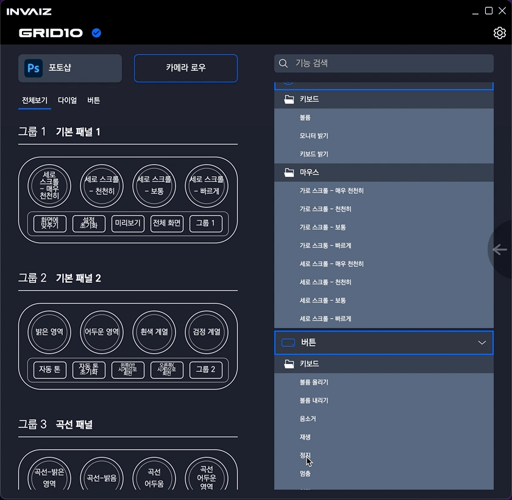
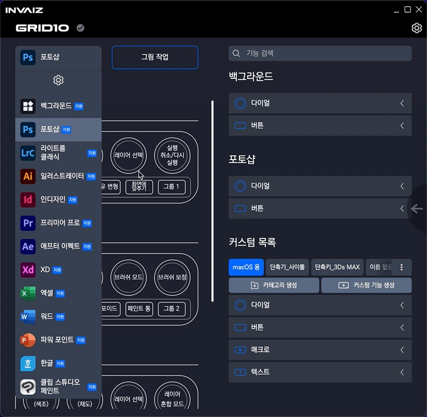
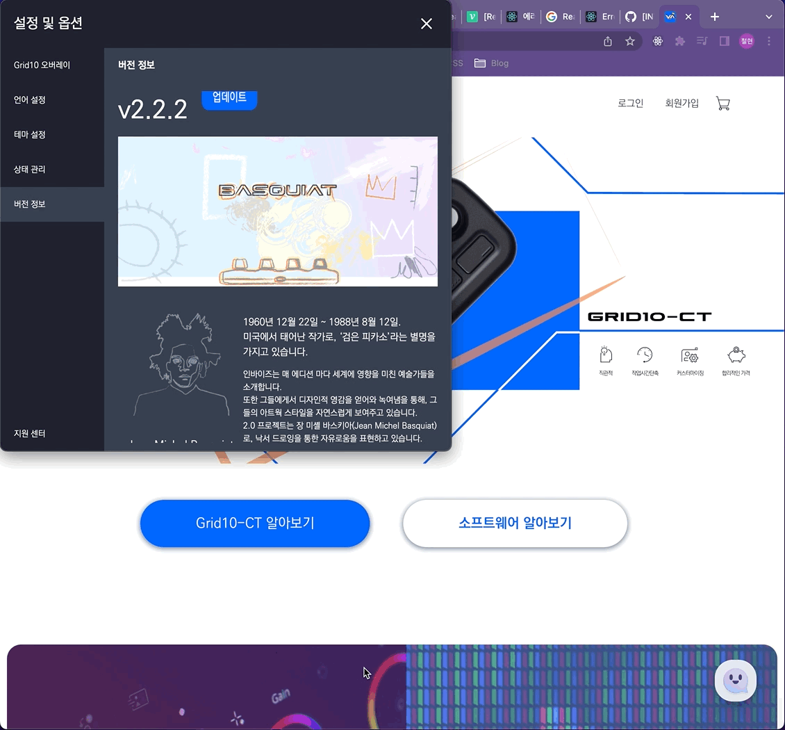
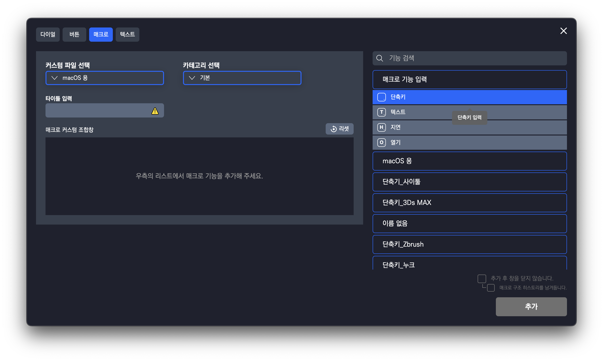
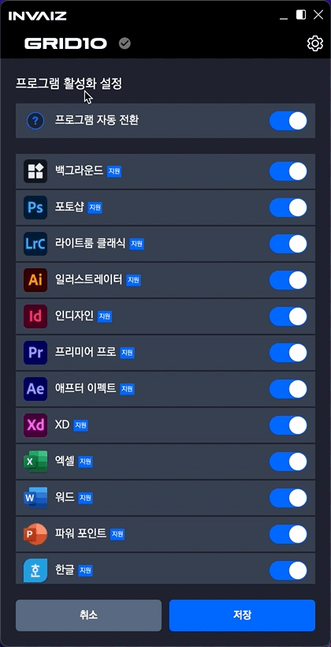
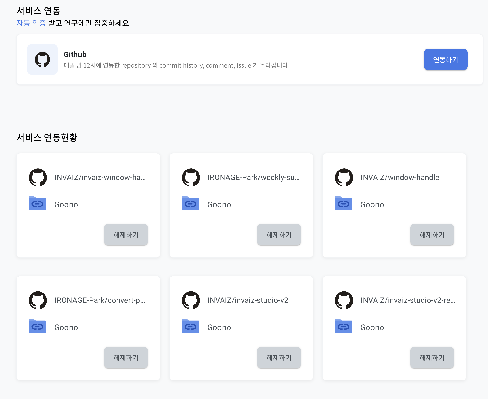
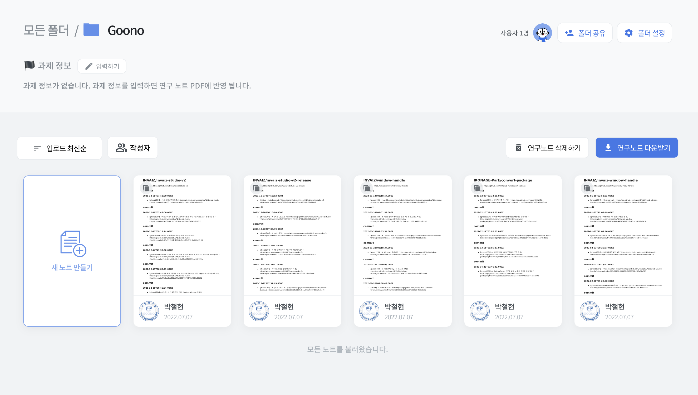
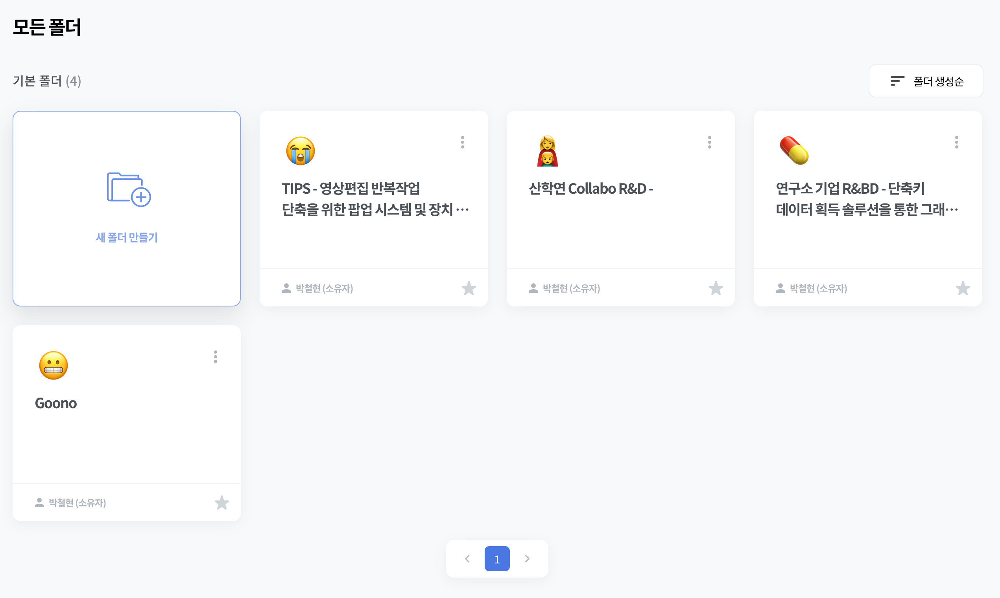
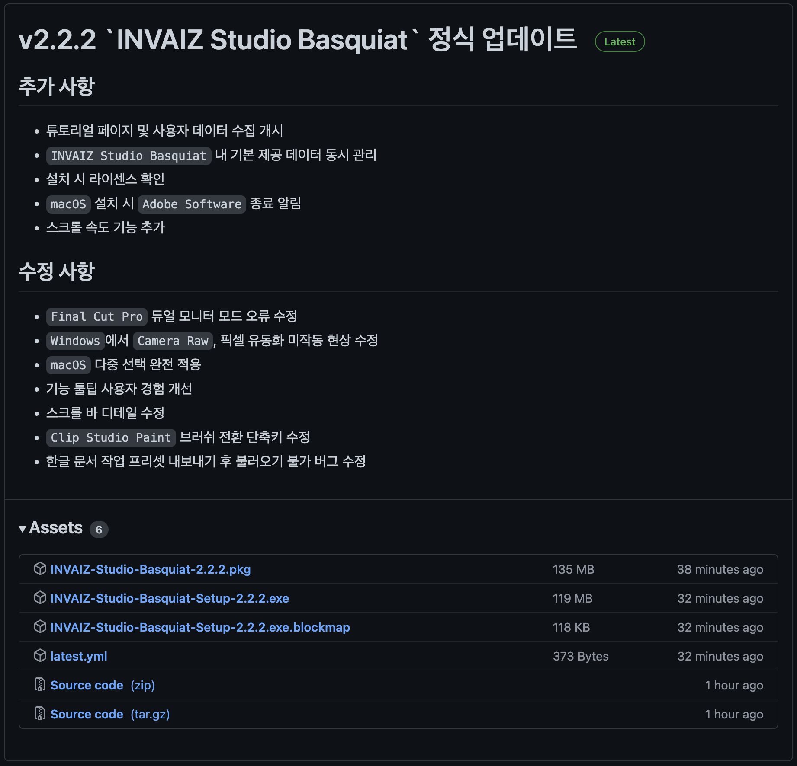

# 2022/07 1주차 주간 리포트

## 주간 작업 목록

---

- [`LG전자` PoC 요구사항 작성 ✅](#lg전자-poc-요구사항-작성-)
- [`INVAIZ Studio Basquiat` 디테일 수정 ✅](#invaiz-studio-basquiat-디테일-수정-)
- [`Goono`에 `Github` 연동 ✅](#goono에-github-연동-)
- [에러 처리 레이어 구성 ❌](#에러-처리-레이어-구성-)
- [현재 프로그램에 호환되지 않는 프리셋 로드 ❌](#현재-프로그램에-호환되지-않는-프리셋-로드-)

---

## `LG전자` PoC 요구사항 작성 ✅

#### 작업 상세 설명

- `LG전자`과 협업하기에 앞서, 자사에 어떠한 문제가 있었고 `LG전자`가 그 문제들 중 어떠한 문제를 해결할 수 있을 것인지 검토 요청하기 위해 자사에 있었던 문제를 정리하여 작성하였습니다.
- 지식 선에서 `LG전자`가 최대한 이해하기 용이하도록 작성하였고, 어떠한 문제들이 있었는지 상세히 기술했습니다.

#### 고려 사항

- 100% 완벽한 기억이 아니므로 누락된 내용이 있을 수 있습니다.

---

## `INVAIZ Studio Basquiat` 디테일 수정 ✅

#### 작업 상세 설명

- 스크롤 속도 기능 추가

  - 기존에 사용하던 가로 / 세로 스크롤은 속도에 제한이 걸려있어 스크롤 속도를 총 4가지 버전으로 추가 제공하였습니다.

  

- 업데이트 배포 전 불필요한 코드 제거, 잘못 설정된 환경 수정 등 리팩터링 작업을 진행하였습니다.
- 또한, `Github Actions`에서 `Windows`의 경우 정상적으로 처리되지 않는 상황을 확인하였고, 이를 수정하여 버그가 발생하지 않도록 조치하였습니다.
- 업데이트 후 피드백 받은 세 가지 사항과 추가적으로 툴팁 디테일을 수정하였습니다.

  1. 모든 툴팁에 대해서 호버로 인한 다른 `UX` 방해 이슈 해결

     

  2. 소프트웨어 업데이트 파일 다운로드 시 페이지 `URL` 변경

     

  3. 매크로에서 단축키의 경우, 툴팁에서 아무 것도 뜨지 않는 상태 변경

     

  4. (추가) 프로그램 자동 전환 설명 툴팁의 디자인을 조금 수정하였습니다.

     

     - 테두리 색깔을 변경하였고, 화살표가 마우스를 기준으로 따라오도록 수정하였습니다.

#### 고려 사항

---

## `Goono`에 `Github` 연동 ✅

#### 작업 상세 설명

- `Goono` 가입 후 `Github` 연동 기능이 있어 시도해보았습니다.
- 성공적으로 아이디는 연동이 되었으나, `public repository`에만 접근이 가능했고 문의를 통하여 `private repository`에 접근 가능하도록 절차를 밟았습니다.
  
- `Github` 연동은 매일 12시에 커밋 내역이 업로드된다고 하며, 다음과 같은 파일들로 추출됩니다.
  
- 그리고 앞으로의 R&D 진행을 위해 우선 폴더를 만들어 놓았으나, 어떻게 개설하여 어떤식으로 관리할 지에 대한 논의가 필요합니다.
  
- 추가적으로 `Goono` 및 연구노트 사용법에 대한 메뉴얼을 한 번 정독하였습니다.

#### 고려 사항

- 메뉴얼을 정독하긴 했지만 생각보다 분량이 많고 내용 중 까다로운 조건이 많아 여러 번 검토해봐야 할 것 같습니다.
- `Goono`와 `Github`로 모든 것을 충당하긴 어려워 보이니 수작업 등에 시간이 좀 할애될 것 같습니다.

---

## 에러 처리 레이어 구성 ❌

#### 작업 상세 설명

- 좀 더 효율적이고, 확실하며 다양한, 그리고 모든 상황에서 유연한 에러 처리를 위해 에러 처리 레이어를 새로 구성하기 위한 설계 절차를 거치고 있습니다.
- 에러 레이어만 새로 깔면 될거라 판단하고 쉽게 생각했는데, 생각보다 어려워서 지금까지 에러 처리를 위해 작성했던 소스를 약 4번 갈아 엎었습니다... 그래서 좀 늦어지고 있습니다.
- 하지만 앞으로 기능 실행 에러 메시지 출력할 때 다국어를 지원한다거나, `INVAIZ Studio Basquiat`에서 `UI` 조작 시 에러가 발생했을 때 추상적인 메시지가 아닌 구체적인 메시지를 출력하는 등의 작업을 위해 필수적이며, 더 나아가서 사용자들에게 오류가 발생했을 때 오류를 보고 받고 쓸데 없는 오류 로그를 삭제하여 사용자들에게 더 빠른 피드백 및 오류 해결 방안을 제시할 수 있도록 하는 기반입니다.

#### 고려 사항

- 소프트웨어 개발에서 중요한 부분인데도 불구하고 레퍼런스나 정형화된 공식이 없어서 탐구에 꽤나 오랜 시간을 사용하게될 것 같습니다.
- 또한, 에러 처리 레이어 구성은 말 그대로 기틀 마련이므로 추후 지금까지 어떤 에러가 있었는지 구체적으로 분석하여 이를 모두 처리하는 로직을 작성해야 하기 때문에 장기적으로 진행해야할 것 같습니다.

---

## 현재 프로그램에 호환되지 않는 프리셋 로드 ❌

#### 작업 상세 설명

- 에러 처리 레이어 구성이 완료된 후 가장 처음 적용할 기능입니다.
- 현재는 프리셋을 로드했을 때, 어떤 프로그램에 맞는 프리셋인지는 알지만 이 레이어가 불명확하여 호환되지 않는 프리셋을 다른 프로그램에 바로 집어 넣으려면 구성을 전부 변경해야 하는 상황입니다.
- 에러 처리 레이어 구성이 완료되면 비교적 손 쉽게 구현할 수 있을 것으로 예상됩니다.

#### 고려 사항

- 이 경우, 현재는 그저 알림창으로 "현재 프로그램에서 사용할 수 없는 프리셋입니다." 라는 메시지를 띄워놓았지만, 어떻게 처리할 지에 대한 결정과 그 방법을 표현한 디자인이 필요할 것 같습니다.
- 현재 저 알림창이 뜨는 이유는 프리셋 추가 창이 한 프로그램에 국한되어 있으며, 프리셋 추가 창에서 현재 프로그램이 아닌 다른 프로그램의 프리셋을 추가하게 되면 어쩔 수 없이 띄우는 메시지 창입니다.
  - 그런데 생각보다 사용자들이 이 사용성을 이해하지 못하며, 불편함을 겪고 문의가 자주 오고 있습니다.
  - 이유는 아무래도 현재 디자인에서 프리셋 설정 창에 들어가면 어떤 프로그램이 활성화되어 있는지 확인할 수 없기 때문으로 예상되며, 이에 대한 해결책이 필요합니다.

---

## 전달 사항

> 2022.07.06(수) `INVAIZ Studio Basquiat` 2.2.2 버전(정식버전) 런칭.
