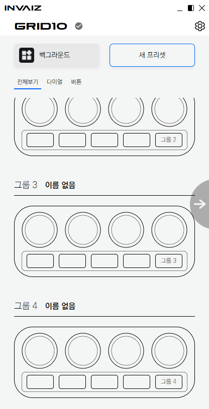

# 2022/07 2주차 주간 리포트

## 주간 작업 목록

---

- [플러그인에서 구독 결제를 사용하기 위한 프록시 서버 구성 및 샘플 코드 작성 ✅](#플러그인에서-구독-결제를-사용하기-위한-프록시-서버-구성-및-샘플-코드-작성-)
- [`INVAIZ` 서버 소스 코드 재구성 ✅](#invaiz-서버-소스-코드-재구성-)
- [에러 처리 레이어 구성 ✅](#에러-처리-레이어-구성-)
- [LG전자 Kick off 미팅 ✅](#lg전자-kick-off-미팅-)
- [현재 프로그램에 호환되지 않는 프리셋 로드 ✅](#현재-프로그램에-호환되지-않는-프리셋-로드-)

---

## 플러그인에서 구독 결제를 사용하기 위한 프록시 서버 구성 및 샘플 코드 작성 ✅

#### 작업 상세 설명

- 플러그인 구독 결제 시, 플러그인(클라이언트)에서 구독 서버로 바로 요청을 보낼 경우, `Secret Key` 등의 민감한 데이터가 유출될 가능성이 있으므로 이를 대행해 줄 프록시 서버를 구성하였습니다.
- 기존 `Express`로 이루어진 `API` 서버와는 달리, `Express` 기반의 `Nest`를 사용하였으며, `DB` 또한 `TypeScript`에 좀 더 최적화된 `TypeORM`을 채택하였습니다.
- 현재 구독 서버의 가입 정보를 바탕으로 클라이언트에서 링크(클라이언트 가입)하는 기능과, 이 링킹된 아이디를 통한 로그인 및 토큰 발급, 그리고 구독 정보 받아오기 기능을 구현하였습니다.
- 샘플 코드를 통해 어떤 정보를 받아올지 설정하고, 만료 기한 혹은 라우팅 등을 언제든지 수정 가능합니다.

#### 고려 사항

- 현재는 어디에도 가입되지 않은 상태(상태 0), 구독 서버에서 제공된 홈페이지 가입(상태 1), 구독 서버와 링킹된 프록시 서버에도 가입(상태 2) 세 가지 상태로 구분하고, 구독 서버에서 가입 및 결제 후 클라이언트에서 가입하는 형식으로 진행 중이지만, 이 방법은 중간에 가로챌 가능성이 농후하기 때문에 위험합니다.
- 따라서 추후 구독 서버와의 문의로 구독 서버의 `API`를 수정하여 클라이언트나 구독 서버 둘 중 하나에서만 가입하고, 그 아이디 하나만을 사용할 수 있도록 진행할 계획입니다.

---

## `INVAIZ` 서버 소스 코드 재구성 ✅

#### 작업 상세 설명

- 현재 `INVAIZ`의 백엔드는 두 가지 형태로 구현되어 있습니다.
  - `JavaScript` 기반의 `Express`
  - `TypeScript` 기반의 `Express`
- 실제로 런칭되고 있는 형태는 `JavaScript` 기반이며, 현재 서버 자체가 레거시 코드를 수정하지 않고, 구조가 제대로 설계되어 있지 않은 상태로 오랫동안 남겨진 코드에 필요한 코드만 리팩터링 없이 얹어 놓은 구조라 수정하기 매우 까다롭습니다.
- 이에 작년에 `TypeScript`로 변경을 진행하면서 구조를 조금 수정하려 했으나, 그 사이에도 `JavaScript` 서버에 응급처치를 진행한 부분이 많아서 실제 런칭하기 어려운 상태입니다.
- 상기 기술한 플러그인 프록시 서버 구성과 관련하여, 추후 백엔드 서버를 `Nest`로 변경할 계획입니다.
- 그에 앞서 기존 서버 소스 코드를 재구성하였습니다.
- `JavaScript`로 작성되어 있던 소스를 `TypeScript`로 변환하고, 백엔드 기본 레이어 구조인 `Controller` / `Service` / `Model` 구조를 적용하였습니다.
- `Webpack`을 통해서 빌드하며, 기존 `DB` 모델링과 추가된 모델들을 선언하였습니다.
- 버전 간 호환성을 갖추기 위해 테스트하는 작업을 진행 중에 있습니다.
  - 현재 `JavaScript` 서버 코드가 `1.2.0` 버전이라면, `TypeScript` 서버 코드는 `0.9.0` 버전이었기 때문에, 이를 `1.2.0` 버전과 동일한 기능을 할 수 있도록 마이그레이션하고, 테스트하는 작업입니다.

#### 고려 사항

- `Nest`와 `TypeScript + Express`의 장단점을 제대로 비교하고, 체감하지 못한 관계로 이부분에 대해서는 개인 프로젝트를 통해 두 가지 방법 모두 구현해보고, 어떤 것을 실제로 적용할지 판단할 계획입니다.
  - 공부가 동반되는 작업이라 장기적으로 진행하겠습니다.
- 또 가능하다면, 기존 소스의 엔트리 포인트(진입점)을 엎은 뒤 `GraphQL`을 적용해볼까 고려 중에 있습니다.

---

## 에러 처리 레이어 구성 ✅

#### 작업 상세 설명

- `INVAIZ Studio Basquiat`의 에러 발생 가능성이 있는 부분을 전부 체크하여 정리한 후, 이 중 가장 처리하기 적합한 부분을 각 엔트리 포인트 앞에 선언하여 한 번에 처리할 수 있는 레이어를 설정하였습니다.
- 각 에러는 에러 타입으로 모두 분할하여 `class`로 선언하였고, 에러 처리 부에서는 이 `class`의 타입을 통해 적절한 에러 대응을 진행하는 로직을 작성합니다.

#### 고려 사항

- 효율적인 방법을 생각해내기 위해 여러 방법(계속 작성했다 갈아 엎는 형태를 반복)을 작성했지만, 아무리 해도 모든 방법이 애매해서 급한대로 마지막에 생각난 방법을 적용하였습니다.
- 따라서 추후 예상치 못한 기능 추가에 의한 버그 대응에 효율적이지 못할 수 있습니다.

---

## LG전자 Kick off 미팅 ✅

#### 작업 상세 설명

- 2022/07/15(금) 오전 09:00부터 `Zoom`을 통하여 `LG전자`와 미팅을 진행하였습니다.
- 미팅 주제는 다음과 같습니다.
  - 개발 품목 협의와 관련하여 최종 결과물을 선정.
  - 월별 스케줄 설정.
- 자세한 회의 내용은 [`Notion`]에 업로드하였습니다.

#### 고려 사항

- 10월 31일 마감이므로 수행해야 할 일이 많아졌습니다...

---

## 현재 프로그램에 호환되지 않는 프리셋 로드 ✅

#### 작업 상세 설명

- 현재 프로그램에서 사용할 수 없는 프리셋을 로드할 때, "현재 프로그램에서 사용할 수 없는 프리셋입니다." 라는 알림창만 띄우고 프리셋을 로드하지 않았는데, 이럴 경우 사용자들이 프리셋 파일에 문제가 있다고 인식을 할 가능성이 높아 이를 개선하기 위한 대안을 작업하였습니다.
- 현재 디자인은 생각 중이나, 다른 소프트웨어에서 자주 사용하는 방식인, 모달을 통해 어떤 프리셋들이 오류가 났는지 알려준 후, 수정할 수 있는 경우 오류를 해결할 수 있도록 도와줄 수 있도록 계획하고 있습니다.
  
- 에러 정의를 통해 현재 총 4가지(다른 프로그램의 프리셋, 다른 기기의 프리셋, 다른 운영체제의 프리셋, 파일 손상)의 상태를 보여줄 수 있으며, 파일 손상은 로드할 수 없고, 다른 운영체제의 경우, `control`과 `command` 만을 변경한다는 메세지를 통해 로드할 수 있도록 진행 중입니다.

#### 고려 사항

- 프리셋 불러오기 외에도 많은 에러를 각 `OS` 별 알림 창이 아닌, `INVAIZ Studio Basquiat`에서 렌더링 가능한 알림창을 사용하는 편이 바람직해 보입니다. 이에 따른 디자인을 고려해야 합니다.

---

## 전달 사항
