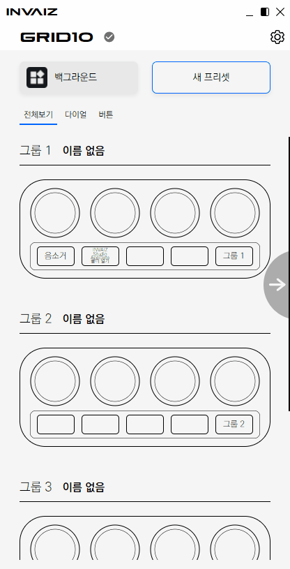
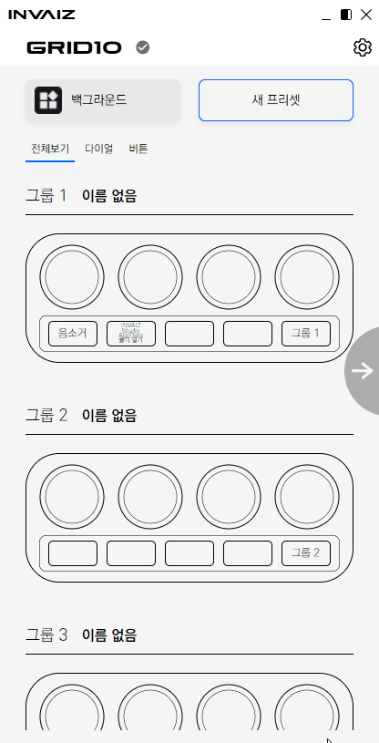
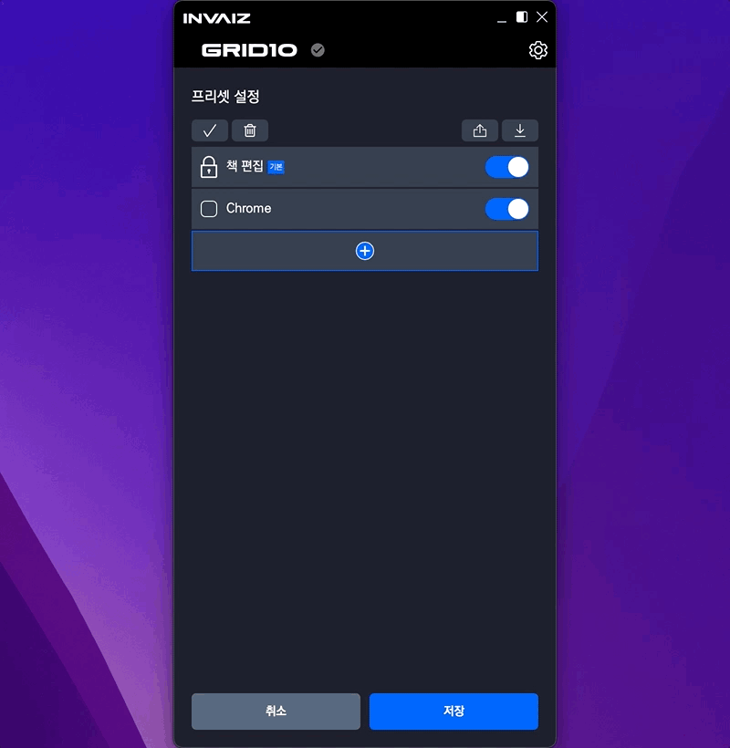
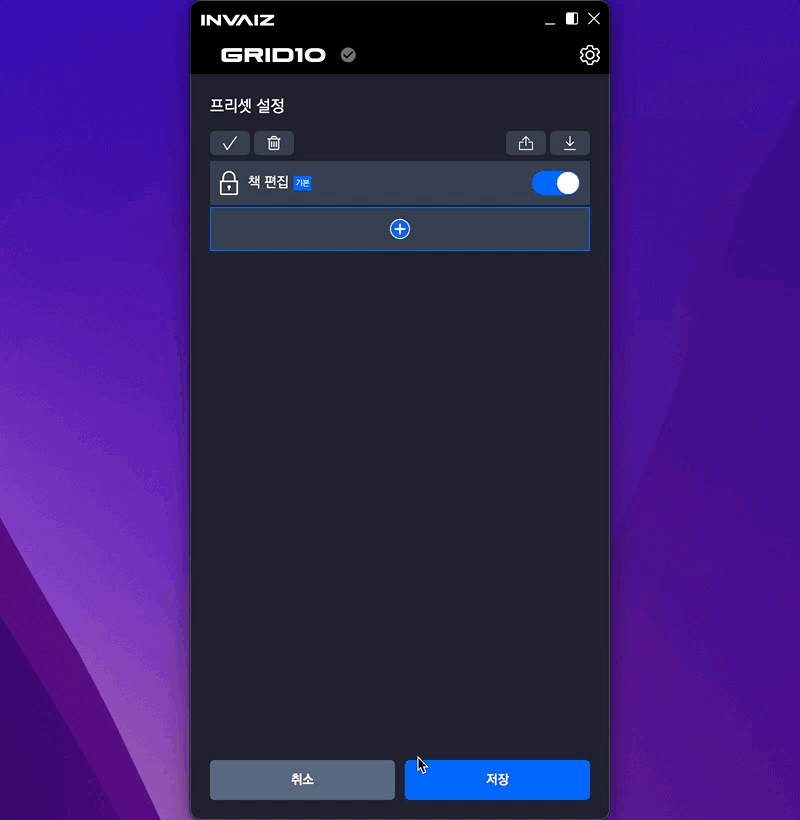

# 2022/07 3주차 주간 리포트

## 주간 작업 목록

---

- [`Windows`에서 `dialog` 로드 시 응답 없음 현상 수정 ✅](#windows에서-dialog-로드-시-응답-없음-현상-수정-)
- [호환되지 않는 프리셋(제품, 운영체제, 프로그램) 로드 ✅](#호환되지-않는-프리셋제품-운영체제-프로그램-로드-)
- [`Mac M1` 제품에서 `CEP` 파일 로드할 수 없는 버그 수정 ✅](#mac-m1-제품에서-cep-파일-로드할-수-없는-버그-수정-)

---

## `Windows`에서 `dialog` 로드 시 응답 없음 현상 수정 ✅

#### 작업 상세 설명

- `Windows`에서 가끔 파일 불러오기/내보내기 등의 창(`dialog`)를 로드하려고 하면, 응답 없음이 뜨면서 `INVAIZ Studio Basquiat`가 정지되는 현상이 있었습니다.
- 해당 버그는 확인 결과 정확한 이유는 모르겠지만 프로그램 리스트의 현재 실행 중인 프로그램 리스트를 불러오고 난 후에 발생하는 버그인 것 같습니다.
- 버그 상황

  

- 수정 상황

  

#### 고려 사항

- `Windows`에서는 `dialog`를 동기 방식으로 실행시키는 것에 문제가 있는 것 같아 모든 `dialog`를 비동기 호출로 변경하였습니다.
- 하지만, 정확한 이유를 모르는 상태로 추론하여 수정한 버그이기 때문에, 다른 원인에 의해 발생할 가능성도 존재합니다.

---

## 호환되지 않는 프리셋(제품, 운영체제, 프로그램) 로드 ✅

#### 작업 상세 설명

- 호환되지 않는 프리셋을 정상적으로 로드할 수 있도록 도와주는 마법사를 추가하였습니다.
- 버전이 업데이트되어 감에 따라 프리셋의 형식이 변경되었고, 이에 따라 최신 버전에서 이전 버전의 프리셋을 로드하려고 할 때 오류가 발생하였는데, 이를 최대한 사용자들에게 편리하게 노출할 수 있도록 해주는 창입니다.
- 프리셋을 로드할 때 크게 4가지의 문제가 발생할 수 있습니다.
  1. 잘못된(손상되거나 버전이 업데이트되면서 호환하기 난해한) 프리셋을 추가하려는 경우
  2. 다른 프로그램의 프리셋을 추가하려는 경우
     - Ex) `Adobe Photoshop`의 프리셋 목록에 `Adobe InDesign` 프리셋을 추가하려고 한다.
  3. 다른 운영체제의 프리셋을 추가하려는 경우
     - Ex) `Windows`의 프리셋을 `macOS`에 추가한다.
  4. 다른 제품의 프리셋을 추가하려는 경우
     - Ex) `Grid Pro`의 프리셋을 `Grid10`에 추가한다.
- 이 중, 2~4번까지의 경우에는 `INVAIZ Studio Basquiat`에 후속 조치를 통해 프리셋을 추가할 수 있도록 하였습니다.
- 전체 프리셋 불러오기 예시

  

  1. 잘못된 프리셋을 추가하려는 경우

     

     - 잘못된 프리셋은 현재 일반적인 방법으로 데이터를 추가할 수 없습니다.
     - 현재는 개발자에게 직접 문의하여 수정된 파일을 받는 방식으로 진행해야 하며, 추후 로그를 서버로 전송하여 개발자가 바로 조치를 취할 수 있도록 계획 중에 있습니다.

  2. 다른 프로그램의 프리셋을 추가하려는 경우

     

     - 다른 프로그램의 프리셋은 해당 프로그램으로 바로 프리셋을 추가해줍니다.
     - 현재 활성화된 프로그램을 추가한 프리셋의 프로그램으로 바로 변경해주는 기능도 고려를 해보았지만, 불러오기를 여러 개 하기 때문에 난해하므로 좀 더 고민해 보아야 할 것 같습니다.

  3. 다른 운영체제의 프리셋을 추가하려는 경우

     

     - 다른 운영체제의 프리셋을 추가할 때, 단축키 기능의 경우 `Command`와 `Control`의 치환 여부를 물어봅니다.
     - `Windows` <-> `macOS`에서, 보통 `Control` 키와 `Command` 키만 다른 경우가 많으므로 질문을 통한 추가 여부를 물어보는 기능을 추가하였습니다.

  4. 다른 제품의 프리셋을 추가하려는 경우

     

     - 다른 프로그램과 마찬가지로 다른 제품의 현재 프로그램으로 바로 프리셋을 추가해줍니다.

- 복합적인 경우(다른 제품/다른 운영체제/다른 프로그램 등 조합) 예시

  

  - 복합적인 경우, 제품 -> 운영체제 -> 프로그램 순으로 오류를 다시 사용자에게 인식하여 사용자가 다음에 프리셋을 추가할 경우 어떤 절차를 거쳐야하는 지 좀 더 직관적으로 나타내었습니다.
  - 한 번에 메세지를 모두 보낼 경우 가독성이 떨어져서 위와 같은 방식을 선택하였습니다.

#### 고려 사항

- 다른 프로그램의 프리셋을 추가할 수 없는 이유는, 프로그램마다 단축키가 다르며 기본 제공 프로그램의 경우 해당 프로그램에 종속적인 기능을 제공하는데 종속적인 기능과 프로그램 자동 전환 기능이 함께 동작했을 때 무의미한 동작이 연출될 수 있기 때문입니다.
- 에러 레이어를 통해 위와 같은 기능을 만들 수 있었으나, 코드가 난잡한 부분이 많아서 리팩터링에 시간을 많이 쏟았습니다.
  - 물론 현재 코드도 마음에 들지 않아 큰일입니다.
  - 계속 손보겠습니다.
- 이제 전체 설정 불러오기와 같이 파일을 직접 드래그하여 불러오는 방식을 개발할 수 있으며, 커스텀 파일 등 다른 외부 파일 로드에 모두 적용할 수 있을 것으로 기대됩니다.

---

## `Mac M1` 제품에서 `CEP` 파일 로드할 수 없는 버그 조사 ✅

#### 작업 상세 설명

- `Mac M1`에서 간혹 `CEP`를 사용하는 `Adobe Software`에서 `CEP`가 정상적으로 동작하지 않는 현상이 발생하고 있습니다.
- 해당 버그를 확인해본 결과, `CEP` 통신을 위한 포트 파일을 생성하는 부분에서, 접근 권한 이슈가 발생하는 것으로 확인되었습니다.
  - 이는 `Adobe Software`에서 `CEP` 통신을 위한 포트 파일을 생성하는 접근 권한을 제대로 부여받지 못한 것으로 예상됩니다.
  - 이에 두 가지 해결 방안이 있습니다.
    - 첫 번째는 `Adobe Software`에서 강제적으로 권한을 얻어내는 방법입니다.
    - 두 번째는 `INVAIZ Studio Basquiat` 실행 시, 해당 포트 파일을 작성할 폴더를 미리 생성해주는 방법입니다.
    - 첫 번째 방법이 이상적이나 제대로 되는지 확인 중에 있으며, 만약 불가능하다면 두 번째 방법을 사용해야 하는데 두 번째 방법은 `Adobe Software`와 상관없이 반드시 `INVAIZ Studio Basquiat`와 `Adobe Software`를 재실행해야 정상적으로 동작하는 불편함이 있을 수 있습니다.
      - 이 불편함은 만에 하나에 대한 상황을 가정한 것이므로 무의미합니다.
- 또한, 간혹 `CEP` 설치 자체가 안 되는 경우가 있어, 설치 파일의 `postinstall`에서 접근 권한을 가져오는 명령어를 통해 강제로 접근 권한을 취득할 수 있도록 하였습니다.

#### 고려 사항

- 제일 문제인 것은 현재 보유 중인 컴퓨터에서는 해당 문제가 발생하지 않아 추론에 의한 버그 수정을 해야한다는 것입니다.
- 즉, 지금까지는 수동으로 수정을 부탁드렸으나 또 다른 컴퓨터에서는 해당 버그가 고쳐지지 않아 발생할 가능성이 있습니다.

---

## 전달 사항
