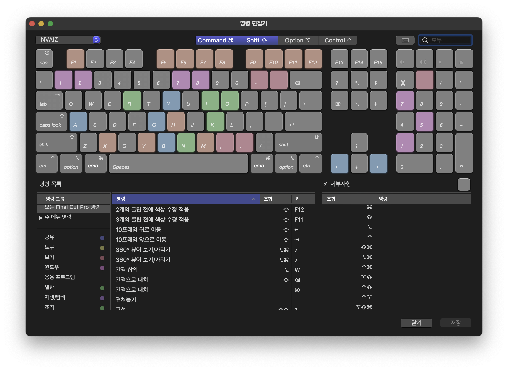
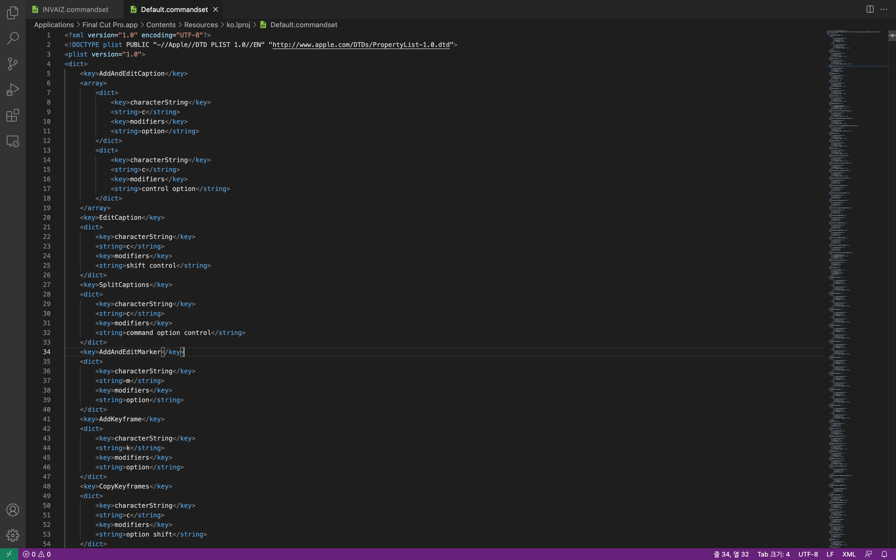
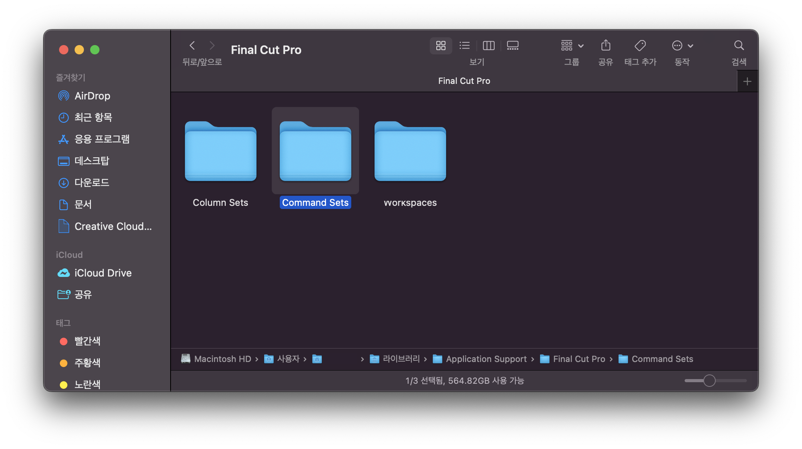
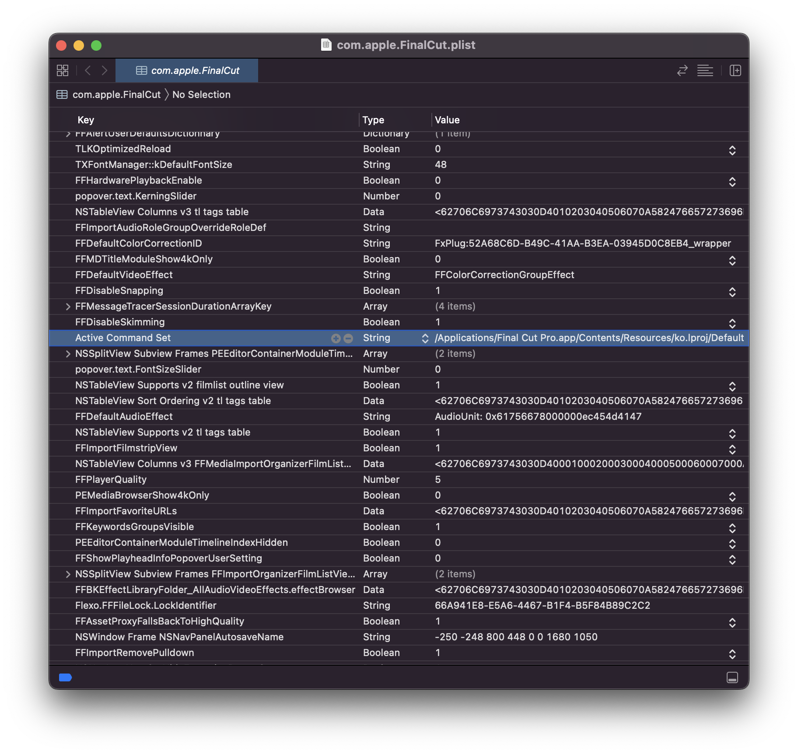

# `Final Cut Pro`의 단축키 집합 `Command Set`

- `Final Cut Pro`의 단축키 시스템은 사용자가 커스터마이징 가능하여 가져오거나 내보낼 수 있는 `Command Set`(명령 세트, 단축키 집합)의 형태로 구성됨.
- 모든 단축키를 재설정, 커스터마이징 할 수 있으며, 사용자 설정 명령 세트 시스템을 지원하여 `Command Set` 파일을 사용자 시스템 폴더를 통해 주입할 수 있음.

## `Command Set` 기본 정보

- `Command Set` 파일의 확장자: `.commandset`
- `Command Set` 파일을 주입하는 폴더 경로: `/Users/{USER_NAME}/Library/Application Support/Final Cut Pro/Command Sets/`
- 현재 `Final Cut Pro` 애플리케이션에서 설정된 `Command Set` 정보: `/Users/{USER_NAME}/Library/Preferences/com.apple.FinalCut.plist` 파일 -> `Active Command Set` 키를 통해 활성화된 `Command Set` 파일의 경로를 확인 가능.

## `.commandset` 파일

- `XML` 파일 구조로, `key`를 통해 커스터마이징할 기능의 이름을 매핑하고 `array`를 통해 해당 기능에 적용할 커스터마이징 단축키를 정의함.
- `keys`의 경우 사용할 키를 그대로 작성.
- `modifiers`의 경우 띄어쓰기로 구분하여 나열하는 방식.
- 직접 정의하기 어려울 경우 `Final Cut Pro`에 내장된 명령 편집기를 통해 기능을 모두 매핑한 후 내보내기하여도 됨.

## `Command Sets` 폴더

- 해당 폴더에 `.commandset` 파일을 주입하면, `Final Cut Pro` 실행 시 해당 파일의 이름을 사용자 설정 명령 세트로 로드함.

## `com.apple.FinalCut.plist` 파일

- 현재 `Final Cut Pro` 애플리케이션에서 사용 중인 설정 값들을 저장하고 있는 파일.
- `Active Command Set` 키를 통해 현재 활성화된 명령 세트 파일의 위치를 알 수 있음.
  - 이를 통해 현재 활성화된 명령 세트의 위치 파악 -> 해당 파일을 읽고 처리 -> 현재 특정 기능에 어떤 단축키가 매핑되어 있는지 확인 가능.
  - 따라서, 단축키를 하나하나 알 필요가 없이 활성화된 명령 세트를 통해 기능 이름으로 해당 기능을 실행할 수 있음.
