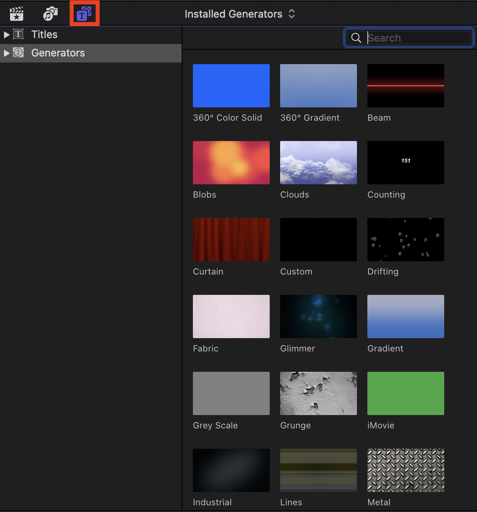

# `Final Cut Pro` 레이아웃

- 라이브러리

  

- 이벤트

  

- 키워드 콜렉션

  

  - 키워드 콜렉션 안에 파일들이 들어있음.

- 번들

  

- 전체 레이아웃

  

- 좌측 헤더

  

  - `Import` 버튼

    

    - 미디어 불러오기 상태 창을 띄움

      

  - `Keyword Editor` 버튼

    

    - 키워드에 대해서 관리할 수 있는 버튼

      

  - `Background Tasks` 버튼

    

    - `Final Cut Pro`가 백그라운드에서 하고 있는 렌더링 작업이나 트랜스 코딩 작업 등등 작업 상태를 보여주는 역할

      

- 우측 헤더

  

  - `Browser` 토글

    - 죄측 상단의 `Browser` 탭을 켜고 끔

      

  - `Timeline` 토글

    - 하단에 있는 `Timeline`을 켜고 끔

      

  - `Inspector` 토글

    - 우측 상단의 `Inspector` 탭을 켜고 끔

      

  - `Share` 버튼

    

    - 시퀀싱 마무리 후 최종적으로 영상을 공유할 때 사용
    - 영상 공유 및 출력과 관련

      

- `Browser`(좌측 상단)

  

  - 영상 소스 관리 탭

    - `import`한 영상이나 소스 등을 확인

      

  - 효과음 관리 탭

    - `Login Pro`, `iTunes`, `Final Cut` 내장 등 작곡, 재생한 음악 등을 확인

      

  - 효과 관리 탭

    - `Titles`, `Generators` 두 가지 효과 등을 확인
    - 돈 주고 산 프리셋이 포함

      

- `Viewer`(중앙 상단)

  

  - `Source Monitor`

    - `Browser`에서 선택한 영상 소스에 대해서 확인
    - 작업하고 있는 클립에 대해서 확인

      

  - `Scale select`

    - `Source Monitor`의 확대 비율 설정

      

  - `View select`

    - 레이아웃 등등 모니터를 어떻게 볼지(레이아웃 등), 기타 효과

      

  - `Transform`

    - 클립을 변형, 자르기, 왜곡하는 곳

      

  - `Auto Enhancement`

    - 클립이나 사운드에 대해서 자동 보정 효과 모음

      

  - `Retiming`

    - 클립의 속도, 역재생 등 조절
    - 클립 선택 시 활성화

      

  - `Monitor`

    - 재생 버튼(`space`)
    - 현재 시간:분:초:프레임

      

  - `Audio Monitor` 토글

    - 우측 하단에 `Audio Monitor`를 켜거나 끔

      

  - `FullScreen` 버튼

    - 전체 화면으로 보여줌
    - 누름과 동시에 자동 재생

      

- `Inspector`(우측 상단)

  - 타이틀, 텍스트, 영상, 음성 등 효과를 주기 위한 파라미터를 조정하는 곳
  - 각각 `Inspector`들이 모여 있음.

    

- `Index`(좌측 하단)

  - 시퀀스에서 사용된 클립, 태그, 부여한 역할 등을 검색하고 찾아볼 수 있는 색인 기능 담당하는 곳

    

- `Insert Clips`(좌측 하단)

  - `Browser`에서 소스를 가져올 때 어떤 방식으로 불러올 것인지 담당

    

- `Insert Options`(좌측 하단)

  - `Browser`에서 소스를 가져올 때 영상, 소리 선택 결정

    

- `Tools`(좌측 하단)

  - 시퀀싱에 사용할 도구 선택

    

- `Project Status`(중앙 하단)

  - 작업하는 프로젝트의 이름, 총 길이

    

- `Timeline Options`(우측 하단)

  - 실시간 스크러빙 활성화 토글

    - 마우스가 가는 대로 실시간으로 영상을 디코딩하여 보여줌

      

  - 실시간 스크러빙 시 소리 출력 토글

    - 스크러빙을 할 때 소리도 함께 나옴
    - 실시간 스크러빙 활성화 시에만 가능

      

  - 솔로 기능 버튼

    - 클립 선택 후 활성화 하면 선택한 클립의 오디오만 들을 수 있음

      

  - 스내핑 토글

    - 클립이 잘린 부분에 딱딱 맞춰서 `Time indicator`를 위치시킬 수 있음(드래그도 사용 가능)
    - 노란색 선이 보이면서 딱딱 스내핑

      

- `Timeline View`(우측 하단)

  - `Timeline`의 레이아웃 설정

    

- `Effects Browser`(우측 하단)

  - 비디오 효과와 오디오 효과를 검색할 수 있는 탭을 켜거나 끔

    

- `Trasition Browser`(우측 하단)

  - `Transition`을 검색할 수 있는 탭을 켜거나 끔

    

- `Timeline`, `Sequence`(최하단)

  - 메인으로 시퀀싱 작업을 진행

    
