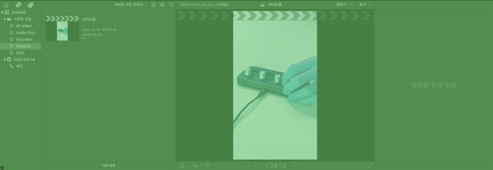
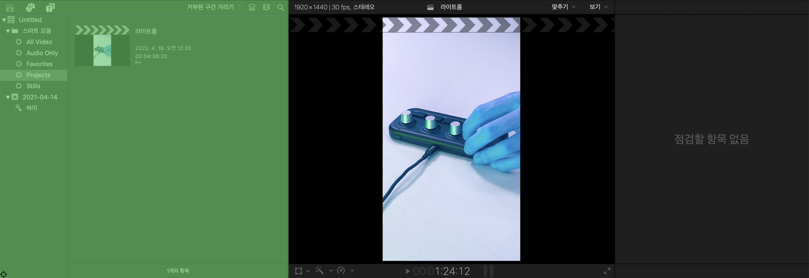
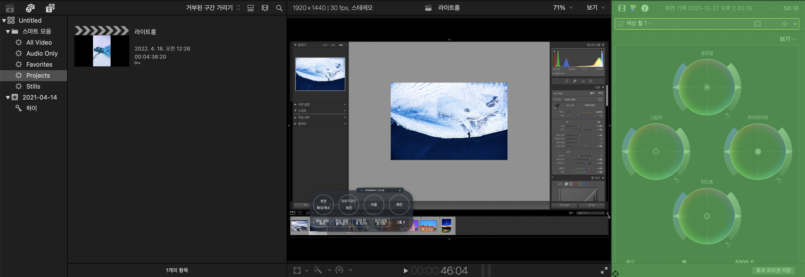
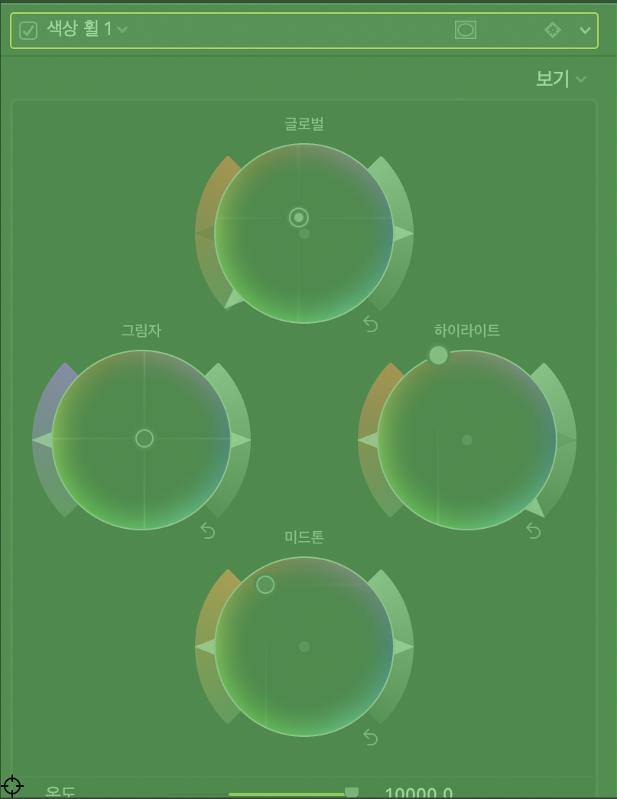
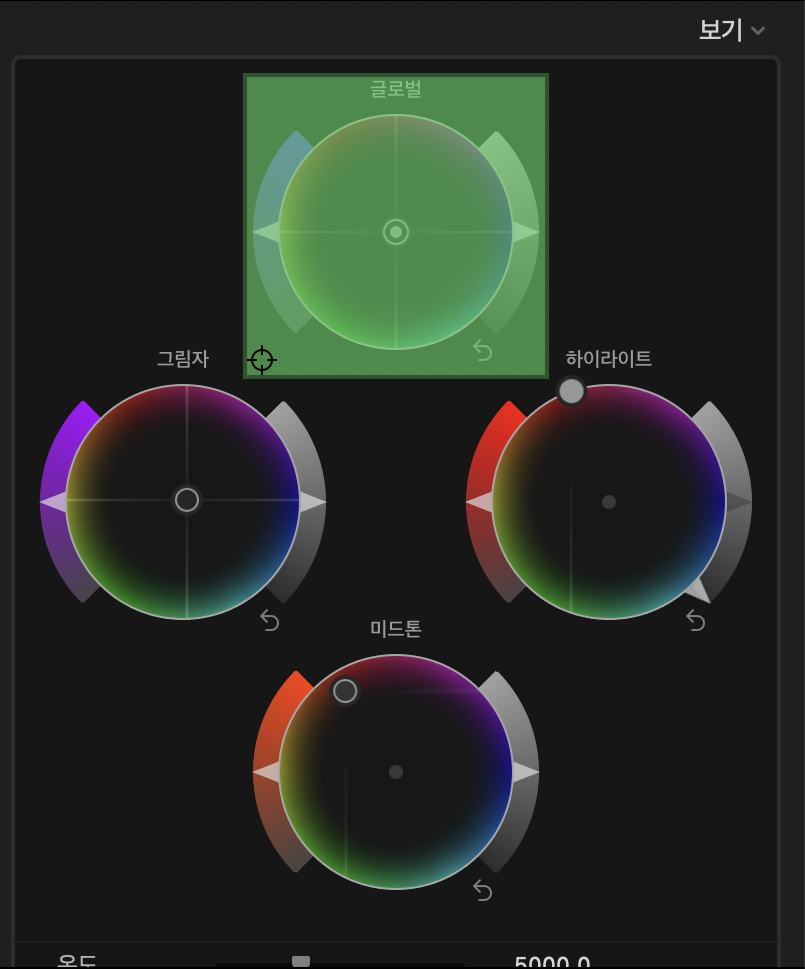
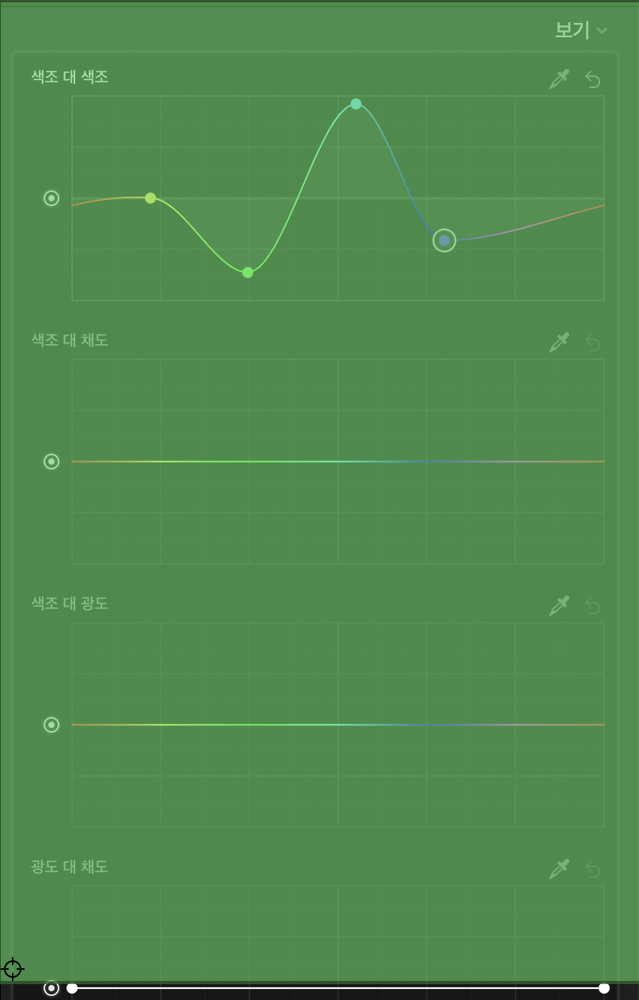
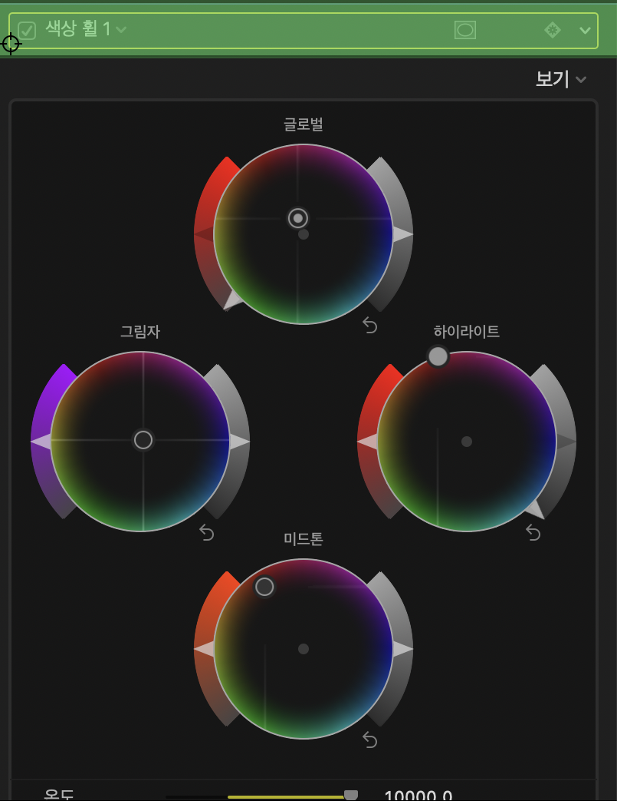
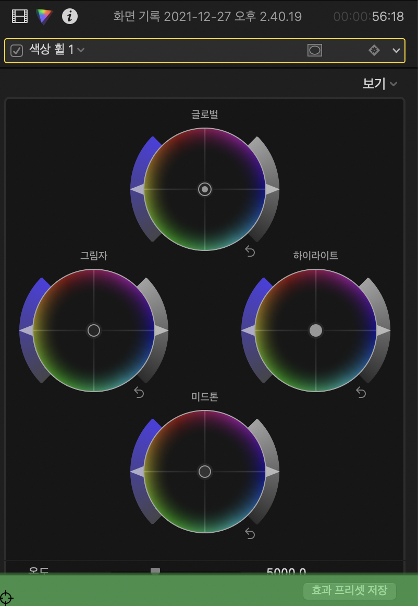

# `Final Cut Pro`의 창 구조

- `Final Cut Pro`의 창 구조를 `JSX` 컴포넌트 형식으로 작성.

## 전체 구조(펼쳐보기)

```jsx
<_AXApplication
  class={PEApplication}
  type="Application"
  name="응용 프로그램"
  title="Final Cut Pro"
>
  <_AXMainWindow class={PEWindow} name="표준 윈도우">
    <_AXSplitGroup
      class={LKContainerView}
      type="Split Group"
      name="자르기 그룹"
    >
      <_AXGroup class={LKContainerItemView} type="Group" name="그룹">
        <_AXSplitGroup
          _NICK_NAME="MainContainer"
          class={LKContainerView}
          type="Split Group"
          name="자르기 그룹"
        >
          <_AXGroup
            _NICK_NAME="TopWrapper"
            class={LKContainerItemView}
            type="Group"
            name="그룹"
          >
            <_AXSplitGroup
              _NICK_NAME="TopContainer"
              class={LKContainerView}
              type="Split Group"
              name="자르기 그룹"
            >
              <_AXGroup
                _NICK_NAME="What1"
                class={LKContainerItemView}
                type="Group"
                name="그룹"
              />
              <_AXGroup
                _NICK_NAME="What2"
                class={LKContainerItemView}
                type="Group"
                name="그룹"
              />
              <_AXGroup
                _NICK_NAME="BrowserWrapper"
                class={LKContainerItemView}
                type="Group"
                name="그룹"
              >
                {8}
              </_AXGroup>
              {/* Previous Contents */}
              <_AXSplitter
                class={LKSyntheticUIElement}
                type="Splitter"
                name="자르기 도구"
                vector={HORIZONTAL}
              />
              {/* Next Contents */}
              <_AXGroup
                _NICK_NAME="ViewerWrapper"
                class={LKContainerItemView}
                type="Group"
                name="그룹"
              >
                {3}
              </_AXGroup>
              {/* Previous Contents */}
              <_AXSplitter
                class={LKSyntheticUIElement}
                type="Splitter"
                name="자르기 도구"
                vector={HORIZONTAL}
              />
              {/* Next Contents */}
              <_AXGroup
                _NICK_NAME="InspectorWrapper"
                class={LKContainerItemView}
                type="Group"
                name="그룹"
              >
                <_AXGroup
                  _NICK_NAME="InspectorHeader"
                  class={LKContainerItemCapView}
                  type="Group"
                  name="그룹"
                >
                  {6}
                </_AXGroup>
                {isCheckMode ? (
                  <_AXGroup
                    _NICK_NAME="InspectorArea"
                    class={NSTabView}
                    type="Group"
                    name="그룹"
                  >
                    <_AXSplitGroup
                      _NICK_NAME="InspectorContent"
                      class={FFInspectorTabSplitView}
                      type="Split Group"
                      name="자르기 그룹"
                    >
                      <_AXGroup
                        _NICK_NAME="InspectorBox"
                        class={NSBox}
                        type="Group"
                        name="그룹"
                      >
                        <_AXGroup
                          _NICK_NAME="InspectorView"
                          class={NSBox}
                          type="Group"
                          name="그룹"
                        >
                          <_AXScrollArea
                            _NICK_NAME="InspectorScrollArea"
                            class={OZViewCtrlRootScrollView}
                            type="Scroll View"
                            name="스크롤 영역"
                          >
                            {insMode === "Color Board" ? (
                              <>
                                <_AXButton
                                  _NICK_NAME=""
                                  class={LKButtonCell}
                                  type="Button"
                                  name="버튼"
                                  label="색상판 재설정"
                                />
                                {/* 글로벌, 그림자, 미드톤, 하이라이트 4가지 타입 */}
                                <_AXTextField
                                  _NICK_NAME="ColorPercent"
                                  class={PISegmentedScrubbercell}
                                  type="Text Field"
                                  name="텍스트 필드"
                                  label="${타입} 색상 정도"
                                  setValue={SETTABLE.NORESPONSIVE}
                                />
                                <_AXTextField
                                  _NICK_NAME="ColorAngle"
                                  class={PISegmentedScrubbercell}
                                  type="Text Field"
                                  name="텍스트 필드"
                                  label="${타입} 색상 색조 앵글"
                                  setValue={SETTABLE.NORESPONSIVE}
                                />
                                {/* 하이라이트의 경우 label에서 "강조합니다."라고 오역되는 버그 존재 */}
                                {/* 따라서 재설정 버튼 외에 컨트롤하기 힘들 것으로 예상 */}
                              </>
                            ) : insMode === "Color Wheel" ? (
                              <>
                                {/* 글로벌, 그림자, 미드톤, 하이라이트 4가지 타입 */}
                                <_AXGroup
                                  _NICK_NAME="ColorWheelItem"
                                  class={PAEColorWheel}
                                  type="Group"
                                  name="그룹"
                                  label="${타입} 색상 휠"
                                >
                                  <_AXButton
                                    _NICK_NAME="ColorWheelResetButton"
                                    class={LKSyntheticUIElement}
                                    type="Button"
                                    name="버튼"
                                    label="재설정합니다."
                                  />
                                  <_AXColorWell
                                    _NICK_NAME="ColorWheelColor"
                                    class={LKSyntheticUIElement}
                                    type="Color Well"
                                    name="색상 저장소"
                                    label="색상입니다."
                                    setValue={SETTABLE.RESPONSIVE}
                                  />
                                  <_AXValueIndicator
                                    _NICK_NAME="ColorWheelSaturation"
                                    class={LKSyntheticUIElement}
                                    type="Value Indicator"
                                    name="값 표시기"
                                    label="채도입니다."
                                    setValue={SETTABLE.RESPONSIVE}
                                  />
                                  <_AXValueIndicator
                                    _NICK_NAME="ColorWheelBrightness"
                                    class={LKSyntheticUIElement}
                                    type="Value Indicator"
                                    name="값 표시기"
                                    label="밝기입니다."
                                    setValue={SETTABLE.RESPONSIVE}
                                  />
                                </_AXGroup>
                                {/* 온도, 색조(Tint), 색조(Hue), 믹스 4가지 타입 */}
                                <_AXSlider
                                  _NICK_NAME="ColorWheelSlider"
                                  class={LKSliderCell}
                                  type="Slider"
                                  name="슬라이더"
                                  label="${타입} 슬라이더"
                                  setValue={SETTABLE.RESPONSIVE}
                                >
                                  <_AXValueIndicator
                                    _NICK_NAME="ColorWheelSliderValue"
                                    class={NSAccessibilitySliderValueIndicator}
                                    type="Value Indicator"
                                    name="값 표시기"
                                    setValue={SETTABLE.RESPONSIVE}
                                  />
                                </_AXSlider>
                                <_AXTextField
                                  _NICK_NAME="ColorWheelText"
                                  class={PlSegmentedScrubberCell}
                                  type="Text Field"
                                  name="텍스트 필드"
                                  label="${타입} 이동 막대"
                                  setValue={SETTABLE.NORESPONSIVE}
                                />
                                <_AXButton
                                  _NICK_NAME="ColorWheelReset"
                                  class={LKButtonCell}
                                  type="Button"
                                  name="버튼"
                                  label="${타입} 재설정"
                                />
                                {/*
                                  이 외에도 글로벌, 그림자, 미드톤, 하이라이트 4가지 타입을 설정하는 영역이 있으나, 열고 닫는 방식으로 닫혀있을 때 요소에 접근이 어렵기 때문에 보류.
                                  > 하지만, 보기와 상관없이 접근이 가능하며, 여는 버튼에 접근할 수 있으므로 사용 가능성 존재.
                                  > 내부의 값 중 RGB는 NORESPONSIVE로 값이 적용됨.
                                  > 따라서 보기를 강제하는 것이 좋을 것으로 예상.
                                  */}
                              </>
                            ) : insMode === "Color Curve" ? (
                              <>
                                {/*
                                  광도, ${색상} 3가지를 설정하는 곡선 부분이 있음
                                  해당 요소들은 포인트를 잡는 부분이 난해하여 여러울 것으로 예상
                                  */}
                                <_AXSlider
                                  _NICK_NAME="ColorCurveSlider"
                                  class={LKSliderCell}
                                  type="Slider"
                                  name="슬라이더"
                                  label="믹스 슬라이더"
                                  setValue={SETTABLE.RESPONSIVE}
                                >
                                  <_AXValueIndicator
                                    _NICK_NAME="ColorCurveSliderValue"
                                    class={NSAccessibilitySliderValueIndicator}
                                    type="Value Indicator"
                                    name="값 표시기"
                                    setValue={SETTABLE.RESPONSIVE}
                                  />
                                </_AXSlider>
                                <_AXTextField
                                  _NICK_NAME="ColorCurveText"
                                  class={PlSegmentedScrubberCell}
                                  type="Text Field"
                                  name="텍스트 필드"
                                  label="믹스 이동 막대"
                                  setValue={SETTABLE.NORESPONSIVE}
                                />
                                <_AXButton
                                  _NICK_NAME="ColorCurveReset"
                                  class={LKButtonCell}
                                  type="Button"
                                  name="버튼"
                                  label="믹스 재설정"
                                />
                              </>
                            ) : (
                              insMode === "Hue/Saturation Curve" && (
                                <>
                                  {/*
                                    색조 대 색조, 색조 대 채도, 색조 대 광도, 광도 대 채도, 채도 대 채도, ${색상} 대 채도를 설정하는 곡선 부분이 있음.
                                    해당 요소들은 포인트를 잡는 부분이 난해하여 여러울 것으로 예상
                                    */}
                                  <_AXSlider
                                    _NICK_NAME="HueSaturationCurveSlider"
                                    class={LKSliderCell}
                                    type="Slider"
                                    name="슬라이더"
                                    label="믹스 슬라이더"
                                    setValue={SETTABLE.RESPONSIVE}
                                  >
                                    <_AXValueIndicator
                                      _NICK_NAME="HueSaturationCurveSliderValue"
                                      class={
                                        NSAccessibilitySliderValueIndicator
                                      }
                                      type="Value Indicator"
                                      name="값 표시기"
                                      setValue={SETTABLE.RESPONSIVE}
                                    />
                                  </_AXSlider>
                                  <_AXTextField
                                    _NICK_NAME="HueSaturationCurveText"
                                    class={PlSegmentedScrubberCell}
                                    type="Text Field"
                                    name="텍스트 필드"
                                    label="믹스 이동 막대"
                                    setValue={SETTABLE.NORESPONSIVE}
                                  />
                                  <_AXButton
                                    _NICK_NAME="HueSaturationCurveReset"
                                    class={LKButtonCell}
                                    type="Button"
                                    name="버튼"
                                    label="믹스 재설정"
                                  />
                                </>
                              )
                            )}
                          </_AXScrollArea>
                        </_AXGroup>
                      </_AXGroup>
                      <_AXGroup
                        _NICK_NAME="InspectorTab"
                        class={NSBox}
                        type="Group"
                        name="그룹"
                      >
                        {1}
                      </_AXGroup>
                      <_AXGroup
                        _NICK_NAME="InspectorSplitter"
                        class={NSBox}
                        type="Group"
                        name="그룹"
                      />
                    </_AXSplitGroup>
                  </_AXGroup>
                ) : (
                  <_AXStaticText
                    _NICK_NAME="NoneCheckModeText"
                    class={NSTextFieldCell}
                    type="Static Text"
                    name="텍스트"
                    value="점검할 항목 없음"
                  />
                )}
                <_AXGroup
                  _NICK_NAME="InspectorFooter"
                  class={LKContainerItemCapView}
                  type="Group"
                  name="그룹"
                >
                  {1}
                </_AXGroup>
              </_AXGroup>
            </_AXSplitGroup>
          </_AXGroup>
          {/* Previous Contents */}
          <_AXSplitter
            class={LKSyntheticUIElement}
            type="Splitter"
            name="자르기 도구"
            vector={VECTICAL}
          />
          {/* Next Contents */}
          <_AXGroup
            _NICK_NAME="BottomWrapper"
            class={LKContainerItemView}
            type="Group"
            name="그룹"
          >
            {1}
          </_AXGroup>
        </_AXSplitGroup>
      </_AXGroup>
    </_AXSplitGroup>
    <_AXToolbar class={NSToolbarView} type="Toolbar" name="도구 막대">
      {7}
    </_AXToolbar>
    <_AXButton
      class={_NSThemeCloseWidgetCell}
      type="Close Button"
      name="닫기 버튼"
    />
    <_AXButton
      class={_NSThemeZoomWidgetCell}
      type="Full Screen Button"
      name="전체 화면 버튼"
    />
    <_AXButton
      class={_NSThemeWidgetCell}
      type="Minimize Button"
      name="최소화 버튼"
    />
  </_AXMainWindow>
  <_AXWindow class={NSWindow} type="Window" name="윈도우">
    {1}
  </_AXWindow>
  <_AXMenuBar class={null} type="Menu Bar" name="메뉴 막대">
    {11}
  </_AXMenuBar>
  <_AXFunctionRowTopLevelElement
    class={_NSFunctionRow}
    type="Touch Bar"
    name="top level function row"
  >
    {7}
  </_AXFunctionRowTopLevelElement>
</_AXApplication>
```

## 전체 구조(컴포넌트 분리)

```jsx
const ColorWheelItem = () => {
  return (
    <_AXGroup
      _NICK_NAME="ColorWheelItem"
      class={PAEColorWheel}
      type="Group"
      name="그룹"
      label="${타입} 색상 휠"
    >
      <_AXButton
        _NICK_NAME="ColorWheelResetButton"
        class={LKSyntheticUIElement}
        type="Button"
        name="버튼"
        label="재설정합니다."
      />
      <_AXColorWell
        _NICK_NAME="ColorWheelColor"
        class={LKSyntheticUIElement}
        type="Color Well"
        name="색상 저장소"
        label="색상입니다."
        setValue={SETTABLE.RESPONSIVE}
      />
      <_AXValueIndicator
        _NICK_NAME="ColorWheelSaturation"
        class={LKSyntheticUIElement}
        type="Value Indicator"
        name="값 표시기"
        label="채도입니다."
        setValue={SETTABLE.RESPONSIVE}
      />
      <_AXValueIndicator
        _NICK_NAME="ColorWheelBrightness"
        class={LKSyntheticUIElement}
        type="Value Indicator"
        name="값 표시기"
        label="밝기입니다."
        setValue={SETTABLE.RESPONSIVE}
      />
    </_AXGroup>
  );
};

const ColorBoardView = () => {
  return (
    <>
      <_AXButton
        _NICK_NAME="ColorBoardReset"
        class={LKButtonCell}
        type="Button"
        name="버튼"
        label="색상판 재설정"
      />
      {/* 글로벌, 그림자, 미드톤, 하이라이트 4가지 타입 */}
      <_AXTextField
        _NICK_NAME="ColorPercent"
        class={PISegmentedScrubbercell}
        type="Text Field"
        name="텍스트 필드"
        label="${타입} 색상 정도"
        setValue={SETTABLE.NORESPONSIVE}
      />
      <_AXTextField
        _NICK_NAME="ColorAngle"
        class={PISegmentedScrubbercell}
        type="Text Field"
        name="텍스트 필드"
        label="${타입} 색상 색조 앵글"
        setValue={SETTABLE.NORESPONSIVE}
      />
      {/* 하이라이트의 경우 label에서 "강조합니다."라고 오역되는 버그 존재 */}
      {/* 따라서 재설정 버튼 외에 컨트롤하기 힘들 것으로 예상 */}
    </>
  );
};

const ColorWheelView = () => {
  return (
    <>
      {/* 글로벌, 그림자, 미드톤, 하이라이트 4가지 타입 */}
      <ColorWheelItem />
      {/* 온도, 색조(Tint), 색조(Hue), 믹스 4가지 타입 */}
      <_AXSlider
        _NICK_NAME="ColorWheelSlider"
        class={LKSliderCell}
        type="Slider"
        name="슬라이더"
        label="${타입} 슬라이더"
        setValue={SETTABLE.RESPONSIVE}
      >
        <_AXValueIndicator
          _NICK_NAME="ColorWheelSliderValue"
          class={NSAccessibilitySliderValueIndicator}
          type="Value Indicator"
          name="값 표시기"
          setValue={SETTABLE.RESPONSIVE}
        />
      </_AXSlider>
      <_AXTextField
        _NICK_NAME="ColorWheelText"
        class={PlSegmentedScrubberCell}
        type="Text Field"
        name="텍스트 필드"
        label="${타입} 이동 막대"
        setValue={SETTABLE.NORESPONSIVE}
      />
      <_AXButton
        _NICK_NAME="ColorWheelReset"
        class={LKButtonCell}
        type="Button"
        name="버튼"
        label="${타입} 재설정"
      />
      {/*
        이 외에도 글로벌, 그림자, 미드톤, 하이라이트 4가지 타입을 설정하는 영역이 있으나, 열고 닫는 방식으로 닫혀있을 때 요소에 접근이 어렵기 때문에 보류.
        > 하지만, 보기와 상관없이 접근이 가능하며, 여는 버튼에 접근할 수 있으므로 사용 가능성 존재.
        > 내부의 값 중 RGB는 NORESPONSIVE로 값이 적용됨.
        > 따라서 보기를 강제하는 것이 좋을 것으로 예상.
        */}
    </>
  );
};

const ColorCurveView = () => {
  return;
  <>
    {/*
      광도, ${색상} 3가지를 설정하는 곡선 부분이 있음
      해당 요소들은 포인트를 잡는 부분이 난해하여 여러울 것으로 예상
      */}
    <_AXSlider
      _NICK_NAME="ColorCurveSlider"
      class={LKSliderCell}
      type="Slider"
      name="슬라이더"
      label="믹스 슬라이더"
      setValue={SETTABLE.RESPONSIVE}
    >
      <_AXValueIndicator
        _NICK_NAME="ColorCurveSliderValue"
        class={NSAccessibilitySliderValueIndicator}
        type="Value Indicator"
        name="값 표시기"
        setValue={SETTABLE.RESPONSIVE}
      />
    </_AXSlider>
    <_AXTextField
      _NICK_NAME="ColorCurveText"
      class={PlSegmentedScrubberCell}
      type="Text Field"
      name="텍스트 필드"
      label="믹스 이동 막대"
      setValue={SETTABLE.NORESPONSIVE}
    />
    <_AXButton
      _NICK_NAME="ColorCurveReset"
      class={LKButtonCell}
      type="Button"
      name="버튼"
      label="믹스 재설정"
    />
  </>;
};

const HueSaturationCurve = () => {
  return (
    <>
      {/*
        색조 대 색조, 색조 대 채도, 색조 대 광도, 광도 대 채도, 채도 대 채도, ${색상} 대 채도를 설정하는 곡선 부분이 있음.
        해당 요소들은 포인트를 잡는 부분이 난해하여 여러울 것으로 예상
        */}
      <_AXSlider
        _NICK_NAME="HueSaturationCurveSlider"
        class={LKSliderCell}
        type="Slider"
        name="슬라이더"
        label="믹스 슬라이더"
        setValue={SETTABLE.RESPONSIVE}
      >
        <_AXValueIndicator
          _NICK_NAME="HueSaturationCurveSliderValue"
          class={NSAccessibilitySliderValueIndicator}
          type="Value Indicator"
          name="값 표시기"
          setValue={SETTABLE.RESPONSIVE}
        />
      </_AXSlider>
      <_AXTextField
        _NICK_NAME="HueSaturationCurveText"
        class={PlSegmentedScrubberCell}
        type="Text Field"
        name="텍스트 필드"
        label="믹스 이동 막대"
        setValue={SETTABLE.NORESPONSIVE}
      />
      <_AXButton
        _NICK_NAME="HueSaturationCurveReset"
        class={LKButtonCell}
        type="Button"
        name="버튼"
        label="믹스 재설정"
      />
    </>
  );
};

const InspectorScrollView = () => {
  return (
    <_AXScrollArea
      _NICK_NAME="InspectorScrollArea"
      class={OZViewCtrlRootScrollView}
      type="Scroll View"
      name="스크롤 영역"
    >
      {insMode === "Color Board" ? (
        <ColorBoardView />
      ) : insMode === "Color Wheel" ? (
        <ColorWheelView />
      ) : insMode === "Color Curve" ? (
        <ColorCurveView />
      ) : (
        insMode === "Hue/Saturation Curve" && <HueSaturationCurve />
      )}
    </_AXScrollArea>
  );
};

const InspectorHeader = () => {
  return (
    <_AXGroup
      _NICK_NAME="InspectorHeader"
      class={LKContainerItemCapView}
      type="Group"
      name="그룹"
    >
      {6}
    </_AXGroup>
  );
};

const InspectorContent = () => {
  return (
    <_AXGroup
      _NICK_NAME="InspectorArea"
      class={NSTabView}
      type="Group"
      name="그룹"
    >
      <_AXSplitGroup
        _NICK_NAME="InspectorContent"
        class={FFInspectorTabSplitView}
        type="Split Group"
        name="자르기 그룹"
      >
        <_AXGroup
          _NICK_NAME="InspectorBox"
          class={NSBox}
          type="Group"
          name="그룹"
        >
          <_AXGroup
            _NICK_NAME="InspectorView"
            class={NSBox}
            type="Group"
            name="그룹"
          >
            <InspectorScrollView />
          </_AXGroup>
        </_AXGroup>
        <_AXGroup
          _NICK_NAME="InspectorTab"
          class={NSBox}
          type="Group"
          name="그룹"
        >
          {1}
        </_AXGroup>
        <_AXGroup
          _NICK_NAME="InspectorSplitter"
          class={NSBox}
          type="Group"
          name="그룹"
        />
      </_AXSplitGroup>
    </_AXGroup>
  );
};

const InspectorFooter = () => {
  return (
    <_AXGroup
      _NICK_NAME="InspectorFooter"
      class={LKContainerItemCapView}
      type="Group"
      name="그룹"
    >
      {1}
    </_AXGroup>
  );
};

const BrowserContainer = () => {
  return (
    <_AXGroup
      _NICK_NAME="BrowserWrapper"
      class={LKContainerItemView}
      type="Group"
      name="그룹"
    >
      {8}
    </_AXGroup>
  );
};

const ViewContainer = () => {
  return (
    <_AXGroup
      _NICK_NAME="ViewerWrapper"
      class={LKContainerItemView}
      type="Group"
      name="그룹"
    >
      {3}
    </_AXGroup>
  );
};

const InspectorContainer = () => {
  return (
    <_AXGroup
      _NICK_NAME="InspectorWrapper"
      class={LKContainerItemView}
      type="Group"
      name="그룹"
    >
      <InspectorHeader />
      {isCheckMode ? (
        <InspectorContent />
      ) : (
        <_AXStaticText
          _NICK_NAME="NoneCheckModeText"
          class={NSTextFieldCell}
          type="Static Text"
          name="텍스트"
          value="점검할 항목 없음"
        />
      )}
      <InspectorFooter />
    </_AXGroup>
  );
};

const TopContainer = () => {
  return (
    <_AXGroup
      _NICK_NAME="TopWrapper"
      class={LKContainerItemView}
      type="Group"
      name="그룹"
    >
      <_AXSplitGroup
        _NICK_NAME="TopContainer"
        class={LKContainerView}
        type="Split Group"
        name="자르기 그룹"
      >
        <_AXGroup
          _NICK_NAME="What1"
          class={LKContainerItemView}
          type="Group"
          name="그룹"
        />
        <_AXGroup
          _NICK_NAME="What2"
          class={LKContainerItemView}
          type="Group"
          name="그룹"
        />
        <BrowserContainer />
        {/* Previous Contents */}
        <_AXSplitter
          class={LKSyntheticUIElement}
          type="Splitter"
          name="자르기 도구"
          vector={HORIZONTAL}
        />
        {/* Next Contents */}
        <ViewContainer />
        {/* Previous Contents */}
        <_AXSplitter
          class={LKSyntheticUIElement}
          type="Splitter"
          name="자르기 도구"
          vector={HORIZONTAL}
        />
        {/* Next Contents */}
        <InspectorContainer />
      </_AXSplitGroup>
    </_AXGroup>
  );
};

const BottomContainer = () => {
  return (
    <_AXGroup
      _NICK_NAME="BottomWrapper"
      class={LKContainerItemView}
      type="Group"
      name="그룹"
    >
      {1}
    </_AXGroup>
  );
};

const MainContainer = () => {
  return (
    <_AXSplitGroup
      class={LKContainerView}
      type="Split Group"
      name="자르기 그룹"
    >
      <_AXGroup class={LKContainerItemView} type="Group" name="그룹">
        <_AXSplitGroup
          _NICK_NAME="MainContainer"
          class={LKContainerView}
          type="Split Group"
          name="자르기 그룹"
        >
          <TopContainer />
          {/* Previous Contents */}
          <_AXSplitter
            class={LKSyntheticUIElement}
            type="Splitter"
            name="자르기 도구"
            vector={VECTICAL}
          />
          {/* Next Contents */}
          <BottomContainer />
        </_AXSplitGroup>
      </_AXGroup>
    </_AXSplitGroup>
  );
};

const MainWindow = () => {
  return (
    <_AXMainWindow class={PEWindow} name="표준 윈도우">
      <MainConatiner />
      <_AXToolbar class={NSToolbarView} type="Toolbar" name="도구 막대">
        {7}
      </_AXToolbar>
      <_AXButton
        class={_NSThemeCloseWidgetCell}
        type="Close Button"
        name="닫기 버튼"
      />
      <_AXButton
        class={_NSThemeZoomWidgetCell}
        type="Full Screen Button"
        name="전체 화면 버튼"
      />
      <_AXButton
        class={_NSThemeWidgetCell}
        type="Minimize Button"
        name="최소화 버튼"
      />
    </_AXMainWindow>
  );
};

const Application = () => {
  return (
    <_AXApplication
      class={PEApplication}
      type="Application"
      name="응용 프로그램"
      title="Final Cut Pro"
    >
      <MainWindow />
      <_AXWindow class={NSWindow} type="Window" name="윈도우">
        {1}
      </_AXWindow>
      <_AXMenuBar class={null} type="Menu Bar" name="메뉴 막대">
        {11}
      </_AXMenuBar>
      <_AXFunctionRowTopLevelElement
        class={_NSFunctionRow}
        type="Touch Bar"
        name="top level function row"
      >
        {7}
      </_AXFunctionRowTopLevelElement>
    </_AXApplication>
  );
};
```

## 별명(`_NICK_NAME`)에 따른 영역 구분

- `MainWindow`

  

  - `SplitGroup1`

    

    - `Group1`

      

      - `MainContainer`

        

        - `TopWrapper`

          

          - `TopContainer`

            

            - `What1`

              

            - `What2`

              

            - `BrowserWrapper`

              

            - `Splitter2`

              

            - `ViewerWrapper`

              

            - `Splitter3`

              

            - `InspectorWrapper`

              

              - `InspectorHeader`

                

              - `InspectorArea`

                

                - `InspectorContent`

                  

                  - `InspectorBox`

                    

                    - `InspectorView`

                      

                      - `InspectorScrollArea`

                        

                        - `ColorBoard`

                          

                        - `ColorWheel`

                          - `ColorWheelItem`

                            

                          - `ColorWheelPanel`
                            

                        - `ColorCurve`

                          

                        - `Hue/Saturation Curve`

                          

                  - `InspectorTab`

                    

                  - `InspectorSplitter`

                    

              - `NoneCheckModeText`

                

              - `InspectorFooter`

                

        - `Splitter1`

          

        - `BottomWrapper`

          
