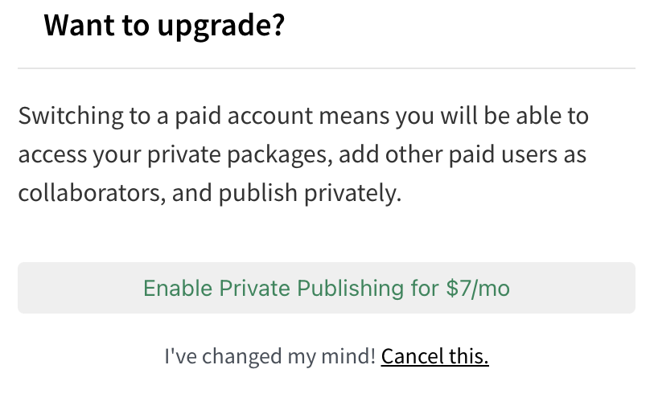

# `publish`

> `npm` 저장소에 `node` 패키지를 업로드하는 시도.

## `npm` 계정 생성

- [`npm` 회원가입](https://www.npmjs.com/signup)
- 해당 사이트에서 회원가입하여 이용하면 된다.
- 회원가입 절차는 매우 간단하고, 이메일 인증만 하면 완료된다.
- 입력한 `username`을 기준으로 `npm` 서비스를 이용할 수 있다.

## 패키지 생성

1. 패키지 이름을 먼저 정해야한다.

- `npm`의 패키지는 매우 많으므로 평범한 패키지 이름은 이미 있을 가능성이 높다.
- `npm info <패키지명>` 명령어를 통해 해당 이름을 가진 패키지가 존재하는지 쉽게 확인할 수 있다.
  - 해당 이름을 가진 패키지가 있을 경우 해당 패키지의 정보가 출력된다.
  - `404 Not found` 에러가 나오면 해당 이름을 가진 패키지가 없음을 의미한다.

2. 패키지 이름의 폴더를 생성하고, 해당 폴더에서 `npm init` 명령어를 통해 패키지의 정보를 입력한다.

   - 비공개, 조직 패키지로 선언하기 위해서는 `npm init --scope=@<조직 or 사용자 이름>` 옵션을 추가한다.

   ```shell
   mkdir <패키지명>
   cd <패키지명>
   npm init
   ```

3. 입력하게 되면 `repository`의 `url`, `bugs`의 `url`, `homepage` 프로퍼티에 `Github`의 주소가 생성되는데, 정확한 주소가 입력되어야 하며, 해당 `Github`가 `public repository` 이어야 한다.

- [`npm init`](https://docs.npmjs.com/cli/v8/commands/npm-init)

## 패키지 배포

1. `npm login` 명령어를 통해 `npm` 계정으로 로그인한다.

   - [`npm adduser`](https://docs.npmjs.com/cli/v8/commands/npm-adduser) 명령어를 사용해도 된다.

2. 패키지의 엔트리 포인트인 `index.js`를 작성하고, 만약 `TypeScript`를 배포할 계획이라면 `index.d.ts`에 선언할 타입을 `export`한다.

3. `npm publish` 명령어를 사용하여 `npm` 서버에 업로드한다.

   - 만약 `Github`의 주소가 일치하지 않거나, 공개 패키지를 배포하는데 해당 `repository`가 `private`이면 에러가 발생한다.
   - 또한 로그인이 정상적으로 되어 있지 않아도 에러가 발생한다.

4. 다른 `npm module(package.json 보유)`에서 `npm install <배포한 패키지명>`하여 설치가 되는지 확인한다.

- [`npm publish`](https://docs.npmjs.com/cli/v8/commands/npm-publish)

## 배포한 패키지 삭제

- 배포한 패키지는 배포 후 72시간 내에 삭제가 가능하며, 그 이후에는 `npm`에 직접 연락하여 삭제를 요청해야 한다.
- `npm unpublish <패키지명>@<버전>` 명령어로 업로드한 패키지의 특정 버전을 삭제할 수 있다.
- 배포한 패키지의 모든 버전을 삭제하기 위해선 `npm unpublish <패키지명> -f` 명령어를 사용한다.

## 비공개 패키지

- 비공개 패키지는 `npm` 계정에서 `7$/month`의 구독 결제를 통해 업그레이드 후 이용 가능하다.

  

- 하지만 로컬 저장소에서는 `npm` 저장소가 아닌 다른 서버를 오픈하여 거기에 `publish` 하여 비공개 패키지를 생성할 수 있다.
- 다른 서버를 오픈하여 비공개 패키지를 `publish` 하는 방법.
  - [`Github package`](https://min9nim.vercel.app/2021-05-17-github-packages/)
  - [`sinopia`](https://sanghaklee.tistory.com/55)
  - [`verdaccio`](https://www.devh.kr/2020/Host-Publish-and-Manage-Private-npm-Packages-with/)

## 참고

- [공개 패키지 생성 및 게시](https://docs.npmjs.com/creating-and-publishing-unscoped-public-packages)
- [범위 지정 패키지 생성 및 게시](https://docs.npmjs.com/creating-and-publishing-scoped-public-packages)
- [비공개 패키지 생성 및 게시](https://docs.npmjs.com/creating-and-publishing-private-packages)
