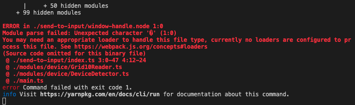
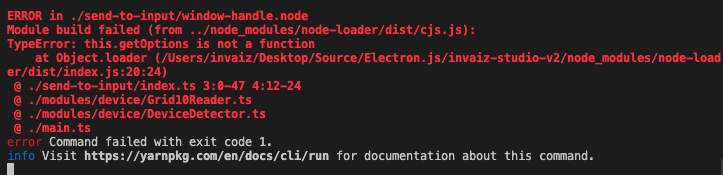
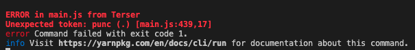

# `.node bundling`

> `Webpack`에서 `node-gyp`를 통해 빌드한 네이티브 모듈을 번들링하기 위한 시도.

## 사용의 문제

- `node-gyp`를 통해 빌드한 `모듈명.node` 파일을 실제 프로젝트에 적용하기 위해 `TypeScript` 코드에서 `import` 하려는데, 확장자가 `.node`라서 그런지 `babel-loader`를 통해 번들링하는 데에 오류가 발생했다.

  - 오류 코드

  

  - 아무래도 `.node` 파일은 특수한 인코딩(이진?) 처리가 되어있기 때문에 `babel-loader`에서 토큰을 인식할 수 없는 듯 했다.
  - 번들링이 아닌 일반적인 파일로 `require("모듈명.node")`를 작성하여 실행하면 정상적으로 `module.exports`된 객체를 들고 오듯이 사용할 수 있다.

### 1. `node-loader` 사용

- `node-loader`라는 번들링 사전 처리 도구를 사용하면 `node` 파일을 사용할 수 있게 된다고 한다.

  - [`node-loader` 문서](https://webpack.js.org/loaders/node-loader/)
  - 이 `loader`를 사용하면 `Node.js add-ons`를 사용할 수 있는 듯 하여 `webpack.config.js`에 다음과 같이 적용하여 다시 번들링했다.

  - `webpack.config.js` 설정

  ```js
  module.exports = [
    {
      // ...
      target: "electron-main",
      node: {
        __dirname: false,
      },
      module: {
        rules: [
          {
            test: /\.node$/,
            loader: "node-loader",
            options: {
              name: "[path][name].[ext]",
            },
          },
          // ...
        ],
      },
    },
  ];
  ```

- 하지만 `node-loader` 코드 내에 `this.getOptions`이라는 메서드가 `function`이 아니라는 오류가 발생했다.

  - 오류 코드

  

  - `node-loader/dist/index.js` 소스 코드

  ```js
  function loader(content) {
    const options = this.getOptions(_options.default);
    const name = (0, _loaderUtils.interpolateName)(
      this,
      typeof options.name !== "undefined"
        ? options.name
        : "[contenthash].[ext]",
      {
        context: this.rootContext,
        content,
      }
    );
    this.emitFile(name, content);
    return `
  try {
  process.dlopen(module, __dirname + require("path").sep + __webpack_public_path__ + ${JSON.stringify(
      name
    )}${
      typeof options.flags !== "undefined"
        ? `, ${JSON.stringify(options.flags)}`
        : ""
    });
  } catch (error) {
  throw new Error('node-loader:\\n' + error);
  }
  `;
  }
  ```

### 2. `externals` 사용

- 그 후, `Webpack`을 사용하여 `Node.js`에서 `Native module`을 로드하는 데에 실패했다는 글을 확인하였다.

  - [StackOverflow](https://stackoverflow.com/questions/32832179/using-webpack-with-nodejs-native-modules)

- 해당 글에는 `Webpack` 설정의 `externals`를 활용하면 해결할 수도 있다고 하여 `externals`를 적용해보기로 했다.

  - [`externals` 문서](https://webpack.kr/configuration/externals/)
  - `externals`는 번들링되는 소스 코드 목록에서 제외할 의존성 모듈(`/node_modules`와 같이 번들링 안 해도 되는 모듈)을 작성할 수 있는 듯 하여 `webpack.config.js`에 다음과 같이 적용하여 다시 번들링했다.

  - `webpack.config.js` 설정

  ```js
  module.exports = [
    {
      // ...
      module: {
        rules: [
          {
            test: /\.node$/,
            loader: "node-loader",
            options: {
              name: "[path][name].[ext]",
            },
          },
          // ...
        ],
      },
      externals: [nodeExternals(), /\.node$/], // in order to ignore all modules in node_modules folder
    },
  ];
  ```

  - 하지만 `Terser`에서 잘못된 토큰이 검출되었다는 오류가 발생했다.

  - 오류 코드

  

### 3. `npm` 저장소에 등록하여 `/node_modules`에 `install` 한 후 사용

- `externals`에서 정규식은 정상적으로 작동하지 않는데, 또 다른 설정이 필요한지 자세히 찾아 보았으나 나오지 않았고, `webpack-node-externals` 모듈을 통해 `nodeExternals()` 함수를 사용하면 `package.json`에 있는 `dependencies` 내의 모듈들은 번들링에서 잘 제외되는 것으로 보아, 내 `.node` 파일 또한 `npm` 저장소에 등록 후 `install` 하여 사용하면 문제가 없을 것이라 생각했다.
- `TypeScript`에서 모듈의 타입을 지정하기 위해 `index.d.ts`를 포함한 패키지를 생성했다.
- 그 후 `npm` 가입 후 저장소에 패키지를 `publish` 하였고, 이를 `install` 한 뒤 사용하니 오류 없이 잘 작동하는 것을 확인했다.
- 하지만 만약 비공개 모듈을 사용해야 할 일이 생긴다면 `npm`에 월간 구독 결제하거나, 사설 `npm` 저장소 서버를 개설해야 할 것 같다.

> 네이티브 모듈인 `.node` 파일을 번들링하기 위해선 좀 더 자세한 조사와 세팅이 필요할 것 같다.
