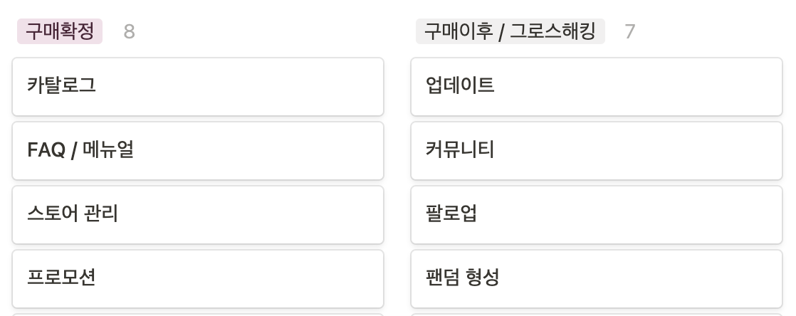
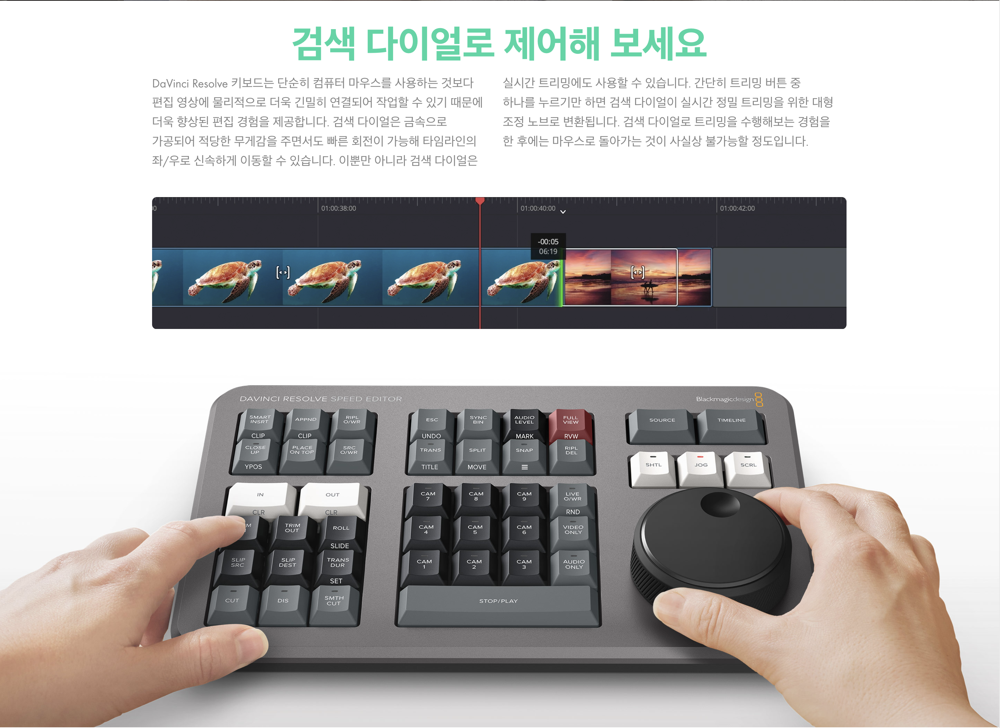
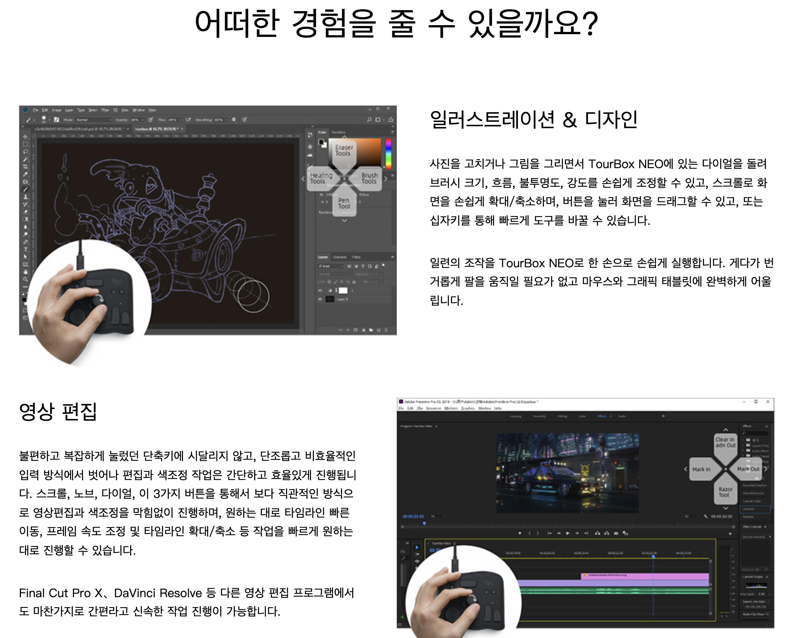
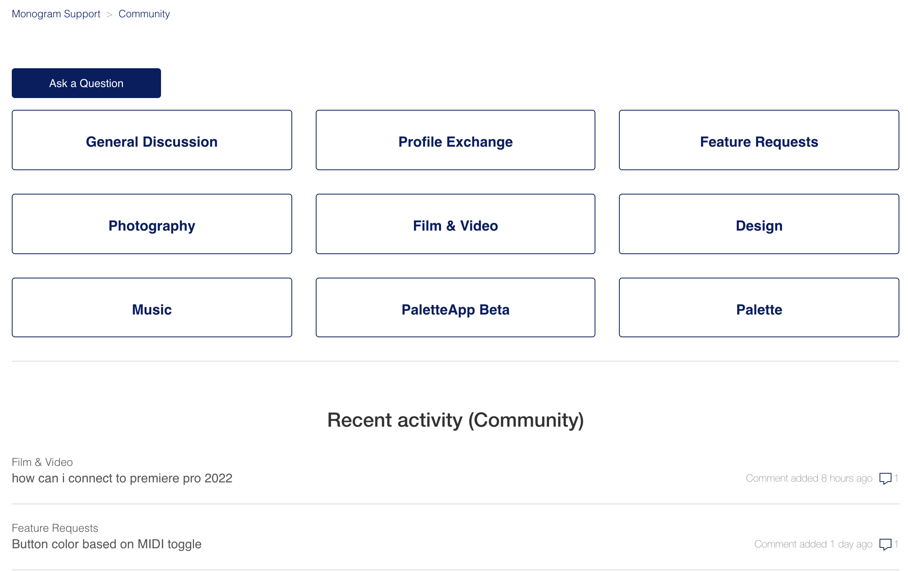
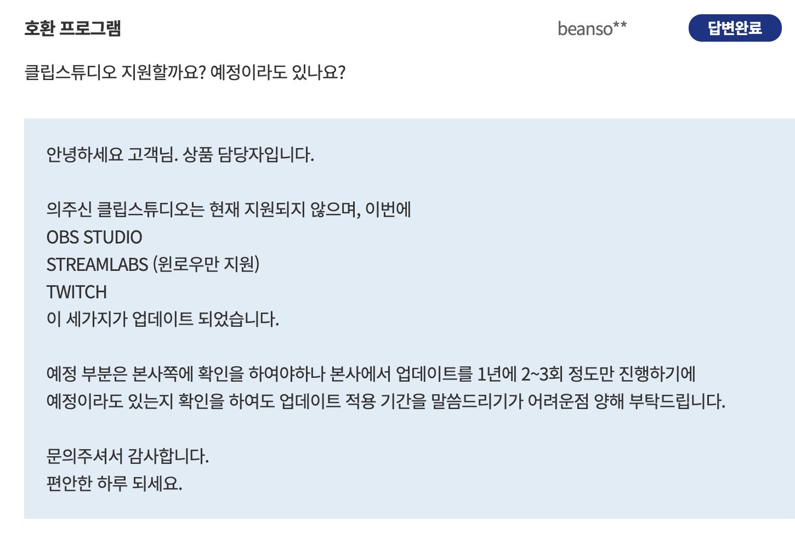

# (인사이트) 구매 확정과 구매 이후 단계에서 취해야 할 마케팅 전략

2021.11.24(수)에 마케팅 회의를 하며, 현재까지 우리가 달려왔던 길을 수치로써 직접 확인했다. 이를 보며, 앞으로의 비전 그 중 마케팅 전략을 수립할 계획이었으나, 수치 데이터를 보고 큰 변화가 필요하다고 판단하여 우리 기업의 새로운 목표. 고객들에게 제공해주고자 하는 가치를 다시 한 번 되새겨보았다.

> 우리는 '**창작의 경계를 허물고, 누구나 디자인의 주체가 될 수 있다**'라는 미션 아래에서  
> '**누구나 쉽고 편리하게 콘텐츠 제작을 할 수 있게 한다**'라는 메세지를 고객들에게 전달하고자 한다.

- 고객 여정 지도(`Customer Journey Map`)를 기반으로 각자 온라인에서 적용 가능한 자료를 조사하고 분석한다.
- 이에 나는 경쟁사 데이터를 기반으로 분석 진행.
- 조사 목록
  

---

## 구매 확정 단계의 마케팅 전략

### 카탈로그

제공하는 가치에 대한 설명을 시각적인 자료로 표현하는 방법.

- 경쟁사 비교.

  - [블랙 매직 디자인](https://www.blackmagicdesign.com/kr/products/davinciresolve/keyboard)  
      
    굉장히 상세한 기능 설명을 사진과 함께 보여 줌.  
    제품 사진과 인물 사진을 아끼지 않아 신뢰도 있고, 상세한 기능 설명으로 고객들의 공감을 이끌어 낼 수 있는 효과.

    > 정확성을 이용한 강조한 빠른 속도, 편리한 경험을 제공하는 것에 초점

  - [투어 박스](https://www.tourboxtech.com/kr/product.html)
      
    굉장히 상세한 기능 설명을 사진, 영상, gif를 아끼지 않고 모두 표출.
    프로그램에 구애 받지 않고 누구나 쉽게 해당 제품을 사용할 수 있다를 자주 보여줌.
    전문가 및 사용자들이 매우 많다는 점을 보여 신뢰도 상승.
    각 기능(키, 다이얼)들의 강점을 구체적인 예시와 사용 영상을 통해 제공.

    > 생산력 향상. 간단하게, 효율적이게, 막힘없이, 손쉬운 적응으로 쉬운 사용성을 강조.

  그 외의 경쟁사 또한 거의 유사한 방식으로 상세한 설명과, 해당 기능을 사용하는 예시를 보여줌.  
  확실히 경쟁사는 '**신뢰**'의 가치가 전달이 잘 되는 것 같음.  
  하지만 각 경쟁사가 추구하는 가치가 다를텐데, 전부 똑같은 '**빠르고 편리하다**'를 강조하는 정도로 밖에 전달이 되지 않는 듯 함.

  > 우리가 전달하고자 하는 메세지를 녹여낼 때, '**빠르고 편리하다**'라는 키워드에 흡수되지 않도록 조심해야 할 듯.  
  > 이는 '**빠르고 편리하다**'는, 일상생활 요소에서 생각보다 공감은 살 수 있으나 직접 와닿지 않는 키워드이기 때문인 듯.  
  > 또한 메세지가 많으면 많을 수록 '**빠르고 편리하다**'는 물론, '**누구나 쉽고 편리하게 콘텐츠 제작을 할 수 있게 한다**'의 전달이 흐려질 가능성이 있지 않을까.. 글이 많을 수록 읽는 데만 시간이 오래 걸리기 때문에..

### FAQ / 메뉴얼

- [루프덱 메뉴얼](https://kr.support.loupedeck.com/)  
  제품과 관련된 모든 정보를 제공하는 듯 함. 문서가 굉장히 방대함. FAQ 또한 많은 정보 제공.  
  디자인 상 탐색하기 어려워보인다는 단점이 있음.

- [모노그램 메뉴얼](https://support.monogramcc.com/hc/en-us)
  루프덱과 똑같은 곳에서 만들었다고 생각될 정도로 비슷함.

    
  기능을 요청할 수 있는 커뮤니티가 존재함.  
  8시간 전에도 작성된 글이 있는 만큼 꽤나 활성화 되어 있음.  
  이를 통해 기업과 소통하고 원하는 정보 빠른 피드백 가능한 좋은 요소로 판단.

- [투어 박스 메뉴얼](https://www.tourboxtech.com/kr/manual.html)  
  생각보다 사용 설명서 및 FAQ가 불친절. 튜토리얼 수준만 사용설명서 지원하고 FAQ는 단 3개 문항 있음.

- [스트림 덱 메뉴얼](https://help.elgato.com/hc/en-us)
  상세한 정보 제공.

- 경쟁사 대부분 굉장히 상세한 FAQ / 메뉴얼을 통해 사용자가 제공받을 수 없는 정보 제공 중.

> 이에 굉장히 상세한 FAQ / 메뉴얼을 우리가 보유하고 있어야 하지만, 사용자가 제공 받는 FAQ / 메뉴얼은, 우리가 보유 중인 데이터를 전부 다 그대로 보여주는 것이 아닌, **사용자가 쉽게 탐색하고 정보를 획득할 수 있도록 유도해야하는 것이 가장 중요한 관건**으로 보임. 이 요소가 잘 되어 있으면 상대적으로 스토어 관리에 힘을 좀 빼도 되지 않을까.

### 스토어 관리

- 타 경쟁사만큼만 하면 될 요소로 판단.
- 문의 내용이나 답변 속도는 빠를 수록 좋다. 아니 빨라야만 한다.
- 빠른 대답과 막힘 없는 피드백이 필수 요소.
- 한 두 개의 낮은 평점은 답변과 다른 정보로 커버할 수 있음. 하지만 낮은 평점에 답변이 없거나, 똑같은 평가가 지속될 경우 매우 악화.

### 프로모션

- 전자기기인 만큼 경쟁사 제품 모두 블랙 프라이데이 할인 이벤트 제공 중.
- 제품 파우치 등 부가 품목을 함께 제공해주는 것 또한 프로모션으로 많이 활용.

> 이에 당장 표현할 수 있는 요소는, **할인 프로모션**을 제공하는 것이 괜찮을 것 같음.  
> 후에 누구나 쉽고 편리하게 콘텐츠 제작을 할 수 있게 한다라는 메세지를 전달하기 위해 **단축키 카드 / 가이드, 디자인 가이드 등 실제 작업에 도움되는 요소**를 함께 제공하는 것도 좋아 보임.

> 제품 특성상, 펀딩 사이트에서 매우 효과적인 요소라는 것은 어쩔 수 없는 사실.  
> 하지만, 펀딩이 특정 기간 내에 새로운 아이템을 먼저 손에 쥘 수 있다는 특성을 가지고 있고, 우리가 거기에 어울리는 아이템이라면, **프로모션을 통해 비슷한 경험을 제공**했을 때 효과가 좋지 않을까라는 생각.

---

## 구매 이후 단계의 마케팅 전략

### 업데이트

- [루프덱](https://support.loupedeck.com/loupedeck-software-download)
  

- [모노그램](https://support.monogramcc.com/hc/en-us/articles/360042909891-Monogram-Creator-Release-Notes)

- [투어 박스](https://www.tourboxtech.com/kr/downloads.html)

- [스트림 덱](https://help.elgato.com/hc/en-us/articles/360028242631-Elgato-Stream-Deck-Software-Release-Notes?_ga=2.47034337.756573304.1637906500-1566464833.1637906500)

타사들은 외국 기업이다보니, 한국의 피드백이 반영될 확률이 낮을 뿐더러,
그나마 제일 빠른 것으로 보이는 투어박스가 연간 10~ 회 정도 업데이트 진행.

마케팅 시, 이유 없는 업데이트를 싫어하여 앱을 삭제한다는 말이 있음.  
아무래도 업데이트 시 용량이 커진다는 편견에 의한 듯?

또한 사전 공지하지 않고 UI/UX 변경하면 반감 살 수 있으니, 미리 공지해야할 것.

- [유튜브 업데이트 내역1](https://gigglehd.com/gg/bbs/8050750)
- [유튜브 업데이트 내역2](https://www.wikitree.co.kr/articles/572393)

이처럼 유튜브는 업데이트 내역 자체에 드립성 정보를 게시하는데, 이게 은근히 무슨 정보 전달에 장난치는게 말이냐? 같은 반응이 소수 있음. 조심해야할 기법인 듯.

> 1. 한국 기업이기 때문에, 피드백 반영률을 높이는 것이 관건.
> 2. 또한 자주 업데이트하는 것은 좋지 않은 듯.. 명확한 이유가 있어야 함.
> 3. 업데이트의 소제목을 붙일 수 있도록 하자.
> 4. 별거 아닌 기능을 업데이트 하나하나에 사용해버리지 말고, 조금만 모아서 패치 노트를 이쁘게 만들면 대규모 업데이트 한거처럼 보일거 같음.
> 5. 업데이트 이후에 이메일 등으로 정보를 알리는건 기본.
> 6. 특정 업데이트 후에, 그 업데이트가 과거의 문제를 해결시켜줬다면 강조하여 정보 전달하면 효과적일거같음. Ex) 혹시 프리셋 바꿀 때 불편하셨나요? 이제, 서브 오버레이가 도와줍니다.
> 7. 게임 같은 경우에 테스트 서버가 있는 것처럼, 다음 업데이트에 반영될 요소를 미리 전달하면 좋을 듯.
> 8. 일정 주기로 업데이트하는건... INVAIZ Studio 특성 상 업데이트보단 버그 수정이 많을거 같아서 모르겠음.
> 9. 이전 버전과 비교해보기 같은 요소 있으면 변화 척도가 생겨서 이 기업이 얼마나 살아 숨쉬는지 보여주기 좋지 않을까.

---

#### 참고

- [모바일 마케팅 프로세스](https://brunch.co.kr/@woozooin/113)
- [앱삭 이유?](https://www.mobiinside.co.kr/2021/05/14/app-delete/)

### 커뮤니티

- 자체 커뮤니티  
  대부분의 경쟁사가 자체 커뮤니티로 유저간 / 기업과의 소통, 프리셋 공유 등을 행하고 있는데, 뚜렷하게 활성화되어 있지 않음.

  => 생각보다 각자의 작업 환경 공유에 대한 니즈를 기기의 프리셋으로는 풀기 어렵지 않을까? 왜냐하면 그야말로 개인의 작업 환경이기 때문에.

  => 누구나 전문가가 되려면 프로의 작업 환경을 훔쳐오는 것이 아닌, 본인의 작업 환경이 곧 프로의 작업 환경이 될 수 있는 것처럼 보여줘야할 듯.

- SNS / 블로그 / 카페 등

#### 커뮤니티 마케팅 3요소

1. 이미지 개선
2. 내부 정보 힌트
3. 사용 목적 달성

이 커뮤니티는 유저들이 활동하기 쉽고, 고객의 실제 의견을 빠르게 얻을 수 있음.

> 1. 가장 먼저 이미지 개선을 위해 이 제품을 구입 했을 때 얻는 만족감을 글로써 강조.
> 2. 우리 제품의 가격대가 왜 이렇게 형성되었는지, 가격이 비싸진 이유는 무엇인지, 앞으로 어떻게 팔건지, 우리 브랜드 스토리에 의거한 우리 제품의 특성은 무엇인지 등등을 SNS를 통해 빠르고 원할한 피드백을 연결해 전달. Ex) 인바이즈가 제품 가격을 올린 이유를 그린 4컷 만화?
> 3. 그 외의 제품의 구매 목적과 같은 정보 전달.(당연한거)
> 4. 추가로 흔한 방법 중 하나인 SNS 공유 이벤트를 이용해 회원끼리 즐기면, 타고 타고 많은 잠재 고객에게 노출되기 좋은 판.
> 5. 고객과의 잦은 이벤트를 통해 더욱 적극적인 소통 유도. Ex) INVAIZ Studio에 불편한 기능을 말해주세요. 몇 분을 선정하여 실제 기능을 반영하고 테스트 및 상품을 드립니다.

#### 참고

- [커뮤니티 마케팅이란?](https://sellclub.tistory.com/597)
- [커뮤니티 마케팅 3요소](https://sellclub.tistory.com/598)

### 팔로업

### 팬덤 형성

---

## 결론

'**누구나 쉽고 편리하게 콘텐츠 제작을 할 수 있게 한다**'라는 메세지를 전달하기 위해서는, 카탈로그, FAQ / 메뉴얼, 프로모션과 구매 이후 단계의 전략이 중요할 것으로 예상된다.

그중에서 지금 당장은 프로모션에 집중해야하고 지금부터 가꾸기 시작해야할 요소로는, 카탈로그, FAQ / 메뉴얼, 업데이트 순서로 진행을 하는 편이 좋을 것 같다.

> 핵심은 고객에게 우리를 **접근하고 배우기(읽고, 쓰고, 요구하고, 듣고, 비교하는 모든 과정) 쉬운 기업**으로 비춰졌을 때 메세지를 전달할 수 있는 기반이 마련될 것이라고 생각된다.  
> 너무 접근하기 쉬우면 전문성 없어 보일 수 있지만, 지금 당장 우리는 전문성을 가져올 수 없을 것 같다.
