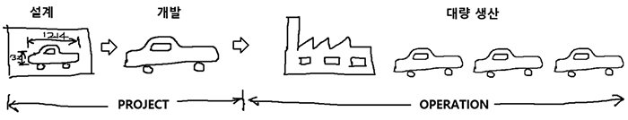

# (인사이트) 프로젝트(1): 여러가지 프로젝트

자신의 직업에 관련된 일을 하면 할 수록 일에 대한 능률은 향상되며, 관련 지식이 확대된다. 따라서 회사에서 일을 하게 되면 성장하는 것이 자명한데, 문제는 한 가지 일만 해서는 성장할 수 있는 높이가 한정되어 있다는 것이다. 똑같은 일을 몇 년 내내 붙잡으면 그 일에 '장인(Master)'이 되긴 하겠지만, 게임에서 저렙 떄의 레벨업 보다 고렙 때의 레벨업보다 어려운 것처럼 어느 시점부터는 성장 속도에 부하가 오게 될 것이며 지식의 폭, 인사이트 또한 좁을 수 밖에 없게 된다.  
반복적인 업무만을 하며, 기술이나 환경의 변화가 적은 직종이라면 큰 문제는 없겠지만 그런 직종은 드물다. 거기다가 개발자나 디자이너 같은 창의적인 생산을 하며 끊임없이 탐구하는 일, 그 일들을 폭발적으로 적용시켜야 할 '스타트업'의 직원이라면 이 좁은 인사이트로 '장인'이 되는 것보단 다양한 경험을 유용하게 사용할 줄 아는 능력이 훨씬 도움이 될 것이다.

따라서 빅테크 기업들 또한 자사의 직원들의 반복적인 업무로 인한 인사이트가 좁아지는 현상을 방지하고 성장에 도움을 주기 위해 "사이드 프로젝트" 제도를 적극적으로 활용하고 있다. `Google`의 `Gmail`, `Google suggest`, `Google now`, `Google Nes`, `Google Map`등 많은 기능이 구글에서 시작한 `20% Rule`이라는 이름의 사이드 프로젝트 제도를 통해서 나왔다고 한다.

프로젝트의 유형을 알아보고, 빅테크 기업에서 적극적으로 적용하고 있는 만큼 잘 적용됐을 때 좋은 **사이드 프로젝트**에 대해 깊게 탐구해보고자 한다.

## 프로젝트란?

**프로젝트**란 고유성을 지닌 결과물을 도출하기 위해 한시적으로 노력을 투입하는 상호 연관성을 지닌 복합적 업무 구성체이다. 프로젝트(Project)라는 단어의 어원은 Projetum 또는 Projectus로부터 유래된 것으로, '사업', '과제', '투영하다', '계획하다'라는 "미래에 이루어야 할 일을 미리 내던짐으로써 방향을 잡고 계획을 세워 그 일을 이루어 나간다"는 뜻이다.

기업이나 조직에서 장기 전략의 목표를 달성하기 윟나 하나의 수단으로써 이행하는 사업을 의미하기도 하며, 기업이 생존하기 위한 각종 신규 사업이나 기술 개발 혹은 각종 개선과 혁신적 노력들이 프로젝트로 선정되고 이행된다.

고대 피라미드나 만리장성, 근대의 수에즈 운하 건설, 맨하탄 프로젝트, 한국의 수원 화성 프로젝트 등 부터 크게 제품 개발, 소프트웨어 개발, 건설이나 건축, 시스템 통합, 연구 개발, 작게는 컨퍼런스, 행사, 영화 출시 및 서적 출간 등이 있으며 개인에게는 가족 행사나 여행, 과제와 같은 것 또한 프로젝트라고 볼 수 있다.

프로젝트는 변화를 위한 도구로써 특정한 목적을 달성해야 하는 특징을 갖는다. 그 목적은 조직의 전략을 이행하기 위한 하나의 수단으로 다른 프로젝트와 연관성을 갖지만, 프로젝트라는 단일 관점에서 보면 성공과 실패를 나타내는 전부일 수도 있다.

조직에서 수행하는 업무 중에 생산과 유지보수, 유통사 관리 등의 일들은 조직의 일반 업무로, 일상적인 활동과 같이 지속적이고 반복적이다. 이러한 지속적이고 반복적인 일상 업무를 **오퍼레이션** 혹은 **운영**이라고 한다. 이와 달리 프로젝트는 지속적이지 않고 반복적이지 않은 시작과 끝이 명확한 일회성 사업이며, 매번 수행하는 프로젝트는 고유한 결과물을 생산한다.

프로젝트는 사후 처리로 오퍼레이션과 연결되며, 기업이나 조직은 이들 프로젝트와 오퍼레이션들의 반복에 의해 전략적 목적 달성이나 생존을 유지한다.

### 프로젝트의 한시성

프로젝트를 완료하는 명확한 시점이 정해지게 되므로, 그 시점까지 완료하기 위한 노력을 필요로 한다. 목표로 하는 종료 날짜를 준수하지 못한다는 것은 결과적으로 프로젝트의 실패로 이어지므로 이를 달성하기 위한 **일정 관리**가 필요하다.  
프로젝트의 일정을 지키기 위해서는 요구되는 자원이나 예산이 확보되고 투입되어야 하기에 이에 대한 **예산 관리** 또한 필요하다.  
매번 수행하는 프로젝트의 결과물은 동일하지 않고, 고유의 특성을 지니므로 동일한 프로젝트는 존재할 수 없다. 이 고유성이 프로젝트에 대한 관리 필요를 유발하며, 계획을 수립하는 노력에서부터 지속적으로 성과를 확인하고 반영한 계획 수정 등의 관리 노력을 통한 **프로젝트 관리**가 필요하다.

## 여러가지 프로젝트

외주(아웃소싱) 프로젝트를 제외했을 때, 개인 혹은 팀이 스스로 기획하고 결과물을 도출하는 프로젝트의 종류는 4가지로 나눌 수 있겠다.

|        |     개인      |       팀        |
| :----: | :-----------: | :-------------: |
| 비영리 | 토이 프로젝트 | 사이드 프로젝트 |
|  영리  |    노마드     |    스타트업     |

비영리 목적의 프로젝트는 '과정'에 큰 중요성을 두고 있고, 영리 목적의 프로젝트는 '결과' 큰 중요성을 가지고 있다고 볼 수 있다.

### 1. 토이 프로젝트

> 재미를 목적으로 하는 비영리 개인 프로젝트

본래 개발 직무에 흥미를 느끼는 개발자들의 문화라고 볼 수 있으며, 실력 향상 등 자기계발과 개발 과정 자체를 재밌게 느끼는 분들에게 잘 적용되고 있는 프로젝트이다.

하지만 모든 `IT` 프로젝트가 그렇듯 이러한 토이 프로젝트도 서버, 유지보수에 지속적으로 비용이 들기 때문에 최소한의 수익을 발생시키거나 계속해서 지불을 하는 것이 아닌 이상 언젠가 프로젝트에 한계로 인한 중지를 하거나 상기 기술한 다른 종류의 프로젝트로 전환을 하게 된다.

꼭 개발자들의 개발이 토이 프로젝트인 것은 아니다. 예를 들어 매일 글쓰기, 일주일에 공부할 분량 채우기, `TIL`, 아이콘을 계속해서 만들어 본인만의 디자인 시스템 제작 등등이 모두 토이 프로젝트일 수 있다.

### 2. 노마드

> 영리를 목적으로 하는 개인 프로젝트

노마드라는 단어는 2020년 말부터 자주 쓰이기 시작한 말이다.

노마드는 혼자서 일 할 수 있다는 것, 즉 "대인 관계를 통해서 스트레스를 받지 않아도 된다는 것"과, 회사를 다니면서도 "부수적으로 소득을 얻을 수 있다는 것" 두 가지 포인트가 있다. 첫 번째 포인트의 경우, 외부에는 독립적으로 운영되는 것처럼 비춰질 수 있으나 실제로는 클라이언트와 협업하거나 회사로부터 보호를 받을 수 없기 떄문에 오히려 스트레스가 생길 수도 있다는 양날의 검이다.

노마드는 마케팅 업무를 하시는 분이 활발하게 하고 있으며 최근에는 브랜딩, 마케팅과 교집합이 꽤나 많은 디자인 영역에도 많이 적용되고 있다. 인플루언서, 유튜브와 같은 본인을 퍼스널 브랜딩하기 위한 수단으로써 활용하기 좋은 프로젝트로 보인다.

### 3. 사이드 프로젝트

> 비영리를 목적으로 하는 팀 프로젝트(같이의 어려움, 가치의 문화)

개발자의 참여율이 높은 프로젝트로 상기 기술한 토이 프로젝트 문화에 영향을 크게 받았기 때문이 아닐까 추론할 수 있으며, 토이 프로젝트라고 하더라도 더 이쁘고 편리한 디자인을 사용하기 위해서 디자이너를 모집하여 사이드 프로젝트로 규모를 키우는 경우도 있다.

개발자들 사이에서 사이드 프로젝트는 누구나 한 번 쯤은 체험해보고 싶을 만큼 흥미로운 주제이고 나도 적용해보고자 몇 번을 시도해보았으나, 실제로 경험한 사람이 많지는 않은 것으로 보인다.  
사이드 프로젝트는 다양한 사람들이 하는 팀 프로젝트이며, 돈이라는 강력한 강제력을 가진 장치가 없고 본인 스스로의 의지로 결정을 해야 하기 때문이다.
즉, 토이 프로젝트보다 재미도 떨어지는데 동기부여 장치도 빈약하며 팀 빌딩이라는 첫 번째 난관이 존재한다.

이렇게 힘든 사이드 프로젝트는 프로젝트를 통해 런칭한 서비스가 잘 되었을 때 스타트업으로 넘어갈 수 있다는 장점이 있다.  
이렇게 성공한 프로젝트로 유명한 것은 한국의 `Naver`나 `멋쟁이 사자처럼`이 있다.

### 4. 스타트업

> 영리를 목적으로 하는 팀 프로젝트(방향과 속도 둘 다 중요한)

스타트업은 매우 어려우며, 노마드처럼 매출을 만들기 위한 방향, 사이드 프로젝트처럼 팀 프로젝트이기 떄문에 속도, 두 가지 모두 중요한 프로젝트이다.

모든 `IT` 프로젝트에서는 비용이 들어가고, 플랫폼 서비스의 경우 마케팅 비용이 엄청나게 들어가기 때문에 초반(몇 년)에 적자일 수 밖에 없는 구조이고, 마케팅 비용, 인건비를 지원받기 위해서 투자를 받아야하는 구조이다.

위와 같은 4가지 프로젝트는 어느정도 순서가 있는데, 최종인 스타트업을 가기 전에 토이 프로젝트 -> 노마드 -> 사이드 프로젝트 -> 스타트업과 같은 코스를 밟는 것이 좋다.

토이 프로젝트를 통해 본인의 실력을 쌓고, 노마드를 통해서 방향성 및 브랜드 인지도, 사이드 프로젝트를 통해 이전까지의 방향성과 비전을 토대로한 팀 빌딩, 그 후 스타트업을 시작하는 것이 좋은 루트인 것 같다.

---

## 참고

- [깊고넓은지식창고 - 프로젝트의 관리 절차](https://multicore-it.com/47)
- [`IT` 팀 사이드 프로젝트 - 2부 길은 하나가 아니다.](https://maily.so/itsp/posts/d3b31e)
- [`Naver` - 프로젝트란 무엇일까?](https://post.naver.com/viewer/postView.nhn?volumeNo=25616056&memberNo=29566044)
