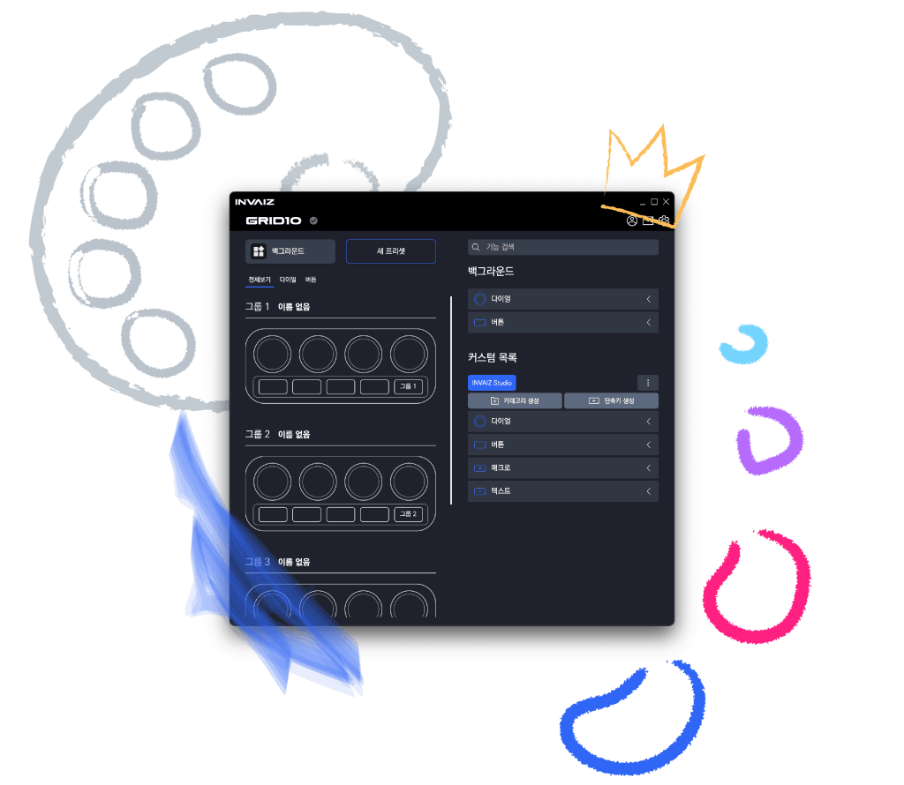
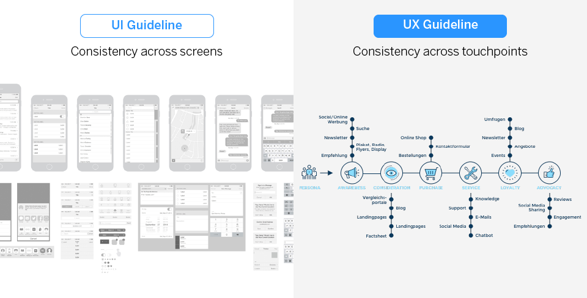
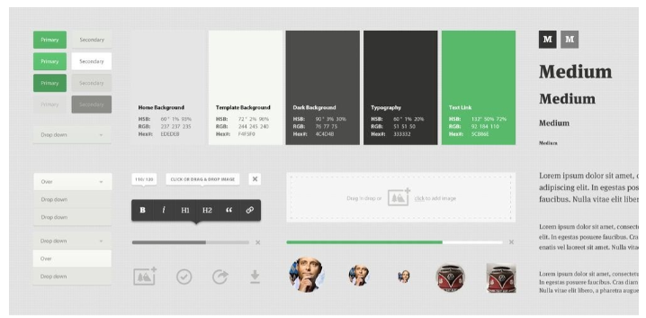
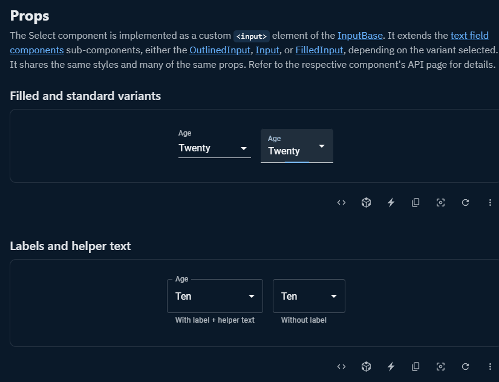

# (기술) 디자인 시스템

앞으로 (주)인바이즈는 `INVAIZ Studio` 뿐만 아니라, 다양한 애플리케이션를 서비스하게 될 예정이며 업데이트할 계획에 있다.  
지금과 같이 애플리케이션의 구성 요소에 대한 명확한 정의 없이 시각적으로 노출되는 디자인만 뽑는 방식을 계속하게 되면, 추후 서비스의 무게가 무거워져가고 추가적으로 디자인을 구성해야할 때마다 그에 따른 비용이 커지는 것은 확실하다.  
또한 업데이트된 구성 요소들이 기존 요소와 가이드나 브랜딩 측면, 전달하고자 하는 디자인의 일관성이 없다면 사용자의 입장에서는 시각적으로 혼란을 느끼거나 아무리 좋은 디자인이라고 한들 위화감을 느낄 수도 있게 된다.

이에 위와 같은 문제점을 답습하지 않기 위해서, 앞으로 새로운 디자인을 기획한 후 작업할 때 보다 효율적으로 관리하기 위한 시스템인 **디자인 시스템**에 대해 조사하였다.

## 디자인 시스템(Design System)이란?

디자인 시스템이란, 디자인 가이드의 한 종류로 디자인 원칙과 중요한 `UX` 전략에 의해 결합된 `UI` 구성 요소의 모음이다. 이 모음은 사용자 경험 내에서 각 구성 요소가 어떻게 동작하는지에 대한 지침을 제공한다.

조직 구성원들은 이러한 구성 요소를 다양한 조합으로 재사용하여 일반적인 상호 작용 패턴을 설계하는 데 시간을 낭비하지 않고 애플리케이션을 업데이트할 수 있게 된다. 레고 세트라고 생각하면 이해하기 쉬울 것 같다.

디자인 시스템은 종종 스타일 가이드로 디자인 정보를 포함하는데, `UI` 요소 전체에서 사용되는 색상, 타이포그래피 및 스타일. 표준, 원칙 및 일관된 `UI` 요소의 모음은 디자인 시스템을 전체 조직에 대한 단일 소스로서 가치 있게 만든다.

> 서비스 `UI` 디자인에서 재사용 가능한 컴포넌트와 패턴을 정의하여, 전체 디자인에 일관성 있게 적용할 수 있도록 만든 가이드라인이나 규칙.

## 가이드라인과 디자인 시스템

### `UI` 가이드라인 (스타일 가이드)

`UI`를 표준화하고 화면 간의 일관성을 확보하기 위한 가이드로, 주요 화면에서 사용되는 공통 `UI` 패턴과 주요 컴포넌트를 추출해 정의하고 상세 속성을 규정하여 디자이너와 개발자가 정해진 기준에 따라 `UI`를 설계할 수 있게 한다.

### `UX` 가이드라인

서비스와 브랜드 측면에서 사용자가 일관적이고 차별화된 경험을 하도록 하기 위한 가이드로, 사용자 컨텍스트를 재구성하여 콘텐츠, 기능 별 사용자의 행동과 니즈를 반영해서 `UX` 원칙을 반영, 사용자 입장에서 서비스를 설계하도록 가이드라인을 구성한다.  
브랜드 측면에서는 해당 브랜드의 정체성이나 색을 일관되게 전달하도록 기능 정의, 네이밍, 어투, `GUI` 요소를 정의한다.

### 디자인 시스템

디자인 원칙과 규격, 재사용 가능한 `UI` 패턴과 컴포넌트, 코드를 포괄하는 시스템이다.  
단순 스타일 가이드, 패턴 라이브러리 역할만 하는 디자인 시스템이 있고, 브랜드 원칙과 `UX` 원칙에 이르는 하나의 철학을 구성하는 시스템도 있다.

> 정해진 디자인 패턴과 컴포넌트를 재사용하여 제품을 구축하고 개선하는 시간을 단축시켜주는 일종의 레고 세트라고 볼 수 있다.

## 디자인 시스템의 필요성

1. 공동의 디자인 자산 확충
2. 일관된 브랜드 정체성과 높은 사용성 유지
3. 커뮤니케이션 기준 마련

## 디자인 시스템의 이점

완전한 디자인 시스템은 여러 디자이너가 있는 경우에도 제품과 인터페이스에서 일관성을 유지할 수 있도록 도와주며, 이는 인터페이스를 다시 만들거나 오래된 디자인 파일을 검색하는 데 지치지 않고 더 중요한 문제를 해결할 수 있다.

> 같은 요소를 다시 만드는 수고를 덜어주기 때문에, 의도하지 않은 비일관성을 줄일 수 있다.

또한 회사의 제품 디자인 노력에 대한 단일 소스가 되어 조직의 비용을 절약할 수 있다. 즉, 모든 디자인 팀은 디자인 파일을 검색하거나 오래된 디자인 사양으로 작업하는 고통을 최소화할 수 있고, 규모가 클 수록 효율적으로 시간 손실을 줄일 수 있게 된다.

이렇게 작은 디자인 요소나 룰들을 미리 만들어 둠으로써, 정보의 중요도에 따른 우선순위 결정이나 워크플로우 최적화와 같은 좀 더 복잡한 문제에 집중할 수 있게 된다.

물리적으로 덜어진 여러 다른 직종의 팀들 간에 소통할 수 있는 언어 역할을 하기도 한다. 예를 들어, 단순히 드롭다운 메뉴라고 하면 각 팀들마다 생각하는 모양이나 기능이 다를 수 있다. 이럴 때 디자인 시스템으로 미리 해당 용어에 대한 컴포넌트를 정의해 놓는다면 팀들 간의 소통을 좀 더 원활하게 할 수 있다.

> 디자인 시스템이 잘 구성되어 있다면, 급하게 추가가 되어야 하는 기능이 발생했을 경우, 급하게 `디자인 요청 -> 디자인 컨펌 -> 개발 시작`이라는 비효율적인 프로세스를 밟지 않고 개발자가 바로 기존의 디자인 시스템만을 적용하여 프로토타입 개발을 진행할 수 있다.

## 디자인 시스템의 단점

디자인 시스템을 유지보수하는 것도 꽤나 큰 비용이 든다. 디자인 시스템은 한 번에 만들고 끝나는 게 아니고, 사용자의 피드백에 따라 계속 업데이트 되어야 하기 때문에, 이에 따른 비용도 충분히 고려해야 한다.

다른 사람들에게 디자인 시스템을 사용하는 방법을 가르치는 데 시간이 걸린다. 모든 디자인 시스템은, 설령 기존 디자인 시스템에서 파생된 것이라 하더라도, 사용 지침이 필요하다. 만약 그러지 않으면 팀 간에 일관되지 않거나 잘못 적용될 위험이 있다.

## 디자인 시스템의 구성

[DesignSystem](./assets/DesignSystem.svg)

- 디자인 시스템을 만들고 유지하기 위해선 디자인 시스템 리포지토리(Design System Repository)와 이를 관리할 인원이 필요하며, 디자인 시스템 리포지토리는 크게 스타일 가이드(Style Guide), 컴포넌트 라이브러리(Component Library), 패턴 라이브러리(Pattern Library)로 이루어져 있다.

1. 스타일 가이드
   
   - 색상, 타이포그래피, 상표, 로고와 같은 포괄적인 브랜딩에 관한 이야기로, 브랜드에서 제공하는 각종 콘텐츠에서의 말투, 어조 등 콘텐츠에 관한 지침이나 상호 작용, 시각적 디자인 기준(`Front-End` Style guide) 또한 포함한다.
2. 컴포넌트 라이브러리
   
   - 재사용 가능한 컴포넌트들을 모아 설명해 놓은 것이다.
   - 디자인 라이브러리라고 한다..
   - 내용
     - 컴포넌트 이름: 의사소통에 용이하도록 구체적이고 명확한 컴포넌트의 이름(드롭다운, 셋팅창 등)
     - 설명: 이 요소가 무엇이고 일반적으로 어떻게 사용되는지에 관한 설명.
     - 속성: 색상, 크기, 모양 등 특정 상황에 적용할 수 있게 사용되는 변수.
     - 상태: 권장하는 기본값부터 달라질 수 있는 외관을 표현해놓은 것.
     - 코드 스니펫: 컴포넌트를 실제로 적용할 수 있는 코드 조각.
     - `FE`, `BE` 프레임워크: 추후 복잡한 디버깅을 피하기 위해 사용.
   - 이러한 컴포넌트 라이브러리를 실제 소스 코드로 활용할 수 있는 문서의 역할을 하는 웹 모듈로 [`StoryBook`](https://storybook.js.org)이 있다.
3. 패턴 라이브러리
   - 컴포넌트 라이브러리는 각각의 `UI` 컴포넌트를 구체적으로 명시했다면, 패턴 라이브러리는 `UI` 컴포넌트들의 그룹이나 레이아웃에 관한 내용을 포함한다.
     - 예를 들어, 결제 버튼은 컴포넌트이고, 결제 버튼과 상품 수 입력 폼을 포함하는 결제 상자는 패턴이라고 볼 수 있다.
     - 컴포넌트와 같이 패턴 또한 재사용하고 적용할 수 있다.

> 이러한 디자인 시스템을 잘 구축하여, 향후 성장할 회사의 방향성 및 일관성 있는 디자인 제공을 용이하게 하면 좋을 것 같다.  
> `Figma`와 `StoryBook`을 활용해보는 편이 시작하기에 가장 좋을 것 같다.

## 디자인 시스템을 관리하기 위한 도구

- [`Invision DSM`](https://www.invisionapp.com/design-system-manager)
- [`Figma`](https://www.figma.com)
- [`Axure`](https://www.axure.com)
- [`Sketch`](https://www.sketch.com)
- [`Adobe XD`](https://www.adobe.com/products/xd/features/design-systems.html)
- [`Zero Height`](https://zeroheight.com)

---

## 디자인 시스템의 예시

- `Google`의 [`Material Design`](https://material.io)
- `Apple`의 [`Human Interface Guidelines`](https://developer.apple.com/design/human-interface-guidelines)
- `Microsoft`의 [`Fluent Design System`](https://www.microsoft.com/design/fluent)
- `IBM`의 [`Carbon Design System`](https://carbondesignsystem.com)
- `SANSUNG`의 [`Samsung Design System`](https://developer.samsung.com/design)
- `LINE`의 [`LINE Design System`](https://designsystem.line.me)
- `SOCAR`의 [`SOCAR Frame`](https://socarframe.socar.kr)
- `Airbnb`의 [`Airbnb Design System`](https://karrisaarinen.com/posts/building-airbnb-design-system)
- `Audi`의 [사용자 인터페이스 가이드라인](https://www.audi.com/ci/en/guides/user-interface/introduction.html)
- `Uber`의 [`Base Web Design`](https://baseweb.design/components)
- 미국 정부의 [`USWDS`(US Web Design System)](https://designsystem.digital.gov)
- [`Mui`](https://mui.com)

---

## 참고

- [Design Systems - `Figma`에서 운영하는 디자인 시스템 모음](https://www.designsystems.com/)
- [Design Systems REPO - 디자인 시스템 모음](https://designsystemsrepo.com/)
- [`토스 플랫폼 디자이너 : 4,000시간을 절약해준 디자인 시스템`](https://www.youtube.com/watch?v=cN40ObQwvY0)
- [Design System 101](https://www.nngroup.com/articles/design-systems-101/)
- [디자인 시스템(Design System), 궁극의 기본 가이드](https://www.designlog.org/2512900)
- [디자인 시스템 1편 - 디자인 가이드/디자인 시스템은 왜 필요한가](https://story.pxd.co.kr/1434)
- [디자인 시스템 구축기 1편](https://brunch.co.kr/@besigner/4)
