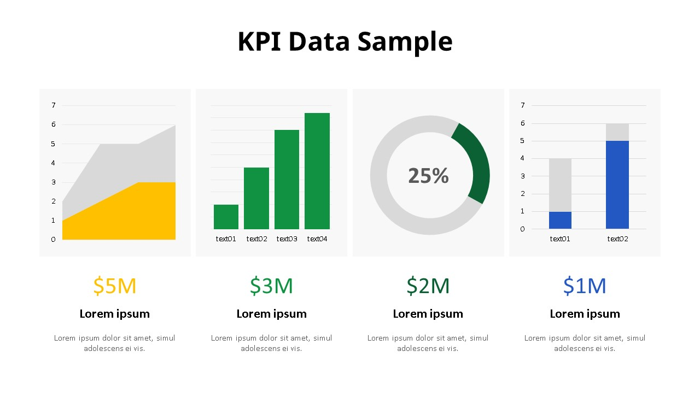

# (인사이트) 스타트업의 `KPI`

핵심성과지표(`KPI`)란, 측정 가능한 정량적인 기업 성과 평과이며 일반적으로 경쟁 업체와 비교하여 사용되는 지표입니다.  
회사 및 조직 생활에는 항상 성취해야 할 목표가 주어집니다. 즉, 매출 달성, 이익 최대화, 불량 최소화, 고객 만족도 상승, 고객 클레임 최소화 등 그 목표 달성을 위해 조직 구성원이 움직입니다. `KPI`는 이 목표를 달성하기 위해 핵심적으로 관리할 요소들에 대한 성과 지표를 의미합니다. 또한, 미래 목표 달성을 위한 여러 핵심적 성과 평과 기준이 되기도 합니다.

- 성과를 측정하는 `KPI`
  - 비즈니스 또는 조직에 대한 전략적, 재정적, 운영적 성과를 평가하는 데 사용.
- 정량화되어야 하는 `KPI`
  - 실제 가치를 제공하려면 `KPI`를 측정할 수 있어야 함. 계량화할 수 없는 요인이 비즈니스 성과에 중요하게 작용할 수 있지만, 정확히 측정할 수 없으므로 `KPI`에 포함되어서는 안됨.
- 비즈니스 및 고객 중심 메트릭을 포함하는 `KPI`
  - 재무, 프로세스 중심 및 고객 관련 메트릭이 포함될 수 있지만 이에 국한되지 않음.
- 기업 일부에만 적용될 수 있는 `KPI`
  - 개별 부서 또는 직원 개인에게도 고유한 `KPI`가 있을 수 있으나, 이러한 `KPI`는 기업의 전체 `KPI`에 기여해야 함.

> 이러한 `KPI`를 평가하고 작성하기 위한 서비스 및 솔루션도 다양합니다.
>
> - [Servicenow](https://www.servicenow.kr/products/business-management/what-is-kpi.html)
> - [asana](https://asana.com/ko/resources/key-performance-indicator-kpi)

## `KPI`가 되기 위한 요소

`KPI`는 산업별, 기업별, 부서별, 개인별로 다 다를 수 있고, 과거 지향 지표가 아닌 미래 지향 지표입니다.

> 구성원들이 기업이 설정한 방향으로 움직이도록 하는 동기 부여가 됨.

1. 성과 측정 가능성
2. 업무 대표성
3. 관리 가능성.
4. 지표 간 균형성
5. 상하 간 연계성

## `KPI` 도출에서 많이 실수하는 경우

1. 측정 가능한 성과를 대상으로 하며, 종합적으로 살펴볼 수 있어야 합니다.

영업 및 사업 부서의 경우 `KPI`로 여러 기준이 존재할 수 있겠지만, 만약 거래처 방문 횟수를 `KPI`로 하거나, 매출 실적 한 가지만 `KPI`로 잡을 경우 문제가 발생합니다. 방문 횟수는 성과를 위한 과정이지 성과가 아니며, 매출 실적만 `KPI`로 잡을 경우 항상 매출 향상만 생각하다 보니 비용을 무시하는 경우도 생깁니다.

2. 미션에 기반하며, 업무를 대표해야 한다.

마케팅 팀의 미션은 시장을 이해하고, 제품을 기획해서, 많이 알리고, 유통 채널에 잘 팔리게 판촉하는 것인데, 갑자기 `KPI`를 비용 절감 건수 및 금액을 제시한다면 제대로된 `KPI`가 아닐 수 있습니다. 즉, `KPI`를 설정할 경우 해당 부서의 미션은 무엇이고, `KPI`가 해당 부서 업무를 대표하는지 제대로 살펴봐야 합니다.

## `KPI` 비즈니스 영역 구분

- 고객
  - 순추천 고객지수(`NPS`, Net Promoter Score): 고객이 당신의 비즈니스를 친구에게 추천할 가능성
  - 고객 이익률 점수(`CPS`, Customer Profitability Score): 고객을 확보하고 유지하기 위한 광고, 고객 서비스 등의 비용을 고려한 고객별 기여 이익
  - 고객 생애 가치(`CRR`, Customer Retention Rate): 얼마나 많은 고객이 재구매/반복구매를 위해서 또 올것인가? 충성 고객 지표
  - 전환률(Conversion Rate)
  - 상대적 점유율(Relative Market Share): 경쟁사와 비교했을 때 당신 회사의 크기
- 재무적인 성과
  - 매출 성장률
  - 순이익: $총 수입 - 총 지출$
  - 순이익률: $\frac{순이익}{세후 순 매출액}$
  - 매출 총 이익률: $\frac{매출 총 이익}{매출액}$
  - 영업 이익률: $\frac{영업 이익}{매출액}$
  - 투자 수익률: 회사 운영 관점에서 투자 대비 수입의 정도
  - 현금 전환 기간: 재고자산회전기간 + 매출채권회전기간 + 매입채무회전기간
    - 사업을 영위하는 전 과정에 있어서 현금의 유입에 걸리는 시간
- 내부 프로세스
  - 역량 가동률(`CUR`, Capability Utilization Rate): 가용한 자원을 활용한 업무의 총량으로 잠재력을 달성하고 있는가? = 현재의 운영 효율을 측정
  - 프로젝트 일정 편차(`PSV`, Project Schedule Variance): 프로젝트의 $벌어들인 가치 - 예정된 가치$
    - 프로젝트가 예정한 시간에 완료되는가?
  - 프로젝트 일정 편차(`PCV`, Project Cost Variance): 프로젝트가 예산을 초과하지 않고 달성되는가?
  - 주문 완료 주기(`OFCT`, Order Fulfillment Cycle Time): 고객이 주문 이후 제품/서비스가 딜리버리 될 때까지 소요된 시간
  - 주문 정시 달성율(`DIFOT` rate, Delivery in Full on Time)
  - 품질 지수(Quality Index)
  - 프로세스 다운 타임(Processs downtime level)
- 임직원
  - 직원 옹호 점수
  - 임직원 업무 관여도
  - 브래드포드 결근 지수: 예상치 못한 직원의 결근에 따른 영향
  - 인당 부가가치 창출도: $\frac{영업 이익 + 총보상 + 복리후상}{직원수}$ 개별 직원 1인당 창출하는 재무적인 부가가치
  - 360도 피드백 비교: 서로에 대한 평가와 본인들에 대한 평가를 비교

## 스타트업에서 `KPI`

위에 작성한 것처럼, `KPI`는 기업의 미션, 목표에 맞추기 위해서 각 기업에 적합한 항목을 채택하고 직원들과 함께 적용하여 주기적으로 평가하고, 분석 및 보고하는 작업을 통해 유의미한 결과를 도출해낼 수 있습니다.

마냥 작성하기만 한다고 해서 그 데이터 속에 있는 의미를 파악하기 어려우며, 철저한 분석을 통한 가공이 필요한 행위입니다.

여기서 스타트업의 경우 이러한 초기 항목을 채택하는 대 어려움이 있을 수 있습니다. 이에 글로벌 액셀러레이터 `Y-Combinator`에서 선정한 주요 비즈니스 유형 별 핵심 지표 프레임워크라는 것이 존재합니다.

- [`YCombinator - Key Metrics`](https://www.ycombinator.com/library/1y-key-metrics)

스타트업에서 누구나 공강할만한 가장 스트레스 받는 것들은 다음 두 가지입니다.

1. 해야될 것이 정말 많은 것 같은 중암감.
2. 팀원가 Feature set, 전략 등에 대한 끊임없는 논쟁.

창업을 하면 정말 해야할 것이 많아집니다. 제품 개발 및 생산, 사업 계획서, 정부 지원 사업, 네트워킹, 발표, 교육 프로그램, 비용 집행, 고용 등등... 그리고 팀원이 생기면 각자 경험, 배경, 성향 등이 다르기 때문에 다 다른 생각들을 하고 자기 직관이 맞는 것처럼 느껴지기 때문에 논쟁을 계속하게 됩니다.  
회의가 결론이 난 것처럼 끝나도 다음에 또 다시 같은 이야기로 논쟁을 하는 경우가 정말 많습니다. 논쟁 자체는 스타트 업에 불필요한 요소는 아니지만, 불필요한 논쟁의 반복은 일의 진도가 없어지게 되고, 번아웃을 찾아오게 만듭니다.

이로 인해 `OKR`, `KPI`, `one-pager` 등의 프레임워크를 많이 사용하곤 합니다.

> `OKR`은 목표와 핵심 결과의 약자로, 측정 가능한 팀 목표를 설정하고 추적하는 데 도움이 되는 목표 설정 방법론입니다.  
> `one-pager`는 프로젝트의 방향성과 목적을 한 판에 정리한 기획안으로, `PO`가 작성한 후 프로덕트 디자이너, 개발자와 함께 수정해나갈 수 있습니다. 프로젝트에 대한 문제 정의 및 근본 원인, 근거 데이터, 가설과 솔루션 요건, 가설에 대한 영향력 혹은 변수, 성공 지표 등에 대한 내용이 담겨있습니다.

스타트업에서 가장 중요한 것은 성장입니다. Y-Combinator에서는 매주 7% 성장을 하면 빠르게 성장하는 스타트업이라고 정의합니다. 하지만 주의해야하는 것이, 성장에만 너무 집중한 나머지(마케팅에만 돈을 너무 많이 쓰는 등) 자금이 부족해질 만한 사건이 발생하여(코로나 등) 대량 해고를 하거나 스캔들이 휩싸이는 유명 기업들이 많아지면서, 오로지 성장에만 집중하는 문화로 인해 생겨났다는 비판도 존재합니다.

`KPI`는 서비스 런칭을 하기 전부터 설정을 하는 것이 좋습니다. `KPI`를 목표로 하고 일을 하면 시간 낭비를 줄여주고 빨리 런칭야 된다는 생각을 하게 해줍니다. `KPI`는 1~4가지 정도로만 있는 것이 적당합니다. 너무 측정하는 것이 많고 `KPI`가 복잡해지면 사실 `KPI`가 무의미해지고 일하는 데 있어 능률이 떨어집니다.

### `KPI`의 중요성

1. 내가 지금 뭘 해야되는지 집중하게 해준다.
2. 숫자는 거짓말 안한다.
   - 상을 타고 정부 지원을 받고 투자 받고 하는 것들이 내가 좋은 제품을 만들고 있다는 착각을 주는데, `KPI`는 이런 환상에서 벗어나게 해준다.
3. 내가 지금 좋은 제품을 만들고 있는지 우리 서비스 사용자들을 잘 설득하고 있는지 나의 전략이 올바른지에 대해 객관적으로 판단을 도와준다.

> `KPI`를 잘못 설정하면 앞으로 나아가지 못하고 쓸데 없는 일만 반복하다가 실패하게 됨.

`Y-Combinator`에서는 Primary metric, Secondary Metric 두 가지로 나눠서 관리합니다.

- Primary Metric
  - 실제 서비스의 가치를 보여 준다.(매출)
  - 서비스가 사람들에게 주기적으로 가치를 주는지 보여준다.(사용자 수)
- Secondary Metric
  - 비즈니스 모델에 따라, 사업의 단계에 따라 3가지 정도 가장 중요한 Metric을 설정하고 측정하는 것이 좋음.
  - Retention(잔존율)
  - Revenue Churn(매출 이탈률)
  - CAC(cost of acquisition)(고객 획득 비용)
  - Payback period(투자 회수 기간)
  - Burn rate(지출 비율)
  - NPS(net promoter score)(순수 추천 고객 지수)
  - Email conversion(이메일 전환율)
  - Organic vs paid users(유기 vs 광고를 통해 들어온 유저들)
  - Referral Rate(추천율)
  - Contribution margin(공헌 이익)
  - Gross margin(매출 총 이익)
  - GMV(Gross merchandise value) (거래된 상품/서비스 가치의 총 금액)
  - ACV(Annual contract value) (연간 계약 금액)
  - TCV(Total contract value) (총 계약 금액)

이렇게 `KPI`를 설정했다면, 이제 매주 특정 성장률을 목표로 정하고 이를 측정해야 합니다. 성장률을 주 단위로 측정하게 되면 초기에 유저들로부터 주 단위로 피드백을 자주 받아 이를 분석하고 반영하는 것이 중요하기 떄문에 이를 달성할 수 있고, 한 주 동한 해야할 일을 계획하기에 수월해지기 때문입니다.

마지막으로 목표 `KPI` 수치 달성에 집중할 수 있는 환경을 만들기 위해 노력해야 합니다. `Airbnb` 창업자들은 초창기에 매주 목표 `KPI`를 사무실, 화장실, 침실 등 사방 팔방에 다 붙여놓고 현재 집중해야될 것이 무엇인지 계속 리마인드를 시켰다고 합니다. 그리고 한 유명 투자자는 투자를 한 후 모니터를 선물하는데, 그 모니터에 `KPI`를 크게 띄어 놔서 투자한 스터트업의 팀원 모두가 볼 수 있도록 한다고 합니다.

이렇게 `KPI`를 지속적으로 리마인드하는 환경을 셋팅하고 매주 정말 심플한 질문 한 가지를 자신에게 합니다. '이 일을 하는 것이 우리에게 7%의 성장을 줄까?' 이 질문은 스타트업이 성장해서 더이상 스타트업이 아닐 때도 장수한 대기업이 되었을 때도 영원히 그대로인 심플한 질문이지만 이에 대한 답과 답을 도출하기 위한 사고방식은 성장하면서 계속 바뀝니다. 시간이 갈수록 매주 7% 성장을 계속 유지하는 것이 어려워지는데 이때 앞으로 뭘해야 7% 성장을 우리에게 가져다 줄까라는 질문을 스스로에게 하면은 좋은 방향성이 생길 것 같습니다.

## 성과와 `KPI`

`KPI`는 곧 성과로 직결될 수 있습니다. 따라서 회사의 `KPI`와 팀별 `KPI`, 그리고 개인의 `KPI`를 조금만 분석해보면 금방 성과를 책정할 수 있을 것으로 예상됩니다. 하지만 성과를 위해 `KPI`를 변질하는 행위는 해선 안됩니다. 정성적인 성과를 부풀리는 것은 본인의 역량이라고 합니다만은, 가령 본인의 성과를 조금 높게 책정하기 위해 거짓된 성과 기술, 정량적인 성과를 변질하는 등의 행위는 회사 내부 팀원끼리의 쓸데 없는 경쟁심 및 시간을 낭비 유발할 것 같습니다.

또, 성과에 큰 역할을 준 구성원은 그에 걸맞는 대우가 꼭 지급되어야 합니다.

## 복지와 `KPI`

복지는 회사가 `KPI`를 달성하기 위한 수단입니다. 복지는 권리가 아니며 직원들은 회사에 근무할 때 `KPI` 달성을 위해 복지를 활용하는 것은 무방하나 복지를 `KPI` 달성보다 우선적으로 생각해선 안됩니다.  
또한, 복지는 회사 내 직원 모두에게 적용되어야 하는 제도입니다. 업무 불균형(누군가는 달성해야 하는 `KPI`가 비정상적으로 많다.)으로 인해 누군가는 혜택을 받지 못하는 상황이 나온다면, 그때는 복지 개선보다 업무 불균형을 먼저 해결해야 할 필요가 있습니다.

모든 직원에게 적용되는 만큼 복지 적용 여부 판별을 위한 `KPI` 분석은 기업 전체의 `KPI` 달성률과 성장률을 보는 것이 바람직하다고 생각됩니다. 만일 어떠한 복지 적용으로 인해 특정 팀의 효율이 낮아지더라도, 다른 팀의 효율이 높아져 결국 기업 전체의 `KPI`와 성장률에 도움을 주었다면 이는 좋은 복지 요소라고 판단할 수 있습니다.  
이를 팀 `KPI`로 판단하고, 특정 팀에만 어떤 한 복지에 대해 패널티가 있다면, 그것은 복지가 아니라 차별이 될 수 있으므로 주의해야 합니다.

> 스타트업은 모든 개개인의 `KPI`를 하나하나 분석하고 그를 반영하기 힘들 수 있습니다. 그만큼 각자가 `KPI`를 확실하게 제시하고, 주기적인 소통을 통해 정량적 수치에 100% 의존해야 하는(이럴 경우 거대기업처럼 문서에 의존하게 될 것 같음) 경우를 사전에 방지하고, 팀원간의 신뢰를 다져 팀 기준의 평가만으로 개인의 평가를 대체할 수 있을 만큼의 팀 빌딩이 중요할 것 같습니다.

---

## 참고

- [인터비즈 - `KPI` (Key Performance Indicator): 핵심 성과 지표](https://m.blog.naver.com/businessinsight/220975491279)
- [RICHARD JO - 반드시 알고 있어야 할 25개의 비즈니스 `KPI`](https://blog.performars.com/ko/%EB%A7%88%EC%BC%80%ED%8C%85kpi)
- [린스프린트 - 비즈니스 모델별 주요 핵심지표 (Key Metrics By Business Type)](https://acquiredentrepreneur.tistory.com/47)
- [DISQUIET\* - 중요한 것에 집중하는 법 - `KPI`](https://www.disquiet.tech/post/how-to-prioritize-with-kpi)
- [CIOKorea - 애자일 시대 검토할 만한 '소프트웨어 개발 `KPI`' 4가지](https://www.ciokorea.com/news/162630)
- [쉽게 읽는 금융 - [프로그래머 - 개발자 - IT] `KPI`(핵심 성과 지표) 예시](https://easytoread.tistory.com/entry/%ED%94%84%EB%A1%9C%EA%B7%B8%EB%9E%98%EB%A8%B8-%EA%B0%9C%EB%B0%9C%EC%9E%90-KPI-%ED%95%B5%EC%8B%AC-%EC%84%B1%EA%B3%BC-%EC%A7%80%ED%91%9C-%EC%98%88%EC%8B%9C)
